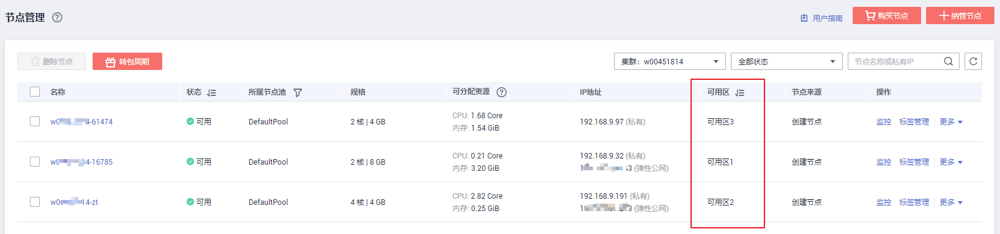

# 购买混合集群

您可以通过云容器引擎控制台非常方便快速的创建Kubernetes集群。Kubernetes是大规模容器集群管理软件，一个集群可以管理一组节点资源。

目前，CCE已经上线混合集群能力，原“虚拟机集群“更名为“混合集群“，支持同时管理虚拟机节点和裸金属节点，支持的场景包括：独立虚拟机场景（原虚拟机集群，虚拟机节点）、独立物理机场景（裸金属节点）、虚拟机与物理机混用场景。

> **说明：**   
>**CCE集群中支持创建物理机节点，需要满足以下条件：**  
>-   集群创建完成之后才可以添加物理机节点。  
>-   网络模式选择容器隧道网络时，集群版本需要选择v1.13.10或以上。  
>-   网络模式选择VPC网络时，集群版本需要选择v1.11.7或以上。  
>-   集群为非IPV6模式。  
>-   节点计费模式为包年/包月。  

## 准备工作

-   创建首个集群前，您必须先确保已存在虚拟私有云，否则无法创建集群。若您已有虚拟私有云，可重复使用，无需重复创建。

    虚拟私有云为CCE集群提供一个隔离的、用户自主配置和管理的虚拟网络环境。创建方法请参见[创建虚拟私有云和子网](https://support.huaweicloud.com/usermanual-vpc/zh-cn_topic_0013935842.html)。

-   您需要新建一个密钥对，用于远程登录节点时的身份认证。

    若使用密码登录节点，请跳过此操作。创建方法请参见[创建密钥对](https://support.huaweicloud.com/usermanual-ecs/zh-cn_topic_0014250631.html)。

-   创建集群前，请提前规划好容器网段和服务网段。网段参数在集群创建后不可更改，需要重新创建集群才能调整，请谨慎选择。

## 创建集群须知

创建集群过程中会同步创建一些基础资源，列表如下：

**表 1**  创建集群须知

<table><thead align="left"><tr id="row20811252105914"><th class="cellrowborder" valign="top" width="30%" id="mcps1.2.3.1.1">
资源名称

</th>
<th class="cellrowborder" valign="top" width="70%" id="mcps1.2.3.1.2">
描述

</th>
</tr>
</thead>
<tbody><tr id="row88111652155915"><td class="cellrowborder" valign="top" width="30%" headers="mcps1.2.3.1.1 ">
控制节点及其相关资源

</td>
<td class="cellrowborder" valign="top" width="70%" headers="mcps1.2.3.1.2 ">
存在于云容器引擎资源租户下，用户不可见。

</td>
</tr>
<tr id="row981135210590"><td class="cellrowborder" valign="top" width="30%" headers="mcps1.2.3.1.1 ">
弹性云服务器（可选创建）

</td>
<td class="cellrowborder" valign="top" width="70%" headers="mcps1.2.3.1.2 ">
集群节点，即用户的计算资源，对应“弹性云服务器”中的ECS。

ECS命名规则为：集群名称-随机数，可自定义，批量创建时会再加一串随机数。

</td>
</tr>
<tr id="row6811952165919"><td class="cellrowborder" valign="top" width="30%" headers="mcps1.2.3.1.1 ">
安全组

</td>
<td class="cellrowborder" valign="top" width="70%" headers="mcps1.2.3.1.2 ">
集群会创建两个安全组，一个用于管理集群控制节点的安全组，一个用于管理集群node节点的安全组。

 须知： 

创建集群时创建的安全组以及安全组规则禁止删除，否则会导致集群异常。

<ol id="ol57751237359"><li>控制节点安全组
命名规则：集群名称-cce-control-随机数

作用：

<ul id="ul516535584419"><li>出方向允许</li><li>其他节点访问控制节点kubernetes相关服务</li></ul>
</li><li>node节点安全组
命名规则：集群名称-cce-node-随机数

作用：

<ul id="ul1579276164613"><li>出方向允许</li><li>开放linux或windows远程登录（22、3389）</li><li>kubernetes组件之间访问使用（4789、10250）</li><li>kubernetes用于对外开放的端口（30000-32767）</li><li>相同安全组之间可以互相访问</li></ul>
</li></ol>
</td>
</tr>
<tr id="row7811135245911"><td class="cellrowborder" valign="top" width="30%" headers="mcps1.2.3.1.1 ">
磁盘（可选创建）

</td>
<td class="cellrowborder" valign="top" width="70%" headers="mcps1.2.3.1.2 ">
分别给各个节点创建两个磁盘，一个是节点的系统盘，一个是给docker运行使用的数据盘。

</td>
</tr>
<tr id="row13811752135919"><td class="cellrowborder" valign="top" width="30%" headers="mcps1.2.3.1.1 ">
弹性IP（可选创建）

</td>
<td class="cellrowborder" valign="top" width="70%" headers="mcps1.2.3.1.2 ">
需用户选择，给节点绑定弹性IP ，可以使节点访问外网。

</td>
</tr>
</tbody>
</table>

## 操作步骤

1.  登录[CCE控制台](https://console.huaweicloud.com/cce2.0/?utm_source=helpcenter)，在总览页面单击“购买Kubernetes集群“，或在左侧导航栏中单击“资源管理  \>  集群管理”，单击“混合集群“下的“购买”。

    **图 1**  集群管理-购买混合集群  
    

2.  参照[表2](#table8638121213265)设置服务选型参数，其中带“\*”的参数为必填参数。

    **表 2**  创建集群参数配置

    
    <table><thead align="left"><tr id="row10638181262612"><th class="cellrowborder" valign="top" width="20.02%" id="mcps1.2.3.1.1">
参数

    </th>
    <th class="cellrowborder" valign="top" width="79.97999999999999%" id="mcps1.2.3.1.2">
参数说明

    </th>
    </tr>
    </thead>
    <tbody><tr id="row1922964644615"><td class="cellrowborder" valign="top" width="20.02%" headers="mcps1.2.3.1.1 ">
* 计费模式

    </td>
    <td class="cellrowborder" valign="top" width="79.97999999999999%" headers="mcps1.2.3.1.2 "><ul id="ul463941414445"><li>包年/包月：包周期计费。包年/包月集群创建后不能删除，如需停止使用，请到<a href="https://account.huaweicloud.com/usercenter/#/userindex/retreatManagement" target="_blank" rel="noopener noreferrer">费用中心</a>执行退订操作。</li><li>按需计费：根据实际使用的资源按小时计费，本章讲解按需计费类型的操作。</li></ul>
    </td>
    </tr>
    <tr id="row42961494311"><td class="cellrowborder" valign="top" width="20.02%" headers="mcps1.2.3.1.1 ">
* 区域

    </td>
    <td class="cellrowborder" valign="top" width="79.97999999999999%" headers="mcps1.2.3.1.2 ">
请就近选择靠近您业务的区域，可减少网络时延，提高访问速度；不同区域的云服务产品之间内网互不相通。

    </td>
    </tr>
    <tr id="row12321131519262"><td class="cellrowborder" valign="top" width="20.02%" headers="mcps1.2.3.1.1 ">
* 企业项目

    </td>
    <td class="cellrowborder" valign="top" width="79.97999999999999%" headers="mcps1.2.3.1.2 ">
该参数仅对开通企业项目的企业客户账号显示。请确保选择的企业项目下有集群创建所需相关资源，如虚拟私有云。

    
了解更多企业项目相关信息，请查看<a href="https://support.huaweicloud.com/usermanual-em/zh-cn_topic_0123692049.html" target="_blank" rel="noopener noreferrer">企业管理</a>。

    </td>
    </tr>
    <tr id="row1063812126263"><td class="cellrowborder" valign="top" width="20.02%" headers="mcps1.2.3.1.1 ">
* 集群名称

    </td>
    <td class="cellrowborder" valign="top" width="79.97999999999999%" headers="mcps1.2.3.1.2 ">
新建集群的名称，创建后不可修改。

    
集群名称长度范围为4-128个字符，以小写字母开头，由小写字母、数字、中划线（-）组成，且不能以中划线（-）结尾。

    </td>
    </tr>
    <tr id="row6649879161231"><td class="cellrowborder" valign="top" width="20.02%" headers="mcps1.2.3.1.1 ">
* 版本

    </td>
    <td class="cellrowborder" valign="top" width="79.97999999999999%" headers="mcps1.2.3.1.2 ">
Kubernetes社区基线版本，建议选择最新的版本。版本升级请参见<a href="集群版本升级说明.md">集群版本升级说明</a>。

    </td>
    </tr>
    <tr id="row572593234714"><td class="cellrowborder" valign="top" width="20.02%" headers="mcps1.2.3.1.1 ">
* 集群管理规模

    </td>
    <td class="cellrowborder" valign="top" width="79.97999999999999%" headers="mcps1.2.3.1.2 ">
当前集群可以管理的最大<strong id="b19899112165516">Node节点</strong>规模，请根据业务需求选择。

    
若选择“50节点”，表示当前集群最多可管理50个Node节点。集群管理规模在集群创建后不支持调整，请在创建时慎重选择。

    
任何一个集群中均包含“Master节点”和“Node节点”，每一个节点对应一台云服务器。<ul id="ul1045015327013"><li>Master节点：集群的控制节点，在创建集群时会自动创建控制节点，负责整个集群的管理和调度。</li><li>Node节点：用户购买或纳管的节点是集群的Node节点，即工作负载节点。Node节点由管理节点分配，当某个Node节点宕机时，管理节点会将工作负载转移到其他Node节点上。</li></ul>
    

    </td>
    </tr>
    <tr id="row680585841419"><td class="cellrowborder" valign="top" width="20.02%" headers="mcps1.2.3.1.1 ">
* 高可用

    </td>
    <td class="cellrowborder" valign="top" width="79.97999999999999%" headers="mcps1.2.3.1.2 "><ul id="ul97916871415"><li>是：将创建一个高可用集群，高可用集群包含多个控制节点（一般为3个），单控制节点故障时，集群依然可用。</li><li>否：将创建一个普通集群，普通集群是单控制节点，当这个控制节点故障时，集群将不可用，但已运行的工作负载不受影响。</li></ul>
    
集群创建完成后，高可用模式及普通模式之间不可变更，需要重新创建集群才能调整。请按实际使用场景谨慎选择：<ul id="ul20457121412567"><li>针对生产环境，为提高集群容灾能力，建议开启“高可用”。</li><li>针对开发和测试环境等对可靠性要求不高的场景，可根据业务需求选择是否开启“高可用”。</li></ul>
    

    </td>
    </tr>
    <tr id="row1763991215268"><td class="cellrowborder" valign="top" width="20.02%" headers="mcps1.2.3.1.1 ">
* 虚拟私有云

    </td>
    <td class="cellrowborder" valign="top" width="79.97999999999999%" headers="mcps1.2.3.1.2 ">
新建集群所在的虚拟私有云。虚拟私有云是通过逻辑方式进行网络隔离，提供安全、隔离的网络环境。

    
若没有可选虚拟私有云，单击“创建虚拟私有云”进行创建，完成创建后点击刷新按钮。操作步骤请参见<a href="https://support.huaweicloud.com/usermanual-vpc/zh-cn_topic_0013935842.html" target="_blank" rel="noopener noreferrer">创建虚拟私有云和子网</a>。

    </td>
    </tr>
    <tr id="row15639412132615"><td class="cellrowborder" valign="top" width="20.02%" headers="mcps1.2.3.1.1 ">
* 所在子网

    </td>
    <td class="cellrowborder" valign="top" width="79.97999999999999%" headers="mcps1.2.3.1.2 ">
节点虚拟机运行的子网环境，通过子网提供与其他网络隔离的、可以独享的网络资源，以提高网络安全。虚拟私有云、子网、集群的关系请参见<a href="集群概述.md">集群概述</a>。

    
<strong id="b9136183821711">集群创建后子网无法修改，请谨慎选择。</strong>

    </td>
    </tr>
    <tr id="row482955911270"><td class="cellrowborder" valign="top" width="20.02%" headers="mcps1.2.3.1.1 ">
* 网络模型

    </td>
    <td class="cellrowborder" valign="top" width="79.97999999999999%" headers="mcps1.2.3.1.2 "><ul id="ul19705159132810"><li>容器隧道网络（Overlay）：基于底层VPC网络，另构建了独立的VXLAN隧道化容器网络，适用于一般场景。VXLAN是将以太网报文封装成UDP报文进行隧道传输。容器网络是承载于VPC网络之上的Overlay网络平面，具有付出少量隧道封装性能损耗，获得了通用性强、互通性强、高级特性支持全面（例如Network Policy网络隔离）的优势，可以满足大多数应用需求。</li><li>VPC网络：采用VPC路由方式与底层网络深度整合，适用于高性能场景，节点数量受限于虚拟私有云VPC的路由配额。每个节点将会被分配固定大小的IP地址段。VPC网络由于没有隧道封装的消耗，容器网络性能相对于容器隧道网络有一定优势。VPC网络集群由于VPC路由中配置有容器网段与节点IP的路由，可以支持集群外直接访问容器实例等特殊场景。</li></ul>
    </td>
    </tr>
    <tr id="row64648564171234"><td class="cellrowborder" valign="top" width="20.02%" headers="mcps1.2.3.1.1 ">
* 容器网段

    </td>
    <td class="cellrowborder" valign="top" width="79.97999999999999%" headers="mcps1.2.3.1.2 ">
请根据业务需求选择容器网段，确定容器网段后，容器实例将在规划的网段内分配IP。

    <ul id="ul1423120351449"><li>未勾选“自动选择”：请手动选择网段。若与子网网段有冲突时将有红色文字提示，请重新选择。建议使用网段：10.0.0.0/12~19，172.16.0.0/16~19，192.168.0.0/16~19。
<strong id="b02629514118">不同集群使用相同的容器网段，会导致容器IP冲突，应用访问异常。</strong>

    </li><li>勾选“自动选择”：系统将自动分配与子网网段无冲突的网段。</li></ul>
    
容器网段要设置合理的掩码，掩码决定集群内可用节点数量。集群中容器网段掩码设置不合适，会导致集群实际可用的节点较少。设置掩码后，选项下方会有当前网段最多支持的实例估算值，请作参考。

    </td>
    </tr>
    <tr id="row6775143217241"><td class="cellrowborder" valign="top" width="20.02%" headers="mcps1.2.3.1.1 ">
服务网段

    </td>
    <td class="cellrowborder" valign="top" width="79.97999999999999%" headers="mcps1.2.3.1.2 ">
服务网段为kubernetes service ip网段。

    <ul id="ul13104152611581"><li>使用默认网段：默认设置为10.247.0.0/16网段。</li><li>手动设置网段：请根据业务需求设置合理的网段和掩码，掩码决定集群内可用service ip数量。</li></ul>
    </td>
    </tr>
    <tr id="row773511171567"><td class="cellrowborder" valign="top" width="20.02%" headers="mcps1.2.3.1.1 ">
鉴权方式

    </td>
    <td class="cellrowborder" valign="top" width="79.97999999999999%" headers="mcps1.2.3.1.2 ">
“RBAC”默认勾选。

    
<strong id="b22341718102818">请务必阅读<a href="kubernetes-RBAC授权.md">CCE权限管理说明</a>并勾选“我已知晓上述限制并阅读CCE权限管理说明”。</strong>

    
开启RBAC能力后，设置了细粒度权限的子用户使用集群下资源将受到权限控制。

    </td>
    </tr>
    <tr id="row1610917221609"><td class="cellrowborder" valign="top" width="20.02%" headers="mcps1.2.3.1.1 ">
认证方式

    </td>
    <td class="cellrowborder" valign="top" width="79.97999999999999%" headers="mcps1.2.3.1.2 ">
认证机制主要用于对集群下的资源做权限控制。例如A用户只能对某个命名空间下的应用有读写权限，B用户对集群下的资源只有读权限等等。角色权限控制的操作请参见<a href="集群管理权限控制.md">3.7-集群管理权限控制</a> 。

    <ul id="ul208851410646"><li>“认证能力增强”默认状态下不选定，此时默认开启X509认证模式，X.509是一种非常通用的证书格式。</li><li>若需要对集群进行权限控制，请勾选“认证能力增强”，选择“认证代理”。
单击“CA根证书”后的“上传文件”，上传符合规范且合法的证书，并<strong id="b2356470185">勾选“我已确认上传的证书合法”</strong>。

    
证书若不合法，集群将无法创建成功。请上传小于1MB的文件，上传格式支持.crt或.cer格式。

    </li></ul>
    </td>
    </tr>
    <tr id="row463941216264"><td class="cellrowborder" valign="top" width="20.02%" headers="mcps1.2.3.1.1 ">
集群描述

    </td>
    <td class="cellrowborder" valign="top" width="79.97999999999999%" headers="mcps1.2.3.1.2 ">
选填，请输入新建容器集群相应的描述信息。

    </td>
    </tr>
    <tr id="row96582533813"><td class="cellrowborder" valign="top" width="20.02%" headers="mcps1.2.3.1.1 ">
高级设置

    </td>
    <td class="cellrowborder" valign="top" width="79.97999999999999%" headers="mcps1.2.3.1.2 ">
单击展开后显示高级功能项目。

    
在某些可用区（AZ）中，不支持的功能将隐藏。如：某个可用区中集群Master节点的flavor不支持“多可用区”功能，则多可用区功能将不显示。

    
此处支持的功能参数如下：

    
<strong id="b16133174810415">ipv6</strong>：

    
开启后将会创建ipv6集群。

    
<strong id="b183512261134">多可用区：</strong>

    
多可用区模式支持集群管理面多可用区容灾，但是对于集群性能有所损耗。

    <ul id="ul173561261313"><li>：未开启状态。Master节点部署在同一个可用区中，如果对应可用区故障，集群将不可用，但已运行工作负载不受影响。</li><li>：开启状态。Master节点分布在不同可用区中，单可用区故障，集群仍然可用。</li></ul>
    
<strong id="b193562261439">服务转发模式：</strong>

    <ul id="ul1435618265318"><li>iptables：社区传统的kube-proxy模式，完全以iptables规则的方式来实现service负载均衡。该方式最主要的问题是在服务多的时候产生太多的iptables规则，非增量式更新会引入一定的时延，大规模情况下有明显的性能问题。</li><li>ipvs：由华为主导开发并在社区获得广泛支持的kube-proxy模式，采用增量式更新，吞吐更高，速度更快，并可以保证service更新期间连接保持不断开，适用于大规模场景。</li></ul>
    
 说明： 
<ul id="ul2513447132113"><li>ipvs为大型集群提供了更好的可扩展性和性能。</li><li>ipvs支持比iptables更复杂的负载平衡算法（最小负载，最少连接，位置，加权等）。</li><li>ipvs支持服务器健康检查和连接重试等。</li></ul>
    

    
<strong id="b186071966103">最大实例数：</strong>

    
若创建集群的网络模型为“VPC网络”时显示该参数。

    
用于设置集群下节点可以创建的最大实例数，默认为256，参数设置后不可更改。集群创建完成后，在创建节点的高级配置中配置的最大实例数不超过此值。

    
<strong id="b203061532132217">资源标签：</strong>

    
通过为资源添加标签，可以对资源进行自定义标记，实现资源的分类。

    
您可以在TMS中创建“预定义标签”，预定义标签对所有支持标签功能的服务资源可见，通过使用预定义标签可以提升标签创建和迁移效率。详情请参见<a href="https://support.huaweicloud.com/usermanual-tms/zh-cn_topic_0144368884.html" target="_blank" rel="noopener noreferrer">创建预定义标签</a>。

    
<strong id="b15868154114358">CPU管理策略：</strong>

    
该参数仅在v1.13.10-r0及以上版本的集群中显示。

    <ul id="ul14813182993518"><li>开启：支持给工作负载实例配置CPU独占，适用于对CPU缓存和调度延迟敏感的工作负载。</li><li>关闭：关闭工作负载实例独占CPU核的功能，优点是CPU共享池的可分配核数较多。</li></ul>
    
更多CPU管理策略内容请参见<a href="https://kubernetes.io/blog/2018/07/24/feature-highlight-cpu-manager/" target="_blank" rel="noopener noreferrer">Feature Highlight: CPU Manager</a>或<a href="https://bbs.huaweicloud.com/forum/thread-28901-1-1.html" target="_blank" rel="noopener noreferrer">深入理解 Kubernetes CPU Mangager</a>。

    </td>
    </tr>
    <tr id="row76532194177"><td class="cellrowborder" valign="top" width="20.02%" headers="mcps1.2.3.1.1 ">
* 购买时长

    </td>
    <td class="cellrowborder" valign="top" width="79.97999999999999%" headers="mcps1.2.3.1.2 ">
若选择创建“包年/包月”的集群，请设置购买时长。

    </td>
    </tr>
    </tbody>
    </table>

3.  单击“下一步：创建节点“，在“创建节点“步骤中，参照如下参数配置节点。
    -   **创建节点：**
        -   现在添加：将为本集群创建节点，创建节点的数量请在下方的节点购买数量中进行设置。

            若您需要使用[应用服务网格ASM](https://support.huaweicloud.com/productdesc-istio/istio_productdesc_0001.html)功能，请选择“现在添加“，集群需要至少创建一个节点来安装Istio控制面。详情请参见[启用服务网格](https://support.huaweicloud.com/usermanual-istio/istio_01_0002.html)。

        -   稍后添加：将仅创建一个集群，不会创建节点，请直接单击“下一步“。

    -   **计费模式：**支持“包年/包月“和“按需计费“两种计费类型。

        创建集群时节点的计费方式跟随集群的计费方式，如集群的计费模式选择“按需计费“，则创建过程中节点的计费模式只能为“按需计费“，“包年/包月“同理。创建方式请参考[购买节点（按需计费）](购买节点（按需计费）.md)与[购买节点（包年包月）](购买节点（包年包月）.md)。

        包年/包月节点创建后不能删除，如需停止使用，请到[费用中心](https://account.huaweicloud.com/usercenter/#/userindex/retreatManagement)执行退订操作。

    -   **当前区域：**节点实例所在的物理位置。
    -   **可用区：**请根据业务需要进行选择。可用区是在同一区域下，电力、网络隔离的物理区域，可用区之间内网互通，不同可用区之间物理隔离。

        如果您需要提高工作负载的高可靠性，建议您将云服务器创建在不同的可用区。

        **图 2**  Node节点创建在不同可用区  
        

    -   **节点类型：**选择节点类型。
        -   虚拟机节点：选中后创建虚拟机节点。
        -   裸金属节点：创建集群过程中不可选，需在集群创建完成后才可以为集群增加裸金属节点。点此了解[裸金属服务器](https://support.huaweicloud.com/bms/index.html)或[购买裸金属集群](购买裸金属集群.md)。

            > **说明：**   
            >CCE集群中创建裸金属节点需满足以下条件：  
            >-   集群创建完成之后才可以添加裸金属节点。  
            >-   集群为非IPV6模式。  
            >-   VPC网络集群版本高于v1.11.7，容器隧道网络集群版本高于v1.13.10。  
            >-   节点计费模式为包年/包月。  
            >购买裸金属节点请参考[购买节点（包年包月）](购买节点（包年包月）.md)。  

    -   **节点名称：**自定义节点名称。创建后如需修改请参考[修改云服务器名称](https://support.huaweicloud.com/usermanual-ecs/zh-cn_topic_0142266317.html)，修改后需要[同步节点信息](同步节点信息.md)。
    -   **节点规格：**请根据业务需求选择相应的节点规格。

        -   通用型：该类型实例提供均衡的计算、存储以及网络配置，适用于大多数的使用场景。通用型实例可用于Web服务器、开发测试环境以及小型数据库工作负载等场景。
        -   内存优化型：该类型实例提供内存比例更高的实例，可以用于对内存要求较高、数据量大的工作负载，例如关系数据库、NoSQL等场景。
        -   GPU加速型：提供优秀的浮点计算能力，从容应对高实时、高并发的海量计算场景。P系列适合于深度学习，科学计算，CAE等；G系列适合于3D动画渲染，CAD等。**目前仅支持1.11版本的集群添加GPU加速型节点；1.13及以上版本集群暂不支持，界面中不显示该选项。**
        -   高性能计算：实例提供具有更稳定、超高性能计算性能的实例，可以用于超高性能计算能力、高吞吐量的工作负载场景，例如科学计算。
        -   通用计算增强型：该类型实例具有性能稳定且资源独享的特点，满足计算性能高且稳定的企业级工作负载诉求。
        -   磁盘增强型：该类型实例能提供可使用[本地磁盘存储](使用本地磁盘存储.md)以及更高网络性能的实例，可以用于处理需要高吞吐以及高数据交换处理的工作负载，例如大数据工作负载等场景。
        -   超高I/O型：该类型实例提供超低SSD盘访问延迟和超高IOPS性能，适用于高性能关系型数据库、NoSQL数据库\(如 Cassandra、MongoDB\)、ElasticSearch搜索等场景。
        -   D芯片加速型：D芯片加速型实例，搭载高性能、低功耗的海思Ascend 310 AI处理器，适用于图像识别、视频处理、推理计算以及机器学习等场景。

            > **说明：**   
            >-   目前已开放公测，仅支持按需付费时选用该节点规格，仅在部分可用区可选，点此[立即申请](https://account.huaweicloud.com/usercenter/#/userindex/betaManagement?serviceCode=ecs_ascend_ai1)。  
            >-   选用D芯片加速型的节点前需要安装**huawei-npu**插件，以保证使用昇腾 310芯片资源的负载可以正常运行，点此[前往安装](huawei-npu.md)。  
            >-   节点创建成功后会安装D310芯片驱动并自动触发节点重启，期间会有短暂的节点不可用，属于正常现象，重启完成后可恢复正常。  

        **图 3**  选择节点规格  
        

        为确保节点稳定性，系统会自动预留部分资源，用于运行必须的系统组件。详细请参见[节点预留资源计算公式](节点预留资源计算公式.md)。

    -   **操作系统：**请选择节点对应的操作系统。

        重装操作系统或修改操作系统配置将导致节点不可用，请务必谨慎操作，详情请参见[集群节点高危操作](集群节点高危操作.md)。

    -   **虚拟私有云：**不可修改，仅用于展示当前集群所在的虚拟私有云，该参数仅在v1.13.10-r0及以上版本的集群中显示。
    -   **所在子网：**通过子网提供与其他网络隔离的、可以独享的网络资源，以提高网络安全。可选择该集群虚拟私有云下的任意子网，集群节点支持跨子网。

        该参数仅在v1.13.10-r0及以上版本的集群中显示。

    -   **弹性IP：**独立申请的公网IP地址，若节点有互联网访问的需求，请选择“现在购买“或“使用已有“。

        > **说明：**   
        >CCE默认不启用VPC的SNAT。若VPC启用了SNAT，可以不使用EIP去访问外网。SNAT详情请参见[从容器访问公网](从容器访问公网.md)。  

        -   暂不使用：若新增节点未绑定弹性IP，则在该节点上运行的工作负载将不能被外网访问，仅可作为私有网络中部署业务或者集群所需云服务器进行使用。
        -   现在购买：选中后将根据您的配置购买弹性IP，并自动为每个节点进行分配。当购买的弹性IP数量小于节点个数时，会将弹性IP随机绑定到节点上。

            请根据业务需求和界面提示，选择弹性IP购买数量、规格、计费模式、带宽类型等。创建弹性云服务器过程中，请确保弹性IP配额充足。

        -   使用已有：请选择已有的弹性IP，将为当前节点分配已有弹性IP。

    -   **系统盘**和**数据盘：**设置节点磁盘空间。

        -   系统盘：规格为\[40, 1024\]GB，用户可以配置，缺省值为40GB。
        -   数据盘：

            -   云硬盘：规格为\[100, 32678\]GB，用户可以配置，缺省值为100GB。

                勾选“资源分配自定义“后，您可以对数据盘中的Docker和Kubelet资源占比进行自定义设置。

            -   本地磁盘：仅支持在Kubernetes v1.13.10-r0及以上版本的集群且节点类型为“磁盘增强型“或“超高I/O型“时使用。本地磁盘实例有宕机风险，不保证数据可靠性，建议您使用云硬盘存储业务数据。

                本地磁盘配置参数如下：

                -   磁盘类型：节点类型为“磁盘增强型“时支持普通磁盘\(hdd\)；节点类型为“超高I/O型“时支持固态硬盘\(ssd\)。
                -   读写方式：支持“串行“和“并行“两种方式。当存在多块本地盘时可以设置读写方式。串行表示数据读写为线性模式，当一块盘使用完才会使用下一块；并行表示数据读写为条带模式，可以同时读写多块本地盘。
                -   k8s空间：您可以自定义数据盘中Docker和Kubelet的资源占比，Docker资源包含Docker镜像数据以及镜像元数据，Kubelet资源包含Pod配置文件、密钥以及临时存储EmptyDir等挂载数据。
                -   用户空间：定义本地盘中不分配给kubernetes使用的空间大小。

            > **须知：**   
            >-   在本地磁盘中设置k8s空间和用户空间时，需满足k8s空间和用户空间总和为100%，设置后可单击自动调整数据。  
            >-   磁盘使用direct-lvm模式，移除将使用loop-lvm模式，有影响系统稳定性的风险。详情请点此[了解更多](https://docs.docker.com/engine/userguide/storagedriver/device-mapper-driver/)。  

            **图 4**  设置本地磁盘  
            

        系统盘和数据盘均可提供以下性能规格的云硬盘：

        -   普通IO：是指由SATA存储提供资源的磁盘类型。提供可靠的块存储，单个云硬盘的最大IOPS可达到1000，可运行关键应用程序。
        -   高IO：是指由SAS存储提供资源的磁盘类型。提供可达到3000的高IO和低至1 ms的读写延时，支持NoSQL/关系型数据库，数据仓库，文件系统等应用。
        -   超高IO：是指由SSD存储提供资源的磁盘类型。提供可达到20000的超高IO和低至1 ms超低读写时延，支持NoSQL/关系型数据库，数据仓库等应用。

    -   **登录方式：**支持密码和密钥对。
        -   选择“密码“：用户名默认为“root”，请输入登录节点的密码，并确认密码。

            登录节点时需要使用该密码，请妥善管理密码，系统无法获取您设置的密码内容。

        -   选择“密钥对“：在选项框中选择用于登录本节点的密钥对，并单击勾选确认信息。

            密钥对用于远程登录节点时的身份认证。若没有密钥对，可单击选项框右侧的“创建密钥对”来新建，创建密钥对操作步骤请参见[创建密钥对](https://support.huaweicloud.com/usermanual-ecs/zh-cn_topic_0014250631.html)。

            **图 5**  密钥对  
            

    -   **ECS高级设置：**（可选），单击展开后可对节点进行如下高级功能配置：
        -   **云服务器组：**选择已创建的云服务器组，或单击右侧的“新建云服务器组“创建，创建完成后单击刷新按钮。

            通过云服务器组功能，弹性云服务器在创建时，将尽量分散地创建在不同的主机上，提高业务的可靠性。

        -   **资源标签：**通过为资源添加标签，可以对资源进行自定义标记，实现资源的分类。

            您可以在TMS中创建“预定义标签“，预定义标签对所有支持标签功能的服务资源可见，通过使用预定义标签可以提升标签创建和迁移效率。详情请参见[创建预定义标签](https://support.huaweicloud.com/usermanual-tms/zh-cn_topic_0144368884.html)。

            CCE服务会自动帮您创建CCE-Dynamic-Provisioning-Node=节点id的标签，允许增加5个标签。

        -   **委托：**委托是由租户管理员在[统一身份认证服务](https://console.huaweicloud.com/iam/#/iam/agencies)上创建的。通过委托，可以将云主机资源共享给其他帐号，或委托更专业的人或团队来代为管理。新建委托请参见[委托其他云服务管理资源](https://support.huaweicloud.com/usermanual-iam/zh-cn_topic_0175653574.html)，创建委托时委托类型选择“云服务“，单击“选择“按钮并在弹出的窗口中选择“ECS BMS“，即允许ECS或BMS调用云服务。
        -   **安装前执行脚本：**请输入脚本命令，大小限制为0\~1000字符。

            脚本将在Kubernetes软件安装前执行，可能导致Kubernetes软件无法正常安装，需谨慎使用。常用于格式化数据盘等场景。

        -   **安装后执行脚本：**请输入脚本命令，大小限制为0\~1000字符。

            脚本将在Kubernetes软件安装后执行，不影响Kubernetes软件安装。常用于修改Docker配置参数等场景。

        -   **新增数据盘：**单击“新增数据盘“增加一个数据盘并设置数据盘容量，该数据盘需要在**安装前执行脚本**中输入脚本命令进行格式化。示例请参见[如何给CCE节点添加第二块数据盘？](https://support.huaweicloud.com/cce_faq/cce_faq_00190.html)
        -   **子网IP：**可选择“自动分配IP地址“和“手动分配IP地址“，推荐使用“自动分配IP地址“。

    -   **Kubernetes高级设置：**（可选），单击展开后可对集群进行如下高级功能配置：
        -   **最大实例数：**节点最大允许创建的实例数\(Pod\)，该数量包含系统默认实例，取值范围为16\~250。

            该设置的目的为防止节点因管理过多实例而负载过重，请根据您的业务需要进行设置。

        -   **自定义镜像仓库：**单击“新增自定义镜像仓库地址“输入镜像仓库地址。

            添加自定义镜像仓库地址（非SSL镜像源地址）到docker启动参数中，避免拉取个人镜像仓库的镜像失败，格式可为“IP地址:端口或者域名”。安装后执行脚本与自定义镜像仓库不能同时使用。

        -   **单容器可用数据空间：**该参数用于设置一个容器可用的数据空间大小，设置范围为 10G 到 80G。如果设置的参数超过数据盘中Docker可占用的实际数据空间（由数据盘设置项中的资源分配自定义参数指定，默认为数据盘大小的90%），将以Docker的实际空间大小为主。该参数仅在v1.13.10-r0及以上版本的集群中显示。

    -   **节点购买数量：**此处设置的节点数不能超过集群管理的最大节点规模，请根据业务需求和界面提示进行选择，如需更多配额，请单击[提交工单](https://console.huaweicloud.com/console/#/quota)申请扩大配额。
    -   **购买时长：**若选择创建“包年/包月“的集群，请设置购买时长。

4.  单击“下一步：安装插件“，在“安装插件“步骤中选择要安装的插件。

    “系统资源插件“为必装插件，“高级功能插件“可根据实际需求进行选择性安装。

    所有插件也可以在集群创建完成后，在左侧导航栏中单击“插件管理“进行安装或卸载，详情请参见[13-插件管理](autoscaler.md)  。

5.  单击“下一步：配置确认”，确认所设置的服务选型参数、规格和费用。
6.  确认规格和费用后，单击“提交”，集群开始创建。

    > **说明：**   
    >-   若选择购买“包年包月“的集群，请单击“去支付“，根据界面提示进行付款操作。  
    >-   在集群创建页面中，您可以通过选择“启用Istio服务网格“，在混合集群中开启应用服务网格功能。详情请参见[启用服务网格](https://support.huaweicloud.com/usermanual-istio/istio_01_0002.html)。  

    集群创建预计需要6-10分钟，您可以单击“返回集群管理“进行其他操作或单击“查看集群事件列表“后查看集群详情。

## 相关操作

-   通过命令行工具连接集群：请参见[通过kubectl连接集群](通过kubectl连接集群.md)。
-   添加节点：集群创建完成后，若您需要为集群添加更多节点，请参见[购买节点（按需计费）](购买节点（按需计费）.md)和[购买节点（包年包月）](购买节点（包年包月）.md)。
-   登录节点：请参见[登录节点](登录节点.md)。

-   创建命名空间：同个集群内可创建多个命名空间，形成逻辑上的不同分组，便于不同的分组在共享使用集群资源时还能被分别管理。若您需要为集群创建命名空间，请参见[命名空间](命名空间.md)。
-   单击已成功创建的集群名称，进入“集群详情“页可查看集群详情。

    **表 3**  已创建的集群详情

    
    <table><thead align="left"><tr id="row1264365516359"><th class="cellrowborder" valign="top" width="20%" id="mcps1.2.3.1.1">
页签类别

    </th>
    <th class="cellrowborder" valign="top" width="80%" id="mcps1.2.3.1.2">
说明

    </th>
    </tr>
    </thead>
    <tbody><tr id="row5975069716956"><td class="cellrowborder" valign="top" width="20%" headers="mcps1.2.3.1.1 ">
集群详情

    </td>
    <td class="cellrowborder" valign="top" width="80%" headers="mcps1.2.3.1.2 ">
可查看该集群的详情及运行状态等。

    </td>
    </tr>
    <tr id="row106431055133510"><td class="cellrowborder" valign="top" width="20%" headers="mcps1.2.3.1.1 ">
监控

    </td>
    <td class="cellrowborder" valign="top" width="80%" headers="mcps1.2.3.1.2 ">
查看集群近1小时、近3小时或近12小时的CPU和内存占用情况。

    </td>
    </tr>
    <tr id="row1464335593515"><td class="cellrowborder" valign="top" width="20%" headers="mcps1.2.3.1.1 ">
事件

    </td>
    <td class="cellrowborder" valign="top" width="80%" headers="mcps1.2.3.1.2 "><ul id="ul42186174161243"><li>可以直接在“事件”页签下查看集群的事件。</li><li>可以设置查询条件，比如设置事件产生的时间段或搜索事件名称，查看相关事件。</li></ul>
    </td>
    </tr>
    </tbody>
    </table>

