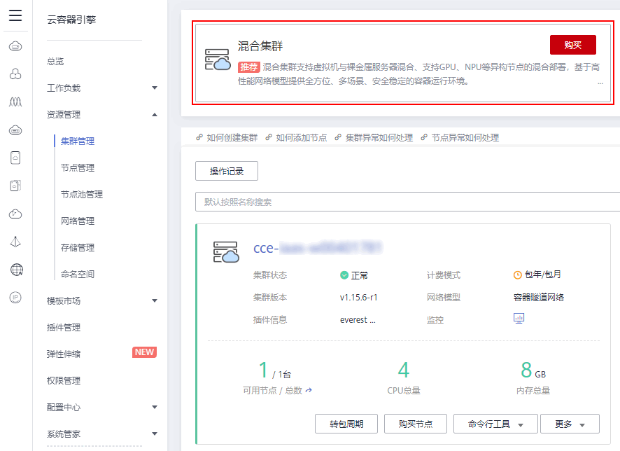
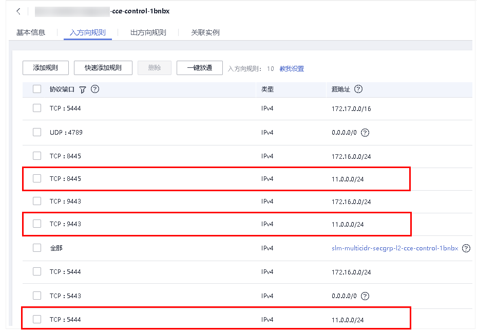

# 购买混合集群

-   [操作场景](#section14010441113)
-   [约束与限制](#section1386743114294)
-   [前提条件](#section1675221242512)
-   [创建集群须知](#section2086419142214)
-   [操作步骤](#section463761220269)
-   [相关操作](#section125261255139)

## 操作场景

您可以通过云容器引擎控制台非常方便快速的创建Kubernetes集群。Kubernetes是大规模容器集群管理软件，一个集群可以管理一组节点资源。

混合集群支持虚拟机与裸金属服务器混合、支持GPU、NPU等异构节点的混合部署，基于高性能网络模型提供全方位、多场景、安全稳定的容器运行环境，您可以通过[购买虚拟机节点](购买节点.md)、[使用GPU节点](使用GPU节点.md)、[使用裸金属节点](使用裸金属节点.md)实现多种场景的混合部署。

## 约束与限制

-   单Region下单用户可创建的集群总数限制为50个，如果配额不满足业务需求，请[到“我的配额”提交申请](https://console.huaweicloud.com/quota/?locale=zh-cn#/quota)。
-   集群一旦创建以后，不支持变更以下项：
    -   变更集群类型，例如“鲲鹏集群“变更为“混合集群“。
    -   变更集群的控制节点数量。
    -   变更控制节点可用区。
    -   变更集群的网络配置，如所在的虚拟私有云VPC、子网、容器网段、服务网段、IPv6、kubeproxy代理（转发）模式。
    -   变更网络模型，例如“容器隧道网络“更换为“VPC网络“。

更多内容请参见[约束与限制](https://support.huaweicloud.com/productdesc-cce/cce_productdesc_0005.html)。

## 前提条件

-   创建首个集群前，您必须先确保已存在虚拟私有云，否则无法创建集群。若您已有虚拟私有云，可重复使用，无需重复创建。

    虚拟私有云为CCE集群提供一个隔离的、用户自主配置和管理的虚拟网络环境。创建方法请参见[创建虚拟私有云和子网](https://support.huaweicloud.com/usermanual-vpc/zh-cn_topic_0013935842.html)。

-   您需要新建一个密钥对，用于远程登录节点时的身份认证。

    若使用密码登录节点，请跳过此操作。创建方法请参见[创建密钥对](https://support.huaweicloud.com/usermanual-ecs/zh-cn_topic_0014250631.html)。

-   创建集群前，请提前规划好容器网段和服务网段。网段参数在集群创建后不可更改，需要重新创建集群才能调整，请谨慎选择。

## 创建集群须知

创建集群过程中会同步创建一些基础资源，列表如下：

**表 1**  创建集群须知

<table><thead align="left"><tr id="row20811252105914"><th class="cellrowborder" valign="top" width="30%" id="mcps1.2.3.1.1">
资源名称

</th>
<th class="cellrowborder" valign="top" width="70%" id="mcps1.2.3.1.2">
描述

</th>
</tr>
</thead>
<tbody><tr id="row88111652155915"><td class="cellrowborder" valign="top" width="30%" headers="mcps1.2.3.1.1 ">
控制节点及其相关资源

</td>
<td class="cellrowborder" valign="top" width="70%" headers="mcps1.2.3.1.2 ">
存在于云容器引擎资源租户下，用户不可见。

</td>
</tr>
<tr id="row981135210590"><td class="cellrowborder" valign="top" width="30%" headers="mcps1.2.3.1.1 ">
弹性云服务器（可选创建）

</td>
<td class="cellrowborder" valign="top" width="70%" headers="mcps1.2.3.1.2 ">
集群节点，即用户的计算资源，对应“弹性云服务器”中的ECS。

ECS命名规则为：集群名称-随机数，可自定义，批量创建时会再加一串随机数。

</td>
</tr>
<tr id="row6811952165919"><td class="cellrowborder" valign="top" width="30%" headers="mcps1.2.3.1.1 ">
安全组

</td>
<td class="cellrowborder" valign="top" width="70%" headers="mcps1.2.3.1.2 ">
集群会创建两个安全组，一个用于管理集群控制节点的安全组，一个用于管理集群工作节点的安全组。

 警告： 

集群创建时自动创建的安全组以及安全组规则禁止删除，否则会导致集群异常。

<ol id="ol57751237359"><li>控制节点安全组
命名规则：集群名称-cce-control-随机数

作用：

<ul id="ul516535584419"><li>出方向允许。</li><li>其他节点访问控制节点kubernetes相关服务。</li></ul>
</li><li>工作节点安全组
命名规则：集群名称-cce-node-随机数

作用：

<ul id="ul1579276164613"><li>出方向允许。</li><li>开放linux或windows远程登录（22、3389）。</li><li>kubernetes组件之间访问使用（4789、10250）。</li><li>kubernetes用于对外开放的端口（30000-32767）。</li><li>相同安全组之间可以互相访问。</li></ul>
</li></ol>
</td>
</tr>
<tr id="row7811135245911"><td class="cellrowborder" valign="top" width="30%" headers="mcps1.2.3.1.1 ">
磁盘（可选创建）

</td>
<td class="cellrowborder" valign="top" width="70%" headers="mcps1.2.3.1.2 ">
分别给各个节点创建两个磁盘，一个是节点的系统盘，一个是给docker运行使用的数据盘。

</td>
</tr>
<tr id="row13811752135919"><td class="cellrowborder" valign="top" width="30%" headers="mcps1.2.3.1.1 ">
弹性IP（可选创建）

</td>
<td class="cellrowborder" valign="top" width="70%" headers="mcps1.2.3.1.2 ">
需用户选择，给节点绑定弹性IP ，可以使节点访问外网。

</td>
</tr>
</tbody>
</table>

## 操作步骤

1.  登录[CCE控制台](https://console.huaweicloud.com/cce2.0/?utm_source=helpcenter)，在总览页面单击“购买Kubernetes集群“，或在左侧导航栏中单击“资源管理  \>  集群管理”，单击“混合集群“下的“购买”。

    **图 1**  集群管理-购买混合集群  
    

2.  参照[表2](#table8638121213265)设置集群参数，其中带“\*”的参数需重点关注。

    **表 2**  创建集群参数配置

    
    <table><thead align="left"><tr id="row10638181262612"><th class="cellrowborder" valign="top" width="20.02%" id="mcps1.2.3.1.1">
参数

    </th>
    <th class="cellrowborder" valign="top" width="79.97999999999999%" id="mcps1.2.3.1.2">
参数说明

    </th>
    </tr>
    </thead>
    <tbody><tr id="row1922964644615"><td class="cellrowborder" valign="top" width="20.02%" headers="mcps1.2.3.1.1 ">
计费模式

    </td>
    <td class="cellrowborder" valign="top" width="79.97999999999999%" headers="mcps1.2.3.1.2 "><ul id="ul463941414445"><li>包年/包月：预付费模式，按订单的购买周期计费，适用于可预估资源使用周期的场景，价格比按需计费模式更优惠。包年/包月集群创建后不能删除，如需停止使用，请到<a href="https://account.huaweicloud.com/usercenter/#/userindex/retreatManagement" target="_blank" rel="noopener noreferrer">费用中心</a>执行退订操作。</li><li>按需计费：后付费模式，按资源的实际使用时长计费，可以随时开通/删除资源。</li></ul>
    
本章以“按需计费”类型为例进行讲解。

    </td>
    </tr>
    <tr id="row42961494311"><td class="cellrowborder" valign="top" width="20.02%" headers="mcps1.2.3.1.1 ">
区域

    </td>
    <td class="cellrowborder" valign="top" width="79.97999999999999%" headers="mcps1.2.3.1.2 ">
不同区域的云服务产品之间内网互不相通；请就近选择靠近您业务的区域，可减少网络时延，提高访问速度。

    </td>
    </tr>
    <tr id="row12321131519262"><td class="cellrowborder" valign="top" width="20.02%" headers="mcps1.2.3.1.1 ">
企业项目

    </td>
    <td class="cellrowborder" valign="top" width="79.97999999999999%" headers="mcps1.2.3.1.2 ">
该参数仅对开通企业项目的企业客户帐号显示。

    
选择某企业项目（如：default）后，集群、集群下节点、集群安全组、节点安全组和自动创建的节点EIP（弹性公网IP）将创建到所选企业项目下。为方便管理资源，在集群创建成功后，建议不要修改集群下节点、集群安全组、节点安全组的企业项目。

    
企业项目是一种云资源管理方式，企业项目管理服务提供统一的云资源按项目管理，以及项目内的资源管理、成员管理。了解更多企业项目相关信息，请查看<a href="https://support.huaweicloud.com/usermanual-em/zh-cn_topic_0123692049.html" target="_blank" rel="noopener noreferrer">企业管理</a>。

    </td>
    </tr>
    <tr id="row1063812126263"><td class="cellrowborder" valign="top" width="20.02%" headers="mcps1.2.3.1.1 ">
* 集群名称

    </td>
    <td class="cellrowborder" valign="top" width="79.97999999999999%" headers="mcps1.2.3.1.2 ">
新建集群的名称，创建后不可修改。

    
集群名称长度范围为4-128个字符，以小写字母开头，由小写字母、数字、中划线（-）组成，且不能以中划线（-）结尾。

    </td>
    </tr>
    <tr id="row6649879161231"><td class="cellrowborder" valign="top" width="20.02%" headers="mcps1.2.3.1.1 ">
版本

    </td>
    <td class="cellrowborder" valign="top" width="79.97999999999999%" headers="mcps1.2.3.1.2 ">
Kubernetes社区基线版本，建议选择最新的版本。版本升级请参见<a href="集群版本升级说明.md">集群版本升级说明</a>。

    
若有<strong id="b20728225518">Beta</strong>版本时，您可以选择试用，但不建议您将该版本用于商用场景。

    </td>
    </tr>
    <tr id="row572593234714"><td class="cellrowborder" valign="top" width="20.02%" headers="mcps1.2.3.1.1 ">
集群管理规模

    </td>
    <td class="cellrowborder" valign="top" width="79.97999999999999%" headers="mcps1.2.3.1.2 ">
集群管理规模是指当前集群的控制节点可以管理的最大工作节点规模，您可以选择50节点、200节点、1000节点或2000节点（仅1.15.11及以上版本的混合集群支持）四种管理规模，请根据您的业务需求选择，该规模在集群创建后不可更改，请慎重选择。如果您需要创建5000节点的集群，请<a href="https://console.huaweicloud.com/quota/?locale=zh-cn#/quota" target="_blank" rel="noopener noreferrer">提交工单</a>申请。

    
若选择“1000节点”，表示当前集群的控制节点最多可管理1000个工作节点。由于不同管理规模的控制节点规格不同，因此配置费用会有差异。

    
任何一个集群中均包含“Master Node”和“Worker Node”，每一个Node对应一台云服务器。<ul id="ul1045015327013"><li>Master Node：集群的控制节点，在创建集群时会自动创建控制节点，负责整个集群的管理和调度。</li><li>Worker Node：集群的工作节点，即用户购买或纳管的节点。工作负载是由控制节点分配的，当某个工作节点宕机时，控制节点会将工作负载转移到其他工作节点上。</li></ul>
    

    </td>
    </tr>
    <tr id="row17367436403"><td class="cellrowborder" valign="top" width="20.02%" headers="mcps1.2.3.1.1 ">
控制节点数

    </td>
    <td class="cellrowborder" valign="top" width="79.97999999999999%" headers="mcps1.2.3.1.2 ">
<strong id="b6722821483">3：</strong>集群将创建三个控制节点，从而实现集群高可用，在单个控制节点发生故障后集群可以继续使用，不影响业务功能。单击“更改”，在“容灾设置”页面，可选择容灾级别。

    <ul id="ul196515617488"><li>可用区：通过把控制节点建在不同的可用区，达到容灾目的。</li><li>故障域：通过把控制节点建在同一可用区下不同故障域，达到容灾目的。当环境支持故障域时，才会显示该选项。</li><li>主机：通过把控制节点建在同一可用区下不同主机，达到容灾目的。</li><li>自定义：您可以自行选择每个控制节点的位置。故障域模式控制节点必须在同一可用区下。</li></ul>
    
<strong id="b131651325480">1：</strong>集群仅创建一个控制节点，单控制节点集群不保证SLA（服务级别协议），非高可用集群，不适用于商用场景。单击“更改”，在“可用区设置”页面可选择控制节点可用区。

    
 说明： 
<ul id="ul1869875074110"><li>在商用场景中，为提高集群容灾能力，建议您选择多控制节点模式集群。</li><li>多控制节点模式开关在集群创建完成后不可变更。单控制节点集群不支持升级为多控制节点集群，控制节点故障将影响运行业务，请谨慎选择。</li><li>为保证可靠性，1000及以上集群管理规模默认开启多控制节点模式。</li></ul>
    

    </td>
    </tr>
    <tr id="row1763991215268"><td class="cellrowborder" valign="top" width="20.02%" headers="mcps1.2.3.1.1 ">
* 虚拟私有云

    </td>
    <td class="cellrowborder" valign="top" width="79.97999999999999%" headers="mcps1.2.3.1.2 ">
新建集群所在的虚拟私有云，集群创建后不可更改。

    
虚拟私有云是通过逻辑方式进行网络隔离，提供安全、隔离的网络环境。

    
若没有虚拟私有云可选择，请单击“创建虚拟私有云”进行创建，完成创建后单击刷新按钮。操作步骤请参见<a href="https://support.huaweicloud.com/usermanual-vpc/zh-cn_topic_0013935842.html" target="_blank" rel="noopener noreferrer">创建虚拟私有云和子网</a>。

    </td>
    </tr>
    <tr id="row15639412132615"><td class="cellrowborder" valign="top" width="20.02%" headers="mcps1.2.3.1.1 ">
* 所在子网

    </td>
    <td class="cellrowborder" valign="top" width="79.97999999999999%" headers="mcps1.2.3.1.2 ">
节点虚拟机运行的子网环境，集群创建后不可更改。

    
通过子网提供与其他网络隔离的、可以独享的网络资源，以提高网络安全。

    
若没有子网可选择，请单击“创建子网”进行创建，完成创建后单击刷新按钮。虚拟私有云、子网、集群的关系请参见<a href="集群概述.md">集群概述</a>。

    
<strong id="b13695957131719">请确保子网下的DNS服务器可以解析OBS服务域名，否则无法创建节点。</strong>

    
<strong id="b1119161703511">集群创建后子网无法修改，请谨慎选择。</strong>

    </td>
    </tr>
    <tr id="row115671413307"><td class="cellrowborder" valign="top" width="20.02%" headers="mcps1.2.3.1.1 ">
IPv6双栈

    </td>
    <td class="cellrowborder" valign="top" width="79.97999999999999%" headers="mcps1.2.3.1.2 ">
默认不开启。<strong id="b3710124814376">该功能仅在1.15及以上版本的集群下显示，方法请参见<a href="https://support.huaweicloud.com/bestpractice-cce/cce_bestpractice_00222.html" target="_blank" rel="noopener noreferrer">通过CCE搭建IPv4/IPv6双栈集群</a>。</strong>

    
开启IPv6：开启后将自动创建IPv6地址的容器网段与服务网段，支持通过IPv6地址段访问集群资源，包括节点，工作负载等。具体使用及限制请参见<a href="https://support.huaweicloud.com/bestpractice-cce/cce_bestpractice_00222.html" target="_blank" rel="noopener noreferrer">如何通过CCE搭建IPv4/IPv6双栈集群？</a>。

    </td>
    </tr>
    <tr id="row482955911270"><td class="cellrowborder" valign="top" width="20.02%" headers="mcps1.2.3.1.1 ">
网络模型

    </td>
    <td class="cellrowborder" valign="top" width="79.97999999999999%" headers="mcps1.2.3.1.2 ">
集群创建成功后，网络模型不可更改，请谨慎选择。如何选择网络模型请参见<a href="https://support.huaweicloud.com/bestpractice-cce/cce_bestpractice_00162.html" target="_blank" rel="noopener noreferrer">CCE集群创建时如何选择网络模型？各模型的区别是什么？</a>

    
<strong id="b952205617204">容器隧道网络</strong>

    
容器隧道网络下只能添加同一类型的节点，即全部为虚拟机节点或全部为裸金属节点。

    <ul id="ul1221141842110"><li>基于底层VPC网络，另构建了独立的VXLAN隧道化容器网络，适用于一般场景。</li><li>VXLAN是将以太网报文封装成UDP报文进行隧道传输。容器网络是承载于VPC网络之上的Overlay网络平面，具有付出少量隧道封装性能损耗，即可获得通用性强、互通性强、高级特性支持全面（例如Network Policy网络隔离）的优势，可以满足大多数应用需求。</li></ul>
    
<strong id="b75401805214">VPC网络</strong>

    
VPC网络模式下每个节点占用一条<a href="https://support.huaweicloud.com/usermanual-vpc/route_0002.html" target="_blank" rel="noopener noreferrer">VPC路由规则</a>，Console界面中可显示当前局点支持的VPC路由规则条数，以及每个节点可供分配的容器IP个数（即可创建的Pod实例数目上限），

    <ul id="ul68480277225"><li>采用VPC路由方式与底层网络深度整合，适用于高性能场景，但每个节点占用一条VPC路由规则，节点数量受限于虚拟私有云VPC的路由配额。</li><li>VPC网络集群下的每个节点将会被分配固定大小的IP地址段，由于没有隧道封装的消耗，容器网络性能相对于容器隧道网络有一定优势。VPC网络集群由于VPC路由中配置有容器网段与节点IP的路由，可以支持集群外直接访问容器实例等特殊场景。
 说明： 
<ul id="ul123221124171119"><li>VPC网络模式下不支持扩展网段和NetworkPolicy。</li><li>一个VPC下创建多个VPC网络模式的集群时，需要为每个集群选择一个不重叠的地址段，不仅不能和VPC地址重叠，也不和其他容器网段重叠。</li></ul>
    

    </li></ul>
    </td>
    </tr>
    <tr id="row64648564171234"><td class="cellrowborder" valign="top" width="20.02%" headers="mcps1.2.3.1.1 ">
容器网段

    </td>
    <td class="cellrowborder" valign="top" width="79.97999999999999%" headers="mcps1.2.3.1.2 ">
请根据业务需求选择容器网段，确定容器网段后，容器实例将在规划的网段内分配IP，集群创建后该网段不可更改。

    <ul id="ul1423120351449"><li>未勾选“自动选择”：请手动选择网段。若与子网网段有冲突时将有红色文字提示，请重新选择。建议使用网段：10.0.0.0/8~18，172.16.0.0/16~18，192.168.0.0/16~18。
<strong id="b02629514118">不同集群使用相同的容器网段，会导致容器IP冲突，应用访问异常。</strong>

    </li><li>勾选“自动选择”：系统将自动分配与子网网段无冲突的网段。</li></ul>
    
容器网段要设置合理的掩码，掩码决定集群内可用节点数量。集群中容器网段掩码设置不合适，会导致集群实际可用的节点较少。设置掩码后，选项下方会有当前网段最多支持的实例估算值，请作参考。详情请参见<a href="https://support.huaweicloud.com/bestpractice-cce/cce_bestpractice_00004.html" target="_blank" rel="noopener noreferrer">如何规划CCE集群的网络地址段？</a>。

    </td>
    </tr>
    <tr id="row6775143217241"><td class="cellrowborder" valign="top" width="20.02%" headers="mcps1.2.3.1.1 ">
服务网段

    </td>
    <td class="cellrowborder" valign="top" width="79.97999999999999%" headers="mcps1.2.3.1.2 ">
服务网段为kubernetes service ip网段，集群创建后该网段不可更改。服务网段与已创建的路由不能冲突，如果冲突，请重新选择。

    <ul id="ul13104152611581"><li>使用默认网段：默认设置为10.247.0.0/16网段。</li><li>手动设置网段：请根据业务需求设置合理的网段和掩码，掩码决定集群内可用service ip数量。</li></ul>
    
详情请参见<a href="https://support.huaweicloud.com/bestpractice-cce/cce_bestpractice_00004.html" target="_blank" rel="noopener noreferrer">如何规划CCE集群的网络地址段？</a>。

    </td>
    </tr>
    <tr id="row773511171567"><td class="cellrowborder" valign="top" width="20.02%" headers="mcps1.2.3.1.1 ">
鉴权方式

    </td>
    <td class="cellrowborder" valign="top" width="79.97999999999999%" headers="mcps1.2.3.1.2 ">
“RBAC”默认选择，不可取消。

    
开启RBAC能力后，设置了细粒度权限的IAM用户使用集群下资源将受到权限控制。详细请参见<a href="设置命名空间权限.md">设置命名空间权限</a>。

    </td>
    </tr>
    <tr id="row1610917221609"><td class="cellrowborder" valign="top" width="20.02%" headers="mcps1.2.3.1.1 ">
认证方式

    </td>
    <td class="cellrowborder" valign="top" width="79.97999999999999%" headers="mcps1.2.3.1.2 ">
认证机制主要用于对集群下的资源做权限控制。例如A用户只能对某个命名空间下的应用有读写权限，B用户对集群下的资源只有读权限等。角色权限控制的操作请参见<a href="集群管理权限控制.md">集群管理权限控制</a>。

    <ul id="ul208851410646"><li>默认状态下不选定“认证能力增强”，此时默认开启X509认证模式，X509是一种非常通用的证书格式。</li><li>若需要对集群进行权限控制，请勾选“认证能力增强”，选择“认证代理”。
单击“CA根证书”后的“上传文件”，上传符合规范且合法的证书，并<strong id="b2356470185">勾选“我已确认上传的证书合法”</strong>。

    
证书若不合法，集群将无法创建成功。请上传小于1MB的文件，上传格式支持.crt或.cer格式。

    </li></ul>
    </td>
    </tr>
    <tr id="row463941216264"><td class="cellrowborder" valign="top" width="20.02%" headers="mcps1.2.3.1.1 ">
集群描述

    </td>
    <td class="cellrowborder" valign="top" width="79.97999999999999%" headers="mcps1.2.3.1.2 ">
选填，请输入新建容器集群相应的描述信息。

    </td>
    </tr>
    <tr id="row96582533813"><td class="cellrowborder" valign="top" width="20.02%" headers="mcps1.2.3.1.1 ">
高级设置

    </td>
    <td class="cellrowborder" valign="top" width="79.97999999999999%" headers="mcps1.2.3.1.2 ">
单击“高级设置”后展开详细项目，支持的功能如下（当前可用区中不支持的功能将隐藏）：

    
<strong id="b193562261439">服务转发模式：</strong>

    <ul id="ul1435618265318"><li>iptables：社区传统的kube-proxy模式，完全以iptables规则的方式来实现service负载均衡。该方式最主要的问题是在服务多的时候产生太多的iptables规则，非增量式更新会引入一定的时延，大规模情况下有明显的性能问题。</li><li>ipvs：由华为主导开发并在社区获得广泛支持的kube-proxy模式，采用增量式更新，吞吐更高，速度更快，并可以保证service更新期间连接保持不断开，适用于大规模场景。
ipvs模式下，ingress和service使用相同的ELB实例时，无法在集群内的节点和容器中访问ingress。

    </li></ul>
    
 说明： 
<ul id="ul2513447132113"><li>ipvs为大型集群提供了更好的可扩展性和性能。</li><li>ipvs支持比iptables更复杂的负载平衡算法（最小负载，最少连接，位置，加权等）。</li><li>ipvs支持服务器健康检查和连接重试等。</li></ul>
    

    
<strong id="b203061532132217">资源标签：</strong>

    
通过为资源添加标签，可以对资源进行自定义标记，实现资源的分类。

    
您可以在TMS中创建“预定义标签”，预定义标签对所有支持标签功能的服务资源可见，通过使用预定义标签可以提升标签创建和迁移效率。具体请参见<a href="https://support.huaweicloud.com/usermanual-tms/zh-cn_topic_0144368884.html" target="_blank" rel="noopener noreferrer">创建预定义标签</a>。

    
<strong id="b15868154114358">CPU管理策略：</strong>

    
该参数仅在v1.13.10-r0及以上版本的集群中显示。

    <ul id="ul14813182993518"><li>开启：支持给工作负载实例配置CPU独占，适用于对CPU缓存和调度延迟敏感的工作负载。</li><li>关闭：关闭工作负载实例独占CPU核的功能，优点是CPU共享池的可分配核数较多。</li></ul>
    
更多CPU管理策略内容请参见<a href="https://kubernetes.io/blog/2018/07/24/feature-highlight-cpu-manager/" target="_blank" rel="noopener noreferrer">Feature Highlight: CPU Manager</a>或<a href="https://bbs.huaweicloud.com/forum/thread-28901-1-1.html" target="_blank" rel="noopener noreferrer">深入理解 Kubernetes CPU Mangager</a>。

    
开启CPU管理策略之后，CCE节点变更规格将无法重新拉起或创建工作负载，解决方法详见<a href="https://support.huaweicloud.com/cce_faq/cce_faq_00189.html" target="_blank" rel="noopener noreferrer">CCE节点变更规格后，为什么无法重新拉起或创建工作负载？</a>。

    </td>
    </tr>
    <tr id="row76532194177"><td class="cellrowborder" valign="top" width="20.02%" headers="mcps1.2.3.1.1 ">
购买时长

    </td>
    <td class="cellrowborder" valign="top" width="79.97999999999999%" headers="mcps1.2.3.1.2 ">
若选择创建“包年/包月”的集群，请设置购买时长。

    </td>
    </tr>
    </tbody>
    </table>

3.  单击“下一步：创建节点“，在“创建节点“步骤中，参照如下参数配置节点。
    -   **创建节点：**
        -   现在添加：创建集群的同时创建节点，当前仅支持虚拟机节点。如果节点创建失败集群会一起回滚。
        -   稍后添加：将不会创建节点，仅创建一个空集群，集群创建完成后可以添加虚拟机或裸金属节点。

    -   **计费模式：**支持“包年/包月“和“按需计费“两种计费类型。

        包年/包月：包年包月是预付费模式，按订单的购买周期计费，适用于可预估资源使用周期的场景，价格比按需计费模式更优惠。

        按需计费：按需计费是后付费模式，按资源的实际使用时长计费，可以随时开通/删除资源。

        创建集群时节点的计费方式跟随集群的计费方式，如集群的计费模式选择“按需计费“，则创建过程中节点的计费模式只能为“按需计费“，“包年/包月“同理。创建方式请参考[购买节点](购买节点.md)。

        包年/包月节点创建后不能删除，如需停止使用，请到[费用中心](https://account.huaweicloud.com/usercenter/#/userindex/retreatManagement)执行退订操作。

    -   **当前区域：**节点实例所在的物理位置。
    -   **可用区：**请根据业务需要进行选择。可用区是在同一区域下，电力、网络隔离的物理区域，可用区之间内网互通，不同可用区之间物理隔离。

        如果您需要提高工作负载的高可靠性，建议您在创建集群后将云服务器部署在不同的可用区，购买集群时节点只能部署在一个可用区。

        **图 2**  工作节点创建在不同可用区  
        

    -   **节点类型：**选择节点类型。
        -   虚拟机节点：选中后创建虚拟机节点。
        -   裸金属节点：创建集群过程中不可选，需在集群创建完成后才可以为集群增加裸金属节点。点此了解[裸金属服务器](https://support.huaweicloud.com/bms/index.html)。

            > **说明：** 
            >CCE集群中创建裸金属节点需满足以下条件：
            >-   集群创建完成之后才可以添加裸金属节点。
            >-   集群为非IPv6模式。
            >-   VPC网络集群版本高于v1.11.7，容器隧道网络集群版本高于v1.13.10。
            >-   节点计费模式为包年/包月。
            >购买裸金属节点请参考[购买节点](购买节点.md)。

    -   **节点名称：**自定义节点名称。长度范围为1-56个字符，以小写字母开头，支持小写字母、数字、中划线\(-\)，不能以中划线\(-\)结尾。

        创建后如需修改请参考[修改云服务器名称](https://support.huaweicloud.com/usermanual-ecs/ecs_03_0145.html)，修改后需要[同步节点信息](同步节点信息.md)。

    -   **节点规格：**请根据业务需求选择相应的节点规格。

        -   通用型：该类型实例提供均衡的计算、存储以及网络配置，适用于大多数的使用场景。通用型实例可用于Web服务器、开发测试环境以及小型数据库工作负载等场景。
        -   内存优化型：该类型实例提供内存比例更高的实例，可以用于对内存要求较高、数据量大的工作负载，例如关系数据库、NoSQL等场景。
        -   通用入门型：通用入门型实例提供均衡的计算、存储以及网络配置，利用CPU积分机制保证基准性能，适合平时不会持续高压力使用CPU，但偶尔需要提高计算性能完成工作负载的场景，可用于轻量级Web服务器、开发、测试环境以及中低性能数据库等场景。
        -   GPU加速型：提供优秀的浮点计算能力，从容应对高实时、高并发的海量计算场景。P系列适合于深度学习，科学计算，CAE等；G系列适合于3D动画渲染，CAD等。**仅支持1.11及以上版本集群添加GPU加速型节点。**
        -   高性能计算型：实例提供具有更稳定、超高性能计算性能的实例，可以用于超高性能计算能力、高吞吐量的工作负载场景，例如科学计算。
        -   通用计算增强型：该类型实例具有性能稳定且资源独享的特点，满足计算性能高且稳定的企业级工作负载诉求。
        -   磁盘增强型：该类型实例能提供可使用[本地磁盘存储](本地磁盘存储.md)以及更高网络性能的实例，可以用于处理需要高吞吐以及高数据交换处理的工作负载，例如大数据工作负载等场景。
        -   超高I/O型：该类型实例提供超低SSD盘访问延迟和超高IOPS性能，适用于高性能关系型数据库、NoSQL数据库（如Cassandra、MongoDB）、ElasticSearch搜索等场景。
        -   AI加速型：AI加速型节点实例，搭载高性能、低功耗的海思Ascend 310 AI处理器，实现快速高效地处理推理和图像识别等工作，适用于图像识别、视频处理、推理计算以及机器学习等场景。

            > **说明：** 
            >-   当前AI加速型节点仅在部分可用区可选。
            >-   选用AI加速型的节点前需要安装[huawei-npu](huawei-npu.md)插件，以保证使用昇腾 310芯片资源的负载可以正常运行。
            >-   节点创建成功后会安装D310芯片驱动并自动触发节点重启，期间会有短暂的节点不可用，属于正常现象，重启完成后可恢复正常。

        **图 3**  选择节点规格  
        

        为确保节点稳定性，系统会自动预留部分资源，用于运行必须的系统组件。详细请参见[节点预留资源计算公式](节点预留资源计算公式.md)。

    -   **操作系统：**部分Region不显示下方分类，请直接选择节点对应的操作系统。

        -   公共镜像：请选择节点对应的操作系统。

            公共镜像是常见的标准操作系统镜像，所有用户可见，包括操作系统以及预装的公共应用，更多介绍请参见[公共镜像概述](https://support.huaweicloud.com/productdesc-ecs/ecs_01_0049.html)。

        -   私有镜像（公测中）：包含操作系统或业务数据、预装的公共应用以及用户的私有应用的镜像，仅用户个人可见。**该功能仅支持v1.15及以上版本集群。**

            若没有私有镜像可选择，请参照[如何使用私有镜像制作工作节点镜像？（公测）](https://support.huaweicloud.com/bestpractice-cce/cce_bestpractice_00026.html)进行制作。

        -   共享镜像：由其他用户共享而来的私有镜像。更多关于共享镜像的使用，请参见[共享镜像](https://support.huaweicloud.com/usermanual-ims/ims_01_0305.html)。

        重装操作系统或修改操作系统配置将导致节点不可用，请务必谨慎操作，具体请参见[高危操作及解决方案](高危操作及解决方案.md)。

    -   **系统盘：**设置工作节点的系统盘空间。您可以设置系统盘的规格为40GB-1024GB之间的数值，缺省值为40GB。

        在默认情况下，系统盘可提供高IO、超高IO两种基本的云硬盘类型，通用SSD类型仅在部分Region公测，若需要使用请提交工单申请。详情请参见[云硬盘概述](https://support.huaweicloud.com/usermanual-ecs/ecs_03_0301.html)。

    -   **数据盘：**设置工作节点的数据盘空间。您可以设置数据盘的规格为100GB-32678GB之间的数值，缺省值为100GB。数据盘可提供的云硬盘类型与系统盘一致，此处不再赘述，详情参见系统盘中的云硬盘类型介绍。

        > **注意：** 
        >若数据盘卸载或损坏，会导致docker服务异常，最终导致节点不可用。建议不要删除该数据盘。

        -   LVM管理：CCE数据盘使用LVM（Logical Volume Manager）进行磁盘管理，开启后您可以通过空间分配调整数据盘中不同资源的空间占比。第一块盘默认选中不可更改，新增数据盘后可开启或关闭该功能：
            -   默认选中，开启LVM管理。
            -   取消选中，关闭LVM管理。

                > **注意：** 
                >-   开启LVM管理的数据盘将按照设置的比例进行统一分配。
                >-   1.13.10及更高版本的集群创建节点时，若未开启LVM管理的数据盘，请参考[为CCE节点添加第二块数据盘](https://support.huaweicloud.com/bestpractice-cce/cce_bestpractice_00190.html)填写安装前执行脚本进行格式化，否则该数据盘仍会被LVM管理。
                >-   1.13.10之前版本的集群创建节点时，若未开启LVM管理的数据盘请务必格式化，否则会与第一块数据盘进行二选一被LVM管理，进而导致与预期不符的情况。

        -   加密：数据盘加密功能可为您的数据提供强大的安全防护，加密磁盘生成的快照及通过这些快照创建的磁盘将自动继承加密功能。

            **该功能仅在部分Region的1.13.10及以上版本的集群中支持**，1.13.10之前版本的集群不显示此选项。

            -   默认不加密。
            -   点选“加密“后，可在弹出的“加密设置“对话框中，选择已有的密钥，若没有可选的密钥，请单击后方的链接创建新密钥，完成创建后单击刷新按钮。

        -   新增数据盘：当前仅支持挂载两块数据盘，您可以在节点创建完成后前往ECS添加更多数据盘。
        -   数据盘空间分配：单击后方的，可以对数据盘中的“k8s空间“和“用户空间“占比进行自定义设置。
            -   k8s空间：您可以自定义数据盘中Docker和Kubelet的资源占比。Docker资源包含Docker工作目录、Docker镜像数据以及镜像元数据；Kubelet资源包含Pod配置文件、密钥以及临时存储EmptyDir等挂载数据。
            -   用户空间：定义本地盘中不分配给kubernetes使用的空间大小和用户空间挂载路径。

                > **说明：** 
                >请注意“挂载路径“不能设置为根目录“/”，否则将导致挂载失败。挂载路径一般设置为：
                >-   /opt/xxxx（但不能为/opt/cloud）
                >-   /mnt/xxxx（但不能为/mnt/paas）
                >-   /tmp/xxx
                >-   /var/xxx （但不能为/var/lib、/var/script、/var/paas等关键目录）
                >-   /xxxx（但不能和系统目录冲突，例如bin、lib、home、root、boot、dev、etc、lost+found、mnt、proc、sbin、srv、tmp、var、media、opt、selinux、sys、usr等）
                >注意不能设置为/home/paas、/var/paas、/var/lib、/var/script、/mnt/paas、/opt/cloud，否则会导致系统或节点安装失败。

        **当集群版本为v1.13.10-r0及以上，且节点类型为“磁盘增强型“或“超高I/O型“时，数据盘将显示如下选项：**

        -   云硬盘：与节点类型为非“磁盘增强型”或“超高I/O型”时的数据盘一致，此处不再赘述，详情参见上方的[数据盘](#li12223421320)。
        -   本地磁盘：本地磁盘实例有宕机风险，不保证数据可靠性，建议您使用**云硬盘**存储您的业务数据。

            本地磁盘配置参数如下：

            -   磁盘类型：节点类型为“磁盘增强型“时支持普通磁盘\(hdd\)；节点类型为“超高I/O型“时支持固态硬盘\(ssd\)。
            -   读写方式：当**存在多块本地盘时**可以设置读写方式，支持“串行“和“并行“两种方式。串行表示数据读写为线性模式，当一块盘使用完才会使用下一块；并行表示数据读写为条带模式，可以同时读写多块本地盘。
            -   k8s空间：您可以自定义数据盘中Docker和Kubelet的资源占比。Docker资源包含Docker工作目录、Docker镜像数据以及镜像元数据；Kubelet资源包含Pod配置文件、密钥以及临时存储EmptyDir等挂载数据。
            -   用户空间：定义本地盘中不分配给kubernetes使用的空间大小和用户空间挂载路径。

        > **须知：** 
        >-   在数据盘中设置“k8s空间“和“用户空间“占比时，需满足k8s空间和用户空间总和为100%，设置后可单击自动调整数据。
        >-   磁盘使用direct-lvm模式，移除将使用loop-lvm模式，有影响系统稳定性的风险。

        **图 4**  设置本地磁盘  
        

    -   **虚拟私有云：**不可修改，仅用于展示当前集群所在的虚拟私有云，该参数仅在v1.13.10-r0及以上版本的集群中显示。
    -   **所在子网：**通过子网提供与其他网络隔离的、可以独享的网络资源，以提高网络安全。可选择该集群虚拟私有云下的任意子网，集群节点支持跨子网。

        该参数仅在v1.13.10-r0及以上版本的集群中显示，请务必**确保子网下的DNS服务器可以解析OBS服务域名**，否则无法创建节点。

        已有集群添加节点时，如果子网对应的VPC新增了扩展网段且子网是扩展网段，要在控制节点安全组（即集群名称-cce-control-随机数）中添加如下三条安全组规则，以保证集群添加的节点功能可用（新建集群时如果VPC已经新增了扩展网段则不涉及此场景）：

        

    -   **弹性IP：**集群开启IPv6时，不显示该参数。独立申请的公网IP地址，若节点有互联网访问的需求，请选择“现在购买“或“使用已有“。

        弹性公网IP提供外网访问能力，可以灵活绑定及解绑，随时修改带宽。未绑定弹性公网IP的云服务器无法直接访问外网，无法直接对外进行互相通信。详情请查看[弹性公网IP介绍](https://support.huaweicloud.com/usermanual-eip/eip_0007.html)。

        -   暂不使用：若新增节点未绑定弹性IP，则在该节点上运行的工作负载将不能被外网访问，仅可作为私有网络中部署业务或者集群所需云服务器进行使用。
        -   自动创建：选中后将根据您的配置购买弹性IP，并自动为每个节点进行分配。当购买的弹性IP数量小于节点个数时，会将弹性IP随机绑定到节点上。

            请根据业务需求和界面提示，选择弹性IP的规格、计费模式、带宽类型、带宽大小等。创建弹性云服务器时，请确保弹性IP配额充足。

        -   使用已有：请选择已有的弹性IP，将为当前节点分配已有弹性IP。

        > **说明：** 
        >CCE默认不启用VPC的SNAT。若VPC启用了SNAT，可以不使用EIP去访问外网。SNAT具体请参见[自定义策略](集群权限.md#section1437818291149)。

    -   **共享带宽：**集群开启IPv6时，显示该参数。请选择“暂不使用”或“使用已有”。

        弹性公网IP提供外网访问能力，可以灵活绑定及解绑，随时修改带宽。未绑定弹性公网IP的云服务器无法直接访问外网，无法直接对外进行互相通信。

    -   **登录方式：**支持密码和密钥对。
        -   选择“密码“：用户名默认为“root”，请输入登录节点的密码，并确认密码。

            登录节点时需要使用该密码，请妥善管理密码，系统无法获取您设置的密码内容。

        -   选择“密钥对“：选择用于登录本节点的密钥对，支持选择共享密钥。

            密钥对用于远程登录节点时的身份认证。若没有密钥对，可单击选项框右侧的“创建密钥对”来新建，创建密钥对操作步骤请参见[创建密钥对](https://support.huaweicloud.com/usermanual-ecs/zh-cn_topic_0014250631.html)。

            > **须知：** 
            >如果子用户创建节点选择密钥对创建，这个密钥只对创建这个密钥的子用户有效，即使其他子用户在同一个组也无法选择，也无法使用。例如：A用户创建的密钥，B用户无法使用这个密钥对创建节点，并且Console也选不到。

            **图 5**  密钥对  
            

    -   **云服务器高级设置：**（可选），单击展开后可对节点进行如下高级功能配置：
        -   **云服务器组：**云服务器组是对云服务器的一种逻辑划分，同一云服务器组中的云服务器遵从同一策略。

            -   反亲和性策略：同一云服务器组中的云服务器分散地创建在不同主机上，提高业务的可靠性。
            -   故障域策略：同一云服务器组中分布多个故障域，指定不同故障域可以实现云服务器的故障隔离，提高业务的可靠性。当环境支持故障域时，才会显示该选项。随机可用区不支持故障域策略。

            选择已创建的云服务器组，或单击“新建云服务器组“创建，创建完成后单击刷新按钮。

        -   **资源标签：**通过为资源添加标签，可以对资源进行自定义标记，实现资源的分类。

            您可以在TMS中创建“预定义标签“，预定义标签对所有支持标签功能的服务资源可见，通过使用预定义标签可以提升标签创建和迁移效率。具体请参见[创建预定义标签](https://support.huaweicloud.com/usermanual-tms/zh-cn_topic_0144368884.html)。

            CCE服务会自动帮您创建CCE-Dynamic-Provisioning-Node=节点id的标签，允许增加5个标签。

        -   **委托：**委托是由租户管理员在[统一身份认证服务](https://console.huaweicloud.com/iam/#/iam/agencies)上创建的。通过委托，可以将云主机资源共享给其他帐号，或委托更专业的人或团队来代为管理。新建委托请参见[委托其他云服务管理资源](https://support.huaweicloud.com/usermanual-iam/iam_06_0004.html)，创建委托时委托类型选择“云服务“，单击“选择“按钮并在弹出的窗口中选择“ECS BMS“，即允许ECS或BMS调用云服务。
        -   **安装前执行脚本：**请输入脚本命令，大小限制为0\~1000字符。

            脚本将在Kubernetes软件安装前执行，可能导致Kubernetes软件无法正常安装，需谨慎使用。常用于格式化数据盘等场景。

        -   **安装后执行脚本：**请输入脚本命令，大小限制为0\~1000字符。

            脚本将在Kubernetes软件安装后执行，不影响Kubernetes软件安装。常用于修改Docker配置参数等场景。

        -   **子网IP：**可选择“自动分配IP地址“和“手动分配IP地址“，推荐使用“自动分配IP地址“。

    -   **Kubernetes高级设置：**（可选），单击展开后可对集群进行如下高级功能配置：
        -   **最大实例数：**节点最大允许创建的实例数\(Pod\)，该数量包含系统默认实例，取值范围为16\~128。

            该设置的目的为防止节点因管理过多实例而负载过重，请根据您的业务需要进行设置。

        -   **自定义镜像仓库：**单击“新增自定义镜像仓库地址“输入镜像仓库地址。

            添加自定义镜像仓库地址（非SSL镜像源地址）到docker启动参数中，避免拉取个人镜像仓库的镜像失败，格式可为“IP地址:端口或者域名”。安装后执行脚本与自定义镜像仓库不能同时使用。

        -   **单容器可用数据空间：**该参数用于设置一个容器可用的数据空间大小，设置范围为10G到80G。如果设置的参数超过数据盘中Docker可占用的实际数据空间（由数据盘设置项中的资源分配自定义参数指定，默认为数据盘大小的90%），将以Docker的实际空间大小为主。该参数仅在v1.13.10-r0及以上版本的集群中显示。

    -   **节点购买数量：**此处设置的节点数不能超过集群管理的最大节点规模，请根据业务需求和界面提示进行选择，单击后方的可查看影响能添加节点数的因素（取决于最小值）。如需申请更多配额，请单击[申请扩大配额](https://console.huaweicloud.com/quota/?locale=zh-cn#/quota)。
    -   **购买时长：**若选择创建“包年/包月“的集群，请设置购买时长。

4.  单击“下一步：安装插件“，在“安装插件“步骤中选择要安装的插件。

    “系统资源插件“为必装插件，“高级功能插件“可根据实际需求进行选择性安装。

    所有插件也可以在集群创建完成后，在左侧导航栏中单击“插件管理“进行安装或卸载，具体请参见[插件管理](插件管理.md)  。

5.  单击“下一步：配置确认”，阅读“使用说明“并点选“我已知晓上述限制“，确认所设置的服务选型参数、规格和费用等信息。
6.  确认规格和费用后，单击“提交”，集群开始创建。

    若选择购买“包年包月“的集群，请单击“去支付“，根据界面提示进行付款操作。

    集群创建预计需要6-10分钟，您可以单击“返回集群管理“进行其他操作或单击“查看集群事件列表“后查看集群详情。待集群状态为“正常”，表示集群创建成功。

## 相关操作

-   通过命令行工具连接集群：请参见[通过kubectl或web-terminal插件操作CCE集群](通过kubectl或web-terminal插件操作CCE集群.md)。
-   添加节点：集群创建完成后，若您需要为集群添加更多节点，请参见[购买节点](购买节点.md)。
-   登录节点：请参见[登录节点](登录节点.md)。

-   创建命名空间：同个集群内可创建多个命名空间，形成逻辑上的不同分组，便于不同的分组在共享使用集群资源时还能被分别管理。若您需要为集群创建命名空间，请参见[命名空间](命名空间.md)。
-   创建工作负载：集群创建完成后，您可以使用镜像创建一个可公网访问的应用，请参见[创建无状态负载\(Deployment\)](创建无状态负载(Deployment).md)或[创建有状态负载\(StatefulSet\)](创建有状态负载(StatefulSet).md)。
-   单击已成功创建的集群名称，进入“集群详情“页可查看集群详情。

    **表 3**  已创建的集群详情

    
    <table><thead align="left"><tr id="row1264365516359"><th class="cellrowborder" valign="top" width="20%" id="mcps1.2.3.1.1">
页签类别

    </th>
    <th class="cellrowborder" valign="top" width="80%" id="mcps1.2.3.1.2">
说明

    </th>
    </tr>
    </thead>
    <tbody><tr id="row5975069716956"><td class="cellrowborder" valign="top" width="20%" headers="mcps1.2.3.1.1 ">
集群详情

    </td>
    <td class="cellrowborder" valign="top" width="80%" headers="mcps1.2.3.1.2 ">
可查看该集群的详情及运行状态等。

    </td>
    </tr>
    <tr id="row106431055133510"><td class="cellrowborder" valign="top" width="20%" headers="mcps1.2.3.1.1 ">
监控

    </td>
    <td class="cellrowborder" valign="top" width="80%" headers="mcps1.2.3.1.2 ">
可查看集群下全部节点的CPU和内存分配率（即分配量的最大值），以及控制节点的CPU和内存使用率、控制节点规格等信息。

    </td>
    </tr>
    <tr id="row1464335593515"><td class="cellrowborder" valign="top" width="20%" headers="mcps1.2.3.1.1 ">
事件

    </td>
    <td class="cellrowborder" valign="top" width="80%" headers="mcps1.2.3.1.2 "><ul id="ul42186174161243"><li>可以直接在“事件”页签下查看集群的事件。</li><li>可以设置查询条件，比如设置事件产生的时间段或搜索事件名称，查看相关事件。</li></ul>
    </td>
    </tr>
    <tr id="row506129238"><td class="cellrowborder" valign="top" width="20%" headers="mcps1.2.3.1.1 ">
弹性扩容

    </td>
    <td class="cellrowborder" valign="top" width="80%" headers="mcps1.2.3.1.2 ">
您可以根据实际业务需要对集群的工作节点进行扩容和缩容，详情请参见<a href="集群弹性扩容.md">集群弹性扩容</a>。

    
v1.17版本的集群不再支持AOM提供的弹性伸缩机制，请使用节点池功能进行弹性伸缩，详情请参见<a href="节点池概述.md">节点池概述</a>。

    </td>
    </tr>
    <tr id="row651036112414"><td class="cellrowborder" valign="top" width="20%" headers="mcps1.2.3.1.1 ">
kubectl

    </td>
    <td class="cellrowborder" valign="top" width="80%" headers="mcps1.2.3.1.2 ">
若您需要从客户端计算机连接到kubernetes集群，请使用kubernetes命令行客户端<a href="https://kubernetes.io/docs/user-guide/kubectl/" target="_blank" rel="noopener noreferrer">kubectl</a>，详情请参见<a href="通过kubectl或web-terminal插件操作CCE集群.md">通过kubectl或web-terminal插件操作CCE集群</a>。

    </td>
    </tr>
    <tr id="row2701721182419"><td class="cellrowborder" valign="top" width="20%" headers="mcps1.2.3.1.1 ">
Istioctl

    </td>
    <td class="cellrowborder" valign="top" width="80%" headers="mcps1.2.3.1.2 ">
在集群开启istio服务网格功能后，您使用Istio命令行工具Istioctl配置多种路由策略，从而管理服务流量，包括流量转移、故障注入、限流熔断等。详情请参见<a href="通过Istioctl配置路由策略.md">通过Istioctl配置路由策略</a>。

    </td>
    </tr>
    </tbody>
    </table>

