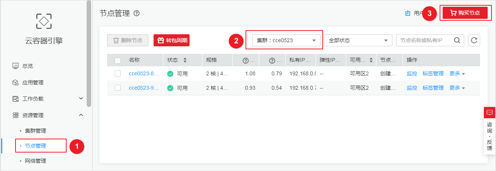
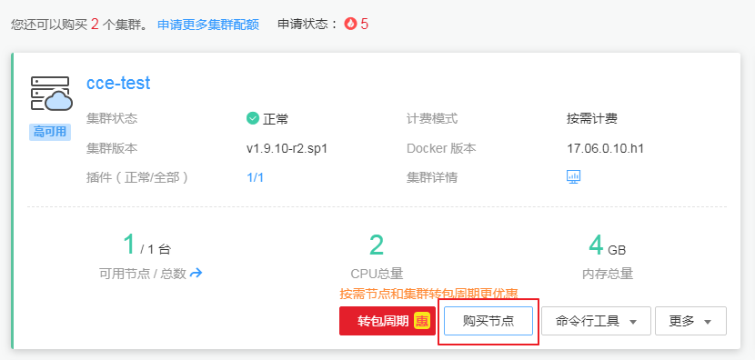

# 购买节点（按需计费）

节点是指接入到平台的计算资源，包括虚拟机、物理机等。用户需确保所在项目节点资源充足，若节点资源不足，会导致创建工作负载等操作失败。

## 准备工作

-   已创建至少一个集群，请参见[购买混合集群](购买混合集群.md)。
-   您需要新建一个密钥对，用于远程登录节点时的身份认证。

    若使用密码登录节点，请跳过此操作。创建方法请参见[创建密钥对](https://support.huaweicloud.com/usermanual-ecs/zh-cn_topic_0014250631.html)。

## 创建节点

1.  登录[CCE控制台](https://console.huaweicloud.com/cce2.0/?utm_source=helpcenter)，可通过如下两种方式进入“购买节点“页面：
    -   在左侧导航栏中选择“资源管理 \> 节点管理”，选择节点所在的集群后，在节点列表页面单击上方的“购买节点”按钮。

        **图 1**  购买节点-1  
        

    -   在左侧导航栏中选择“资源管理 \> 集群管理”，在集群列表页面单击需要添加节点集群下方的“购买节点”按钮。

        **图 2**  购买节点-2  
        

2.  计费模式：支持“按需计费“和“包年/包月“类型。本章讲解“按需计费“类型的操作。

    包年包月请参见[购买节点（包年包月）](购买节点（包年包月）.md)。

3.  选择区域和可用区。
    -   **当前区域：**节点实例所在的物理位置。
    -   **可用区：**请根据业务需要进行选择。可用区是在同一区域下，电力、网络隔离的物理区域，可用区之间内网互通，不同可用区之间物理隔离。

        如果您需要提高工作负载的高可靠性，建议您将云服务器创建在不同的可用区。

        **图 3**  Node节点创建在不同可用区  
        

4.  配置节点规格和节点个数。
    -   **节点类型：**选择节点类型。
        -   虚拟机节点：选中后创建虚拟机节点。
        -   裸金属节点：创建集群过程中不可选，需在集群创建完成后才可以为集群增加裸金属节点。点此了解[裸金属服务器](https://support.huaweicloud.com/bms/index.html)或[购买裸金属集群](购买裸金属集群.md)。

            > **说明：**   
            >CCE集群中创建裸金属节点需满足以下条件：  
            >-   集群创建完成之后才可以添加裸金属节点。  
            >-   集群为非IPV6模式。  
            >-   VPC网络集群版本高于v1.11.7，容器隧道网络集群版本高于v1.13.10。  
            >-   节点计费模式为包年/包月。  
            >购买裸金属节点请参考[购买节点（包年包月）](购买节点（包年包月）.md)。  

    -   **节点名称：**自定义节点名称。创建后如需修改请参考[修改云服务器名称](https://support.huaweicloud.com/usermanual-ecs/zh-cn_topic_0142266317.html)，修改后需要[同步节点信息](同步节点信息.md)。
    -   **节点规格：**请根据业务需求选择相应的节点规格。

        -   通用型：该类型实例提供均衡的计算、存储以及网络配置，适用于大多数的使用场景。通用型实例可用于Web服务器、开发测试环境以及小型数据库工作负载等场景。
        -   内存优化型：该类型实例提供内存比例更高的实例，可以用于对内存要求较高、数据量大的工作负载，例如关系数据库、NoSQL等场景。
        -   GPU加速型：提供优秀的浮点计算能力，从容应对高实时、高并发的海量计算场景。P系列适合于深度学习，科学计算，CAE等；G系列适合于3D动画渲染，CAD等。**目前仅支持1.11版本的集群添加GPU加速型节点；1.13及以上版本集群暂不支持，界面中不显示该选项。**
        -   高性能计算：实例提供具有更稳定、超高性能计算性能的实例，可以用于超高性能计算能力、高吞吐量的工作负载场景，例如科学计算。
        -   通用计算增强型：该类型实例具有性能稳定且资源独享的特点，满足计算性能高且稳定的企业级工作负载诉求。
        -   磁盘增强型：该类型实例能提供可使用[本地磁盘存储](使用本地磁盘存储.md)以及更高网络性能的实例，可以用于处理需要高吞吐以及高数据交换处理的工作负载，例如大数据工作负载等场景。
        -   超高I/O型：该类型实例提供超低SSD盘访问延迟和超高IOPS性能，适用于高性能关系型数据库、NoSQL数据库\(如 Cassandra、MongoDB\)、ElasticSearch搜索等场景。
        -   D芯片加速型：D芯片加速型实例，搭载高性能、低功耗的海思Ascend 310 AI处理器，适用于图像识别、视频处理、推理计算以及机器学习等场景。

            > **说明：**   
            >-   目前已开放公测，仅支持按需付费时选用该节点规格，仅在部分可用区可选，点此[立即申请](https://account.huaweicloud.com/usercenter/#/userindex/betaManagement?serviceCode=ecs_ascend_ai1)。  
            >-   选用D芯片加速型的节点前需要安装**huawei-npu**插件，以保证使用昇腾 310芯片资源的负载可以正常运行，点此[前往安装](huawei-npu.md)。  
            >-   节点创建成功后会安装D310芯片驱动并自动触发节点重启，期间会有短暂的节点不可用，属于正常现象，重启完成后可恢复正常。  

        **图 4**  选择节点规格  
        

        为确保节点稳定性，系统会自动预留部分资源，用于运行必须的系统组件。详细请参见[节点预留资源计算公式](节点预留资源计算公式.md)。

    -   **操作系统：**请选择节点对应的操作系统。

        重装操作系统或修改操作系统配置将导致节点不可用，请务必谨慎操作，详情请参见[集群节点高危操作](集群节点高危操作.md)。

    -   **虚拟私有云：**不可修改，仅用于展示当前集群所在的虚拟私有云，该参数仅在v1.13.10-r0及以上版本的集群中显示。
    -   **所在子网：**通过子网提供与其他网络隔离的、可以独享的网络资源，以提高网络安全。可选择该集群虚拟私有云下的任意子网，集群节点支持跨子网。

        该参数仅在v1.13.10-r0及以上版本的集群中显示。

5.  **弹性IP：**独立申请的公网IP地址，若节点有互联网访问的需求，请选择“现在购买“或“使用已有“。

    > **说明：**   
    >CCE默认不启用VPC的SNAT。若VPC启用了SNAT，可以不使用EIP去访问外网。SNAT详情请参见[从容器访问公网](从容器访问公网.md)。  

    -   暂不使用：若新增节点未绑定弹性IP，则在该节点上运行的工作负载将不能被外网访问，仅可作为私有网络中部署业务或者集群所需云服务器进行使用。
    -   现在购买：选中后将根据您的配置购买弹性IP，并自动为每个节点进行分配。当购买的弹性IP数量小于节点个数时，会将弹性IP随机绑定到节点上。

        请根据业务需求和界面提示，选择弹性IP购买数量、规格、计费模式、带宽类型等。创建弹性云服务器过程中，请确保弹性IP配额充足。

    -   使用已有：请选择已有的弹性IP，将为当前节点分配已有弹性IP。

6.  **系统盘**和**数据盘：**设置节点磁盘空间。

    -   系统盘：规格为\[40, 1024\]GB，用户可以配置，缺省值为40GB。
    -   数据盘：

        -   云硬盘：规格为\[100, 32678\]GB，用户可以配置，缺省值为100GB。

            勾选“资源分配自定义“后，您可以对数据盘中的Docker和Kubelet资源占比进行自定义设置。

        -   本地磁盘：仅支持在Kubernetes v1.13.10-r0及以上版本的集群且节点类型为“磁盘增强型“或“超高I/O型“时使用。本地磁盘实例有宕机风险，不保证数据可靠性，建议您使用云硬盘存储业务数据。

            本地磁盘配置参数如下：

            -   磁盘类型：节点类型为“磁盘增强型“时支持普通磁盘\(hdd\)；节点类型为“超高I/O型“时支持固态硬盘\(ssd\)。
            -   读写方式：支持“串行“和“并行“两种方式。当存在多块本地盘时可以设置读写方式。串行表示数据读写为线性模式，当一块盘使用完才会使用下一块；并行表示数据读写为条带模式，可以同时读写多块本地盘。
            -   k8s空间：您可以自定义数据盘中Docker和Kubelet的资源占比，Docker资源包含Docker镜像数据以及镜像元数据，Kubelet资源包含Pod配置文件、密钥以及临时存储EmptyDir等挂载数据。
            -   用户空间：定义本地盘中不分配给kubernetes使用的空间大小。

        > **须知：**   
        >-   在本地磁盘中设置k8s空间和用户空间时，需满足k8s空间和用户空间总和为100%，设置后可单击自动调整数据。  
        >-   磁盘使用direct-lvm模式，移除将使用loop-lvm模式，有影响系统稳定性的风险。详情请点此[了解更多](https://docs.docker.com/engine/userguide/storagedriver/device-mapper-driver/)。  

        **图 5**  设置本地磁盘  
        

    系统盘和数据盘均可提供以下性能规格的云硬盘：

    -   普通IO：是指由SATA存储提供资源的磁盘类型。提供可靠的块存储，单个云硬盘的最大IOPS可达到1000，可运行关键应用程序。
    -   高IO：是指由SAS存储提供资源的磁盘类型。提供可达到3000的高IO和低至1 ms的读写延时，支持NoSQL/关系型数据库，数据仓库，文件系统等应用。
    -   超高IO：是指由SSD存储提供资源的磁盘类型。提供可达到20000的超高IO和低至1 ms超低读写时延，支持NoSQL/关系型数据库，数据仓库等应用。

7.  **登录方式：**支持密码和密钥对。
    -   选择“密码“：用户名默认为“root”，请输入登录节点的密码，并确认密码。

        登录节点时需要使用该密码，请妥善管理密码，系统无法获取您设置的密码内容。

    -   选择“密钥对“：在选项框中选择用于登录本节点的密钥对，并单击勾选确认信息。

        密钥对用于远程登录节点时的身份认证。若没有密钥对，可单击选项框右侧的“创建密钥对”来新建，创建密钥对操作步骤请参见[创建密钥对](https://support.huaweicloud.com/usermanual-ecs/zh-cn_topic_0014250631.html)。

        **图 6**  密钥对  
        

8.  **ECS高级设置：**（可选），单击展开后可对节点进行如下高级功能配置：
    -   **云服务器组：**选择已创建的云服务器组，或单击右侧的“新建云服务器组“创建，创建完成后单击刷新按钮。

        通过云服务器组功能，弹性云服务器在创建时，将尽量分散地创建在不同的主机上，提高业务的可靠性。

    -   **资源标签：**通过为资源添加标签，可以对资源进行自定义标记，实现资源的分类。

        您可以在TMS中创建“预定义标签“，预定义标签对所有支持标签功能的服务资源可见，通过使用预定义标签可以提升标签创建和迁移效率。详情请参见[创建预定义标签](https://support.huaweicloud.com/usermanual-tms/zh-cn_topic_0144368884.html)。

        CCE服务会自动帮您创建CCE-Dynamic-Provisioning-Node=节点id的标签，允许增加5个标签。

    -   **委托：**委托是由租户管理员在[统一身份认证服务](https://console.huaweicloud.com/iam/#/iam/agencies)上创建的。通过委托，可以将云主机资源共享给其他帐号，或委托更专业的人或团队来代为管理。新建委托请参见[委托其他云服务管理资源](https://support.huaweicloud.com/usermanual-iam/zh-cn_topic_0175653574.html)，创建委托时委托类型选择“云服务“，单击“选择“按钮并在弹出的窗口中选择“ECS BMS“，即允许ECS或BMS调用云服务。
    -   **安装前执行脚本：**请输入脚本命令，大小限制为0\~1000字符。

        脚本将在Kubernetes软件安装前执行，可能导致Kubernetes软件无法正常安装，需谨慎使用。常用于格式化数据盘等场景。

    -   **安装后执行脚本：**请输入脚本命令，大小限制为0\~1000字符。

        脚本将在Kubernetes软件安装后执行，不影响Kubernetes软件安装。常用于修改Docker配置参数等场景。

    -   **新增数据盘：**单击“新增数据盘“增加一个数据盘并设置数据盘容量，该数据盘需要在**安装前执行脚本**中输入脚本命令进行格式化。示例请参见[如何给CCE节点添加第二块数据盘？](https://support.huaweicloud.com/cce_faq/cce_faq_00190.html)
    -   **子网IP：**可选择“自动分配IP地址“和“手动分配IP地址“，推荐使用“自动分配IP地址“。

9.  **Kubernetes高级设置：**（可选），单击展开后可对集群进行如下高级功能配置：
    -   **最大实例数：**节点最大允许创建的实例数\(Pod\)，该数量包含系统默认实例，取值范围为16\~250。

        该设置的目的为防止节点因管理过多实例而负载过重，请根据您的业务需要进行设置。

    -   **自定义镜像仓库：**单击“新增自定义镜像仓库地址“输入镜像仓库地址。

        添加自定义镜像仓库地址（非SSL镜像源地址）到docker启动参数中，避免拉取个人镜像仓库的镜像失败，格式可为“IP地址:端口或者域名”。安装后执行脚本与自定义镜像仓库不能同时使用。

    -   **单容器可用数据空间：**该参数用于设置一个容器可用的数据空间大小，设置范围为 10G 到 80G。如果设置的参数超过数据盘中Docker可占用的实际数据空间（由数据盘设置项中的资源分配自定义参数指定，默认为数据盘大小的90%），将以Docker的实际空间大小为主。该参数仅在v1.13.10-r0及以上版本的集群中显示。

10. **节点购买数量：**此处设置的节点数不能超过集群管理的最大节点规模，请根据业务需求和界面提示进行选择，如需更多配额，请单击[提交工单](https://console.huaweicloud.com/console/#/quota)申请扩大配额。
11. 单击“立即购买”，确认订单无误后，单击“提交“。开始创建节点，预计需要6-10分钟，请耐心等待。

    > **说明：**   
    >-   若创建节点时，提示弹性IP配额不足，请参照[如何解决新增节点时提示弹性IP不足的问题？](https://support.huaweicloud.com/cce_faq/cce_faq_00027.html)方法解决。  
    >-   添加节点时会自动创建云服务器。若创建失败，该失败回滚过程会根据云服务器的统一收费策略来收取费用。若出现失败回滚类的收费，请到[费用中心](https://account.huaweicloud.com/usercenter/#/userindex/retreatManagement)执行退订操作。  

12. 单击“返回节点列表“，待状态为可用，表示节点创建成功。

