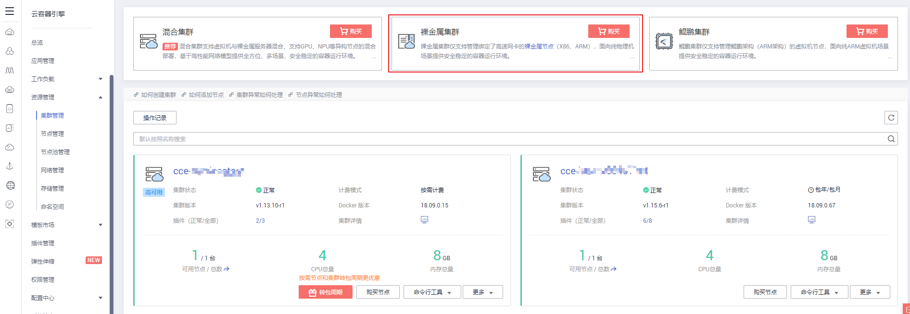

# 购买裸金属集群

裸金属集群是基于裸金属服务提供高计算和高网络性能的kubernetes容器集群，如需使用请先开通裸金属服务。

裸金属集群为保证高速的容器网络性能，要求您在[创建裸金属服务器](https://support.huaweicloud.com/usermanual-bms/zh-cn_topic_0035100414.html)时，添加一块高速网卡。

## 准备工作

-   创建首个集群前，您必须先确保已存在虚拟私有云，否则无法创建集群。若您已有虚拟私有云，可重复使用，无需重复创建。

    虚拟私有云为CCE集群提供一个隔离的、用户自主配置和管理的虚拟网络环境。创建方法请参见[创建虚拟私有云和子网](https://support.huaweicloud.com/usermanual-vpc/zh-cn_topic_0013935842.html)。

-   已购买裸金属服务，具体步骤请参见[创建裸金属服务器](https://support.huaweicloud.com/usermanual-bms/zh-cn_topic_0035100414.html)。
-   已创建高速网络，具体步骤请参见[这里](https://support.huaweicloud.com/usermanual-bms/zh-cn_topic_0053537013.html)。高速网络是“裸金属服务器（简称BMS）“的内部网络，为同一可用区内的BMS之间提供带宽不受限制的网络。

## 创建集群

1.  登录[CCE控制台](https://console.huaweicloud.com/cce2.0/?utm_source=helpcenter)，在左侧导航栏中单击“资源管理 \> 集群管理”，在集群管理页面单击“裸金属集群“下的“购买”。

    **图 1**  购买裸金属集群  
    

2.  参照[表1](#table8638121213265)设置集群参数，其中带“\*”的参数需重点关注。

    **表 1**  创建集群参数配置

    
    <table><thead align="left"><tr id="row10638181262612"><th class="cellrowborder" valign="top" width="20%" id="mcps1.2.3.1.1">
参数

    </th>
    <th class="cellrowborder" valign="top" width="80%" id="mcps1.2.3.1.2">
参数说明

    </th>
    </tr>
    </thead>
    <tbody><tr id="row3232711133718"><td class="cellrowborder" valign="top" width="20%" headers="mcps1.2.3.1.1 ">
计费模式

    </td>
    <td class="cellrowborder" valign="top" width="80%" headers="mcps1.2.3.1.2 "><ul id="ul463941414445"><li>包年/包月：预付费模式，按订单的购买周期计费，适用于可预估资源使用周期的场景，价格比按需计费模式更优惠。包年/包月集群创建后不能删除，如需停止使用，请到<a href="https://account.huaweicloud.com/usercenter/#/userindex/retreatManagement" target="_blank" rel="noopener noreferrer">费用中心</a>执行退订操作。</li><li>按需计费：后付费模式，按资源的实际使用时长计费，可以随时开通/删除资源。</li></ul>
    </td>
    </tr>
    <tr id="row9824857125213"><td class="cellrowborder" valign="top" width="20%" headers="mcps1.2.3.1.1 ">
区域

    </td>
    <td class="cellrowborder" valign="top" width="80%" headers="mcps1.2.3.1.2 ">
请就近选择靠近您业务的区域，可减少网络时延，提高访问速度；不同区域的云服务产品之间内网互不相通。

    </td>
    </tr>
    <tr id="row119431051131213"><td class="cellrowborder" valign="top" width="20%" headers="mcps1.2.3.1.1 ">
企业项目

    </td>
    <td class="cellrowborder" valign="top" width="80%" headers="mcps1.2.3.1.2 ">
该参数仅对开通企业项目的企业客户账号显示。选择某企业项目（如：default）后，集群、集群下节点、集群安全组、节点安全组和自动创建的节点EIP将创建到所选企业项目下。

    
企业项目是一种云资源管理方式，企业项目管理服务提供统一的云资源按项目管理，以及项目内的资源管理、成员管理。了解更多企业项目相关信息，请查看<a href="https://support.huaweicloud.com/usermanual-em/zh-cn_topic_0123692049.html" target="_blank" rel="noopener noreferrer">企业管理</a>。

    </td>
    </tr>
    <tr id="row1063812126263"><td class="cellrowborder" valign="top" width="20%" headers="mcps1.2.3.1.1 ">
* 集群名称

    </td>
    <td class="cellrowborder" valign="top" width="80%" headers="mcps1.2.3.1.2 ">
新建集群的名称，创建后不可修改。

    
集群名称长度范围为4-128个字符，以小写字母开头，由小写字母、数字、中划线（-）组成，且不能以中划线（-）结尾。

    </td>
    </tr>
    <tr id="row1820711165158"><td class="cellrowborder" valign="top" width="20%" headers="mcps1.2.3.1.1 ">
版本

    </td>
    <td class="cellrowborder" valign="top" width="80%" headers="mcps1.2.3.1.2 ">
Kubernetes社区基线版本，建议选择最新的版本。版本升级请参见<a href="集群大版本升级说明.md">集群大版本升级说明</a>。

    
若有<strong id="b20728225518">Beta</strong>版本时，您可以选择试用，但不建议您将该版本用于商用场景。

    </td>
    </tr>
    <tr id="row434114618372"><td class="cellrowborder" valign="top" width="20%" headers="mcps1.2.3.1.1 ">
集群管理规模

    </td>
    <td class="cellrowborder" valign="top" width="80%" headers="mcps1.2.3.1.2 ">
集群管理规模是指当前集群的控制节点可以管理的最大工作节点规模，您可以选择10节点、100节点、500节点三种管理规模（不同Region中略有差异），请根据您的业务需求选择，该规模在集群创建后不可更改，请慎重选择。

    
若选择“500节点”，表示当前集群的控制节点最多可管理500个工作节点。由于不同管理规模的控制节点规格不同，因此配置费用会有差异。

    
任何一个集群中均包含“Master Node”和“Worker Node”，每一个Node对应一台云服务器。<ul id="ul1045015327013"><li>Master Node：集群的控制节点，在创建集群时会自动创建控制节点，负责整个集群的管理和调度。</li><li>Worker Node：集群的工作节点，即用户购买或纳管的节点。工作负载是由控制节点分配的，当某个工作节点宕机时，控制节点会将工作负载转移到其他工作节点上。</li></ul>
    

    </td>
    </tr>
    <tr id="row128144815371"><td class="cellrowborder" valign="top" width="20%" headers="mcps1.2.3.1.1 ">
高可用

    </td>
    <td class="cellrowborder" valign="top" width="80%" headers="mcps1.2.3.1.2 ">
是：开启高可用模式，集群将创建多个控制节点，在单个控制节点发生故障时集群可以继续使用，不影响业务功能。

    
否：开启高可用模式，集群仅创建一个控制节点，非高可用集群不保证SLA，不适用于商用场景。

    
 说明： 
<ul id="ul997894015013"><li>在商用场景中，为提高集群容灾能力，建议您选择“高可用”模式集群。</li><li>非高可用集群不支持升级为高可用集群，控制节点故障将影响运行业务，只能通过重新创建集群才能调整为高可用集群，请谨慎选择。</li></ul>
    

    </td>
    </tr>
    <tr id="row1763991215268"><td class="cellrowborder" valign="top" width="20%" headers="mcps1.2.3.1.1 ">
* 虚拟私有云

    </td>
    <td class="cellrowborder" valign="top" width="80%" headers="mcps1.2.3.1.2 ">
新建集群所在的虚拟私有云。

    
虚拟私有云是通过逻辑方式进行网络隔离，提供安全、隔离的网络环境。

    
若没有虚拟私有云可选择，请单击“创建虚拟私有云”进行创建，完成创建后点击刷新按钮。操作步骤请参见<a href="https://support.huaweicloud.com/usermanual-vpc/zh-cn_topic_0013935842.html" target="_blank" rel="noopener noreferrer">创建虚拟私有云和子网</a>。

    </td>
    </tr>
    <tr id="row15639412132615"><td class="cellrowborder" valign="top" width="20%" headers="mcps1.2.3.1.1 ">
* 所在子网

    </td>
    <td class="cellrowborder" valign="top" width="80%" headers="mcps1.2.3.1.2 ">
节点虚拟机运行的子网环境。

    
通过子网提供与其他网络隔离的、可以独享的网络资源，以提高网络安全。

    
若没有子网可选择，请单击“创建子网”进行创建，完成创建后点击刷新按钮。虚拟私有云、子网、集群的关系请参见<a href="集群概述.md">集群概述</a>。

    
<strong id="b13695957131719">请确保子网下的DNS服务器可以解析OBS服务域名，否则无法创建节点。</strong>

    
<strong id="b9136183821711">集群创建后子网无法修改，请谨慎选择。</strong>

    </td>
    </tr>
    <tr id="row142110462613"><td class="cellrowborder" valign="top" width="20%" headers="mcps1.2.3.1.1 ">
网络模型

    </td>
    <td class="cellrowborder" valign="top" width="80%" headers="mcps1.2.3.1.2 ">
Underlay：传统单层网络，是当前数据中心网络基础转发架构的网络。

    </td>
    </tr>
    <tr id="row8378645411"><td class="cellrowborder" valign="top" width="20%" headers="mcps1.2.3.1.1 ">
* 高速网络

    </td>
    <td class="cellrowborder" valign="top" width="80%" headers="mcps1.2.3.1.2 ">
请选择已创建的高速网络。

    
高速网络是“裸金属服务器（简称BMS）”的内部网络，能保证裸金属服务器之间带宽不受限制的高速访问。

    
创建步骤请参见<a href="https://support.huaweicloud.com/usermanual-bms/zh-cn_topic_0053537013.html" target="_blank" rel="noopener noreferrer">管理高速网络</a>。

    </td>
    </tr>
    <tr id="row6514088885942"><td class="cellrowborder" valign="top" width="20%" headers="mcps1.2.3.1.1 ">
容器网段

    </td>
    <td class="cellrowborder" valign="top" width="80%" headers="mcps1.2.3.1.2 ">
请根据业务需求选择容器网段，确定容器网段后，容器实例将在规划的网段内分配IP。

    <ul id="ul1423120351449"><li>“自动选择”未勾选：请手动选择网段。若与子网网段有冲突时将有红色文字提示，请重新选择。建议使用网段：10.0.0.0/8~16，172.16.0.0/16，192.168.0.0/16。
<strong id="b02629514118">不同集群使用相同的容器网段，会导致容器IP冲突，应用访问异常。</strong>

    </li><li>勾选“自动选择”：系统将自动分配与子网网段无冲突的网段。</li></ul>
    
容器网段要设置合理的掩码，掩码决定集群内可用节点数量。集群中容器网段掩码设置不合适，会导致集群实际可用的节点较少。设置掩码后，选项下方会有当前网段最多支持的实例估算值，请作参考。详情请参见<a href="https://support.huaweicloud.com/bestpractice-cce/cce_bestpractice_00004.html" target="_blank" rel="noopener noreferrer">如何规划CCE集群的网络地址段？</a>

    </td>
    </tr>
    <tr id="row1118716429343"><td class="cellrowborder" valign="top" width="20%" headers="mcps1.2.3.1.1 ">
服务网段

    </td>
    <td class="cellrowborder" valign="top" width="80%" headers="mcps1.2.3.1.2 ">
服务网段为kubernetes service ip网段。

    
默认选中，网段将设置为10.247.0.0/16。

    </td>
    </tr>
    <tr id="row03792506375"><td class="cellrowborder" valign="top" width="20%" headers="mcps1.2.3.1.1 ">
鉴权方式

    </td>
    <td class="cellrowborder" valign="top" width="80%" headers="mcps1.2.3.1.2 ">
“RBAC”默认勾选，不可取消。

    
开启RBAC能力后，设置了细粒度权限的IAM用户使用集群下资源将受到权限控制。详细请参见<a href="设置命名空间权限.md">设置命名空间权限</a>。

    </td>
    </tr>
    <tr id="row899013277910"><td class="cellrowborder" valign="top" width="20%" headers="mcps1.2.3.1.1 ">
认证方式

    </td>
    <td class="cellrowborder" valign="top" width="80%" headers="mcps1.2.3.1.2 ">
认证机制主要用于对集群下的资源做权限控制。例如A用户只能对某个命名空间下的应用有读写权限，B用户对集群下的资源只有读权限等等。角色权限控制的操作请参见<a href="集群管理权限控制.md">集群管理权限控制</a>。

    <ul id="ul208851410646"><li>默认状态下不选定“认证能力增强”，此时默认开启X509认证模式，X.509是一种非常通用的证书格式。</li><li>若需要对集群进行权限控制，请勾选“认证能力增强”，选择“认证代理”。
单击“CA根证书”后的“上传文件”，上传符合规范且合法的证书，并<strong id="b2356470185">勾选“我已确认上传的证书合法”</strong>。

    
证书若不合法，集群将无法创建成功。请上传小于1MB的文件，上传格式支持.crt或.cer格式。

    </li></ul>
    </td>
    </tr>
    <tr id="row463941216264"><td class="cellrowborder" valign="top" width="20%" headers="mcps1.2.3.1.1 ">
集群描述

    </td>
    <td class="cellrowborder" valign="top" width="80%" headers="mcps1.2.3.1.2 ">
选填，请输入新建容器集群相应的描述信息。

    </td>
    </tr>
    <tr id="row151051543144310"><td class="cellrowborder" valign="top" width="20%" headers="mcps1.2.3.1.1 ">
高级设置

    </td>
    <td class="cellrowborder" valign="top" width="80%" headers="mcps1.2.3.1.2 ">
单击“高级设置”后展开详细项目，支持的功能如下（当前可用区中不支持的功能将隐藏）：

    
<strong id="b193562261439">服务转发模式：</strong>

    <ul id="ul1435618265318"><li>iptables：社区传统的kube-proxy模式，完全以iptables规则的方式来实现service负载均衡。该方式最主要的问题是在服务多的时候产生太多的iptables规则，非增量式更新会引入一定的时延，大规模情况下有明显的性能问题。</li><li>ipvs：由华为主导开发并在社区获得广泛支持的kube-proxy模式，采用增量式更新，吞吐更高，速度更快，并可以保证service更新期间连接保持不断开，适用于大规模场景。
ipvs模式下，ingress和service使用相同的ELB实例时，无法在集群内的节点和容器中访问ingress。

    </li></ul>
    
 说明： 
<ul id="ul2513447132113"><li>ipvs为大型集群提供了更好的可扩展性和性能。</li><li>ipvs支持比iptables更复杂的负载平衡算法（最小负载，最少连接，位置，加权等）。</li><li>ipvs支持服务器健康检查和连接重试等。</li></ul>
    

    
<strong id="b203061532132217">资源标签：</strong>

    
通过为资源添加标签，可以对资源进行自定义标记，实现资源的分类。

    
您可以在TMS中创建“预定义标签”，预定义标签对所有支持标签功能的服务资源可见，通过使用预定义标签可以提升标签创建和迁移效率。具体请参见<a href="https://support.huaweicloud.com/usermanual-tms/zh-cn_topic_0144368884.html" target="_blank" rel="noopener noreferrer">创建预定义标签</a>。

    
<strong id="b15868154114358">CPU管理策略：</strong>

    
该参数仅在v1.13.10-r0及以上版本的集群中显示。

    <ul id="ul14813182993518"><li>开启：支持给工作负载实例配置CPU独占，适用于对CPU缓存和调度延迟敏感的工作负载。</li><li>关闭：关闭工作负载实例独占CPU核的功能，优点是CPU共享池的可分配核数较多。</li></ul>
    
更多CPU管理策略内容请参见<a href="https://kubernetes.io/blog/2018/07/24/feature-highlight-cpu-manager/" target="_blank" rel="noopener noreferrer">Feature Highlight: CPU Manager</a>或<a href="https://bbs.huaweicloud.com/forum/thread-28901-1-1.html" target="_blank" rel="noopener noreferrer">深入理解 Kubernetes CPU Mangager</a>。

    
<strong id="b15232314276">控制节点可用区：</strong>

    
选择控制节点分布在哪个可用区，高可用集群可选择多个可用区，非高可用集群只能选择一个可用区。

    
<b>图1 </b>控制节点可用区选择 

    
多可用区模式支持集群管理面多可用区容灾，控制节点的可用区最多可以选择3个。

    </td>
    </tr>
    <tr id="row1821013512568"><td class="cellrowborder" valign="top" width="20%" headers="mcps1.2.3.1.1 ">
购买时长

    </td>
    <td class="cellrowborder" valign="top" width="80%" headers="mcps1.2.3.1.2 ">
若选择创建“包年/包月”的集群，请设置购买时长。

    </td>
    </tr>
    </tbody>
    </table>

3.  配置完成后，单击“下一步：配置确认”。
4.  确认规格和费用后，单击“提交”，集群开始创建。

    > **说明：** 
    >若选择购买“包年包月“的集群，请单击“去支付“，根据界面提示进行付款操作。

    集群创建预计需要6-10分钟，您可以单击“返回集群管理“进行其他操作或单击“查看集群事件列表“后查看集群详情。

## 相关操作

-   通过命令行工具连接集群：请参见[通过kubectl或web-terminal插件连接CCE集群](通过kubectl或web-terminal插件连接CCE集群.md)。
-   添加节点：集群创建完成后，若您需要为集群添加更多节点，请参见[购买节点](购买节点.md)。
-   登录节点：请参见[登录节点](登录节点.md)。

-   创建命名空间：同个集群内可创建多个命名空间，形成逻辑上的不同分组，便于不同的分组在共享使用集群资源时还能被分别管理。若您需要为集群创建命名空间，请参见[命名空间](命名空间.md)。
-   创建工作负载：集群创建完成后，您可以使用镜像创建一个可公网访问的应用，请参见[创建无状态负载\(Deployment\)](创建无状态负载(Deployment).md)或[创建有状态负载\(StatefulSet\)](创建有状态负载(StatefulSet).md)。
-   单击已成功创建的集群名称，进入“集群详情“页可查看集群详情。

    **表 2**  已创建的集群详情

    
    <table><thead align="left"><tr id="cce_01_0028_row1264365516359"><th class="cellrowborder" valign="top" width="20%" id="mcps1.2.3.1.1">
页签类别

    </th>
    <th class="cellrowborder" valign="top" width="80%" id="mcps1.2.3.1.2">
说明

    </th>
    </tr>
    </thead>
    <tbody><tr id="cce_01_0028_row5975069716956"><td class="cellrowborder" valign="top" width="20%" headers="mcps1.2.3.1.1 ">
集群详情

    </td>
    <td class="cellrowborder" valign="top" width="80%" headers="mcps1.2.3.1.2 ">
可查看该集群的详情及运行状态等。

    </td>
    </tr>
    <tr id="cce_01_0028_row106431055133510"><td class="cellrowborder" valign="top" width="20%" headers="mcps1.2.3.1.1 ">
监控

    </td>
    <td class="cellrowborder" valign="top" width="80%" headers="mcps1.2.3.1.2 ">
可查看集群下全部节点的CPU和内存分配率（即分配量的最大值），以及控制节点的CPU和内存使用率、控制节点规格等信息。

    </td>
    </tr>
    <tr id="cce_01_0028_row1464335593515"><td class="cellrowborder" valign="top" width="20%" headers="mcps1.2.3.1.1 ">
事件

    </td>
    <td class="cellrowborder" valign="top" width="80%" headers="mcps1.2.3.1.2 "><ul id="cce_01_0028_ul42186174161243"><li>可以直接在“事件”页签下查看集群的事件。</li><li>可以设置查询条件，比如设置事件产生的时间段或搜索事件名称，查看相关事件。</li></ul>
    </td>
    </tr>
    <tr id="cce_01_0028_row506129238"><td class="cellrowborder" valign="top" width="20%" headers="mcps1.2.3.1.1 ">
弹性扩容

    </td>
    <td class="cellrowborder" valign="top" width="80%" headers="mcps1.2.3.1.2 ">
您可以根据实际业务需要对集群的工作节点进行扩容和缩容，详情请参见<a href="集群弹性扩容.md">集群弹性扩容</a>。

    </td>
    </tr>
    <tr id="cce_01_0028_row651036112414"><td class="cellrowborder" valign="top" width="20%" headers="mcps1.2.3.1.1 ">
kubectl

    </td>
    <td class="cellrowborder" valign="top" width="80%" headers="mcps1.2.3.1.2 ">
若您需要从客户端计算机连接到kubernetes集群，请使用kubernetes命令行客户端<a href="https://kubernetes.io/docs/user-guide/kubectl/" target="_blank" rel="noopener noreferrer">kubectl</a>，详情请参见<a href="通过kubectl或web-terminal插件连接CCE集群.md">通过kubectl或web-terminal插件连接CCE集群</a>。

    </td>
    </tr>
    <tr id="cce_01_0028_row2701721182419"><td class="cellrowborder" valign="top" width="20%" headers="mcps1.2.3.1.1 ">
Istioctl

    </td>
    <td class="cellrowborder" valign="top" width="80%" headers="mcps1.2.3.1.2 ">
在集群开启istio服务网格功能后，您使用Istio命令行工具Istioctl配置多种路由策略，从而管理服务流量，包括流量转移、故障注入、限流熔断等。详情请参见<a href="通过Istioctl配置路由策略.md">通过Istioctl配置路由策略</a>。

    </td>
    </tr>
    </tbody>
    </table>

