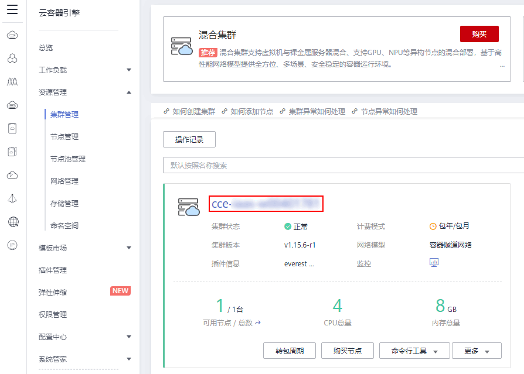
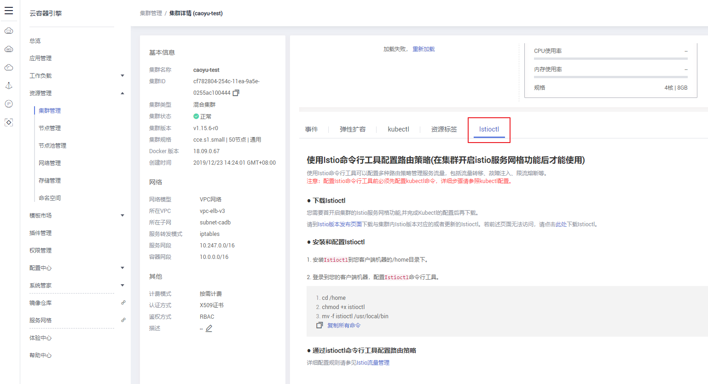

# 通过Istioctl配置路由策略

-   [操作场景](#section8631134182813)
-   [前提条件](#section125311022122915)
-   [操作步骤](#section078023812295)

## 操作场景

在集群开启istio服务网格功能后，您使用Istio命令行工具Istioctl配置多种路由策略，从而管理服务流量，包括流量转移、故障注入、限流熔断等。

## 前提条件

配置Istio命令行工具前必须先配置kubectl命令，详细信息请参见[安装和设置kubectl](https://kubernetes.io/docs/tasks/tools/install-kubectl/)。

## 操作步骤

1.  登录[CCE控制台](https://console.huaweicloud.com/cce2.0/?utm_source=helpcenter)，在左侧导航栏中选择“资源管理 \> 集群管理”，单击待连接集群的名称。

    **图 1**  单击集群名称  
    

2.  在集群详情页中的“Istioctl“页签下，请参照界面中的提示信息完成Istioctl的安装和配置。

    **图 2**  使用Istioctl配置路由策略  
    

