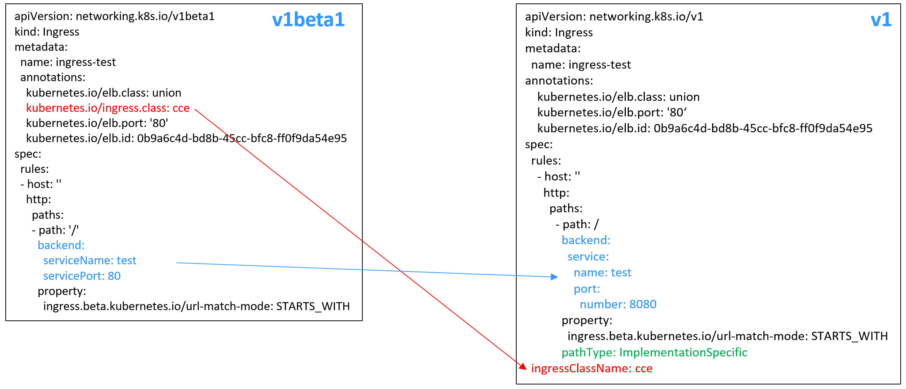

# 通过Kubectl命令行添加ELB Ingress<a name="cce_10_0252"></a>

## 操作场景<a name="section12681123215510"></a>

本节以[Nginx工作负载](创建无状态负载(Deployment).md#section155246177178)为例，说明通过kubectl命令添加ELB Ingress的方法。

-   如您在同一VPC下没有可用的ELB，CCE支持在添加Ingress时自动创建ELB，请参考[添加Ingress-自动创建ELB](#section3675115714214)。
-   如您已在同一VPC下提前创建了一个可用的ELB，则可参考[添加Ingress-对接已有ELB](#section32300431736)。

## 前提条件<a name="section16541428173911"></a>

-   Ingress为后端工作负载提供网络访问，因此集群中需提前部署可用的工作负载。若您无可用工作负载，可参考[创建无状态负载\(Deployment\)](创建无状态负载(Deployment).md)、[创建有状态负载\(StatefulSet\)](创建有状态负载(StatefulSet).md)或[创建守护进程集\(DaemonSet\)](创建守护进程集(DaemonSet).md)部署示例nginx工作负载。
-   为上述工作负载配置NodePort类型的Service，可参考[节点访问\(NodePort\)](节点访问(NodePort).md)部署示例Service。
-   独享型ELB规格必须支持应用型（HTTP/HTTPS），且网络类型必须支持私网（有私有IP地址）。

## networking.k8s.io/v1版本Ingress说明<a name="section084115985013"></a>

CCE在1.23版本集群开始Ingress切换到**networking.k8s.io/v1**版本。

v1版本参数相较v1beta1参数有如下区别。

-   ingress类型由annotations中**kubernetes.io/ingress.class**变为使用**spec.ingressClassName**字段。
-   **backend**的写法变化。
-   每个路径下必须指定路径类型**pathType**，支持如下类型。
    -   ImplementationSpecific: 对于这种路径类型，匹配方法取决于具体Ingress Controller的实现。在CCE中会使用ingress.beta.kubernetes.io/url-match-mode指定的匹配方式，这与v1beta1方式相同。
    -   Exact：精确匹配 URL 路径，且区分大小写。
    -   Prefix：基于以 / 分隔的 URL 路径前缀匹配。匹配区分大小写，并且对路径中的元素逐个匹配。 路径元素指的是由 / 分隔符分隔的路径中的标签列表。




## 添加Ingress-自动创建ELB<a name="section3675115714214"></a>

下面介绍如何通过kubectl命令在添加Ingress时自动创建ELB。

1.  请参见[通过kubectl连接集群](通过kubectl连接集群.md)，使用kubectl连接集群。
2.  创建名为“**ingress-test.yaml**”的YAML文件，此处文件名可自定义。

    **vi ingress-test.yaml**

    > **说明：** 
    >CCE在1.23版本集群开始Ingress切换到networking.k8s.io/v1版本，之前版本集群使用networking.k8s.io/v1beta1。v1版本与v1beta1版本的区别请参见[networking.k8s.io/v1版本Ingress说明](#section084115985013)。

    **共享型负载均衡（公网访问）示例  -1.23及以上版本集群：**

    ```
    apiVersion: networking.k8s.io/v1
    kind: Ingress 
    metadata: 
      name: ingress-test
      annotations: 
        kubernetes.io/elb.class: union
        kubernetes.io/elb.port: '80'
        kubernetes.io/elb.autocreate: 
          '{
              "type":"public",
              "bandwidth_name":"cce-bandwidth-******",
              "bandwidth_chargemode":"bandwidth",
              "bandwidth_size":5,
              "bandwidth_sharetype":"PER",
              "eip_type":"5_bgp"
            }'
    spec:
      rules: 
      - host: ''
        http: 
          paths: 
          - path: '/'
            backend: 
              service:
                name: <your_service_name>  #替换为您的目标服务名称
                port: 
                  number: 8080             #替换为您的目标服务端口
            property:
              ingress.beta.kubernetes.io/url-match-mode: STARTS_WITH
            pathType: ImplementationSpecific
      ingressClassName: cce    # 表示使用ELB Ingress
    ```

    **共享型负载均衡（公网访问）示例  - 1.21及以下版本集群：**

    ```
    apiVersion: networking.k8s.io/v1beta1
    kind: Ingress 
    metadata: 
      name: ingress-test
      annotations: 
        kubernetes.io/elb.class: union
        kubernetes.io/ingress.class: cce    # 表示使用ELB Ingress
        kubernetes.io/elb.port: '80'
        kubernetes.io/elb.autocreate: 
          '{
              "type":"public",
              "bandwidth_name":"cce-bandwidth-******",
              "bandwidth_chargemode":"bandwidth",
              "bandwidth_size":5,
              "bandwidth_sharetype":"PER",
              "eip_type":"5_bgp"
            }'
    spec:
      rules: 
      - host: ''
        http: 
          paths: 
          - path: '/'
            backend: 
              serviceName: <your_service_name>  #替换为您的目标服务名称
              servicePort: 80
            property:
              ingress.beta.kubernetes.io/url-match-mode: STARTS_WITH
    ```

    **独享型负载均衡（公网访问）示例  - 1.23及以上版本集群：**

    ```
    apiVersion: networking.k8s.io/v1
    kind: Ingress
    metadata:
      name: ingress-test
      namespace: default
      annotations:
        kubernetes.io/elb.class: performance
        kubernetes.io/elb.port: '80'
        kubernetes.io/elb.autocreate: 
          '{
              "type": "public",
              "bandwidth_name": "cce-bandwidth-******",
              "bandwidth_chargemode": "bandwidth",
              "bandwidth_size": 5,
              "bandwidth_sharetype": "PER",
              "eip_type": "5_bgp",
              "available_zone": [
                  "cn-north-4b"
              ],
              "l7_flavor_name": "L7_flavor.elb.s1.small"
           }'
    spec:
      rules: 
      - host: ''
        http: 
          paths: 
          - path: '/'
            backend: 
              service:
                name: <your_service_name>  #替换为您的目标服务名称
                port: 
                  number: 8080             #替换为您的目标服务端口
            property:
              ingress.beta.kubernetes.io/url-match-mode: STARTS_WITH
            pathType: ImplementationSpecific
      ingressClassName: cce
    ```

    **独享型负载均衡（公网访问）示例  -  **1.21及以下**版本集群：**

    ```
    apiVersion: networking.k8s.io/v1beta1
    kind: Ingress
    metadata:
      name: ingress-test
      namespace: default
      annotations:
        kubernetes.io/elb.class: performance
        kubernetes.io/ingress.class: cce
        kubernetes.io/elb.port: '80'
        kubernetes.io/elb.autocreate: 
          '{
              "type": "public",
              "bandwidth_name": "cce-bandwidth-******",
              "bandwidth_chargemode": "bandwidth",
              "bandwidth_size": 5,
              "bandwidth_sharetype": "PER",
              "eip_type": "5_bgp",
              "available_zone": [
                  "cn-north-4b"
              ],
              "l7_flavor_name": "L7_flavor.elb.s1.small"
           }'
    spec:
      rules:
      - host: ''
        http:
          paths:
          - path: '/'
            backend: 
              serviceName: <your_service_name>  #替换为您的目标服务名称
              servicePort: 80
            property:
              ingress.beta.kubernetes.io/url-match-mode: STARTS_WITH
    ```

    **表 1**  关键参数说明

    <a name="table7686256226"></a>
    <table><thead align="left"><tr id="row19686145162220"><th class="cellrowborder" valign="top" width="24.542454245424544%" id="mcps1.2.5.1.1"><p id="p56866582212"><a name="p56866582212"></a><a name="p56866582212"></a>参数</p>
    </th>
    <th class="cellrowborder" valign="top" width="14.331433143314332%" id="mcps1.2.5.1.2"><p id="p136861358222"><a name="p136861358222"></a><a name="p136861358222"></a>是否必填</p>
    </th>
    <th class="cellrowborder" valign="top" width="17.461746174617463%" id="mcps1.2.5.1.3"><p id="p0686154226"><a name="p0686154226"></a><a name="p0686154226"></a>参数类型</p>
    </th>
    <th class="cellrowborder" valign="top" width="43.66436643664366%" id="mcps1.2.5.1.4"><p id="p768615162214"><a name="p768615162214"></a><a name="p768615162214"></a>描述</p>
    </th>
    </tr>
    </thead>
    <tbody><tr id="row968615513223"><td class="cellrowborder" valign="top" width="24.542454245424544%" headers="mcps1.2.5.1.1 "><p id="p36867562211"><a name="p36867562211"></a><a name="p36867562211"></a>kubernetes.io/elb.class</p>
    </td>
    <td class="cellrowborder" valign="top" width="14.331433143314332%" headers="mcps1.2.5.1.2 "><p id="p1968618512213"><a name="p1968618512213"></a><a name="p1968618512213"></a>否</p>
    </td>
    <td class="cellrowborder" valign="top" width="17.461746174617463%" headers="mcps1.2.5.1.3 "><p id="p12686135112213"><a name="p12686135112213"></a><a name="p12686135112213"></a>String</p>
    </td>
    <td class="cellrowborder" valign="top" width="43.66436643664366%" headers="mcps1.2.5.1.4 "><p id="p186865519228"><a name="p186865519228"></a><a name="p186865519228"></a>请根据不同的应用场景和功能需求选择合适的负载均衡器类型。</p>
    <p id="p18686651226"><a name="p18686651226"></a><a name="p18686651226"></a>取值如下：</p>
    <a name="ul2686254223"></a><a name="ul2686254223"></a><ul id="ul2686254223"><li>union：共享型负载均衡。</li><li>performance：独享型负载均衡，详情请参见<a href="https://support.huaweicloud.com/productdesc-elb/elb_pro_0004.html" target="_blank" rel="noopener noreferrer">共享型弹性负载均衡与独享型负载均衡的功能区别</a>。</li></ul>
    <p id="p268655142217"><a name="p268655142217"></a><a name="p268655142217"></a>默认值为<span class="parmvalue" id="parmvalue242244794415"><a name="parmvalue242244794415"></a><a name="parmvalue242244794415"></a>“union”</span></p>
    </td>
    </tr>
    <tr id="row136862502210"><td class="cellrowborder" valign="top" width="24.542454245424544%" headers="mcps1.2.5.1.1 "><p id="p668610592216"><a name="p668610592216"></a><a name="p668610592216"></a>kubernetes.io/ingress.class</p>
    </td>
    <td class="cellrowborder" valign="top" width="14.331433143314332%" headers="mcps1.2.5.1.2 "><p id="p671994222920"><a name="p671994222920"></a><a name="p671994222920"></a>是</p>
    <p id="p14686205122212"><a name="p14686205122212"></a><a name="p14686205122212"></a>（仅1.21及以下集群）</p>
    </td>
    <td class="cellrowborder" valign="top" width="17.461746174617463%" headers="mcps1.2.5.1.3 "><p id="p7686175122215"><a name="p7686175122215"></a><a name="p7686175122215"></a>String</p>
    </td>
    <td class="cellrowborder" valign="top" width="43.66436643664366%" headers="mcps1.2.5.1.4 "><p id="p12686115182216"><a name="p12686115182216"></a><a name="p12686115182216"></a>cce：表示使用自研ELB&nbsp;Ingress。</p>
    <p id="p168610515220"><a name="p168610515220"></a><a name="p168610515220"></a>通过API接口创建Ingress时必须增加该参数。</p>
    </td>
    </tr>
    <tr id="row113215433284"><td class="cellrowborder" valign="top" width="24.542454245424544%" headers="mcps1.2.5.1.1 "><p id="p832116435287"><a name="p832116435287"></a><a name="p832116435287"></a>ingressClassName</p>
    </td>
    <td class="cellrowborder" valign="top" width="14.331433143314332%" headers="mcps1.2.5.1.2 "><p id="p1232111438283"><a name="p1232111438283"></a><a name="p1232111438283"></a>是</p>
    <p id="p16489747112918"><a name="p16489747112918"></a><a name="p16489747112918"></a>（仅1.23及以上集群）</p>
    </td>
    <td class="cellrowborder" valign="top" width="17.461746174617463%" headers="mcps1.2.5.1.3 "><p id="p10321194372811"><a name="p10321194372811"></a><a name="p10321194372811"></a>String</p>
    </td>
    <td class="cellrowborder" valign="top" width="43.66436643664366%" headers="mcps1.2.5.1.4 "><p id="p1139112482917"><a name="p1139112482917"></a><a name="p1139112482917"></a>cce：表示使用自研ELB&nbsp;Ingress。</p>
    <p id="p101391724122916"><a name="p101391724122916"></a><a name="p101391724122916"></a>通过API接口创建Ingress时必须增加该参数。</p>
    </td>
    </tr>
    <tr id="row1868617513229"><td class="cellrowborder" valign="top" width="24.542454245424544%" headers="mcps1.2.5.1.1 "><p id="p15686185132218"><a name="p15686185132218"></a><a name="p15686185132218"></a>kubernetes.io/elb.port</p>
    </td>
    <td class="cellrowborder" valign="top" width="14.331433143314332%" headers="mcps1.2.5.1.2 "><p id="p6686115112215"><a name="p6686115112215"></a><a name="p6686115112215"></a>是</p>
    </td>
    <td class="cellrowborder" valign="top" width="17.461746174617463%" headers="mcps1.2.5.1.3 "><p id="p196861356223"><a name="p196861356223"></a><a name="p196861356223"></a>Integer</p>
    </td>
    <td class="cellrowborder" valign="top" width="43.66436643664366%" headers="mcps1.2.5.1.4 "><p id="p168611502215"><a name="p168611502215"></a><a name="p168611502215"></a>界面上的对外端口，为注册到负载均衡服务地址上的端口。</p>
    <p id="p668618516224"><a name="p668618516224"></a><a name="p668618516224"></a>取值范围：1~65535。</p>
    </td>
    </tr>
    <tr id="row106861582218"><td class="cellrowborder" valign="top" width="24.542454245424544%" headers="mcps1.2.5.1.1 "><p id="p1068618512224"><a name="p1068618512224"></a><a name="p1068618512224"></a>kubernetes.io/elb.subnet-id</p>
    </td>
    <td class="cellrowborder" valign="top" width="14.331433143314332%" headers="mcps1.2.5.1.2 "><p id="p068615516223"><a name="p068615516223"></a><a name="p068615516223"></a>-</p>
    </td>
    <td class="cellrowborder" valign="top" width="17.461746174617463%" headers="mcps1.2.5.1.3 "><p id="p068612517228"><a name="p068612517228"></a><a name="p068612517228"></a>String</p>
    </td>
    <td class="cellrowborder" valign="top" width="43.66436643664366%" headers="mcps1.2.5.1.4 "><p id="p568611582215"><a name="p568611582215"></a><a name="p568611582215"></a>为集群所在子网的ID，取值范围：1~100字符。</p>
    <a name="ul568616517224"></a><a name="ul568616517224"></a><ul id="ul568616517224"><li>Kubernetes v1.11.7-r0及以下版本的集群自动创建时：必填。</li><li>Kubernetes v1.11.7-r0以上版本的集群：可不填，默认为""。</li></ul>
    <p id="p16686155112214"><a name="p16686155112214"></a><a name="p16686155112214"></a>获取方法请参见：<a href="https://support.huaweicloud.com/api-vpc/vpc_api_0005.html" target="_blank" rel="noopener noreferrer">VPC子网接口与OpenStack Neutron子网接口的区别是什么？</a></p>
    </td>
    </tr>
    <tr id="row76869516221"><td class="cellrowborder" valign="top" width="24.542454245424544%" headers="mcps1.2.5.1.1 "><p id="p166868582215"><a name="p166868582215"></a><a name="p166868582215"></a>kubernetes.io/elb.enterpriseID</p>
    </td>
    <td class="cellrowborder" valign="top" width="14.331433143314332%" headers="mcps1.2.5.1.2 "><p id="p6686059226"><a name="p6686059226"></a><a name="p6686059226"></a>是</p>
    </td>
    <td class="cellrowborder" valign="top" width="17.461746174617463%" headers="mcps1.2.5.1.3 "><p id="p1868665112217"><a name="p1868665112217"></a><a name="p1868665112217"></a>String</p>
    </td>
    <td class="cellrowborder" valign="top" width="43.66436643664366%" headers="mcps1.2.5.1.4 "><p id="p168655192216"><a name="p168655192216"></a><a name="p168655192216"></a><strong id="b10686105172220"><a name="b10686105172220"></a><a name="b10686105172220"></a>Kubernetes v1.15及以上版本的集群支持此字段；Kubernetes v1.15以下版本默认创建到default项目下。</strong></p>
    <p id="p196864510227"><a name="p196864510227"></a><a name="p196864510227"></a>企业项目ID，选择后可以直接创建在具体的企业项目下。</p>
    <p id="p206862518224"><a name="p206862518224"></a><a name="p206862518224"></a>取值范围：1~100字符。</p>
    <p id="p10686205102218"><a name="p10686205102218"></a><a name="p10686205102218"></a><strong id="b168615202212"><a name="b168615202212"></a><a name="b168615202212"></a>获取方法：</strong></p>
    <p id="p1168611512222"><a name="p1168611512222"></a><a name="p1168611512222"></a>登录控制台后，单击顶部菜单右侧的“企业 &gt; 项目管理”，在打开的企业项目列表中单击要加入的企业项目名称，进入企业项目详情页，找到“ID”字段复制即可。</p>
    </td>
    </tr>
    <tr id="row1686115112217"><td class="cellrowborder" valign="top" width="24.542454245424544%" headers="mcps1.2.5.1.1 "><p id="p146861455229"><a name="p146861455229"></a><a name="p146861455229"></a>kubernetes.io/elb.autocreate</p>
    </td>
    <td class="cellrowborder" valign="top" width="14.331433143314332%" headers="mcps1.2.5.1.2 "><p id="p19686254222"><a name="p19686254222"></a><a name="p19686254222"></a>是</p>
    </td>
    <td class="cellrowborder" valign="top" width="17.461746174617463%" headers="mcps1.2.5.1.3 "><p id="p96864511228"><a name="p96864511228"></a><a name="p96864511228"></a>elb.autocreate object</p>
    </td>
    <td class="cellrowborder" valign="top" width="43.66436643664366%" headers="mcps1.2.5.1.4 "><p id="p2687254227"><a name="p2687254227"></a><a name="p2687254227"></a>自动创建Ingress关联的ELB，详细字段说明参见<a href="#table268711532210">表2</a>。</p>
    <p id="p106872519226"><a name="p106872519226"></a><a name="p106872519226"></a><strong id="b2068785132218"><a name="b2068785132218"></a><a name="b2068785132218"></a>示例：</strong></p>
    <a name="ul166872552218"></a><a name="ul166872552218"></a><ul id="ul166872552218"><li>公网自动创建：<p id="p136872515228"><a name="p136872515228"></a><a name="p136872515228"></a>值为 '{"type":"public","bandwidth_name":"cce-bandwidth-******","bandwidth_chargemode":"bandwidth","bandwidth_size":5,"bandwidth_sharetype":"PER","eip_type":"5_bgp","name":"james"}'</p>
    </li><li>私网自动创建：<p id="p15687959222"><a name="p15687959222"></a><a name="p15687959222"></a>值为 '{"type":"inner", "name": "A-location-d-test"}'</p>
    </li></ul>
    </td>
    </tr>
    <tr id="row116871853222"><td class="cellrowborder" valign="top" width="24.542454245424544%" headers="mcps1.2.5.1.1 "><p id="p86876511227"><a name="p86876511227"></a><a name="p86876511227"></a>host</p>
    </td>
    <td class="cellrowborder" valign="top" width="14.331433143314332%" headers="mcps1.2.5.1.2 "><p id="p268785142219"><a name="p268785142219"></a><a name="p268785142219"></a>否</p>
    </td>
    <td class="cellrowborder" valign="top" width="17.461746174617463%" headers="mcps1.2.5.1.3 "><p id="p1868713582210"><a name="p1868713582210"></a><a name="p1868713582210"></a>String</p>
    </td>
    <td class="cellrowborder" valign="top" width="43.66436643664366%" headers="mcps1.2.5.1.4 "><p id="p56876515224"><a name="p56876515224"></a><a name="p56876515224"></a>为服务访问域名配置，默认为""，表示域名全匹配。</p>
    </td>
    </tr>
    <tr id="row166871513221"><td class="cellrowborder" valign="top" width="24.542454245424544%" headers="mcps1.2.5.1.1 "><p id="p26872542219"><a name="p26872542219"></a><a name="p26872542219"></a>path</p>
    </td>
    <td class="cellrowborder" valign="top" width="14.331433143314332%" headers="mcps1.2.5.1.2 "><p id="p56874519227"><a name="p56874519227"></a><a name="p56874519227"></a>是</p>
    </td>
    <td class="cellrowborder" valign="top" width="17.461746174617463%" headers="mcps1.2.5.1.3 "><p id="p18687175112220"><a name="p18687175112220"></a><a name="p18687175112220"></a>String</p>
    </td>
    <td class="cellrowborder" valign="top" width="43.66436643664366%" headers="mcps1.2.5.1.4 "><p id="p86872516225"><a name="p86872516225"></a><a name="p86872516225"></a>为路由路径，用户自定义设置。所有外部访问请求需要匹配host和path。</p>
    </td>
    </tr>
    <tr id="row568725172212"><td class="cellrowborder" valign="top" width="24.542454245424544%" headers="mcps1.2.5.1.1 "><p id="p1268711511220"><a name="p1268711511220"></a><a name="p1268711511220"></a>serviceName</p>
    </td>
    <td class="cellrowborder" valign="top" width="14.331433143314332%" headers="mcps1.2.5.1.2 "><p id="p568725152210"><a name="p568725152210"></a><a name="p568725152210"></a>是</p>
    </td>
    <td class="cellrowborder" valign="top" width="17.461746174617463%" headers="mcps1.2.5.1.3 "><p id="p168735122213"><a name="p168735122213"></a><a name="p168735122213"></a>String</p>
    </td>
    <td class="cellrowborder" valign="top" width="43.66436643664366%" headers="mcps1.2.5.1.4 "><p id="p968725102211"><a name="p968725102211"></a><a name="p968725102211"></a>Ingress绑定的目标Service名称。</p>
    </td>
    </tr>
    <tr id="row12687145162215"><td class="cellrowborder" valign="top" width="24.542454245424544%" headers="mcps1.2.5.1.1 "><p id="p868715518227"><a name="p868715518227"></a><a name="p868715518227"></a>servicePort</p>
    </td>
    <td class="cellrowborder" valign="top" width="14.331433143314332%" headers="mcps1.2.5.1.2 "><p id="p66871513229"><a name="p66871513229"></a><a name="p66871513229"></a>是</p>
    </td>
    <td class="cellrowborder" valign="top" width="17.461746174617463%" headers="mcps1.2.5.1.3 "><p id="p268710502212"><a name="p268710502212"></a><a name="p268710502212"></a>Integer</p>
    </td>
    <td class="cellrowborder" valign="top" width="43.66436643664366%" headers="mcps1.2.5.1.4 "><p id="p268725112215"><a name="p268725112215"></a><a name="p268725112215"></a>目标Service的访问端口。</p>
    </td>
    </tr>
    <tr id="row56878518222"><td class="cellrowborder" valign="top" width="24.542454245424544%" headers="mcps1.2.5.1.1 "><p id="p1968717516225"><a name="p1968717516225"></a><a name="p1968717516225"></a>ingress.beta.kubernetes.io/url-match-mode</p>
    </td>
    <td class="cellrowborder" valign="top" width="14.331433143314332%" headers="mcps1.2.5.1.2 "><p id="p06871551221"><a name="p06871551221"></a><a name="p06871551221"></a>否</p>
    </td>
    <td class="cellrowborder" valign="top" width="17.461746174617463%" headers="mcps1.2.5.1.3 "><p id="p368765202212"><a name="p368765202212"></a><a name="p368765202212"></a>String</p>
    </td>
    <td class="cellrowborder" valign="top" width="43.66436643664366%" headers="mcps1.2.5.1.4 "><p id="p17687954227"><a name="p17687954227"></a><a name="p17687954227"></a>路由匹配策略。</p>
    <p id="p2687851225"><a name="p2687851225"></a><a name="p2687851225"></a>默认值为<span class="parmvalue" id="parmvalue1124845489"><a name="parmvalue1124845489"></a><a name="parmvalue1124845489"></a>“STARTS_WITH”</span>(前缀匹配)。</p>
    <p id="p14687135102217"><a name="p14687135102217"></a><a name="p14687135102217"></a>取值范围：</p>
    <a name="ul1368755172219"></a><a name="ul1368755172219"></a><ul id="ul1368755172219"><li>EQUAL_TO：精确匹配</li><li>STARTS_WITH：前缀匹配</li><li>REGEX：正则匹配</li></ul>
    </td>
    </tr>
    </tbody>
    </table>

    **表 2**  elb.autocreate字段数据结构说明

    <a name="table268711532210"></a>
    <table><thead align="left"><tr id="row46871051228"><th class="cellrowborder" valign="top" width="24.612461246124614%" id="mcps1.2.5.1.1"><p id="p568718511222"><a name="p568718511222"></a><a name="p568718511222"></a>参数</p>
    </th>
    <th class="cellrowborder" valign="top" width="14.481448144814483%" id="mcps1.2.5.1.2"><p id="p17687145202214"><a name="p17687145202214"></a><a name="p17687145202214"></a>是否必填</p>
    </th>
    <th class="cellrowborder" valign="top" width="15.771577157715772%" id="mcps1.2.5.1.3"><p id="p12687259222"><a name="p12687259222"></a><a name="p12687259222"></a>参数类型</p>
    </th>
    <th class="cellrowborder" valign="top" width="45.13451345134513%" id="mcps1.2.5.1.4"><p id="p136878542215"><a name="p136878542215"></a><a name="p136878542215"></a>描述</p>
    </th>
    </tr>
    </thead>
    <tbody><tr id="row1468810518229"><td class="cellrowborder" valign="top" width="24.612461246124614%" headers="mcps1.2.5.1.1 "><p id="p106881052228"><a name="p106881052228"></a><a name="p106881052228"></a>type</p>
    </td>
    <td class="cellrowborder" valign="top" width="14.481448144814483%" headers="mcps1.2.5.1.2 "><p id="p36889532210"><a name="p36889532210"></a><a name="p36889532210"></a>否</p>
    </td>
    <td class="cellrowborder" valign="top" width="15.771577157715772%" headers="mcps1.2.5.1.3 "><p id="p106887522210"><a name="p106887522210"></a><a name="p106887522210"></a>String</p>
    </td>
    <td class="cellrowborder" valign="top" width="45.13451345134513%" headers="mcps1.2.5.1.4 "><p id="p1868815152219"><a name="p1868815152219"></a><a name="p1868815152219"></a>负载均衡实例网络类型，公网或者私网。</p>
    <a name="ul36884518226"></a><a name="ul36884518226"></a><ul id="ul36884518226"><li>public：公网型负载均衡</li><li>inner：私网型负载均衡</li></ul>
    <p id="p1068817515229"><a name="p1068817515229"></a><a name="p1068817515229"></a>默认值为<span class="parmvalue" id="parmvalue7618451144716"><a name="parmvalue7618451144716"></a><a name="parmvalue7618451144716"></a>“inner”</span>。</p>
    </td>
    </tr>
    <tr id="row268813515229"><td class="cellrowborder" valign="top" width="24.612461246124614%" headers="mcps1.2.5.1.1 "><p id="p1768817520227"><a name="p1768817520227"></a><a name="p1768817520227"></a>bandwidth_name</p>
    </td>
    <td class="cellrowborder" valign="top" width="14.481448144814483%" headers="mcps1.2.5.1.2 "><p id="p06881952229"><a name="p06881952229"></a><a name="p06881952229"></a>公网型负载均衡必填</p>
    </td>
    <td class="cellrowborder" valign="top" width="15.771577157715772%" headers="mcps1.2.5.1.3 "><p id="p668815522218"><a name="p668815522218"></a><a name="p668815522218"></a>String</p>
    </td>
    <td class="cellrowborder" valign="top" width="45.13451345134513%" headers="mcps1.2.5.1.4 "><p id="p368820520226"><a name="p368820520226"></a><a name="p368820520226"></a>带宽的名称，默认值为<span class="parmvalue" id="parmvalue127670449476"><a name="parmvalue127670449476"></a><a name="parmvalue127670449476"></a>“cce-bandwidth-******”</span>。</p>
    <p id="p1468845132213"><a name="p1468845132213"></a><a name="p1468845132213"></a>取值范围：1~64个字符，小写字母，数字，下划线，小写字母开头，小写字母或者数字结尾。</p>
    </td>
    </tr>
    <tr id="row2068814552210"><td class="cellrowborder" valign="top" width="24.612461246124614%" headers="mcps1.2.5.1.1 "><p id="p1868835122212"><a name="p1868835122212"></a><a name="p1868835122212"></a>bandwidth_chargemode</p>
    </td>
    <td class="cellrowborder" valign="top" width="14.481448144814483%" headers="mcps1.2.5.1.2 "><p id="p86886512223"><a name="p86886512223"></a><a name="p86886512223"></a>否</p>
    </td>
    <td class="cellrowborder" valign="top" width="15.771577157715772%" headers="mcps1.2.5.1.3 "><p id="p1368817512223"><a name="p1368817512223"></a><a name="p1368817512223"></a>String</p>
    </td>
    <td class="cellrowborder" valign="top" width="45.13451345134513%" headers="mcps1.2.5.1.4 "><p id="p1868818514222"><a name="p1868818514222"></a><a name="p1868818514222"></a>带宽付费模式。</p>
    <a name="ul5688256222"></a><a name="ul5688256222"></a><ul id="ul5688256222"><li>bandwidth：按带宽</li><li>traffic：按流量</li></ul>
    <p id="p1368885192220"><a name="p1368885192220"></a><a name="p1368885192220"></a>默认值为<span class="parmvalue" id="parmvalue4348143014712"><a name="parmvalue4348143014712"></a><a name="parmvalue4348143014712"></a>“bandwidth”</span>。</p>
    </td>
    </tr>
    <tr id="row116881855228"><td class="cellrowborder" valign="top" width="24.612461246124614%" headers="mcps1.2.5.1.1 "><p id="p206884582219"><a name="p206884582219"></a><a name="p206884582219"></a>bandwidth_size</p>
    </td>
    <td class="cellrowborder" valign="top" width="14.481448144814483%" headers="mcps1.2.5.1.2 "><p id="p2068817592216"><a name="p2068817592216"></a><a name="p2068817592216"></a>公网型负载均衡必填</p>
    </td>
    <td class="cellrowborder" valign="top" width="15.771577157715772%" headers="mcps1.2.5.1.3 "><p id="p568816511224"><a name="p568816511224"></a><a name="p568816511224"></a>Integer</p>
    </td>
    <td class="cellrowborder" valign="top" width="45.13451345134513%" headers="mcps1.2.5.1.4 "><p id="p166888522214"><a name="p166888522214"></a><a name="p166888522214"></a>带宽大小，默认取值范围为1Mbit/s~2000Mbit/s，具体范围请根据各Region配置为准。</p>
    <a name="ul46883511224"></a><a name="ul46883511224"></a><ul id="ul46883511224"><li>注意：调整带宽时的最小单位会根据带宽范围不同存在差异。<a name="ul1468875102216"></a><a name="ul1468875102216"></a><ul id="ul1468875102216"><li>小于等于300Mbit/s：默认最小单位为1Mbit/s。</li><li>300Mbit/s~1000Mbit/s：默认最小单位为50Mbit/s。</li><li>大于1000Mbit/s：默认最小单位为500Mbit/s。</li></ul>
    </li></ul>
    </td>
    </tr>
    <tr id="row2688257226"><td class="cellrowborder" valign="top" width="24.612461246124614%" headers="mcps1.2.5.1.1 "><p id="p668814542214"><a name="p668814542214"></a><a name="p668814542214"></a>bandwidth_sharetype</p>
    </td>
    <td class="cellrowborder" valign="top" width="14.481448144814483%" headers="mcps1.2.5.1.2 "><p id="p868817517227"><a name="p868817517227"></a><a name="p868817517227"></a>公网型负载均衡必填</p>
    </td>
    <td class="cellrowborder" valign="top" width="15.771577157715772%" headers="mcps1.2.5.1.3 "><p id="p66881853227"><a name="p66881853227"></a><a name="p66881853227"></a>String</p>
    </td>
    <td class="cellrowborder" valign="top" width="45.13451345134513%" headers="mcps1.2.5.1.4 "><p id="p46881053226"><a name="p46881053226"></a><a name="p46881053226"></a>带宽类型。</p>
    <p id="p579771319477"><a name="p579771319477"></a><a name="p579771319477"></a>PER：独享带宽</p>
    </td>
    </tr>
    <tr id="row1668895162218"><td class="cellrowborder" valign="top" width="24.612461246124614%" headers="mcps1.2.5.1.1 "><p id="p36889518224"><a name="p36889518224"></a><a name="p36889518224"></a>eip_type</p>
    </td>
    <td class="cellrowborder" valign="top" width="14.481448144814483%" headers="mcps1.2.5.1.2 "><p id="p1368818514228"><a name="p1368818514228"></a><a name="p1368818514228"></a>公网型负载均衡必填</p>
    </td>
    <td class="cellrowborder" valign="top" width="15.771577157715772%" headers="mcps1.2.5.1.3 "><p id="p86891352224"><a name="p86891352224"></a><a name="p86891352224"></a>String</p>
    </td>
    <td class="cellrowborder" valign="top" width="45.13451345134513%" headers="mcps1.2.5.1.4 "><p id="p176892572216"><a name="p176892572216"></a><a name="p176892572216"></a>弹性公网IP类型。</p>
    <a name="ul968965152215"></a><a name="ul968965152215"></a><ul id="ul968965152215"><li>5_telcom：电信</li><li>5_union：联通</li><li>5_bgp：全动态BGP</li><li>5_sbgp：静态BGP</li></ul>
    </td>
    </tr>
    <tr id="row3689954226"><td class="cellrowborder" valign="top" width="24.612461246124614%" headers="mcps1.2.5.1.1 "><p id="p9689157227"><a name="p9689157227"></a><a name="p9689157227"></a>name</p>
    </td>
    <td class="cellrowborder" valign="top" width="14.481448144814483%" headers="mcps1.2.5.1.2 "><p id="p146895562212"><a name="p146895562212"></a><a name="p146895562212"></a>否</p>
    </td>
    <td class="cellrowborder" valign="top" width="15.771577157715772%" headers="mcps1.2.5.1.3 "><p id="p146893516226"><a name="p146893516226"></a><a name="p146893516226"></a>String</p>
    </td>
    <td class="cellrowborder" valign="top" width="45.13451345134513%" headers="mcps1.2.5.1.4 "><p id="p26892518226"><a name="p26892518226"></a><a name="p26892518226"></a>自动创建的负载均衡的名称。</p>
    <p id="p126895522211"><a name="p126895522211"></a><a name="p126895522211"></a>取值范围：1~64个字符，小写字母，数字，下划线，小写字母开头，小写字母或者数字结尾。</p>
    <p id="p268916512216"><a name="p268916512216"></a><a name="p268916512216"></a>默认值为<span class="parmvalue" id="parmvalue181495154710"><a name="parmvalue181495154710"></a><a name="parmvalue181495154710"></a>“cce-lb+ingress.UID”</span></p>
    </td>
    </tr>
    <tr id="row1689185172219"><td class="cellrowborder" valign="top" width="24.612461246124614%" headers="mcps1.2.5.1.1 "><p id="p126893562219"><a name="p126893562219"></a><a name="p126893562219"></a>vip_subnet_cidr_id</p>
    </td>
    <td class="cellrowborder" valign="top" width="14.481448144814483%" headers="mcps1.2.5.1.2 "><p id="p196897515228"><a name="p196897515228"></a><a name="p196897515228"></a>否</p>
    </td>
    <td class="cellrowborder" valign="top" width="15.771577157715772%" headers="mcps1.2.5.1.3 "><p id="p146892582213"><a name="p146892582213"></a><a name="p146892582213"></a>String</p>
    </td>
    <td class="cellrowborder" valign="top" width="45.13451345134513%" headers="mcps1.2.5.1.4 "><p id="p56896532210"><a name="p56896532210"></a><a name="p56896532210"></a>指定ELB所在的子网。1.21及以上版本支持。</p>
    <p id="p106896582212"><a name="p106896582212"></a><a name="p106896582212"></a>如不指定，则ELB与集群在同一个子网。</p>
    </td>
    </tr>
    <tr id="row768916517229"><td class="cellrowborder" valign="top" width="24.612461246124614%" headers="mcps1.2.5.1.1 "><p id="p16689125162212"><a name="p16689125162212"></a><a name="p16689125162212"></a>available_zone</p>
    </td>
    <td class="cellrowborder" valign="top" width="14.481448144814483%" headers="mcps1.2.5.1.2 "><p id="p1968917592216"><a name="p1968917592216"></a><a name="p1968917592216"></a>是</p>
    </td>
    <td class="cellrowborder" valign="top" width="15.771577157715772%" headers="mcps1.2.5.1.3 "><p id="p12689955226"><a name="p12689955226"></a><a name="p12689955226"></a>Array of strings</p>
    </td>
    <td class="cellrowborder" valign="top" width="45.13451345134513%" headers="mcps1.2.5.1.4 "><p id="p868905142216"><a name="p868905142216"></a><a name="p868905142216"></a>负载均衡所在可用区，必填项。</p>
    <p id="p116133492616"><a name="p116133492616"></a><a name="p116133492616"></a>可以通过<a href="https://support.huaweicloud.com/api-elb/ListAvailabilityZones.html" target="_blank" rel="noopener noreferrer">查询可用区列表</a>获取所有支持的可用区。</p>
    <p id="p168920512217"><a name="p168920512217"></a><a name="p168920512217"></a>独享型负载均衡器独有字段。</p>
    </td>
    </tr>
    <tr id="row196891856221"><td class="cellrowborder" valign="top" width="24.612461246124614%" headers="mcps1.2.5.1.1 "><p id="p19689754220"><a name="p19689754220"></a><a name="p19689754220"></a>l4_flavor_name</p>
    </td>
    <td class="cellrowborder" valign="top" width="14.481448144814483%" headers="mcps1.2.5.1.2 "><p id="p9689185112217"><a name="p9689185112217"></a><a name="p9689185112217"></a>否</p>
    </td>
    <td class="cellrowborder" valign="top" width="15.771577157715772%" headers="mcps1.2.5.1.3 "><p id="p11689185202217"><a name="p11689185202217"></a><a name="p11689185202217"></a>String</p>
    </td>
    <td class="cellrowborder" valign="top" width="45.13451345134513%" headers="mcps1.2.5.1.4 "><p id="p2689195172211"><a name="p2689195172211"></a><a name="p2689195172211"></a>四层负载均衡实例名称。</p>
    <p id="p124018276462"><a name="p124018276462"></a><a name="p124018276462"></a>可以通过<a href="https://support.huaweicloud.com/api-elb/ListFlavors.html" target="_blank" rel="noopener noreferrer">查询规格列表</a>获取所有支持的类型。</p>
    <p id="p14689105132211"><a name="p14689105132211"></a><a name="p14689105132211"></a>独享型负载均衡器独有字段。</p>
    </td>
    </tr>
    <tr id="row196898522213"><td class="cellrowborder" valign="top" width="24.612461246124614%" headers="mcps1.2.5.1.1 "><p id="p36894522210"><a name="p36894522210"></a><a name="p36894522210"></a>l7_flavor_name</p>
    </td>
    <td class="cellrowborder" valign="top" width="14.481448144814483%" headers="mcps1.2.5.1.2 "><p id="p9689135132216"><a name="p9689135132216"></a><a name="p9689135132216"></a>是</p>
    </td>
    <td class="cellrowborder" valign="top" width="15.771577157715772%" headers="mcps1.2.5.1.3 "><p id="p18689554228"><a name="p18689554228"></a><a name="p18689554228"></a>String</p>
    </td>
    <td class="cellrowborder" valign="top" width="45.13451345134513%" headers="mcps1.2.5.1.4 "><p id="p86892053228"><a name="p86892053228"></a><a name="p86892053228"></a>七层负载均衡实例名称，必填项。</p>
    <p id="p1372432011271"><a name="p1372432011271"></a><a name="p1372432011271"></a>可以通过<a href="https://support.huaweicloud.com/api-elb/ListFlavors.html" target="_blank" rel="noopener noreferrer">查询规格列表</a>获取所有支持的类型。</p>
    <p id="p4689854222"><a name="p4689854222"></a><a name="p4689854222"></a>独享型负载均衡器独有字段。</p>
    </td>
    </tr>
    <tr id="row1968910511221"><td class="cellrowborder" valign="top" width="24.612461246124614%" headers="mcps1.2.5.1.1 "><p id="p1268912512216"><a name="p1268912512216"></a><a name="p1268912512216"></a>elb_virsubnet_ids</p>
    </td>
    <td class="cellrowborder" valign="top" width="14.481448144814483%" headers="mcps1.2.5.1.2 "><p id="p106898511226"><a name="p106898511226"></a><a name="p106898511226"></a>否</p>
    </td>
    <td class="cellrowborder" valign="top" width="15.771577157715772%" headers="mcps1.2.5.1.3 "><p id="p46891542218"><a name="p46891542218"></a><a name="p46891542218"></a>Array of strings</p>
    </td>
    <td class="cellrowborder" valign="top" width="45.13451345134513%" headers="mcps1.2.5.1.4 "><p id="p11690651225"><a name="p11690651225"></a><a name="p11690651225"></a>负载均衡后端所在子网，不填默认集群子网。不同实例规格将占用不同数量子网IP，不建议使用其他资源（如集群，节点等）的子网网段。</p>
    <p id="p5690185152210"><a name="p5690185152210"></a><a name="p5690185152210"></a>默认值为集群所在子网。</p>
    <p id="p56901052220"><a name="p56901052220"></a><a name="p56901052220"></a>独享型负载均衡器独有字段。</p>
    <p id="p16419184732217"><a name="p16419184732217"></a><a name="p16419184732217"></a>示例：</p>
    <pre class="screen" id="screen14420047102212"><a name="screen14420047102212"></a><a name="screen14420047102212"></a>"elb_virsubnet_ids": [
       "14567f27-8ae4-42b8-ae47-9f847a4690dd"
     ]</pre>
    </td>
    </tr>
    </tbody>
    </table>

3.  创建Ingress。

    **kubectl create -f ingress-test.yaml**

    回显如下，表示Ingress服务已创建。

    ```
    ingress/ingress-test created
    ```

    **kubectl get ingress**

    回显如下，表示Ingress服务创建成功，工作负载可访问。

    ```
    NAME             HOSTS     ADDRESS          PORTS   AGE
    ingress-test     *         121.**.**.**     80      10s
    ```

4.  访问工作负载（例如[Nginx工作负载](创建无状态负载(Deployment).md#section155246177178)），在浏览器中输入访问地址http://121.\*\*.\*\*.\*\*:80进行验证。

    其中，121.\*\*.\*\*.\*\*为统一负载均衡实例的IP地址。


## 添加Ingress-对接已有ELB<a name="section32300431736"></a>

CCE支持在添加Ingress时选择对接已有的ELB。

> **说明：** 
>-   对接已有独享型ELB规格必须支持应用型（HTTP/HTTPS），且网络类型必须支持私网（有私有IP）。

**以1.23及以上版本集群为例，YAML文件配置如下：**

```
apiVersion: networking.k8s.io/v1
kind: Ingress 
metadata: 
  name: ingress-test
  annotations: 
    kubernetes.io/elb.id: <your_elb_id>  #替换为您已有的ELB ID
    kubernetes.io/elb.ip: <your_elb_ip>  #替换为您已有的ELB IP
    kubernetes.io/elb.port: '80'
spec:
  rules: 
  - host: ''
    http: 
      paths: 
      - path: '/'
        backend: 
          service:
            name: <your_service_name>  #替换为您的目标服务名称
            port: 
              number: 8080             #替换为您的目标服务端口
        property:
          ingress.beta.kubernetes.io/url-match-mode: STARTS_WITH
        pathType: ImplementationSpecific
  ingressClassName: cce               
```

**以1.21及以下版本集群为例，YAML文件配置如下：**

```
apiVersion: networking.k8s.io/v1beta1
kind: Ingress 
metadata: 
  name: ingress-test
  annotations: 
    kubernetes.io/elb.id: <your_elb_id>  #替换为您已有的ELB ID
    kubernetes.io/elb.ip: <your_elb_ip>  #替换为您已有的ELB IP
    kubernetes.io/elb.port: '80'
    kubernetes.io/ingress.class: cce
spec:
  rules: 
  - host: ''
    http: 
      paths: 
      - path: '/'
        backend: 
          serviceName: <your_service_name>  #替换为您的目标服务名称
          servicePort: 80
        property:
          ingress.beta.kubernetes.io/url-match-mode: STARTS_WITH
```

**表 3**  关键参数说明

<a name="table1892373611597"></a>
<table><thead align="left"><tr id="row16921123616594"><th class="cellrowborder" valign="top" width="24.772477247724773%" id="mcps1.2.5.1.1"><p id="p092111361598"><a name="p092111361598"></a><a name="p092111361598"></a>参数</p>
</th>
<th class="cellrowborder" valign="top" width="13.691369136913693%" id="mcps1.2.5.1.2"><p id="p4921736125920"><a name="p4921736125920"></a><a name="p4921736125920"></a>是否必填</p>
</th>
<th class="cellrowborder" valign="top" width="13.821382138213819%" id="mcps1.2.5.1.3"><p id="p992173615594"><a name="p992173615594"></a><a name="p992173615594"></a>参数类型</p>
</th>
<th class="cellrowborder" valign="top" width="47.714771477147714%" id="mcps1.2.5.1.4"><p id="p15921143625917"><a name="p15921143625917"></a><a name="p15921143625917"></a>描述</p>
</th>
</tr>
</thead>
<tbody><tr id="row892173675917"><td class="cellrowborder" valign="top" width="24.772477247724773%" headers="mcps1.2.5.1.1 "><p id="p1292133635910"><a name="p1292133635910"></a><a name="p1292133635910"></a>kubernetes.io/elb.id</p>
</td>
<td class="cellrowborder" valign="top" width="13.691369136913693%" headers="mcps1.2.5.1.2 "><p id="p8921936145914"><a name="p8921936145914"></a><a name="p8921936145914"></a>是</p>
</td>
<td class="cellrowborder" valign="top" width="13.821382138213819%" headers="mcps1.2.5.1.3 "><p id="p09214367590"><a name="p09214367590"></a><a name="p09214367590"></a>String</p>
</td>
<td class="cellrowborder" valign="top" width="47.714771477147714%" headers="mcps1.2.5.1.4 "><p id="p692133675916"><a name="p692133675916"></a><a name="p692133675916"></a>为负载均衡实例的ID，取值范围：1-100字符。</p>
<p id="p1892183614596"><a name="p1892183614596"></a><a name="p1892183614596"></a><strong id="b092111362592"><a name="b092111362592"></a><a name="b092111362592"></a>获取方法：</strong></p>
<p id="p1092183616594"><a name="p1092183616594"></a><a name="p1092183616594"></a>在控制台的<span class="uicontrol" id="uicontrol192111362595"><a name="uicontrol192111362595"></a><a name="uicontrol192111362595"></a>“服务列表”</span>中，单击<span class="uicontrol" id="uicontrol1192113619595"><a name="uicontrol1192113619595"></a><a name="uicontrol1192113619595"></a>“网络 &gt; 弹性负载均衡 ELB”</span>，单击ELB的名称，在ELB详情页的<span class="uicontrol" id="uicontrol1392113368595"><a name="uicontrol1392113368595"></a><a name="uicontrol1392113368595"></a>“基本信息”</span>页签下找到<span class="uicontrol" id="uicontrol092183619596"><a name="uicontrol092183619596"></a><a name="uicontrol092183619596"></a>“ID”</span>字段复制即可。</p>
</td>
</tr>
<tr id="row2921183614593"><td class="cellrowborder" valign="top" width="24.772477247724773%" headers="mcps1.2.5.1.1 "><p id="p159212365592"><a name="p159212365592"></a><a name="p159212365592"></a>kubernetes.io/elb.ip</p>
</td>
<td class="cellrowborder" valign="top" width="13.691369136913693%" headers="mcps1.2.5.1.2 "><p id="p492116364592"><a name="p492116364592"></a><a name="p492116364592"></a>是</p>
</td>
<td class="cellrowborder" valign="top" width="13.821382138213819%" headers="mcps1.2.5.1.3 "><p id="p79211436195917"><a name="p79211436195917"></a><a name="p79211436195917"></a>String</p>
</td>
<td class="cellrowborder" valign="top" width="47.714771477147714%" headers="mcps1.2.5.1.4 "><p id="p4921183685915"><a name="p4921183685915"></a><a name="p4921183685915"></a>为负载均衡实例的服务地址，公网ELB配置为公网IP，私网ELB配置为私网IP。</p>
</td>
</tr>
</tbody>
</table>

## 配置HTTPS证书<a name="section64211114202417"></a>

Ingress支持配置TLS证书，以HTTPS协议的方式对外提供安全服务。

当前支持使用配置在集群中的IngressTLS密钥证书，以及ELB服务中的证书。

> **说明：** 
>同一个ELB实例的同一个端口配置HTTPS时，需要选择一样的证书。

**使用IngressTLS密钥证书**

1.  请参见[通过kubectl连接集群](通过kubectl连接集群.md)，使用kubectl连接集群。
2.  执行如下命令，创建名为“**ingress-test-secret.yaml**”的YAML文件，此处文件名可自定义。

    **vi ingress-test-secret.yaml**

    **YAML文件配置如下：**

    ```
    apiVersion: v1
    data:
      tls.crt: LS0******tLS0tCg==
      tls.key: LS0tL******0tLS0K
    kind: Secret
    metadata:
      annotations:
        description: test for ingressTLS secrets
      name: ingress-test-secret
      namespace: default
    type: IngressTLS
    ```

    > **说明：** 
    >此处tls.crt和tls.key为示例，请获取真实密钥进行替换。tls.crt和tls.key的值为Base64编码后的内容。

3.  创建密钥。

    **kubectl create -f  **ingress-test-secret.yaml****

    回显如下，表明密钥已创建。

    ```
    secret/ingress-test-secret created
    ```

    查看已创建的密钥。

    **kubectl get secrets**

    回显如下，表明密钥创建成功。

    ```
    NAME                         TYPE                                  DATA      AGE
    ingress-test-secret          IngressTLS                            2         13s
    ```

4.  创建名为“**ingress-test.yaml**”的YAML文件，此处文件名可自定义。

    **vi ingress-test.yaml**

    > **说明：** 
    >默认安全策略选择（kubernetes.io/elb.tls-ciphers-policy）仅在1.17.17及以上版本的集群中支持。
    >自定义安全策略选择（kubernetes.io/elb.security\_policy\_id）仅在1.17.17及以上版本的集群中支持。

    **以自动创建关联ELB为例，YAML文件配置如下：**

    ```
    apiVersion: networking.k8s.io/v1beta1
    kind: Ingress 
    metadata: 
      name: ingress-test
      annotations: 
        kubernetes.io/elb.class: union
        kubernetes.io/ingress.class: cce
        kubernetes.io/elb.port: '443'
        kubernetes.io/elb.autocreate: 
          '{
              "type":"public",
              "bandwidth_name":"cce-bandwidth-15511633796**",
              "bandwidth_chargemode":"bandwidth",
              "bandwidth_size":5,
              "bandwidth_sharetype":"PER",
              "eip_type":"5_bgp"
            }'
        kubernetes.io/elb.security_policy_id: 99bec42b-0dd4-4583-98e9-b05ce628d157  #自定义安全策略优先级高于系统默认安全策略
        kubernetes.io/elb.tls-ciphers-policy: tls-1-2
    spec:
      tls: 
      - secretName: ingress-test-secret
      rules: 
      - host: ''
        http: 
          paths: 
          - path: '/'
            backend: 
              serviceName: <your_service_name>  #替换为您的目标服务名称
              servicePort: 80
            property:
              ingress.beta.kubernetes.io/url-match-mode: STARTS_WITH
    ```

    **表 4**  关键参数说明

    <a name="table74191314162416"></a>
    <table><thead align="left"><tr id="row1141881432420"><th class="cellrowborder" valign="top" width="24.71247124712471%" id="mcps1.2.5.1.1"><p id="p24181614182410"><a name="p24181614182410"></a><a name="p24181614182410"></a>参数</p>
    </th>
    <th class="cellrowborder" valign="top" width="13.751375137513753%" id="mcps1.2.5.1.2"><p id="p441891432411"><a name="p441891432411"></a><a name="p441891432411"></a>是否必填</p>
    </th>
    <th class="cellrowborder" valign="top" width="13.821382138213819%" id="mcps1.2.5.1.3"><p id="p174188147243"><a name="p174188147243"></a><a name="p174188147243"></a>参数类型</p>
    </th>
    <th class="cellrowborder" valign="top" width="47.714771477147714%" id="mcps1.2.5.1.4"><p id="p84181142246"><a name="p84181142246"></a><a name="p84181142246"></a>描述</p>
    </th>
    </tr>
    </thead>
    <tbody><tr id="row63611125261"><td class="cellrowborder" valign="top" width="24.71247124712471%" headers="mcps1.2.5.1.1 "><p id="p136122513615"><a name="p136122513615"></a><a name="p136122513615"></a>kubernetes.io/elb.security_policy_id</p>
    </td>
    <td class="cellrowborder" valign="top" width="13.751375137513753%" headers="mcps1.2.5.1.2 "><p id="p83611251064"><a name="p83611251064"></a><a name="p83611251064"></a>否</p>
    </td>
    <td class="cellrowborder" valign="top" width="13.821382138213819%" headers="mcps1.2.5.1.3 "><p id="p9361182516610"><a name="p9361182516610"></a><a name="p9361182516610"></a>String</p>
    </td>
    <td class="cellrowborder" valign="top" width="47.714771477147714%" headers="mcps1.2.5.1.4 "><p id="p436102519619"><a name="p436102519619"></a><a name="p436102519619"></a>ELB中自定义安全组策略ID，请前往ELB控制台获取。该字段仅在HTTPS协议下生效，且优先级高于默认安全策略。</p>
    <p id="p893146216"><a name="p893146216"></a><a name="p893146216"></a>自定义安全策略的创建、更新步骤请参见<a href="https://support.huaweicloud.com/usermanual-elb/elb_ug_jt_0022.html" target="_blank" rel="noopener noreferrer">TLS安全策略</a>。</p>
    </td>
    </tr>
    <tr id="row12419614122415"><td class="cellrowborder" valign="top" width="24.71247124712471%" headers="mcps1.2.5.1.1 "><p id="p18418131411241"><a name="p18418131411241"></a><a name="p18418131411241"></a>kubernetes.io/elb.tls-ciphers-policy</p>
    </td>
    <td class="cellrowborder" valign="top" width="13.751375137513753%" headers="mcps1.2.5.1.2 "><p id="p1341851472414"><a name="p1341851472414"></a><a name="p1341851472414"></a>否</p>
    </td>
    <td class="cellrowborder" valign="top" width="13.821382138213819%" headers="mcps1.2.5.1.3 "><p id="p1941810146243"><a name="p1941810146243"></a><a name="p1941810146243"></a>String</p>
    </td>
    <td class="cellrowborder" valign="top" width="47.714771477147714%" headers="mcps1.2.5.1.4 "><p id="p20418131419249"><a name="p20418131419249"></a><a name="p20418131419249"></a>默认值为<span class="parmvalue" id="parmvalue141816146245"><a name="parmvalue141816146245"></a><a name="parmvalue141816146245"></a>“tls-1-2”</span>，为监听器使用的默认安全策略，仅在HTTPS协议下生效。</p>
    <p id="p9418614122414"><a name="p9418614122414"></a><a name="p9418614122414"></a>取值范围：</p>
    <a name="ul641916143241"></a><a name="ul641916143241"></a><ul id="ul641916143241"><li>tls-1-0</li><li>tls-1-1</li><li>tls-1-2</li><li>tls-1-2-strict</li></ul>
    <p id="p154191114182415"><a name="p154191114182415"></a><a name="p154191114182415"></a>各安全策略使用的加密套件列表详细参见<a href="#table9419191416246">表5</a>。</p>
    </td>
    </tr>
    <tr id="row1741941412245"><td class="cellrowborder" valign="top" width="24.71247124712471%" headers="mcps1.2.5.1.1 "><p id="p0419111415244"><a name="p0419111415244"></a><a name="p0419111415244"></a>tls</p>
    </td>
    <td class="cellrowborder" valign="top" width="13.751375137513753%" headers="mcps1.2.5.1.2 "><p id="p7419171414244"><a name="p7419171414244"></a><a name="p7419171414244"></a>否</p>
    </td>
    <td class="cellrowborder" valign="top" width="13.821382138213819%" headers="mcps1.2.5.1.3 "><p id="p114191714142413"><a name="p114191714142413"></a><a name="p114191714142413"></a>Array of strings</p>
    </td>
    <td class="cellrowborder" valign="top" width="47.714771477147714%" headers="mcps1.2.5.1.4 "><p id="p5419101492419"><a name="p5419101492419"></a><a name="p5419101492419"></a>HTTPS协议时，需添加此字段。该字段可添加多项独立的域名和证书，详见<a href="#section0555194782414">配置服务器名称指示（SNI）</a>。</p>
    </td>
    </tr>
    <tr id="row5419101462414"><td class="cellrowborder" valign="top" width="24.71247124712471%" headers="mcps1.2.5.1.1 "><p id="p2419121482413"><a name="p2419121482413"></a><a name="p2419121482413"></a>secretName</p>
    </td>
    <td class="cellrowborder" valign="top" width="13.751375137513753%" headers="mcps1.2.5.1.2 "><p id="p1241991412412"><a name="p1241991412412"></a><a name="p1241991412412"></a>否</p>
    </td>
    <td class="cellrowborder" valign="top" width="13.821382138213819%" headers="mcps1.2.5.1.3 "><p id="p141917145245"><a name="p141917145245"></a><a name="p141917145245"></a>String</p>
    </td>
    <td class="cellrowborder" valign="top" width="47.714771477147714%" headers="mcps1.2.5.1.4 "><p id="p7419714162413"><a name="p7419714162413"></a><a name="p7419714162413"></a>HTTPS协议时添加，配置为创建的密钥证书名称。</p>
    </td>
    </tr>
    </tbody>
    </table>

    **表 5**  tls\_ciphers\_policy取值说明

    <a name="table9419191416246"></a>
    <table><thead align="left"><tr id="row2419214132420"><th class="cellrowborder" valign="top" width="16.37%" id="mcps1.2.4.1.1"><p id="p24196145242"><a name="p24196145242"></a><a name="p24196145242"></a>安全策略</p>
    </th>
    <th class="cellrowborder" valign="top" width="25.71%" id="mcps1.2.4.1.2"><p id="p15419131413249"><a name="p15419131413249"></a><a name="p15419131413249"></a>支持的TLS版本类型</p>
    </th>
    <th class="cellrowborder" valign="top" width="57.92%" id="mcps1.2.4.1.3"><p id="p15419171417249"><a name="p15419171417249"></a><a name="p15419171417249"></a>使用的加密套件列表</p>
    </th>
    </tr>
    </thead>
    <tbody><tr id="row18419161432410"><td class="cellrowborder" valign="top" width="16.37%" headers="mcps1.2.4.1.1 "><p id="p7419101442419"><a name="p7419101442419"></a><a name="p7419101442419"></a>tls-1-0</p>
    </td>
    <td class="cellrowborder" valign="top" width="25.71%" headers="mcps1.2.4.1.2 "><p id="p1141971442418"><a name="p1141971442418"></a><a name="p1141971442418"></a>TLS 1.2</p>
    <p id="p04191314152418"><a name="p04191314152418"></a><a name="p04191314152418"></a>TLS 1.1</p>
    <p id="p94191414112416"><a name="p94191414112416"></a><a name="p94191414112416"></a>TLS 1.0</p>
    </td>
    <td class="cellrowborder" rowspan="3" valign="top" width="57.92%" headers="mcps1.2.4.1.3 "><p id="p174195143248"><a name="p174195143248"></a><a name="p174195143248"></a>ECDHE-RSA-AES256-GCM-SHA384:ECDHE-RSA-AES128-GCM-SHA256:ECDHE-ECDSA-AES256-GCM-SHA384:ECDHE-ECDSA-AES128-GCM-SHA256:AES128-GCM-SHA256:AES256-GCM-SHA384:ECDHE-ECDSA-AES128-SHA256:ECDHE-RSA-AES128-SHA256:AES128-SHA256:AES256-SHA256:ECDHE-ECDSA-AES256-SHA384:ECDHE-RSA-AES256-SHA384:ECDHE-ECDSA-AES128-SHA:ECDHE-RSA-AES128-SHA:ECDHE-RSA-AES256-SHA:ECDHE-ECDSA-AES256-SHA:AES128-SHA:AES256-SHA</p>
    </td>
    </tr>
    <tr id="row9419171417241"><td class="cellrowborder" valign="top" headers="mcps1.2.4.1.1 "><p id="p0419131422419"><a name="p0419131422419"></a><a name="p0419131422419"></a>tls-1-1</p>
    </td>
    <td class="cellrowborder" valign="top" headers="mcps1.2.4.1.2 "><p id="p114191614142413"><a name="p114191614142413"></a><a name="p114191614142413"></a>TLS 1.2</p>
    <p id="p941951432415"><a name="p941951432415"></a><a name="p941951432415"></a>TLS 1.1</p>
    </td>
    </tr>
    <tr id="row19419181415248"><td class="cellrowborder" valign="top" headers="mcps1.2.4.1.1 "><p id="p64191814202410"><a name="p64191814202410"></a><a name="p64191814202410"></a>tls-1-2</p>
    </td>
    <td class="cellrowborder" valign="top" headers="mcps1.2.4.1.2 "><p id="p6419131462417"><a name="p6419131462417"></a><a name="p6419131462417"></a>TLS 1.2</p>
    </td>
    </tr>
    <tr id="row20419141412416"><td class="cellrowborder" valign="top" width="16.37%" headers="mcps1.2.4.1.1 "><p id="p19419121482413"><a name="p19419121482413"></a><a name="p19419121482413"></a>tls-1-2-strict</p>
    </td>
    <td class="cellrowborder" valign="top" width="25.71%" headers="mcps1.2.4.1.2 "><p id="p64198144244"><a name="p64198144244"></a><a name="p64198144244"></a>TLS 1.2</p>
    </td>
    <td class="cellrowborder" valign="top" width="57.92%" headers="mcps1.2.4.1.3 "><p id="p2041911146244"><a name="p2041911146244"></a><a name="p2041911146244"></a>ECDHE-RSA-AES256-GCM-SHA384:ECDHE-RSA-AES128-GCM-SHA256:ECDHE-ECDSA-AES256-GCM-SHA384:ECDHE-ECDSA-AES128-GCM-SHA256:AES128-GCM-SHA256:AES256-GCM-SHA384:ECDHE-ECDSA-AES128-SHA256:ECDHE-RSA-AES128-SHA256:AES128-SHA256:AES256-SHA256:ECDHE-ECDSA-AES256-SHA384:ECDHE-RSA-AES256-SHA384</p>
    </td>
    </tr>
    </tbody>
    </table>

5.  创建Ingress。

    **kubectl create -f ingress-test.yaml**

    回显如下，表示Ingress服务已创建。

    ```
    ingress/ingress-test created
    ```

    查看已创建的Ingress。

    **kubectl get ingress**

    回显如下，表示Ingress服务创建成功，工作负载可访问。

    ```
    NAME             HOSTS     ADDRESS          PORTS   AGE
    ingress-test     *         121.**.**.**     80      10s
    ```

6.  访问工作负载（例如[Nginx工作负载](创建无状态负载(Deployment).md#section155246177178)），在浏览器中输入安全访问地址https://121.\*\*.\*\*.\*\*:443进行验证。

    其中，121.\*\*.\*\*.\*\*为统一负载均衡实例的IP地址。


**使用ELB服务中的证书**

使用ELB服务中的证书，可以通过指定kubernetes.io/elb.tls-certificate-ids这个annotations实现。

> **说明：** 
>1.  当同时指定annotation中已有证书和IngressTLS时，使用ELB服务中的证书。
>2.  CCE不校验ELB服务中的证书是否有效，只校验证书是否存在。

```
apiVersion: networking.k8s.io/v1beta1
kind: Ingress 
metadata: 
  name: ingress-test
  annotations: 
    kubernetes.io/ingress.class: cce
    kubernetes.io/elb.port: '443'
    kubernetes.io/elb.id: 0b9a6c4d-bd8b-45cc-bfc8-ff0f9da54e95
    kubernetes.io/elb.class: union
    kubernetes.io/elb.tls-certificate-ids: 058cc023690d48a3867ad69dbe9cd6e5,b98382b1f01c473286653afd1ed9ab63
spec:
  rules: 
  - host: ''
    http: 
      paths: 
      - path: '/'
        backend: 
          serviceName: <your_service_name>  #替换为您的目标服务名称
          servicePort: 80
        property:
          ingress.beta.kubernetes.io/url-match-mode: STARTS_WITH
```

## 使用HTTP/2<a name="section5536333131519"></a>

Ingress支持HTTP/2的方式暴露服务，在默认情况下，客户端与LB之间采用HTTP1.X协议，若需开启HTTP/2功能，可在annotation字段中加入如下配置：

\`kubernetes.io/elb.http2-enable: 'true'\`

以关联已有ELB为例，yaml配置文件如下。

**1.21及以下版本集群：**

```
apiVersion: networking.k8s.io/v1beta1
kind: Ingress 
metadata: 
  name: ingress-test
  annotations: 
    kubernetes.io/elb.id: <your_elb_id>  #替换为您已有的ELB ID
    kubernetes.io/elb.ip: <your_elb_ip>  #替换为您已有的ELB IP
    kubernetes.io/elb.port: '443'
    kubernetes.io/ingress.class: cce
    kubernetes.io/elb.http2-enable: 'true' # 开启HTTP/2功能
spec:
  tls:
  - secretName: ingress-test-secret
  rules: 
  - host: ''
    http: 
      paths: 
      - path: '/'
        backend: 
          serviceName: <your_service_name>  #替换为您的目标服务名称
          servicePort: 80                   #替换为您的目标服务端口
        property:
          ingress.beta.kubernetes.io/url-match-mode: STARTS_WITH
```

**1.23及以上版本集群：**

```
apiVersion: networking.k8s.io/v1
kind: Ingress 
metadata: 
  name: ingress-test
  annotations: 
    kubernetes.io/elb.id: <your_elb_id>  #替换为您已有的ELB ID
    kubernetes.io/elb.ip: <your_elb_ip>  #替换为您已有的ELB IP
    kubernetes.io/elb.port: '443'
    kubernetes.io/elb.http2-enable: 'true' # 开启HTTP/2功能
spec:
  tls: 
  - secretName: ingress-test-secret
  rules: 
  - host: ''
    http: 
      paths: 
      - path: '/'
        backend: 
          service:
            name: <your_service_name>  #替换为您的目标服务名称
            port: 
              number: 8080             #替换为您的目标服务端口
        property:
          ingress.beta.kubernetes.io/url-match-mode: STARTS_WITH
        pathType: ImplementationSpecific
  ingressClassName: cce 
```

表6 HTTP/2参数说明

<a name="table17688239103511"></a>
<table><thead align="left"><tr id="row568853914357"><th class="cellrowborder" valign="top" width="24.542454245424544%" id="mcps1.1.5.1.1"><p id="p1868818399357"><a name="p1868818399357"></a><a name="p1868818399357"></a>参数</p>
</th>
<th class="cellrowborder" valign="top" width="8.830883088308832%" id="mcps1.1.5.1.2"><p id="p12688839163511"><a name="p12688839163511"></a><a name="p12688839163511"></a>是否必填</p>
</th>
<th class="cellrowborder" valign="top" width="10.391039103910392%" id="mcps1.1.5.1.3"><p id="p26888391350"><a name="p26888391350"></a><a name="p26888391350"></a>参数类型</p>
</th>
<th class="cellrowborder" valign="top" width="56.23562356235624%" id="mcps1.1.5.1.4"><p id="p1168810398351"><a name="p1168810398351"></a><a name="p1168810398351"></a>描述</p>
</th>
</tr>
</thead>
<tbody><tr id="row1068843915351"><td class="cellrowborder" valign="top" width="24.542454245424544%" headers="mcps1.1.5.1.1 "><p id="p3286145014363"><a name="p3286145014363"></a><a name="p3286145014363"></a>kubernetes.io/elb.http2-enable</p>
</td>
<td class="cellrowborder" valign="top" width="8.830883088308832%" headers="mcps1.1.5.1.2 "><p id="p128511506361"><a name="p128511506361"></a><a name="p128511506361"></a>否</p>
</td>
<td class="cellrowborder" valign="top" width="10.391039103910392%" headers="mcps1.1.5.1.3 "><p id="p7283165017368"><a name="p7283165017368"></a><a name="p7283165017368"></a>Bool</p>
</td>
<td class="cellrowborder" valign="top" width="56.23562356235624%" headers="mcps1.1.5.1.4 "><p id="p123836441445"><a name="p123836441445"></a><a name="p123836441445"></a>表示HTTP/2功能的开启状态。开启后，可提升客户端与LB间的访问性能，但LB与后端服务器间仍采用HTTP1.X协议。<strong id="b3383154411414"><a name="b3383154411414"></a><a name="b3383154411414"></a>v1.19.16-r0、v1.21.3-r0及以上版本的集群支持此字段</strong>。</p>
<p id="p428125093618"><a name="p428125093618"></a><a name="p428125093618"></a>取值范围：</p>
<a name="ul2067892553718"></a><a name="ul2067892553718"></a><ul id="ul2067892553718"><li>true：开启HTTP/2功能；</li><li>false：关闭HTTP/2功能（默认为关闭状态）。</li></ul>
<p id="p694994217379"><a name="p694994217379"></a><a name="p694994217379"></a>注意：<strong id="b0647184533811"><a name="b0647184533811"></a><a name="b0647184533811"></a>只有当监听器的协议为HTTPS时，才支持开启或关闭HTTP/2功能</strong>。当监听器的协议为HTTP时，该字段无效，默认将其设置为false。</p>
</td>
</tr>
</tbody>
</table>

## 配置服务器名称指示（SNI）<a name="section0555194782414"></a>

SNI允许同一个IP地址和端口号下对外提供多个基于TLS的访问域名，且不同的域名可以使用不同的安全证书。

> **说明：** 
>-   用于SNI的证书需要指定域名，每个证书只能指定一个域名。支持泛域名证书。
>-   安全策略选择（kubernetes.io/elb.tls-ciphers-policy）仅在1.17.11及以上版本的集群中支持。

满足以上条件时可进行SNI配置，以自动创建关联ELB为例，yaml文件配置如下，本例中**sni-test-secret-1**、**sni-test-secret-2**为SNI证书，该证书指定的域名必须与证书中的域名一致。

```
apiVersion: networking.k8s.io/v1beta1
kind: Ingress 
metadata: 
  name: ingress-test
  annotations: 
    kubernetes.io/elb.class: union
    kubernetes.io/ingress.class: cce
    kubernetes.io/elb.port: '443'
    kubernetes.io/elb.autocreate: 
      '{
          "type":"public",
          "bandwidth_name":"cce-bandwidth-******",
          "bandwidth_chargemode":"bandwidth",
          "bandwidth_size":5,
          "bandwidth_sharetype":"PER",
          "eip_type":"5_bgp"
        }'
    kubernetes.io/elb.tls-ciphers-policy: tls-1-2
spec:
  tls: 
  - secretName: ingress-test-secret
  - hosts:
      - example.top  #签发证书时指定域名为example.top
    secretName: sni-test-secret-1  
  - hosts:
      - example.com  #签发证书时指定域名为example.com
    secretName: sni-test-secret-2
  rules: 
  - host: ''
    http: 
      paths: 
      - path: '/'
        backend: 
          serviceName: <your_service_name>  #替换为您的目标服务名称
          servicePort: 80
        property:
          ingress.beta.kubernetes.io/url-match-mode: STARTS_WITH
```

## 路由到多个服务<a name="section85321156192416"></a>

Ingress可通过不同的匹配策略同时路由到多个后端服务，YAML文件中的**spec**字段设置如下。通过访问“www.example.com/foo”、“www.example.com/bar”、“foo.example.com/”即可分别路由到三个不同的后端Service。

> **须知：** 
>Ingress转发策略中注册的URL需与后端应用暴露的URL一致，否则将返回404错误。

```
spec:
  rules: 
  - host: 'www.example.com'
    http: 
      paths: 
      - path: '/foo'
        backend: 
          serviceName: <your_service_name>  #替换为您的目标服务名称
          servicePort: 80
        property:
          ingress.beta.kubernetes.io/url-match-mode: STARTS_WITH
      - path: '/bar'
        backend:
          serviceName: <your_service_name>  #替换为您的目标服务名称
          servicePort: 80
        property:
          ingress.beta.kubernetes.io/url-match-mode: STARTS_WITH
  - host: 'foo.example.com'
    http:
      paths:
      - path: '/'
        backend:
          serviceName: <your_service_name>  #替换为您的目标服务名称
          servicePort: 80
        property:
          ingress.beta.kubernetes.io/url-match-mode: STARTS_WITH
```

