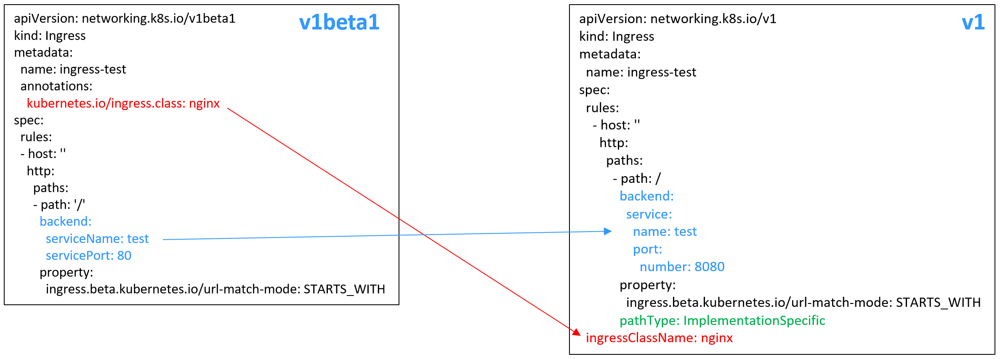

# 通过Kubectl命令行添加Nginx Ingress<a name="cce_10_0364"></a>

## 操作场景<a name="section18611202289"></a>

本节以[Nginx工作负载](创建无状态负载(Deployment).md#section155246177178)为例，说明kubectl命令添加Nginx Ingress的方法。

## 前提条件<a name="section108611520192816"></a>

-   集群必须已安装nginx-ingress插件，具体操作可参考[安装插件](nginx-ingress.md#section1152424015224)。
-   Ingress为后端工作负载提供网络访问，因此集群中需提前部署可用的工作负载。若您无可用工作负载，可参考[创建无状态负载\(Deployment\)](创建无状态负载(Deployment).md)、[创建有状态负载\(StatefulSet\)](创建有状态负载(StatefulSet).md)或[创建守护进程集\(DaemonSet\)](创建守护进程集(DaemonSet).md)部署工作负载。
-   为上述工作负载配置ClusterIP类型或NodePort类型的Service，可参考[集群内访问\(ClusterIP\)](集群内访问(ClusterIP).md)或[节点访问\(NodePort\)](节点访问(NodePort).md)配置示例Service。
-   选择HTTPS协议对外提供访问时，需要提前创建IngressTLS类型的密钥证书，创建密钥的方法请参见[创建密钥](创建密钥.md)。

## networking.k8s.io/v1版本Ingress说明<a name="section084115985013"></a>

CCE在1.23版本集群开始Ingress切换到**networking.k8s.io/v1**版本。

v1版本参数相较v1beta1参数有如下区别。

-   ingress类型由annotations中**kubernetes.io/ingress.class**变为使用**spec.ingressClassName**字段。
-   **backend**的写法变化。
-   每个路径下必须指定路径类型**pathType**，支持如下类型。
    -   ImplementationSpecific: 对于这种路径类型，匹配方法取决于具体Ingress Controller的实现。在CCE中会使用ingress.beta.kubernetes.io/url-match-mode指定的匹配方式，这与v1beta1方式相同。
    -   Exact：精确匹配 URL 路径，且区分大小写。
    -   Prefix：基于以 / 分隔的 URL 路径前缀匹配。匹配区分大小写，并且对路径中的元素逐个匹配。 路径元素指的是由 / 分隔符分隔的路径中的标签列表。




## 添加Nginx Ingress<a name="section53051715172814"></a>

1.  请参见[通过kubectl连接集群](通过kubectl连接集群.md)，使用kubectl连接集群。
2.  创建名为“**ingress-test.yaml**”的YAML文件，此处文件名可自定义。

    **vi ingress-test.yaml**

    > **说明：** 
    >-   CCE在1.23版本集群开始Ingress切换到networking.k8s.io/v1版本，之前版本集群使用networking.k8s.io/v1beta1。v1版本与v1beta1版本的区别请参见[networking.k8s.io/v1版本Ingress说明](#section084115985013)。
    >-   社区v1.2.0版本（对应CCE nginx-ingress插件2.1.0版本）后修复CVE-2021-25746\(https://github.com/kubernetes/ingress-nginx/issues/8503\)漏洞，新增规则（https://github.com/kubernetes/ingress-nginx/blame/main/internal/ingress/inspector/rules.go）禁用一些存在越权风险的Anntotations值。
    >-   社区v1.2.0版本（对应CCE nginx-ingress插件2.1.0版本）后修复CVE-2021-25745\(https://github.com/kubernetes/ingress-nginx/issues/8502\)漏洞，新增规则（https://github.com/kubernetes/ingress-nginx/blame/main/internal/ingress/inspector/rules.go）禁用一些存在越权风险的访问路径。

    **以HTTP协议访问为例，YAML文件配置如下。**

    **1.23及以上版本集群**：

    ```
    apiVersion: networking.k8s.io/v1
    kind: Ingress
    metadata:
      name: ingress-test
    spec:
      rules:
        - host: ''
          http:
            paths:
              - path: /
                backend:
                  service:
                    name: <your_service_name>  #替换为您的目标服务名称
                    port:
                      number: <your_service_port>  #替换为您的目标服务端口
                property:
                  ingress.beta.kubernetes.io/url-match-mode: STARTS_WITH
                pathType: ImplementationSpecific
      ingressClassName: nginx   # 表示使用Nginx Ingress
    ```

    **1.21及以下版本集群**：

    ```
    apiVersion: networking.k8s.io/v1beta1
    kind: Ingress
    metadata:
      name: ingress-test
      namespace: default
      annotations:
        kubernetes.io/ingress.class: nginx   # 表示使用Nginx Ingress
    spec:
      rules:
        - host: ''
          http:
            paths:
              - path: '/'
                backend:
                  serviceName: <your_service_name>  #替换为您的目标服务名称
                  servicePort: <your_service_port>  #替换为您的目标服务端口
    ```

    **表 1**  关键参数说明

    <a name="table128613206282"></a>
    <table><thead align="left"><tr id="row0861920112817"><th class="cellrowborder" valign="top" width="24.772477247724773%" id="mcps1.2.5.1.1"><p id="p786112062818"><a name="p786112062818"></a><a name="p786112062818"></a>参数</p>
    </th>
    <th class="cellrowborder" valign="top" width="13.691369136913693%" id="mcps1.2.5.1.2"><p id="p88617203282"><a name="p88617203282"></a><a name="p88617203282"></a>是否必填</p>
    </th>
    <th class="cellrowborder" valign="top" width="13.821382138213819%" id="mcps1.2.5.1.3"><p id="p1586162032820"><a name="p1586162032820"></a><a name="p1586162032820"></a>参数类型</p>
    </th>
    <th class="cellrowborder" valign="top" width="47.714771477147714%" id="mcps1.2.5.1.4"><p id="p10862120122811"><a name="p10862120122811"></a><a name="p10862120122811"></a>描述</p>
    </th>
    </tr>
    </thead>
    <tbody><tr id="row1386292022814"><td class="cellrowborder" valign="top" width="24.772477247724773%" headers="mcps1.2.5.1.1 "><p id="p28627205285"><a name="p28627205285"></a><a name="p28627205285"></a>kubernetes.io/ingress.class</p>
    </td>
    <td class="cellrowborder" valign="top" width="13.691369136913693%" headers="mcps1.2.5.1.2 "><p id="p9862182092810"><a name="p9862182092810"></a><a name="p9862182092810"></a>是（仅1.21及以下集群）</p>
    </td>
    <td class="cellrowborder" valign="top" width="13.821382138213819%" headers="mcps1.2.5.1.3 "><p id="p1986282011288"><a name="p1986282011288"></a><a name="p1986282011288"></a>String</p>
    </td>
    <td class="cellrowborder" valign="top" width="47.714771477147714%" headers="mcps1.2.5.1.4 "><p id="p1486222020282"><a name="p1486222020282"></a><a name="p1486222020282"></a>nginx：表示使用NginxIngress，未安装nginx-ingress插件时无法使用。</p>
    <p id="p7862132017287"><a name="p7862132017287"></a><a name="p7862132017287"></a>通过API接口创建Ingress时必须增加该参数。</p>
    </td>
    </tr>
    <tr id="row28621220132812"><td class="cellrowborder" valign="top" width="24.772477247724773%" headers="mcps1.2.5.1.1 "><p id="p59194313143"><a name="p59194313143"></a><a name="p59194313143"></a>ingressClassName</p>
    </td>
    <td class="cellrowborder" valign="top" width="13.691369136913693%" headers="mcps1.2.5.1.2 "><p id="p19193301415"><a name="p19193301415"></a><a name="p19193301415"></a>是</p>
    <p id="p69199318144"><a name="p69199318144"></a><a name="p69199318144"></a>（仅1.23及以上集群）</p>
    </td>
    <td class="cellrowborder" valign="top" width="13.821382138213819%" headers="mcps1.2.5.1.3 "><p id="p1791953141420"><a name="p1791953141420"></a><a name="p1791953141420"></a>String</p>
    </td>
    <td class="cellrowborder" valign="top" width="47.714771477147714%" headers="mcps1.2.5.1.4 "><p id="p191993181412"><a name="p191993181412"></a><a name="p191993181412"></a>nginx：表示使用NginxIngress，未安装nginx-ingress插件时无法使用。</p>
    <p id="p18919163191414"><a name="p18919163191414"></a><a name="p18919163191414"></a>通过API接口创建Ingress时必须增加该参数。</p>
    </td>
    </tr>
    <tr id="row10728182725410"><td class="cellrowborder" valign="top" width="24.772477247724773%" headers="mcps1.2.5.1.1 "><p id="p1968717516225"><a name="p1968717516225"></a><a name="p1968717516225"></a>ingress.beta.kubernetes.io/url-match-mode</p>
    </td>
    <td class="cellrowborder" valign="top" width="13.691369136913693%" headers="mcps1.2.5.1.2 "><p id="p06871551221"><a name="p06871551221"></a><a name="p06871551221"></a>否</p>
    </td>
    <td class="cellrowborder" valign="top" width="13.821382138213819%" headers="mcps1.2.5.1.3 "><p id="p368765202212"><a name="p368765202212"></a><a name="p368765202212"></a>String</p>
    </td>
    <td class="cellrowborder" valign="top" width="47.714771477147714%" headers="mcps1.2.5.1.4 "><p id="p17687954227"><a name="p17687954227"></a><a name="p17687954227"></a>路由匹配策略。</p>
    <p id="p2687851225"><a name="p2687851225"></a><a name="p2687851225"></a>默认值为<span class="parmvalue" id="parmvalue1124845489"><a name="parmvalue1124845489"></a><a name="parmvalue1124845489"></a>“STARTS_WITH”</span>(前缀匹配)。</p>
    <p id="p14687135102217"><a name="p14687135102217"></a><a name="p14687135102217"></a>取值范围：</p>
    <a name="ul1368755172219"></a><a name="ul1368755172219"></a><ul id="ul1368755172219"><li>EQUAL_TO：精确匹配</li><li>STARTS_WITH：前缀匹配</li><li>REGEX：正则匹配</li></ul>
    </td>
    </tr>
    <tr id="row67278272540"><td class="cellrowborder" valign="top" width="24.772477247724773%" headers="mcps1.2.5.1.1 "><p id="p10643627185415"><a name="p10643627185415"></a><a name="p10643627185415"></a>pathType</p>
    </td>
    <td class="cellrowborder" valign="top" width="13.691369136913693%" headers="mcps1.2.5.1.2 "><p id="p9643182718545"><a name="p9643182718545"></a><a name="p9643182718545"></a>是</p>
    </td>
    <td class="cellrowborder" valign="top" width="13.821382138213819%" headers="mcps1.2.5.1.3 "><p id="p20643122719545"><a name="p20643122719545"></a><a name="p20643122719545"></a>String</p>
    </td>
    <td class="cellrowborder" valign="top" width="47.714771477147714%" headers="mcps1.2.5.1.4 "><p id="p16431427135414"><a name="p16431427135414"></a><a name="p16431427135414"></a>路径类型，改字段仅v1.23及以上集群支持。</p>
    <a name="ul364310277543"></a><a name="ul364310277543"></a><ul id="ul364310277543"><li>ImplementationSpecific: 匹配方法取决于具体Ingress Controller的实现。在CCE中会使用ingress.beta.kubernetes.io/url-match-mode指定的匹配方式。</li><li>Exact：精确匹配 URL 路径，且区分大小写。</li><li>Prefix：基于以 / 分隔的 URL 路径前缀匹配。匹配区分大小写，并且对路径中的元素逐个匹配。 路径元素指的是由 / 分隔符分隔的路径中的标签列表。</li></ul>
    </td>
    </tr>
    </tbody>
    </table>

3.  创建Ingress。

    **kubectl create -f ingress-test.yaml**

    回显如下，表示Ingress服务已创建。

    ```
    ingress/ingress-test created
    ```

    查看已创建的Ingress。

    **kubectl get ingress**

    回显如下，表示Ingress服务创建成功，工作负载可访问。

    ```
    NAME             HOSTS     ADDRESS          PORTS   AGE
    ingress-test     *         121.**.**.**     80      10s
    ```

4.  访问工作负载（例如[Nginx工作负载](创建无状态负载(Deployment).md#section155246177178)），在浏览器中输入访问地址“http://121.\*\*.\*\*.\*\*:80“进行验证。

    其中，“121.\*\*.\*\*.\*\*“为统一负载均衡实例的IP地址。


## 配置HTTPS证书<a name="section17862112010285"></a>

Ingress支持配置HTTPS证书以提供安全服务，YAML配置示例如下。

**1.23及以上版本集群**：

```
apiVersion: networking.k8s.io/v1
kind: Ingress 
metadata: 
  name: ingress-test
  namespace: default
spec:
  tls: 
  - hosts: 
    - foo.bar.com
    secretName: ingress-test-secret
  rules:
    - host: ''
      http:
        paths:
          - path: /
            backend:
              service:
                name: <your_service_name>  #替换为您的目标服务名称
                port:
                  number: <your_service_port>  #替换为您的目标服务端口
            property:
              ingress.beta.kubernetes.io/url-match-mode: STARTS_WITH
            pathType: ImplementationSpecific
  ingressClassName: nginx
```

**1.21及以下版本集群**：

```
apiVersion: networking.k8s.io/v1beta1
kind: Ingress 
metadata: 
  name: ingress-test
  annotations: 
    kubernetes.io/ingress.class: nginx
spec:
  tls: 
  - hosts: 
    - foo.bar.com
    secretName: ingress-test-secret
  rules: 
  - host: ''
    http: 
      paths: 
      - path: '/'
        backend: 
          serviceName: <your_service_name>  #替换为您的目标服务名称
          servicePort: <your_service_port>  #替换为您的目标服务端口
  ingressClassName: nginx
```

如想配置HTTP重定向到HTTPS，可在annotation字段中加入如下配置：

```
nginx.ingress.kubernetes.io/ssl-redirect: "true"
```

## 配置URL重写规则<a name="section14863520202819"></a>

在一些使用场景中后端服务暴露的URL与Ingress规则中指定的路径不同，如果不进行URL重写配置，所有访问都将返回404。Nginx的URL重写可以通过Rewrite方法实现，使用“nginx.ingress.kubernetes.io/rewrite-target“注解可以实现不同路径的重写规则，如下所示：

```
apiVersion: networking.k8s.io/v1beta1
kind: Ingress
metadata:
  name: ingress-test
  namespace: default
  annotations:
    kubernetes.io/ingress.class: nginx
    nginx.ingress.kubernetes.io/rewrite-target: /$2
spec:
  rules:
    - host: 'rewrite.bar.com'
      http:
        paths:
          - path: '/something(/|$)(.*)'
            backend:
              serviceName: <your_service_name>  #替换为您的目标服务名称
              servicePort: <your_service_port>  #替换为您的目标服务端口
```

> **说明：** 
>只要有一个Ingress使用了rewrite-target，则所有Ingress定义下同一个host下所有path都会正则大小写敏感，包括没有使用rewrite-target的Ingress。

以上示例中，占位符$2表示将第二个括号即\(.\*\)中匹配到的所有字符填写到“nginx.ingress.kubernetes.io/rewrite-target“注解中。

例如，上面的Ingress定义将导致以下重写：

-   rewrite.bar.com/something 重写为 rewrite.bar.com/
-   rewrite.bar.com/something/ 重写为 rewrite.bar.com/
-   rewrite.bar.com/something/new 重写为 rewrite.bar.com/new

nginx-ingress-controller容器中，“/etc/nginx“路径下的nginx.conf文件可查看所有Ingress配置。以上示例中的重写规则将生成一条Rewrite指令，并写入到nginx.conf的location字段中，如下所示：

```
## start server rewrite.bar.com
        server {
                server_name rewrite.bar.com ;
                ...
                location ~* "^/something(/|$)(.*)" {
                        set $namespace      "default";
                        set $ingress_name   "ingress-test";
                        set $service_name   "<your_service_name>";
                        set $service_port   "80";
                        ...
                        rewrite "(?i)/something(/|$)(.*)" /$2 break;
                        ...
                }
        }
        ## end server rewrite.bar.com
```

上面的Rewrite指令基本语法结构为：

```
rewrite regex replacement [flag];
```

-   regex：匹配URI的正则表达式。在上述例子中，“\(?i\)/something\(/|$\)\(.\*\)“即为匹配URI的正则表达式，其中“\(?i\)“表示不区分大小写。
-   replacement：重写内容。在上述例子中，“/$2“即为重写内容，表示把路径重写为第二个括号“\(.\*\)“中匹配到的所有字符。
-   flag：表示重写形式的标记，包括：
    -   last：表示本条规则匹配完成后继续向下匹配。
    -   break：表示本条规则匹配完成后停止匹配。
    -   redirect：表示临时重定向，返回状态码302。
    -   permanent：表示永久重定向，返回状态码301。


对于一些复杂高级的Rewrite需求，可以通过如下注解来实现，其本质也是修改Nginx的配置文件（nginx.conf），可以实现上面提到的“nginx.ingress.kubernetes.io/rewrite-target“注解的功能，但是自定义程度更高，适合更加复杂的Rewrite需求。

-   nginx.ingress.kubernetes.io/server-snippet：在nginx.conf的“server“字段中添加自定义配置。
-   nginx.ingress.kubernetes.io/configuration-snippet：在nginx.conf的“location“字段中添加自定义配置。

通过以上两个注解可以在nginx.conf中的“server“或“location“字段中插入Rewrite指令，完成URL的重写，示例如下：

```
annotations:
     kubernetes.io/ingress.class: "nginx"
     nginx.ingress.kubernetes.io/configuration-snippet: |
        rewrite ^/stylesheets/(.*)$ /something/stylesheets/$1 redirect;  # 添加 /something 前缀
        rewrite ^/images/(.*)$ /something/images/$1 redirect;  # 添加 /something 前缀
```

如上两条规则在访问URL中添加了“/something“路径，即：

-   当用户访问rewrite.bar.com/stylesheets/new.css时，重写为rewrite.bar.com/something/stylesheets/new.css
-   当用户访问rewrite.bar.com/images/new.jpg时，重写为rewrite.bar.com/something/images/new.jpg

## 创建负载均衡规则<a name="section1486422014288"></a>

原生的Nginx支持多种负载均衡规则，其中常用的有加权轮询、IP hash等。Nginx Ingress在原生的Nginx能力基础上，支持使用一致性哈希方法进行负载均衡。

Nginx默认支持的IP hash方法使用的是线性的hash空间，根据IP的hash运算值来选取后端的目标服务器。但是这种方法在添加删除节点时，所有IP值都需要重新进行hash运算，然后重新路由，这样的话就会导致大面积的会话丢失或缓存失效，因此Nginx Ingress引入了一致性哈希来解决这一问题。

一致性哈希是一种特殊的哈希算法，通过构建环状的hash空间来替代普通的线性hash空间，在增删节点时仅需要将路由的目标按顺时针原则向下迁移，而其他路由无需改变，可以尽可能地减少重新路由，有效解决动态增删节点带来的负载均衡问题。

通过配置一致性哈希规则，在增加一台服务器时，新的服务器会尽量分担其他所有服务器的压力；同样，在减少一台服务器时，其他所有服务器也可以尽量分担它的资源，可以有效减少集群局部节点的压力，防止由于某一节点宕机带来的集群雪崩效应。

Nginx Ingress可以通过“nginx.ingress.kubernetes.io/upstream-hash-by“注解实现一致性哈希规则的配置，如下所示：

```
apiVersion: networking.k8s.io/v1beta1
kind: Ingress
metadata:
  name: ingress-test
  namespace: default
  annotations:
    kubernetes.io/ingress.class: nginx
    nginx.ingress.kubernetes.io/upstream-hash-by: "$request_uri"  #按照请求uri进行hash
spec:
  rules:
    - host: ''
      http:
        paths:
          - path: '/'
            backend:
              serviceName: <your_service_name>  #替换为您的目标服务名称
              servicePort: <your_service_port>  #替换为您的目标服务端口
```

注解“nginx.ingress.kubernetes.io/upstream-hash-by“的参数值支持nginx参数、文本值或任意组合，例如：

-   nginx.ingress.kubernetes.io/upstream-hash-by: "$request\_uri"代表按照请求uri进行hash。
-   nginx.ingress.kubernetes.io/upstream-hash-by: "$request\_uri$host"代表按照请求uri和域名进行hash。
-   nginx.ingress.kubernetes.io/upstream-hash-by: "$\{request\_uri\}-text-value"代表按照请求uri和文本值进行hash。

## 更多参数配置<a name="section983383172519"></a>

CCE的Nginx Ingress插件使用社区模板与镜像，Nginx Ingress默认的其他参数无法满足业务需求时，也可通过添加annotations的方式自定义参数，例如默认后端、超时时间、请求body体大小等。所有参数配置方法均和[创建负载均衡规则](#section1486422014288)相同，支持的参数列表请参见[Annotations](https://kubernetes.github.io/ingress-nginx/user-guide/nginx-configuration/annotations/)。

