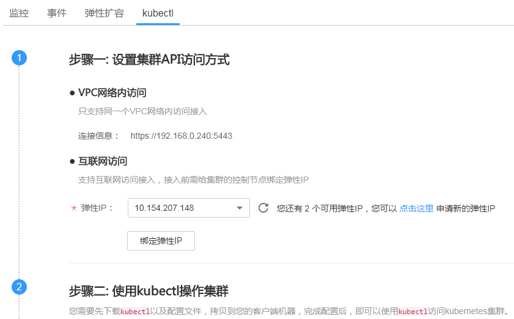

# 通过kubectl或web-terminal插件操作CCE集群

## 操作场景

本文将以CCE集群为例，介绍如何通过kubectl或web-terminal插件操作CCE集群。

## 通过web-terminal插件操作集群

**请安装和设置web-terminal。**

有关详细信息，请参见[web-terminal](web-terminal.md)安装和配置插件，安装完成后单击左侧导航栏的“插件管理“，在“插件实例”中，单击“web-terminal”名称进入插件详情页，单击“访问地址”后的链接即可登录。

## 使用kubectl操作集群

**背景信息**

若您需要从客户端计算机连接到kubernetes集群，请使用kubernetes命令行客户端kubectl，使用方法请参见[安装并配置 kubectl](https://kubernetes.io/zh/docs/tasks/tools/install-kubectl/)。

**前提条件**

CCE支持“VPC网络内访问“和“互联网访问“两种方式访问集群。

-   VPC网络内访问：您需要在[ECS控制台](https://console.huaweicloud.com/ecm/?locale=zh-cn#/ecs/manager/vmList)购买一台云服务器，并确保和当前集群在同个VPC内。
-   互联网访问：您需要准备一台能连接公网的云服务器。

> **须知：** 
>通过“互联网访问”方式访问集群，集群的kube-apiserver将会暴露到互联网，存在被攻击的风险，建议对kube-apiserver所在节点的EIP配置DDoS高防服务。

**下载kubectl**

您需要先下载kubectl以及配置文件，拷贝到您的客户端机器，完成配置后，即可以使用访问kubernetes集群。

请到[kubernetes版本发布页面](https://github.com/kubernetes/kubernetes/blob/master/CHANGELOG/README.md)下载与集群版本对应的或者更新的kubectl。

**安装和配置kubectl**

1.  登录[CCE控制台](https://console.huaweicloud.com/cce2.0/?utm_source=helpcenter)，在左侧导航栏中选择“资源管理 \> 集群管理”，单击待连接集群下的“命令行工具 \>  kubectl”。

    **图 1**  单击kubectl  
    

2.  在集群详情页中的“kubectl“页签下，请参照界面中的提示信息完成集群连接。

    > **说明：** 
    >-   您可以在“kubectl“页签下方便的**下载kubectl配置文件**（kubeconfig.json），配置文件的有效期可选择1\~10950天（30年）。该文件用于对接认证用户集群，请用户妥善保存该认证凭据，防止文件泄露后，集群有被攻击的风险。如果不幸泄露，可以通过证书更新的方式，替换认证凭据。
    >-   由于EIP无法固定，所以服务器端证书无法预置EIP，若从互联网访问则无法开启客户端校验服务器端。如需开启客户端校验服务器端，请使用VPC访问方式。
    >-   IAM用户下载的配置文件所拥有的Kubernetes权限与CCE控制台上IAM用户所拥有的权限一致。

    **图 2**  通过kubectl连接集群  
    

## 相关操作

连接集群后，您可以使用Kubernetes管理工作负载，具体请参见[Kubectl使用指南](Kubectl使用指南.md)。

