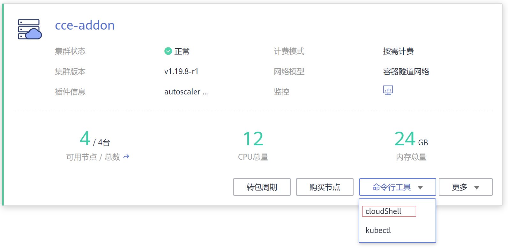
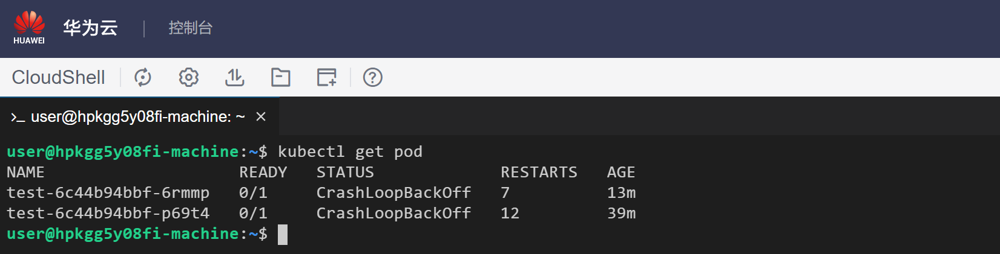
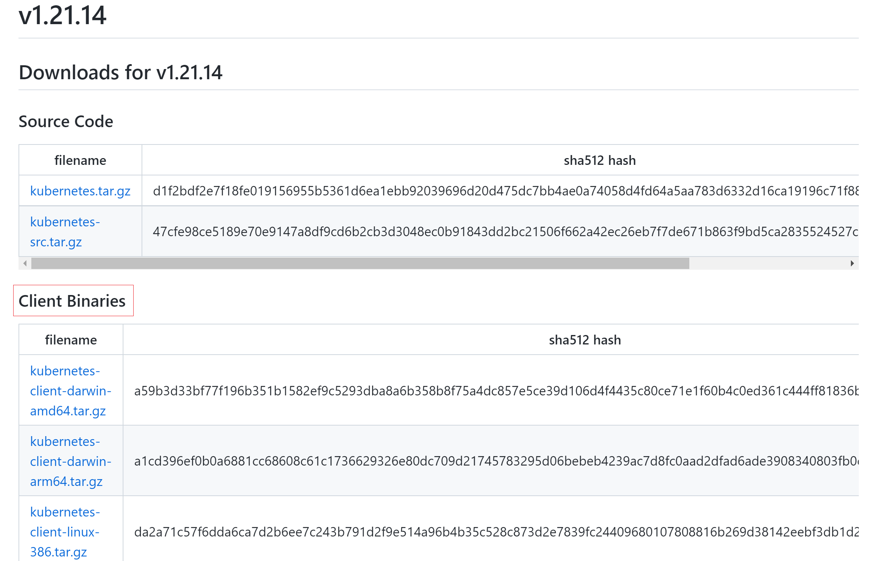
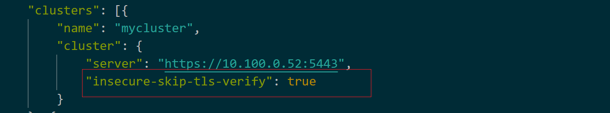
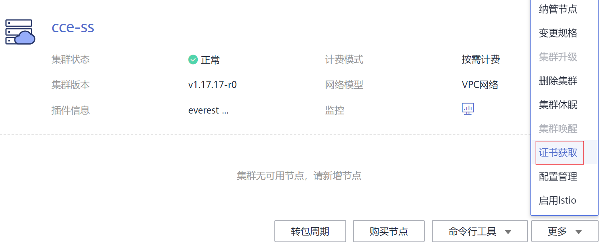
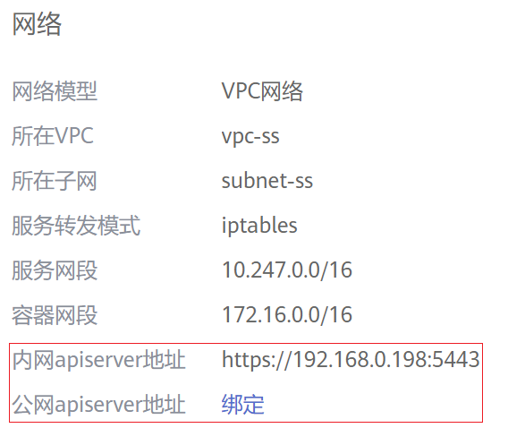

# 通过kubectl连接集群

## 操作场景

本文将以CCE集群为例，介绍如何通过kubectl或CloudShell连接CCE集群。

## 权限说明

kubectl访问CCE集群是通过集群上生成的配置文件（kubeconfig.json）进行认证，kubeconfig.json文件内包含用户信息，CCE根据用户信息的权限判断kubectl有权限访问哪些Kubernetes资源。即哪个用户获取的kubeconfig.json文件，kubeconfig.json就拥有哪个用户的信息，这样使用kubectl访问时就拥有这个用户的权限。

用户拥有的权限请参见[集群权限（IAM授权）与命名空间权限（Kubernetes RBAC授权）的关系](CCE权限概述-178.md#section1464135853519)。

在CloudShell中使用kubectl是由登录用户的权限决定kubectl的权限。

## 使用CloudShell连接集群

CloudShell是一款用于管理与运维云资源的网页版Shell工具，CCE支持使用CloudShell连接集群，在CloudShell中可以使用kubectl访问集群。

> **说明：** 
>CloudShell中kubectl证书有效期为1天，从云容器引擎重新跳转可以重置有效期。
>CloudShell基于VPCEP实现，在CloudShell中使用kubectl访问集群需要在集群控制节点的安全组（安全组名称：集群名称-cce-control-随机数）中放通如下网段访问5443端口。5443端口默认对所有网段放通，如果您对安全组做过加固，当出现在CloudShell中无法访问集群时，请检查5443端口是否放通了198.19.128.0/16网段。
>集群必须安装CoreDNS才能使用CloudShell。

**图 1**  CloudShell  

**图 2**  在CloudShell中使用kubectl  

## 使用kubectl连接集群

**背景信息**

若您需要从客户端计算机连接到kubernetes集群，请使用kubernetes命令行客户端kubectl，使用方法请参见[安装并配置 kubectl](https://kubernetes.io/docs/tasks/tools/)。

**前提条件**

CCE支持“VPC网络内访问“和“互联网访问“两种方式访问集群。

-   VPC网络内访问：与当前集群相同VPC内访问集群。
-   互联网访问：您需要准备一台能连接公网的云服务器。

> **须知：** 
>通过“互联网访问”方式访问集群，集群的kube-apiserver将会暴露到互联网，存在被攻击的风险，建议对kube-apiserver所在节点的EIP配置DDoS高防服务。

**下载kubectl**

您需要先下载kubectl以及配置文件，拷贝到您的客户端机器，完成配置后，即可以使用访问kubernetes集群。

在[kubernetes版本发布页面](https://github.com/kubernetes/kubernetes/blob/master/CHANGELOG/README.md)，根据集群版本单击对应链接，然后单击**Client Binaries**，选择对应平台软件包下载即可。

**图 3**  下载kubectl  

**安装和配置kubectl**

1.  登录CCE控制台，在左侧导航栏中选择“资源管理 \> 集群管理”，单击待连接集群下的“命令行工具 \>  kubectl”。
2.  在集群详情页中的“kubectl“页签下，请参照界面中的提示信息完成集群连接。

    > **说明：** 
    >-   您可以在“kubectl“页签下方便的**下载kubectl配置文件**（kubeconfig.json）。该文件用于对接认证用户集群，请用户妥善保存该认证凭据，防止文件泄露后，集群有被攻击的风险。
    >-   当前集群开启了双向认证，对已经绑定了EIP的集群，如果出现认证不通过的情况（x509: certificate is valid），需要重新绑定EIP并重新下载kubeconfig.json。
    >-   当前集群默认不开启[域名双向认证说明](#section1559919152711)，可通过 kubectl config use-context externalTLSVerify 命令开启双向认证。对已经绑定了EIP的集群，如果在使用双向认证时出现认证不通过的情况（x509: certificate is valid），需要重新绑定EIP并重新下载kubeconfig.json。
    >-   IAM用户下载的配置文件所拥有的Kubernetes权限与CCE控制台上IAM用户所拥有的权限一致。
    >-   如果Linux系统里面配置了KUBECONFIG环境变量，kubectl会优先加载KUBECONFIG环境变量，而不是$home/.kube/config，使用时请注意。

    **图 4**  通过kubectl连接集群  
    

## 域名双向认证

CCE当前支持域名双向认证。

-   域名双向认证默认不开启，可通过  **kubectl config use-context externalTLSVerify**  命令切换到externalTLSVerify这个context开启使用。
-   集群绑定或解绑弹性IP、配置或更新自定义域名时，集群服务端证书将同步签入最新的集群访问地址（包括集群绑定的弹性IP、集群配置的所有自定义域名）。
-   异步同步集群通常耗时约5-10min，同步结果可以在操作记录中查看“同步证书”。
-   对已经绑定了EIP的集群，如果在使用双向认证时出现认证不通过的情况（x509: certificate is valid），需要重新绑定EIP并重新下载kubeconfig.json。
-   早期未支持域名双向认证时，kubeconfig.json中包含"insecure-skip-tls-verify": true字段，如[图5](#fig1941342411)所示。如果需要使用双向认证，您可以重新下载kubeconfig.json文件并配置开启域名双向认证。

    **图 5**  未开启域名双向认证  
    

## 通过API Server调用Kubernetes原生API

通过Kubernetes集群的API Server可以调用Kubernetes原生API。

1.  登录CCE控制台，在左侧导航栏中选择“资源管理 \> 集群管理”，在需要调用的集群上选择“更多 \> 证书获取”。

    

    共下载如下三个证书。

    -   ca.crt
    -   client.crt
    -   client.key

2.  进入集群，在集群详情页获取API Server地址，如下所示。

    

    有了证书和API Server地址，您就可以调用Kubernetes原生API。

    例如使用curl命令调用接口查看Pod信息，只需将证书携带上，如下所示。

    **curl --cert ./client.crt --key ./client.key  https://192.168.0.198:5443/api/v1/namespaces/default/pods/**

## 常见问题（Error from server Forbidden）

使用kubectl在创建或查询Kubernetes资源时，显示如下内容。

\# kubectl get deploy Error from server \(Forbidden\): deployments.apps is forbidden: User "0c97ac3cb280f4d91fa7c0096739e1f8" cannot list resource "deployments" in API group "apps" in the namespace "default"

原因是用户没有操作该Kubernetes资源的权限，请参见[命名空间权限（Kubernetes RBAC授权）](命名空间权限（Kubernetes-RBAC授权）-180.md)为用户授权。

