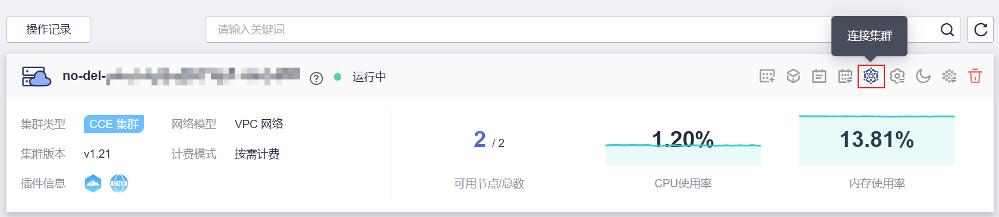

# 通过kubectl连接集群<a name="cce_10_0107"></a>

## 操作场景<a name="section14234115144"></a>

本文将以CCE集群为例，介绍如何通过kubectl或CloudShell连接CCE集群。

## 权限说明<a name="section17352373317"></a>

kubectl访问CCE集群是通过集群上生成的配置文件（kubeconfig.json）进行认证，kubeconfig.json文件内包含用户信息，CCE根据用户信息的权限判断kubectl有权限访问哪些Kubernetes资源。即哪个用户获取的kubeconfig.json文件，kubeconfig.json就拥有哪个用户的信息，这样使用kubectl访问时就拥有这个用户的权限。

用户拥有的权限请参见[集群权限（IAM授权）与命名空间权限（Kubernetes RBAC授权）的关系](CCE权限概述.md#section1464135853519)。

在CloudShell中使用kubectl是由登录用户的权限决定kubectl的权限。

## 使用CloudShell连接集群<a name="section165852057101615"></a>

CloudShell是一款用于管理与运维云资源的网页版Shell工具，CCE支持使用CloudShell连接集群，如[图1](#fig143888334518)所示，单击即可在CloudShell中使用kubectl访问集群。

> **说明：** 
>-   CloudShell中kubectl证书有效期为1天，从云容器引擎重新跳转可以重置有效期。
>-   CloudShell基于VPCEP实现，在CloudShell中使用kubectl访问集群需要在集群控制节点的安全组（安全组名称：集群名称-cce-control-随机数）中放通如下网段访问5443端口。5443端口默认对所有网段放通，如果您对安全组做过加固，当出现在CloudShell中无法访问集群时，请检查5443端口是否放通了**198.19.0.0/16**网段。
>-   集群必须安装CoreDNS才能使用CloudShell。
>-   当前仅北京一、北京四、上海一、上海二、广州和乌兰察布一支持使用CloudShell登录容器。

**图 1**  CloudShell<a name="fig143888334518"></a>  


**图 2**  在CloudShell中使用kubectl<a name="fig1324619441512"></a>  


## 使用kubectl连接集群<a name="section37321625113110"></a>

若您需要从客户端计算机连接到Kubernetes集群，可使用Kubernetes命令行客户端kubectl，您可登录CCE控制台，单击待连接集群名称，在“集群信息“页面查看访问地址以及kubectl的连接步骤，如[图3](#fig16278986314)所示。

CCE支持“VPC网络内访问“和“互联网访问“两种方式访问集群。

-   VPC网络内访问：即通过内网地址访问，访问集群的客户端机器需要位于集群所在的同一VPC内。
-   互联网访问：即通过公网地址访问，访问集群的客户端机器需要具备访问公网的能力，并为集群绑定公网地址。

    > **须知：** 
    >通过“互联网访问”方式访问集群，您需要在集群信息页中的“连接信息“版块为集群绑定公网地址，如[图3](#fig16278986314)所示。绑定公网集群的kube-apiserver将会暴露到互联网，存在被攻击的风险，建议对kube-apiserver所在节点的EIP配置DDoS高防服务。

    **图 3**  集群连接信息<a name="fig16278986314"></a>  
    


您需要先下载kubectl以及配置文件，拷贝到您的客户端机器，完成配置后，即可以访问Kubernetes集群。使用kubectl连接集群的步骤如下：

1.  <a name="li194691356201712"></a>**下载kubectl**

    在[Kubernetes](https://github.com/kubernetes/kubernetes/blob/master/CHANGELOG/README.md)，根据集群版本单击对应链接，然后单击**Client Binaries**，选择对应平台软件包下载即可。如需通过命令行方式安装kubectl，请参考[安装kubectl](https://kubernetes.io/zh-cn/docs/tasks/tools/#kubectl)。

    **图 4**  下载kubectl<a name="fig978018401170"></a>  
    

2.  <a name="li34691156151712"></a>**获取kubectl配置文件**

    在集群信息页中的“连接信息“版块，单击kubectl后的“点击查看“按钮，查看kubectl的连接信息，并在弹出页面中下载配置文件。

    **图 5**  下载配置文件<a name="fig1278292815444"></a>  
    

    > **说明：** 
    >-   kubectl配置文件（kubeconfig.json）用于对接认证集群，请您妥善保存该认证凭据，防止文件泄露后，集群有被攻击的风险。
    >-   当前集群默认不开启[域名双向认证说明](#section1559919152711)，可通过 kubectl config use-context externalTLSVerify 命令开启双向认证。对已经绑定了EIP的集群，如果在使用双向认证时出现认证不通过的情况（x509: certificate is valid），需要重新绑定EIP并重新下载kubeconfig.json。
    >-   IAM用户下载的配置文件所拥有的Kubernetes权限与CCE控制台上IAM用户所拥有的权限一致。
    >-   如果Linux系统里面配置了KUBECONFIG环境变量，kubectl会优先加载KUBECONFIG环境变量，而不是$home/.kube/config，使用时请注意。

3.  **配置kubectl**

    以Linux环境为例安装和配置kubectl。

    1.  拷贝[1](#li194691356201712)中下载的kubectl及[2](#li34691156151712)中下载的配置文件到您客户端机器的/home目录下。
    2.  登录到您的客户端机器，配置kubectl。如果已经安装 kubectl，则跳过此步骤。

        ```
        cd /home
        chmod +x kubectl
        mv -f kubectl /usr/local/bin
        ```

    3.  登录到您的客户端机器，配置 kubectl 配置文件。

        ```
        cd /home
        mkdir -p $HOME/.kube
        mv -f kubeconfig.json $HOME/.kube/config
        ```

    4.  根据使用场景，切换kubectl的访问模式。
        -   VPC内网接入访问请执行：

            ```
            kubectl config use-context internal
            ```

        -   互联网接入访问请执行（集群需绑定公网地址）：

            ```
            kubectl config use-context external
            ```

        -   互联网接入访问如需开启双向认证请执行（集群需绑定公网地址）：

            ```
            kubectl config use-context externalTLSVerify
            ```

            关于集群双向认证的说明请参见[域名双向认证](#section1559919152711)。


## 域名双向认证<a name="section1559919152711"></a>

CCE当前支持域名双向认证。

-   域名双向认证默认不开启，可通过  **kubectl config use-context externalTLSVerify**  命令切换到externalTLSVerify这个context开启使用。
-   集群绑定或解绑弹性IP、配置或更新自定义域名时，集群服务端证书将同步签入最新的集群访问地址（包括集群绑定的弹性IP、集群配置的所有自定义域名）。
-   异步同步集群通常耗时约5-10min，同步结果可以在操作记录中查看“同步证书”。
-   对已经绑定了EIP的集群，如果在使用双向认证时出现认证不通过的情况（x509: certificate is valid），需要重新绑定EIP并重新下载kubeconfig.json。
-   早期未支持域名双向认证时，kubeconfig.json中包含"insecure-skip-tls-verify": true字段，如[图6](#fig1941342411)所示。如果需要使用双向认证，您可以重新下载kubeconfig.json文件并配置开启域名双向认证。

    **图 6**  未开启域名双向认证<a name="fig1941342411"></a>  
    


## 常见问题（Error from server Forbidden）<a name="section1628510591883"></a>

使用kubectl在创建或查询Kubernetes资源时，显示如下内容。

\# kubectl get deploy Error from server \(Forbidden\): deployments.apps is forbidden: User "0c97ac3cb280f4d91fa7c0096739e1f8" cannot list resource "deployments" in API group "apps" in the namespace "default"

原因是用户没有操作该Kubernetes资源的权限，请参见[命名空间权限（Kubernetes RBAC授权）](命名空间权限（Kubernetes-RBAC授权）.md)为用户授权。

## 相关操作<a name="section125261255139"></a>

-   [通过kubectl对接多个集群](https://support.huaweicloud.com/bestpractice-cce/cce_bestpractice_00254.html)
-   [通过配置kubeconfig文件实现集群权限精细化管理](https://support.huaweicloud.com/bestpractice-cce/cce_bestpractice_00221.html)

