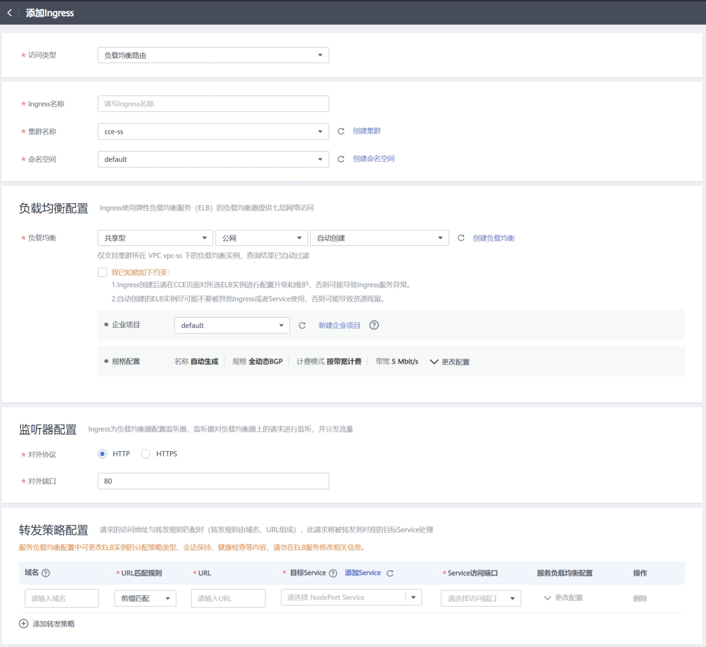
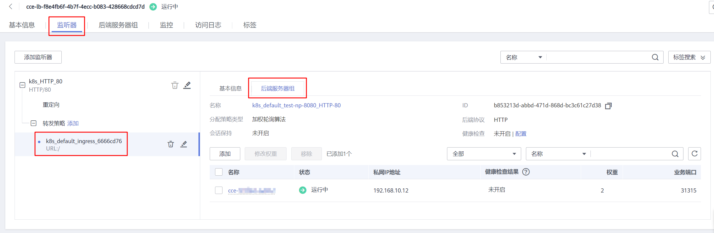
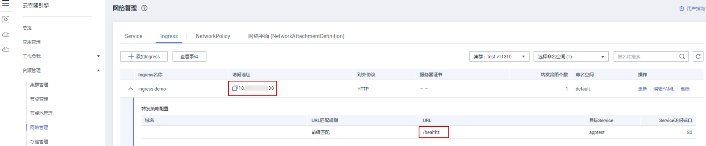

# 通过控制台使用ELB Ingress

## 前提条件

-   Ingress为后端工作负载提供网络访问，因此集群中需提前部署可用的工作负载。若您无可用工作负载，可参考[创建无状态负载\(Deployment\)](创建无状态负载(Deployment)-40.md)、[创建有状态负载\(StatefulSet\)](创建有状态负载(StatefulSet)-41.md)或[创建守护进程集\(DaemonSet\)](创建守护进程集(DaemonSet)-42.md)部署工作负载。
-   为上述工作负载配置Service，支持的Service类型如[表1](#table143264518141)，可参考[集群内访问\(ClusterIP\)](集群内访问(ClusterIP)-70.md)或[节点访问\(NodePort\)](节点访问(NodePort)-71.md)配置示例Service。

**表 1**  支持Service类型

<table><thead align="left"><tr id="row1132645112145"><th class="cellrowborder" valign="top" width="25%" id="mcps1.2.5.1.1">
Ingress类型

</th>
<th class="cellrowborder" valign="top" width="24.959999999999997%" id="mcps1.2.5.1.2">
访问类型

</th>
<th class="cellrowborder" valign="top" width="24.95%" id="mcps1.2.5.1.3">
集群内访问（ClusterIP）

</th>
<th class="cellrowborder" valign="top" width="25.09%" id="mcps1.2.5.1.4">
节点访问（NodePort）

</th>
</tr>
</thead>
<tbody><tr id="row1326185141413"><td class="cellrowborder" rowspan="2" valign="top" width="25%" headers="mcps1.2.5.1.1 ">
ELBIngress

</td>
<td class="cellrowborder" valign="top" width="24.959999999999997%" headers="mcps1.2.5.1.2 ">
负载均衡路由

</td>
<td class="cellrowborder" valign="top" width="24.95%" headers="mcps1.2.5.1.3 ">
不支持

</td>
<td class="cellrowborder" valign="top" width="25.09%" headers="mcps1.2.5.1.4 ">
支持

</td>
</tr>
<tr id="row432645171419"><td class="cellrowborder" valign="top" headers="mcps1.2.5.1.1 ">
ENI负载均衡路由

</td>
<td class="cellrowborder" valign="top" headers="mcps1.2.5.1.2 ">
支持

</td>
<td class="cellrowborder" valign="top" headers="mcps1.2.5.1.3 ">
不支持

</td>
</tr>
<tr id="row19326155112146"><td class="cellrowborder" rowspan="2" valign="top" width="25%" headers="mcps1.2.5.1.1 ">
NginxIngress

</td>
<td class="cellrowborder" valign="top" width="24.959999999999997%" headers="mcps1.2.5.1.2 ">
负载均衡路由

</td>
<td class="cellrowborder" valign="top" width="24.95%" headers="mcps1.2.5.1.3 ">
支持

</td>
<td class="cellrowborder" valign="top" width="25.09%" headers="mcps1.2.5.1.4 ">
支持

</td>
</tr>
<tr id="row1732610515140"><td class="cellrowborder" valign="top" headers="mcps1.2.5.1.1 ">
ENI负载均衡路由

</td>
<td class="cellrowborder" valign="top" headers="mcps1.2.5.1.2 ">
支持

</td>
<td class="cellrowborder" valign="top" headers="mcps1.2.5.1.3 ">
不支持

</td>
</tr>
</tbody>
</table>

## 注意事项

-   建议其他资源不要使用Ingress自动创建的ELB实例，否则在删除Ingress时，ELB实例会被占用，导致资源残留。
-   添加Ingress后请在CCE页面对所选ELB实例进行配置升级和维护，不可在ELB页面对配置进行更改，否则可能导致Ingress服务异常。
-   Ingress转发策略中注册的URL需与后端应用暴露的URL一致，否则将返回404错误。

## 添加ELB Ingress

本节以nginx作为工作负载并添加ELB Ingress为例进行说明。

1.  登录CCE控制台。
2.  单击控制台左侧导航栏的“资源管理 \>  网络管理”，进入“Ingress页签”选择对应的集群和命名空间。
3.  单击“添加Ingress”，进入配置页面，如[图1](#fig15429107112)所示。

    **图 1**  Ingress配置页面  
    

    根据需求设置Ingress参数，关键参数信息如下：

    -   **访问类型**：根据实际选择负载均衡路由或ENI负载均衡路由。
        -   负载均衡路由：使用弹性负载均衡器访问服务。仅支持将请求转发到节点访问 \( NodePort \) 类型的Service。
        -   ENI负载均衡路由：使用弹性负载均衡器直通容器。仅支持将请求转发到集群内访问 \( ClusterIP \) 类型的Service，且Service的关联工作负载已绑定弹性网卡（即容器对接ENI）。

    -   **Ingress名称：**自定义Ingress名称，例如ingress-demo。
    -   **集群名称：**选择需要添加Ingress的集群。
    -   **命名空间：**选择需要添加Ingress的命名空间。
    -   **负载均衡配置：**Ingress使用弹性负载均衡服务（ELB）的负载均衡器提供七层网络访问。支持自动创建和使用已有负载均衡实例两种方式。如需手动创建负载均衡实例，请单击“创建负载均衡”，完成后单击刷新按钮。

        > **须知：** 
        >-   建议其他资源不要使用Ingress自动创建的ELB实例，否则在删除Ingress时，ELB实例会被占用，导致资源残留。
        >-   集群版本为1.17及以上时支持独享型负载均衡。
        >-   对接已有独享型ELB规格需要支持应用型（HTTP），且网络类型必须支持私网。
        >-   使用ENI负载均衡路由时仅支持独享型负载均衡。

        负载均衡：负载均衡实例需与当前集群处于相同VPC且为相同公网或私网类型。

        -   共享型：用户共享集群资源，集群支持超大性能。
        -   独享型：用户独享资源，高性能保障。并且拥有如下额外配置：
            -   可用区：独享型负载均衡支持同时部署在多个可用区，多活模式且互为备份，可提供更高的可靠性。
            -   实例规格：实例规格决定了负载均衡可创建的监听器类型，可按需选择规格类型和大小。
            -   慢启动：流量会根据时间戳线性导入后端，不会出现流量风暴，导致部分请求得不到响应。

        请根据业务需求选择“公网“或“私网“，默认为“公网”。

        -   公网：通过公网IP提供服务，将来自公网的客户端请求按照指定的负载均衡策略分发到后端云服务器进行处理。
            -   企业项目：对接企业项目，可以选择直接创建在具体的企业项目下。
            -   更改配置：选择“公网 \> 自动创建“时，单击规格配置下的“更改配置”，可修改待创建的负载均衡实例的名称、规格、计费模式和带宽。

        -   私网：通过私网IP提供服务，将来自同一个VPC的客户端请求按照指定的负载均衡策略分发到后端进行处理。
            -   企业项目：对接企业项目，可以选择直接创建在具体的企业项目下。

    -   **监听器配置：**Ingress为负载均衡器配置监听器，监听器对负载均衡器上的请求进行监听，并分发流量。配置完成后ELB实例侧将会创建对应的监听器，名称默认为k8s\_<协议类型\>\_<端口号\>，例如“k8s\_HTTP\_80”。
        -   对外协议：支持HTTP和HTTPS。
        -   对外端口：开放在负载均衡服务地址的端口，可任意指定。
        -   服务器证书：负载均衡器创建HTTPS协议监听时需要绑定证书，以支持HTTPS数据传输加密认证。创建密钥证书的方法请参见[创建密钥](创建密钥-146.md)。

            > **说明：** 
            >同一个ELB实例的同一个端口配置HTTPS时，一个监听器只支持配置一个密钥证书。若使用两个不同的密钥证书将两个Ingress添加到同一个ELB下的同一个监听器，ELB侧实际只生效最先添加的证书。

        -   开启SNI：单击后开启SNI功能。SNI（Server Name Indication）是TLS的扩展协议，在该协议下允许同一个IP地址和端口号下对外提供多个基于TLS的访问域名，且不同的域名可以使用不同的安全证书。开启SNI后，允许客户端在发起TLS握手请求时就提交请求的域名信息。负载均衡收到TLS请求后，会根据请求的域名去查找证书：若找到域名对应的证书，则返回该证书认证鉴权；否则，返回缺省证书（服务器证书）认证鉴权。

            > **说明：** 
            >-   当选择HTTPS协议时，才支持配置“开启SNI”选项。
            >-   该功能仅支持1.15.11及以上版本的集群。
            >-   用于SNI的证书需要指定域名，每个证书只能指定一个域名。支持泛域名证书。

        -   安全策略：安全策略包含HTTPS可选的TLS协议版本和配套的加密算法套件。

            关于安全策略的详细说明，请参见[安全策略](https://support.huaweicloud.com/usermanual-elb/elb_ug_jt_0022.html)。

            > **说明：** 
            >-   选择HTTPS协议时，才支持配置“安全策略”选项。
            >-   该功能仅支持1.17.9及以上版本的集群。

    -   **转发策略配置：**请求的访问地址与转发规则匹配时（转发规则由域名、URL组成，例如：10.117.117.117:80/helloworld），此请求将被转发到对应的目标Service处理。单击“添加转发策略“按钮可添加多条转发策略。
        -   域名：实际访问的域名地址。请确保所填写的域名已注册并备案，一旦配置了域名规则后，必须使用域名访问。
        -   URL匹配规则：
            -   前缀匹配：例如映射URL为/healthz，只要符合此前缀的URL均可访问。例如/healthz/v1，/healthz/v2。
            -   精确匹配：表示只有URL完全匹配时，访问才能生效。例如映射URL为/healthz，则必须为此URL才能访问。
            -   正则匹配：按正则表达式方式匹配URL。例如正则表达式为**/\[A-Za-z0-9\_.-\]+/test**。只要符合此规则的URL均可访问，例如/abcA9/test，/v1-Ab/test。正则匹配规则支持POSIX与Perl两种标准。

        -   URL：需要注册的访问路径，例如：/healthz。
        -   目标Service：请选择已有Service或新建Service。页面列表中的查询结果已自动过滤不符合要求的Service。
        -   Service访问端口：可选择目标Service的访问端口。
        -   服务负载均衡配置：该配置是基于服务的配置，若有多条路由使用当前服务，这些路由将使用相同的服务负载均衡配置。
            -   分配策略类型：可选择加权轮询算法、加权最少连接或源IP算法。各分配策略具体说明请参考[负载均衡\(LoadBalancer\)](负载均衡(LoadBalancer)-72.md)。
            -   会话保持：默认不启用。启用后需选择会话保持类型，设置会话保持时间。

                负载均衡器cookie：负载均衡器会根据客户端第一个请求生成一个cookie，后续所有包含这个cookie值的请求都会由同一个后端服务器处理。

                应用程序cookie：该选项依赖于后端应用。后端应用生成一个cookie值，后续所有包含这个cookie值的请求都会由同一个后端服务器处理。共享型负载均衡支持该会话保持类型。

            -   健康检查：默认不启用。请根据界面提示进行配置。

        -   操作：可单击“删除“按钮删除该配置。

4.  配置完成后，单击“创建“。创建完成后，在Ingress列表可查看到已添加的Ingress。

    在ELB控制台可查看通过CCE自动创建的ELB，名称默认为“cce-lb-ingress.UID“。单击ELB名称进入详情页，在“监听器”页签下即可查看Ingress对应的路由设置，包括URL、监听器端口以及对应的后端服务器组端口。

    > **须知：** 
    >Ingress创建后请在CCE页面对所选ELB实例进行配置升级和维护，不要在ELB控制台对ELB实例进行维护，否则可能导致Ingress服务异常。

    **图 2**  ELB路由设置  
    

5.  访问工作负载（例如名称为defaultbackend）的“/healthz”接口。
    1.  如[图3](#fig911562743620)，获取工作负载“/healthz“接口的访问地址。访问地址由负载均衡实例IP、对外端口、映射URL组成，例如：10.\*\*.\*\*.\*\*:80/healthz。

        **图 3**  获取访问地址  
        

    2.  在浏览器中输入“/healthz”接口的访问地址，如：http://10.\*\*.\*\*.\*\*:80/healthz，即可成功访问工作负载，如[图4](#fig17115192714367)。

        **图 4**  访问defaultbackend“/healthz”接口  
        

## 更新Ingress

您可以在添加完Ingress后，更新此Ingress的端口、域名和路由配置。操作如下：

> **说明：** 
>在CCE控制台更新Ingress时，负载均衡配置中可更改ELB实例的分配策略类型、会话保持、健康检查等内容，请勿在ELB服务修改相关信息。

1.  登录CCE控制台，在左侧导航栏中选择“资源管理 \> 网络管理”。在**Ingress**页签下，选择对应的集群和命名空间，单击待更新Ingress后方的“更新”。
2.  在“更新Ingress“页面，更新所需参数。

    参数选项与创建时一致。

3.  单击“提交”。工作负载已更新Ingress。

## 相关操作

由于社区Ingress结构体中没有property属性，用户使用client-go调用创建ingress的api接口时，创建的Ingress中没有property属性。为了与社区的client-go兼容，CCE提供了相关解决方案，具体请参见[Ingress中的property字段如何实现与社区client-go兼容？](https://support.huaweicloud.com/cce_faq/cce_faq_00234.html)。

