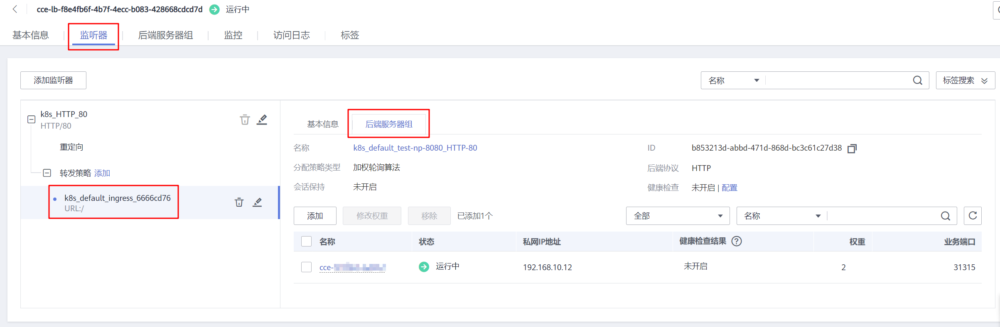
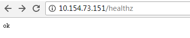

# 通过控制台使用ELB Ingress

## 前提条件

-   Ingress为后端工作负载提供网络访问，因此集群中需提前部署可用的工作负载。若您无可用工作负载，可参考[创建无状态负载\(Deployment\)](创建无状态负载(Deployment).md)、[创建有状态负载\(StatefulSet\)](创建有状态负载(StatefulSet).md)或[创建守护进程集\(DaemonSet\)](创建守护进程集(DaemonSet).md)部署工作负载。
-   独享型ELB规格必须支持应用型（HTTP/HTTPS），且网络类型必须支持私网（有私有IP地址）。
-   ELB直通Pod场景（CCE Turbo集群 + 独享型ELB实例）下，ELB Ingress支持ClusterIP类型Service；其他非直通场景下支持NodePort类型Service。

## 注意事项

-   建议其他资源不要使用Ingress自动创建的ELB实例，否则在删除Ingress时，ELB实例会被占用，导致资源残留。
-   添加Ingress后请在CCE页面对所选ELB实例进行配置升级和维护，不可在ELB页面对配置进行更改，否则可能导致Ingress服务异常。
-   Ingress转发策略中注册的URL需与后端应用暴露的URL一致，否则将返回404错误。
-   IPVS模式集群下，Ingress和Service使用相同ELB实例时，无法在集群内的节点和容器中访问Ingress，因为kube-proxy会在ipvs-0的网桥上挂载LB类型的Service地址，Ingress对接的ELB的流量会被ipvs-0网桥劫持。建议Ingress和Service使用不同ELB实例。

## 添加ELB Ingress

本节以nginx作为工作负载并添加ELB Ingress为例进行说明。

1.  登录CCE控制台，进入集群。
2.  选择左侧导航栏的“服务发现“，在右侧选择“路由“页签，单击右上角“创建路由“。
3.  设置Ingress参数。
    -   **名称：**自定义Ingress名称，例如ingress-demo。
    -   **对接Nginx：**此选项只有在安装了[nginx-ingress](nginx-ingress.md)插件后才会显示。如显示了“对接Nginx“，则说明您安装了nginx-ingress插件，创建ELB Ingress时不能打开该项开关，如果打开则是使用Nginx Ingress Controller，具体请参见[通过控制台使用Nginx Ingress](通过控制台使用Nginx-Ingress.md)。
    -   **负载均衡器：**

        选择对接的ELB实例，仅支持与集群在同一个VPC下的ELB实例。如果没有可选的ELB实例，请单击“创建负载均衡器“调整到ELB控制台创建。

        独享型ELB规格需要支持应用型（HTTP），且网络类型必须支持私网。

    -   **监听器配置：**Ingress为负载均衡器配置监听器，监听器对负载均衡器上的请求进行监听，并分发流量。配置完成后ELB实例侧将会创建对应的监听器，名称默认为k8s\_<协议类型\>\_<端口号\>，例如“k8s\_HTTP\_80”。
        -   对外协议：支持HTTP和HTTPS。
        -   对外端口：开放在负载均衡服务地址的端口，可任意指定。
        -   证书来源：支持IngressTLS密钥和ELB服务器证书。
        -   服务器证书：负载均衡器创建HTTPS协议监听时需要绑定证书，以支持HTTPS数据传输加密认证。

            -   IngressTLS密钥：创建密钥证书的方法请参见[创建密钥](创建密钥.md)。
            -   ELB服务器证书：使用在ELB服务中创建的证书。

            > **说明：** 
            >同一个ELB实例的同一个端口配置HTTPS时，一个监听器只支持配置一个密钥证书。若使用两个不同的密钥证书将两个Ingress添加到同一个ELB下的同一个监听器，ELB侧实际只生效最先添加的证书。

        -   SNI：单击后开启SNI功能。SNI（Server Name Indication）是TLS的扩展协议，在该协议下允许同一个IP地址和端口号下对外提供多个基于TLS的访问域名，且不同的域名可以使用不同的安全证书。开启SNI后，允许客户端在发起TLS握手请求时就提交请求的域名信息。负载均衡收到TLS请求后，会根据请求的域名去查找证书：若找到域名对应的证书，则返回该证书认证鉴权；否则，返回缺省证书（服务器证书）认证鉴权。

            > **说明：** 
            >-   当选择HTTPS协议时，才支持配置“SNI”选项。
            >-   该功能仅支持1.15.11及以上版本的集群。
            >-   用于SNI的证书需要指定域名，每个证书只能指定一个域名。支持泛域名证书。

        -   安全策略：安全策略包含HTTPS可选的TLS协议版本和配套的加密算法套件。

            关于安全策略的详细说明，请参见[安全策略](https://support.huaweicloud.com/usermanual-elb/elb_ug_jt_0022.html)。

            > **说明：** 
            >-   选择HTTPS协议时，才支持配置“安全策略”选项。
            >-   该功能仅支持1.17.9及以上版本的集群。

    -   **转发策略配置：**请求的访问地址与转发规则匹配时（转发规则由域名、URL组成，例如：10.117.117.117:80/helloworld），此请求将被转发到对应的目标Service处理。单击“添加转发策略“按钮可添加多条转发策略。
        -   域名：实际访问的域名地址。请确保所填写的域名已注册并备案，一旦配置了域名规则后，必须使用域名访问。
        -   URL匹配规则：
            -   前缀匹配：例如映射URL为/healthz，只要符合此前缀的URL均可访问。例如/healthz/v1，/healthz/v2。
            -   精确匹配：表示只有URL完全匹配时，访问才能生效。例如映射URL为/healthz，则必须为此URL才能访问。
            -   正则匹配：按正则表达式方式匹配URL。例如正则表达式为**/\[A-Za-z0-9\_.-\]+/test**。只要符合此规则的URL均可访问，例如/abcA9/test，/v1-Ab/test。正则匹配规则支持POSIX与Perl两种标准。

        -   URL：需要注册的访问路径，例如：/healthz。

            > **说明：** 
            >此处添加的URL路径要求后端应用内存在相同的路径，否则转发无法生效。
            >例如，Nginx应用默认的Web访问路径为“/usr/share/nginx/html“，在为Ingress转发策略添加“/test“路径时，需要应用的Web访问路径下也包含相同路径，即“/usr/share/nginx/html/test“，否则将返回404。

        -   目标服务名称：请选择已有Service或新建Service。页面列表中的查询结果已自动过滤不符合要求的Service。
        -   目标服务访问端口：可选择目标Service的访问端口。
        -   操作：可单击“删除“按钮删除该配置。

    -   **注解**：Ingress有一些CCE定制的高级功能，通过注解annotations实现。在使用kubectl创建时，会用到注解，具体请参见[添加Ingress-自动创建ELB](通过Kubectl命令行添加ELB-Ingress.md#section3675115714214)和[添加Ingress-对接已有ELB](通过Kubectl命令行添加ELB-Ingress.md#section32300431736)。

4.  配置完成后，单击“创建“。创建完成后，在Ingress列表可查看到已添加的Ingress。

    在ELB控制台可查看通过CCE自动创建的ELB，名称默认为“cce-lb-ingress.UID“。单击ELB名称进入详情页，在“监听器”页签下即可查看Ingress对应的路由设置，包括URL、监听器端口以及对应的后端服务器组端口。

    > **须知：** 
    >Ingress创建后请在CCE页面对所选ELB实例进行配置升级和维护，不要在ELB控制台对ELB实例进行维护，否则可能导致Ingress服务异常。

    **图 1**  ELB路由设置  
    

5.  访问工作负载（例如名称为defaultbackend）的“/healthz”接口。
    1.  获取工作负载“/healthz“接口的访问地址。访问地址由负载均衡实例IP、对外端口、映射URL组成，例如：10.\*\*.\*\*.\*\*:80/healthz。
    2.  在浏览器中输入“/healthz”接口的访问地址，如：http://10.\*\*.\*\*.\*\*:80/healthz，即可成功访问工作负载，如[图2](#fig17115192714367)。

        **图 2**  访问defaultbackend“/healthz”接口  
        

## 相关操作

由于社区Ingress结构体中没有property属性，用户使用client-go调用创建ingress的api接口时，创建的Ingress中没有property属性。为了与社区的client-go兼容，CCE提供了相关解决方案，具体请参见[Ingress中的property字段如何实现与社区client-go兼容？](https://support.huaweicloud.com/cce_faq/cce_faq_00234.html)。

