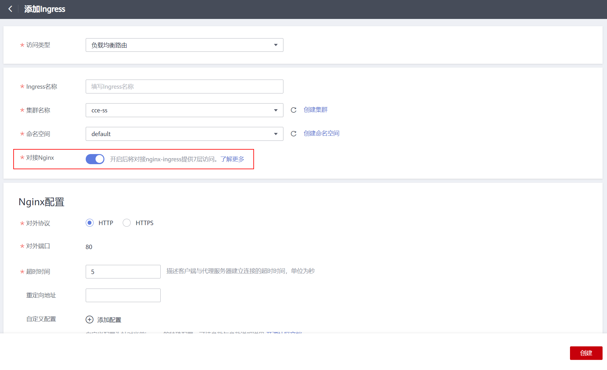

# 通过控制台使用Nginx Ingress

## 前提条件

-   Ingress为后端工作负载提供网络访问，因此集群中需提前部署可用的工作负载。若您无可用工作负载，可参考[创建无状态负载\(Deployment\)](创建无状态负载(Deployment)-40.md)、[创建有状态负载\(StatefulSet\)](创建有状态负载(StatefulSet)-41.md)或[创建守护进程集\(DaemonSet\)](创建守护进程集(DaemonSet)-42.md)部署工作负载。
-   为上述工作负载配置Service，支持的Service类型如[表1](#table032012432142)，可参考[集群内访问\(ClusterIP\)](集群内访问(ClusterIP)-70.md)或[节点访问\(NodePort\)](节点访问(NodePort)-71.md)配置示例Service。
-   添加NginxIngress时，需在集群中提前安装nginx-ingress插件，具体操作可参考[安装插件](nginx-ingress-153.md#section3590245124519)。

**表 1**  支持Service类型

<table><thead align="left"><tr id="row1032054319146"><th class="cellrowborder" valign="top" width="25%" id="mcps1.2.5.1.1">
Ingress类型

</th>
<th class="cellrowborder" valign="top" width="24.959999999999997%" id="mcps1.2.5.1.2">
访问类型

</th>
<th class="cellrowborder" valign="top" width="24.95%" id="mcps1.2.5.1.3">
集群内访问（ClusterIP）

</th>
<th class="cellrowborder" valign="top" width="25.09%" id="mcps1.2.5.1.4">
节点访问（NodePort）

</th>
</tr>
</thead>
<tbody><tr id="row1732015431141"><td class="cellrowborder" rowspan="2" valign="top" width="25%" headers="mcps1.2.5.1.1 ">
ELBIngress

</td>
<td class="cellrowborder" valign="top" width="24.959999999999997%" headers="mcps1.2.5.1.2 ">
负载均衡路由

</td>
<td class="cellrowborder" valign="top" width="24.95%" headers="mcps1.2.5.1.3 ">
不支持

</td>
<td class="cellrowborder" valign="top" width="25.09%" headers="mcps1.2.5.1.4 ">
支持

</td>
</tr>
<tr id="row832014381410"><td class="cellrowborder" valign="top" headers="mcps1.2.5.1.1 ">
ENI负载均衡路由

</td>
<td class="cellrowborder" valign="top" headers="mcps1.2.5.1.2 ">
支持

</td>
<td class="cellrowborder" valign="top" headers="mcps1.2.5.1.3 ">
不支持

</td>
</tr>
<tr id="row9320124313143"><td class="cellrowborder" rowspan="2" valign="top" width="25%" headers="mcps1.2.5.1.1 ">
NginxIngress

</td>
<td class="cellrowborder" valign="top" width="24.959999999999997%" headers="mcps1.2.5.1.2 ">
负载均衡路由

</td>
<td class="cellrowborder" valign="top" width="24.95%" headers="mcps1.2.5.1.3 ">
支持

</td>
<td class="cellrowborder" valign="top" width="25.09%" headers="mcps1.2.5.1.4 ">
支持

</td>
</tr>
<tr id="row16320134361416"><td class="cellrowborder" valign="top" headers="mcps1.2.5.1.1 ">
ENI负载均衡路由

</td>
<td class="cellrowborder" valign="top" headers="mcps1.2.5.1.2 ">
支持

</td>
<td class="cellrowborder" valign="top" headers="mcps1.2.5.1.3 ">
不支持

</td>
</tr>
</tbody>
</table>

## 注意事项

-   **请勿在ELB服务页面修改ELB实例的任何配置，否则将导致服务异常。**如果您已经误操作，请卸载Nginx Ingress插件后重装。
-   Ingress转发策略中注册的URL需与后端应用暴露的URL一致，否则将返回404错误。
-   负载均衡实例需与当前集群处于相同VPC 且为相同公网或私网类型。
-   负载均衡实例需要拥有至少两个监听器配额，且端口80和443没有被监听器占用。

## 添加Nginx Ingress

本节以Nginx作为工作负载并添加Nginx Ingress为例进行说明。

1.  登录CCE控制台。
2.  单击控制台左侧导航栏的“资源管理 \>  网络管理”，进入“Ingress页签”选择对应的集群和命名空间。
3.  单击“添加Ingress”，进入配置页面，如[图1](#fig2041613463518)所示。

    **图 1**  Ingress配置页面  
    

    根据需求设置Ingress参数，关键参数信息如下：

    -   **访问类型**：使用弹性负载均衡器访问服务。
    -   **Ingress名称：**自定义Ingress名称，例如nginx-ingress-demo。
    -   **集群名称：**选择需要添加Ingress的集群。
    -   **命名空间：**选择需要添加Ingress的命名空间。
    -   **对接Nginx：**集群中已安装[nginx-ingress](nginx-ingress-153.md)插件后显示此选项，未安装nginx-ingress模板时本选项不显示。

        单击开启后将对接nginx-ingress提供7层访问，可配置如下参数：

        **表 2**  Nginx配置参数

        
        <table><thead align="left"><tr id="row1152018212415"><th class="cellrowborder" valign="top" width="23.400000000000002%" id="mcps1.2.3.1.1">
参数

        </th>
        <th class="cellrowborder" valign="top" width="76.6%" id="mcps1.2.3.1.2">
参数说明

        </th>
        </tr>
        </thead>
        <tbody><tr id="row10520162117415"><td class="cellrowborder" valign="top" width="23.400000000000002%" headers="mcps1.2.3.1.1 ">
对外协议

        </td>
        <td class="cellrowborder" valign="top" width="76.6%" headers="mcps1.2.3.1.2 ">
支持“HTTP”和“HTTPS”两种协议。

        </td>
        </tr>
        <tr id="row252018211444"><td class="cellrowborder" valign="top" width="23.400000000000002%" headers="mcps1.2.3.1.1 ">
对外端口

        </td>
        <td class="cellrowborder" valign="top" width="76.6%" headers="mcps1.2.3.1.2 ">
安装nginx-ingress插件时预留的监听端口，HTTP为80，HTTPS为443。

        </td>
        </tr>
        <tr id="row1978191961413"><td class="cellrowborder" valign="top" width="23.400000000000002%" headers="mcps1.2.3.1.1 ">
服务器证书

        </td>
        <td class="cellrowborder" valign="top" width="76.6%" headers="mcps1.2.3.1.2 ">
创建HTTPS协议监听时需要绑定IngressTLS类型的密钥证书，以支持HTTPS数据传输加密认证，创建密钥的方法请参见<a href="创建密钥-146.md">创建密钥</a>。

        </td>
        </tr>
        <tr id="row1952062114419"><td class="cellrowborder" valign="top" width="23.400000000000002%" headers="mcps1.2.3.1.1 ">
超时时间

        </td>
        <td class="cellrowborder" valign="top" width="76.6%" headers="mcps1.2.3.1.2 ">
描述客户端与代理服务器建立连接的超时时间。

        </td>
        </tr>
        <tr id="row165215211243"><td class="cellrowborder" valign="top" width="23.400000000000002%" headers="mcps1.2.3.1.1 ">
重定向地址

        </td>
        <td class="cellrowborder" valign="top" width="76.6%" headers="mcps1.2.3.1.2 ">
将所有的内容重定向到指定地址，例如输入"https://www.example.com/"。

        </td>
        </tr>
        <tr id="row65212212410"><td class="cellrowborder" valign="top" width="23.400000000000002%" headers="mcps1.2.3.1.1 ">
自定义配置

        </td>
        <td class="cellrowborder" valign="top" width="76.6%" headers="mcps1.2.3.1.2 ">
以“key: value”形式设置，可通过<a href="https://kubernetes.github.io/ingress-nginx/user-guide/nginx-configuration/annotations/" target="_blank" rel="noopener noreferrer">Annotations</a>查询nginx-ingress支持的配置。

        </td>
        </tr>
        </tbody>
        </table>

    -   **转发策略配置：**请求的访问地址与转发规则匹配时（转发规则由域名、URL组成），此请求将被转发到对应的目标Service处理。单击“添加转发策略“按钮可添加多条转发策略。
        -   域名：实际访问的域名地址。请确保所填写的域名已注册并备案，在Ingress创建完成后，将域名与自动创建的负载均衡实例的IP（即Ingress访问地址的IP部分）绑定。一旦配置了域名规则，则必须使用域名访问。
        -   URL匹配规则：
            -   前缀匹配：例如映射URL为/healthz，只要符合此前缀的URL均可访问。例如/healthz/v1，/healthz/v2。
            -   精确匹配：表示只有URL完全匹配时，访问才能生效。例如映射URL为/healthz，则必须为此URL才能访问。
            -   正则匹配：按正则表达式方式匹配URL。例如正则表达式为**/\[A-Za-z0-9\_.-\]+/test**。只要符合此规则的URL均可访问，例如/abcA9/test，/v1-Ab/test。正则匹配规则支持POSIX与Perl两种标准。

        -   URL：需要注册的访问路径，例如：/healthz。
        -   目标Service：请选择已有Service或新建Service。页面列表中的查询结果已自动过滤不符合要求的Service。
        -   Service访问端口：可选择目标Service的访问端口。
        -   操作：可单击“删除“按钮删除该配置。

4.  配置完成后，单击“创建“。

    创建完成后，在Ingress列表可查看到已添加的Ingress。

## 更新Ingress

您可以在添加完Ingress后，更新此Ingress的端口、域名和路由配置。

> **说明：** 
>在CCE控制台更新Ingress时，负载均衡配置中可更改ELB实例的分配策略类型、会话保持、健康检查等内容，请勿在ELB服务修改相关信息。

1.  登录CCE控制台，在左侧导航栏中选择“资源管理 \> 网络管理”。在**Ingress**页签下，选择对应的集群和命名空间，单击待更新Ingress后方的“更新”。
2.  在“更新Ingress“页面，更新所需参数。
3.  单击“提交”，更新Ingress。

