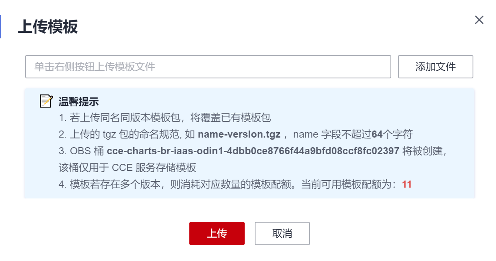

# 通过模板部署应用<a name="cce_10_0146"></a>

在CCE控制台上，您可以上传Helm模板包，然后在控制台安装部署，并对部署的实例进行管理。

> **须知：** 
>CCE从2022年9月开始，各region将逐步切换至Helm v3。模板管理不再支持Helm v2版本的模板，若您在短期内不能切换至Helm v3，可通过Helm v2 客户端在后台管理v2版本的模板。

## 约束与限制<a name="section148624339590"></a>

-   单个用户可以上传模板的个数有限制，请以各个Region控制台界面中提示的实际值为准。
-   CCE使用的Helm版本为v3.8.2，支持上传Helm v3版本语法的模板包。
-   模板若存在多个版本，则消耗对应数量的模板配额。
-   由于模板的操作权限同时具有较高的集群操作权限，因此租户应当谨慎授予用户对于模板生命周期管理的权限，包括上传模板的权限，以及创建、删除和更新模板实例的权限。

## 模板包规范<a name="s8af9336c49a44399865c7a0f3149d789"></a>

以下以redis为例，在准备redis模板包时根据模板包规范制作模板包。

-   **命名要求**

    模板包命名格式为：**\{name\}-\{version\}**.tgz，其中**\{version\}**为版本号，格式为“主版本号.次版本号.修订号”，如redis-0.4.2.tgz。

    > **说明：** 
    >模板名称\{name\}的长度不能超过64个字符。
    >版本号需遵循[语义化版本](https://semver.org/lang/zh-CN/)规则。
    >-   主版本号、次版本号为必选，修订号为可选。
    >-   主版本号、次版本号、修订号的数值为整数，均需要≥0，且≤99。

-   **目录结构**

    模板包的目录结构如下所示：

    ```
    redis/
      templates/
      values.yaml
      README.md
      Chart.yaml
      .helmignore
    ```

    目录说明如[表1](#tb7d789a3467e4fe9b4385a51f3460321)所示，带\*的为必选项：    

    **表 1**  模板包目录说明

    <a name="tb7d789a3467e4fe9b4385a51f3460321"></a>
    <table><thead align="left"><tr id="row6784152135012"><th class="cellrowborder" valign="top" width="22%" id="mcps1.2.3.1.1"><p id="p278413212502"><a name="p278413212502"></a><a name="p278413212502"></a>参数</p>
    </th>
    <th class="cellrowborder" valign="top" width="78%" id="mcps1.2.3.1.2"><p id="p20784621115018"><a name="p20784621115018"></a><a name="p20784621115018"></a>参数说明</p>
    </th>
    </tr>
    </thead>
    <tbody><tr id="row37842210500"><td class="cellrowborder" valign="top" width="22%" headers="mcps1.2.3.1.1 "><p id="p1278432119504"><a name="p1278432119504"></a><a name="p1278432119504"></a>* templates</p>
    </td>
    <td class="cellrowborder" valign="top" width="78%" headers="mcps1.2.3.1.2 "><p id="p478412213502"><a name="p478412213502"></a><a name="p478412213502"></a>用于存放所有的template（模板）文件。</p>
    </td>
    </tr>
    <tr id="row147841721185017"><td class="cellrowborder" valign="top" width="22%" headers="mcps1.2.3.1.1 "><p id="p14784172119501"><a name="p14784172119501"></a><a name="p14784172119501"></a>* values.yaml</p>
    </td>
    <td class="cellrowborder" valign="top" width="78%" headers="mcps1.2.3.1.2 "><p id="p1678472115013"><a name="p1678472115013"></a><a name="p1678472115013"></a>用于描述template文件所需的配置参数。</p>
    <div class="notice" id="note11415171194911"><a name="note11415171194911"></a><a name="note11415171194911"></a><span class="noticetitle"> 须知： </span><div class="noticebody"><p id="p394216481648"><a name="p394216481648"></a><a name="p394216481648"></a>定义template文件配置参数时，请注意此处定义的“镜像地址”务必和容器镜像仓库中对应的镜像地址保持一致。否则创建工作负载会异常，提示镜像拉取失败。</p>
    <p id="p04177113498"><a name="p04177113498"></a><a name="p04177113498"></a>镜像地址获取方法如下：在CCE控制台，单击左侧导航栏的“镜像仓库”，进入容器镜像服务控制台。在“我的镜像 &gt; 自有镜像”中，单击已上传镜像的名称，在“镜像版本 ”页签的“下载指令”栏中即可获取镜像地址，单击<a name="image292113414153"></a><a name="image292113414153"></a><span></span>按钮即可复制该指令。</p>
    </div></div>
    </td>
    </tr>
    <tr id="row1078472120505"><td class="cellrowborder" valign="top" width="22%" headers="mcps1.2.3.1.1 "><p id="p1278411218502"><a name="p1278411218502"></a><a name="p1278411218502"></a>README.md</p>
    </td>
    <td class="cellrowborder" valign="top" width="78%" headers="mcps1.2.3.1.2 "><p id="p10784102115505"><a name="p10784102115505"></a><a name="p10784102115505"></a>一个markdown文件，包括：</p>
    <a name="ul778411210502"></a><a name="ul778411210502"></a><ul id="ul778411210502"><li>描述Chart提供的工作负载或服务。</li><li>运行Chart的前提。</li><li>解释values.yaml文件中的配置。</li><li>安装和配置Chart的相关信息。</li></ul>
    </td>
    </tr>
    <tr id="row1678672116506"><td class="cellrowborder" valign="top" width="22%" headers="mcps1.2.3.1.1 "><p id="p6786162113504"><a name="p6786162113504"></a><a name="p6786162113504"></a>* Chart.yaml</p>
    </td>
    <td class="cellrowborder" valign="top" width="78%" headers="mcps1.2.3.1.2 "><p id="p157289283818"><a name="p157289283818"></a><a name="p157289283818"></a>模板的基本信息说明。</p>
    <p id="p278615212501"><a name="p278615212501"></a><a name="p278615212501"></a>注：Helm v3版本apiVersion从v1切换到了v2。</p>
    </td>
    </tr>
    <tr id="row97861621175015"><td class="cellrowborder" valign="top" width="22%" headers="mcps1.2.3.1.1 "><p id="p6786921165010"><a name="p6786921165010"></a><a name="p6786921165010"></a>.helmignore</p>
    </td>
    <td class="cellrowborder" valign="top" width="78%" headers="mcps1.2.3.1.2 "><p id="p07861721145013"><a name="p07861721145013"></a><a name="p07861721145013"></a>设定在工作负载安装时不需要读取templates的某些文件或数据。</p>
    </td>
    </tr>
    </tbody>
    </table>


## 上传模板<a name="section62601733171011"></a>

1.  登录CCE控制台，单击集群名称进入集群，在左侧导航栏中选择“模板管理“，在右上角单击“上传模板“。
2.  单击“添加文件”，选中待上传的工作负载包后，单击“上传”。

    **图 1**  上传模板包<a name="fig1029711912716"></a>  
    

    > **说明：** 
    >由于上传模板时创建OBS桶的命名规则由cce-charts-\{region\}-**\{domain\_name\}**变为cce-charts-\{region\}-**\{domain\_id\}**，其中旧命名规则中的domain\_name系统会做base64转化并取前63位，如果您在现有命名规则的OBS桶中找不到模板，请在旧命名规则的桶中进行查找。


## 创建模板实例<a name="s94388d41fe234fba81844802bc682fb8"></a>

1.  登录CCE控制台，单击集群名称进入集群，在左侧导航栏中选择“模板管理“。
2.  在已上传的模板中，单击“安装“。
3.  参照[表2](#t26bc1c499f114b5185e5edcf61e44d95)设置安装工作负载参数。

    **表 2**  安装工作负载参数说明

    <a name="t26bc1c499f114b5185e5edcf61e44d95"></a>
    <table><thead align="left"><tr id="rbf609a3fcf2445d2b6d59cbcca7f75b3"><th class="cellrowborder" valign="top" width="23%" id="mcps1.2.3.1.1"><p id="a24b59ed54e3e49a7abefd7528912fb26"><a name="a24b59ed54e3e49a7abefd7528912fb26"></a><a name="a24b59ed54e3e49a7abefd7528912fb26"></a>参数</p>
    </th>
    <th class="cellrowborder" valign="top" width="77%" id="mcps1.2.3.1.2"><p id="a48e24994d5e7491782edce936fd59c1a"><a name="a48e24994d5e7491782edce936fd59c1a"></a><a name="a48e24994d5e7491782edce936fd59c1a"></a>参数说明</p>
    </th>
    </tr>
    </thead>
    <tbody><tr id="r4199465b1b1a4b31b17eac511ff9c594"><td class="cellrowborder" valign="top" width="23%" headers="mcps1.2.3.1.1 "><p id="a010899bea1f349bdad1eef099e4fa486"><a name="a010899bea1f349bdad1eef099e4fa486"></a><a name="a010899bea1f349bdad1eef099e4fa486"></a>实例名称</p>
    </td>
    <td class="cellrowborder" valign="top" width="77%" headers="mcps1.2.3.1.2 "><p id="a0153652b843848a3b6bdad99e3c3b39f"><a name="a0153652b843848a3b6bdad99e3c3b39f"></a><a name="a0153652b843848a3b6bdad99e3c3b39f"></a>新建模板实例名称，命名必须唯一。</p>
    </td>
    </tr>
    <tr id="rbd79869126dd476ba89ebd3a3103af0c"><td class="cellrowborder" valign="top" width="23%" headers="mcps1.2.3.1.1 "><p id="zh-cn_topic_0093297948_p441405163731"><a name="zh-cn_topic_0093297948_p441405163731"></a><a name="zh-cn_topic_0093297948_p441405163731"></a>命名空间</p>
    </td>
    <td class="cellrowborder" valign="top" width="77%" headers="mcps1.2.3.1.2 "><p id="a29df703802f0429a96ce7e488e7b6376"><a name="a29df703802f0429a96ce7e488e7b6376"></a><a name="a29df703802f0429a96ce7e488e7b6376"></a>指定部署的命名空间。</p>
    </td>
    </tr>
    <tr id="row546905872315"><td class="cellrowborder" valign="top" width="23%" headers="mcps1.2.3.1.1 "><p id="p1066772202416"><a name="p1066772202416"></a><a name="p1066772202416"></a>选择版本</p>
    </td>
    <td class="cellrowborder" valign="top" width="77%" headers="mcps1.2.3.1.2 "><p id="p9667192182418"><a name="p9667192182418"></a><a name="p9667192182418"></a>选择模板的版本。</p>
    </td>
    </tr>
    <tr id="r70f26452e7574784b0bcc4fa28655e23"><td class="cellrowborder" valign="top" width="23%" headers="mcps1.2.3.1.1 "><p id="ae76aa7c5d99b4e378bf694b82b9e5dc5"><a name="ae76aa7c5d99b4e378bf694b82b9e5dc5"></a><a name="ae76aa7c5d99b4e378bf694b82b9e5dc5"></a>配置文件</p>
    </td>
    <td class="cellrowborder" valign="top" width="77%" headers="mcps1.2.3.1.2 "><p id="a303f5e86580c4fa29c238785c98ea8ce"><a name="a303f5e86580c4fa29c238785c98ea8ce"></a><a name="a303f5e86580c4fa29c238785c98ea8ce"></a>用户可以导入values.yaml文件，导入后可替换模板包中的values.yaml文件；也可直接在配置框中在线编辑模板参数。</p>
    <div class="note" id="na1d8e395109d472699025c5118ef563d"><a name="na1d8e395109d472699025c5118ef563d"></a><a name="na1d8e395109d472699025c5118ef563d"></a><span class="notetitle"> 说明： </span><div class="notebody"><p class="textintable" id="a428d67dfa7aa45e99ea2cc24c467e433"><a name="a428d67dfa7aa45e99ea2cc24c467e433"></a><a name="a428d67dfa7aa45e99ea2cc24c467e433"></a>此处导入的values.yaml文件需符合yaml规范，即KEY:VALUE格式。对于文件中的字段不做任何限制。</p>
    <p id="p112003015566"><a name="p112003015566"></a><a name="p112003015566"></a>导入的value.yaml的key值必须与所选的模板包的values.yaml保持一致，否则不会生效。即key不能修改。</p>
    </div></div>
    <a name="o62d8e522faae46b79e270230405ddf10"></a><a name="o62d8e522faae46b79e270230405ddf10"></a><ol id="o62d8e522faae46b79e270230405ddf10"><li>单击<span class="uicontrol" id="uicontrol18345437152617"><a name="uicontrol18345437152617"></a><a name="uicontrol18345437152617"></a>“添加文件”</span>。</li><li>选择对应的values.yaml文件，单击<span class="uicontrol" id="uicontrol7453165122611"><a name="uicontrol7453165122611"></a><a name="uicontrol7453165122611"></a>“打开”</span>。</li></ol>
    </td>
    </tr>
    </tbody>
    </table>

4.  配置完成后，单击“安装“。

    在“模板实例“页签下可以查看模板实例的安装情况。


## 升级模板工作负载<a name="section5324101171010"></a>

1.  登录CCE控制台，单击集群名称进入集群，在左侧导航栏中选择“模板管理“，在右侧选择“模板实例“页签。
2.  单击待升级工作负载后的“升级”，设置升级模板工作负载的参数。
3.  选择对应的模板版本。
4.  参照界面提示修改模板参数。单击“升级”，再单击“提交”。
5.  单击“返回模板实例列表“，模板状态为“升级成功”时，表明工作负载升级成功。

## 回退模板工作负载<a name="section13251511191012"></a>

1.  登录CCE控制台，单击集群名称进入集群，在左侧导航栏中选择“模板管理“，在右侧选择“模板实例“页签。
2.  单击待回退工作负载后的“回退”，选择要回退的工作负载版本，单击“回退”。

    模板工作负载列表中，状态为“回退成功”时，表明工作负载回退成功。


## 卸载模板工作负载<a name="section15325151161011"></a>

1.  登录CCE控制台，单击集群名称进入集群，在左侧导航栏中选择“模板管理“，在右侧选择“模板实例“页签。
2.  单击待卸载模板实例后的“更多 \> 卸载”，确认待卸载模板实例后，单击“是”。模板实例卸载后不能恢复，请谨慎操作。

