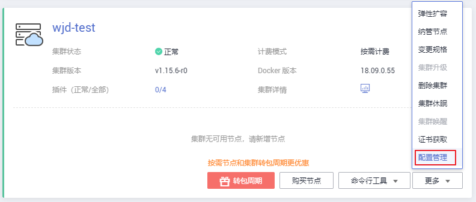

# 配置管理

为方便对CCE集群中的kubernetes配置参数进行管理，华为云开发了配置管理功能，通过该功能您可以对核心组件进行深度配置。

## 约束与限制

本功能仅支持在**v1.15及以上版本**的集群中使用，V1.15以下版本不显示该功能。

## 操作步骤

1.  登录[CCE控制台](https://console.huaweicloud.com/cce2.0/?utm_source=helpcenter)，在左侧导航栏中选择“资源管理 \> 集群管理”。
2.  单击集群后的“更多 \> 配置管理“。

    **图 1**  配置管理  
    

3.  在侧边栏滑出的“配置管理“窗口中，根据业务需求修改Kubernetes的参数值：

    **表 1**  配置管理参数

    
    <table><thead align="left"><tr id="row1653411231576"><th class="cellrowborder" valign="top" width="18.81811818818118%" id="mcps1.2.5.1.1">
组件

    </th>
    <th class="cellrowborder" valign="top" width="28.22717728227177%" id="mcps1.2.5.1.2">
参数

    </th>
    <th class="cellrowborder" valign="top" width="35.83641635836416%" id="mcps1.2.5.1.3">
详情

    </th>
    <th class="cellrowborder" valign="top" width="17.11828817118288%" id="mcps1.2.5.1.4">
取值

    </th>
    </tr>
    </thead>
    <tbody><tr id="row423504023719"><td class="cellrowborder" rowspan="5" valign="top" width="18.81811818818118%" headers="mcps1.2.5.1.1 ">
kube-apiserver

    </td>
    <td class="cellrowborder" valign="top" width="28.22717728227177%" headers="mcps1.2.5.1.2 ">
default-not-ready-toleration-seconds

    </td>
    <td class="cellrowborder" valign="top" width="35.83641635836416%" headers="mcps1.2.5.1.3 ">
notReady容忍时间，NoExecute that is added by default to every pod that does not already have such a toleration.

    </td>
    <td class="cellrowborder" valign="top" width="17.11828817118288%" headers="mcps1.2.5.1.4 ">
默认：300

    </td>
    </tr>
    <tr id="row11235144013371"><td class="cellrowborder" valign="top" headers="mcps1.2.5.1.1 ">
default-unreachable-toleration-seconds

    </td>
    <td class="cellrowborder" valign="top" headers="mcps1.2.5.1.2 ">
unreachable容忍时间，NoExecute that is added by default to every pod that does not already have such a toleration.

    </td>
    <td class="cellrowborder" valign="top" headers="mcps1.2.5.1.3 ">
默认：300

    </td>
    </tr>
    <tr id="row112351240143715"><td class="cellrowborder" valign="top" headers="mcps1.2.5.1.1 ">
max-mutating-requests-inflight

    </td>
    <td class="cellrowborder" valign="top" headers="mcps1.2.5.1.2 ">
在给定时间内的最大mutating请求数。 当服务器超过此值时，它会拒绝请求。

    
0表示无限制。

    </td>
    <td class="cellrowborder" valign="top" headers="mcps1.2.5.1.3 ">
默认：1000

    </td>
    </tr>
    <tr id="row2832133434914"><td class="cellrowborder" valign="top" headers="mcps1.2.5.1.1 ">
max-requests-inflight

    </td>
    <td class="cellrowborder" valign="top" headers="mcps1.2.5.1.2 ">
在给定时间内的最大 non-mutating 请求数。 当服务器超过此值时，它会拒绝请求。

    
0表示无限制。

    </td>
    <td class="cellrowborder" valign="top" headers="mcps1.2.5.1.3 ">
默认：2000

    </td>
    </tr>
    <tr id="row1235940123713"><td class="cellrowborder" valign="top" headers="mcps1.2.5.1.1 ">
service-node-port-range

    </td>
    <td class="cellrowborder" valign="top" headers="mcps1.2.5.1.2 ">
nodeport 端口范围

    </td>
    <td class="cellrowborder" valign="top" headers="mcps1.2.5.1.3 ">
默认：

    
30000-32767

    
取值范围：

    
min≥30000

    
max≤65535

    </td>
    </tr>
    <tr id="row423534010377"><td class="cellrowborder" rowspan="12" valign="top" width="18.81811818818118%" headers="mcps1.2.5.1.1 ">
kube-controller-manager

    </td>
    <td class="cellrowborder" valign="top" width="28.22717728227177%" headers="mcps1.2.5.1.2 ">
concurrent-deployment-syncs

    </td>
    <td class="cellrowborder" valign="top" width="35.83641635836416%" headers="mcps1.2.5.1.3 ">
deployment的并发处理数

    </td>
    <td class="cellrowborder" valign="top" width="17.11828817118288%" headers="mcps1.2.5.1.4 ">
默认：5

    </td>
    </tr>
    <tr id="row11235540113710"><td class="cellrowborder" valign="top" headers="mcps1.2.5.1.1 ">
concurrent-endpoint-syncs

    </td>
    <td class="cellrowborder" valign="top" headers="mcps1.2.5.1.2 ">
endpoint的并发处理数

    </td>
    <td class="cellrowborder" valign="top" headers="mcps1.2.5.1.3 ">
默认：5

    </td>
    </tr>
    <tr id="row19235134093716"><td class="cellrowborder" valign="top" headers="mcps1.2.5.1.1 ">
concurrent-gc-syncs

    </td>
    <td class="cellrowborder" valign="top" headers="mcps1.2.5.1.2 ">
garbage collector的并发数

    </td>
    <td class="cellrowborder" valign="top" headers="mcps1.2.5.1.3 ">
默认：20

    </td>
    </tr>
    <tr id="row11235140113712"><td class="cellrowborder" valign="top" headers="mcps1.2.5.1.1 ">
concurrent-namespace-syncs

    </td>
    <td class="cellrowborder" valign="top" headers="mcps1.2.5.1.2 ">
namespace的并发处理数

    </td>
    <td class="cellrowborder" valign="top" headers="mcps1.2.5.1.3 ">
默认：10

    </td>
    </tr>
    <tr id="row17235174063715"><td class="cellrowborder" valign="top" headers="mcps1.2.5.1.1 ">
concurrent-replicaset-syncs

    </td>
    <td class="cellrowborder" valign="top" headers="mcps1.2.5.1.2 ">
replicaset的并发处理数

    </td>
    <td class="cellrowborder" valign="top" headers="mcps1.2.5.1.3 ">
默认：5

    </td>
    </tr>
    <tr id="row32350405377"><td class="cellrowborder" valign="top" headers="mcps1.2.5.1.1 ">
concurrent-resource-quota-syncs

    </td>
    <td class="cellrowborder" valign="top" headers="mcps1.2.5.1.2 ">
resource quota的并发处理数

    </td>
    <td class="cellrowborder" valign="top" headers="mcps1.2.5.1.3 ">
默认：5

    </td>
    </tr>
    <tr id="row14235184015375"><td class="cellrowborder" valign="top" headers="mcps1.2.5.1.1 ">
concurrent-service-syncs

    </td>
    <td class="cellrowborder" valign="top" headers="mcps1.2.5.1.2 ">
service的并发处理数

    </td>
    <td class="cellrowborder" valign="top" headers="mcps1.2.5.1.3 ">
默认：10

    </td>
    </tr>
    <tr id="row16235134063718"><td class="cellrowborder" valign="top" headers="mcps1.2.5.1.1 ">
concurrent-serviceaccount-token-syncs

    </td>
    <td class="cellrowborder" valign="top" headers="mcps1.2.5.1.2 ">
serviceaccount-token的并发处理数

    </td>
    <td class="cellrowborder" valign="top" headers="mcps1.2.5.1.3 ">
默认：5

    </td>
    </tr>
    <tr id="row72351340183713"><td class="cellrowborder" valign="top" headers="mcps1.2.5.1.1 ">
concurrent-ttl-after-finished-syncs

    </td>
    <td class="cellrowborder" valign="top" headers="mcps1.2.5.1.2 ">
ttl-after-finished的并发处理数

    </td>
    <td class="cellrowborder" valign="top" headers="mcps1.2.5.1.3 ">
默认：5

    </td>
    </tr>
    <tr id="row12235164083715"><td class="cellrowborder" valign="top" headers="mcps1.2.5.1.1 ">
concurrent_rc_syncs

    </td>
    <td class="cellrowborder" valign="top" headers="mcps1.2.5.1.2 ">
rc的并发处理数

    </td>
    <td class="cellrowborder" valign="top" headers="mcps1.2.5.1.3 ">
默认：5

    </td>
    </tr>
    <tr id="row42356400377"><td class="cellrowborder" valign="top" headers="mcps1.2.5.1.1 ">
kube-api-qps

    </td>
    <td class="cellrowborder" valign="top" headers="mcps1.2.5.1.2 ">
与kube-apiserver通信的qps

    </td>
    <td class="cellrowborder" valign="top" headers="mcps1.2.5.1.3 ">
默认：100

    </td>
    </tr>
    <tr id="row16235740153717"><td class="cellrowborder" valign="top" headers="mcps1.2.5.1.1 ">
kube-api-burst

    </td>
    <td class="cellrowborder" valign="top" headers="mcps1.2.5.1.2 ">
与kube-apiserver通信的burst

    </td>
    <td class="cellrowborder" valign="top" headers="mcps1.2.5.1.3 ">
默认：100

    </td>
    </tr>
    <tr id="row8235140133713"><td class="cellrowborder" rowspan="2" valign="top" width="18.81811818818118%" headers="mcps1.2.5.1.1 ">
kube-scheduler

    </td>
    <td class="cellrowborder" valign="top" width="28.22717728227177%" headers="mcps1.2.5.1.2 ">
kube-api-qps

    </td>
    <td class="cellrowborder" valign="top" width="35.83641635836416%" headers="mcps1.2.5.1.3 ">
与kube-apiserver通信的qps

    </td>
    <td class="cellrowborder" valign="top" width="17.11828817118288%" headers="mcps1.2.5.1.4 ">
默认：100

    </td>
    </tr>
    <tr id="row1323515403372"><td class="cellrowborder" valign="top" headers="mcps1.2.5.1.1 ">
kube-api-burst

    </td>
    <td class="cellrowborder" valign="top" headers="mcps1.2.5.1.2 ">
与kube-apiserver通信的burst

    </td>
    <td class="cellrowborder" valign="top" headers="mcps1.2.5.1.3 ">
默认：100

    </td>
    </tr>
    </tbody>
    </table>

4.  单击“确定“，完成配置操作。

## 参考链接

-   [kube-apiserver](https://v1-15.docs.kubernetes.io/docs/reference/command-line-tools-reference/kube-apiserver)
-   [kube-controller-manager](https://v1-15.docs.kubernetes.io/docs/reference/command-line-tools-reference/kube-controller-manager)
-   [kube-scheduler](https://v1-15.docs.kubernetes.io/docs/reference/command-line-tools-reference/kube-scheduler)

