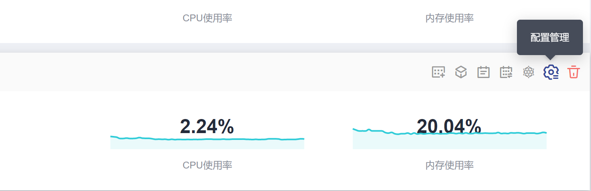

# 配置管理

## 操作场景

CCE集群支持对kubernetes配置参数进行管理，通过该功能您可以对核心组件进行深度配置。

## 约束与限制

本功能仅支持在**v1.15及以上版本**的集群中使用，V1.15以下版本不显示该功能。

## 操作步骤

1.  登录CCE控制台，在左侧导航栏中选择“集群管理“。
2.  单击集群后的。

    **图 1**  配置管理  
    

3.  在侧边栏滑出的“配置管理“窗口中，根据业务需求修改Kubernetes的参数值：

    **表 1**  external-controller-manager组件参数

    
    <table><thead align="left"><tr id="row1782665095518"><th class="cellrowborder" valign="top" width="34.77%" id="mcps1.2.4.1.1">
参数

    </th>
    <th class="cellrowborder" valign="top" width="44.14%" id="mcps1.2.4.1.2">
详情

    </th>
    <th class="cellrowborder" valign="top" width="21.09%" id="mcps1.2.4.1.3">
取值

    </th>
    </tr>
    </thead>
    <tbody><tr id="row24681332145717"><td class="cellrowborder" valign="top" width="34.77%" headers="mcps1.2.4.1.1 ">
enable-resource-quota

    </td>
    <td class="cellrowborder" valign="top" width="44.14%" headers="mcps1.2.4.1.2 ">
创建namespace时是否自动创建resourcequota对象。

    <ul id="ul193813461677"><li>false：不自动创建resourcequota对象。</li><li>true：自动创建resourcequota对象。resourcequota的默认取值请参见<a href="设置资源配额及限制.md">设置资源配额及限制</a>。</li></ul>
    </td>
    <td class="cellrowborder" valign="top" width="21.09%" headers="mcps1.2.4.1.3 ">
默认：false

    </td>
    </tr>
    </tbody>
    </table>

    **表 2**  kube-apiserver组件参数

    
    <table><thead align="left"><tr id="row6905141362416"><th class="cellrowborder" valign="top" width="34.77%" id="mcps1.2.4.1.1">
参数

    </th>
    <th class="cellrowborder" valign="top" width="44.14%" id="mcps1.2.4.1.2">
详情

    </th>
    <th class="cellrowborder" valign="top" width="21.09%" id="mcps1.2.4.1.3">
取值

    </th>
    </tr>
    </thead>
    <tbody><tr id="row6906151392420"><td class="cellrowborder" valign="top" width="34.77%" headers="mcps1.2.4.1.1 ">
default-not-ready-toleration-seconds

    </td>
    <td class="cellrowborder" valign="top" width="44.14%" headers="mcps1.2.4.1.2 ">
notReady容忍时间，NoExecute that is added by default to every pod that does not already have such a toleration.

    </td>
    <td class="cellrowborder" valign="top" width="21.09%" headers="mcps1.2.4.1.3 ">
默认：300s

    </td>
    </tr>
    <tr id="row5906171352418"><td class="cellrowborder" valign="top" width="34.77%" headers="mcps1.2.4.1.1 ">
default-unreachable-toleration-seconds

    </td>
    <td class="cellrowborder" valign="top" width="44.14%" headers="mcps1.2.4.1.2 ">
unreachable容忍时间，NoExecute that is added by default to every pod that does not already have such a toleration.

    </td>
    <td class="cellrowborder" valign="top" width="21.09%" headers="mcps1.2.4.1.3 ">
默认：300s

    </td>
    </tr>
    <tr id="row2090781322411"><td class="cellrowborder" valign="top" width="34.77%" headers="mcps1.2.4.1.1 ">
max-mutating-requests-inflight

    </td>
    <td class="cellrowborder" valign="top" width="44.14%" headers="mcps1.2.4.1.2 ">
最大mutating并发请求数。 当服务器超过此值时，它会拒绝请求。

    
0表示无限制。

    
从1.21版本开始不再支持手动配置，根据集群规格自动配置如下：

    <ul id="ul1906171317249"><li>50和200节点：200</li><li>1000节点：500</li><li>2000节点：1000</li></ul>
    </td>
    <td class="cellrowborder" valign="top" width="21.09%" headers="mcps1.2.4.1.3 ">
默认：1000

    </td>
    </tr>
    <tr id="row2907181302414"><td class="cellrowborder" valign="top" width="34.77%" headers="mcps1.2.4.1.1 ">
max-requests-inflight

    </td>
    <td class="cellrowborder" valign="top" width="44.14%" headers="mcps1.2.4.1.2 ">
最大non-mutating并发请求数。 当服务器超过此值时，它会拒绝请求。

    
0表示无限制。

    
从1.21版本开始不再支持手动配置，根据集群规格自动配置如下：

    <ul id="ul4907161372410"><li>50和200节点：400</li><li>1000节点：1000</li><li>2000节点：2000</li></ul>
    </td>
    <td class="cellrowborder" valign="top" width="21.09%" headers="mcps1.2.4.1.3 ">
默认：2000

    </td>
    </tr>
    <tr id="row15907181352414"><td class="cellrowborder" valign="top" width="34.77%" headers="mcps1.2.4.1.1 ">
service-node-port-range

    </td>
    <td class="cellrowborder" valign="top" width="44.14%" headers="mcps1.2.4.1.2 ">
nodeport端口范围

    </td>
    <td class="cellrowborder" valign="top" width="21.09%" headers="mcps1.2.4.1.3 ">
默认：

    
30000-32767

    
取值范围：

    
min&gt;20105

    
max&lt;32768

    </td>
    </tr>
    </tbody>
    </table>

    **表 3**  kube-controller-manager组件参数

    
    <table><thead align="left"><tr id="row1999444916256"><th class="cellrowborder" valign="top" width="34.77%" id="mcps1.2.4.1.1">
参数

    </th>
    <th class="cellrowborder" valign="top" width="44.14%" id="mcps1.2.4.1.2">
详情

    </th>
    <th class="cellrowborder" valign="top" width="21.09%" id="mcps1.2.4.1.3">
取值

    </th>
    </tr>
    </thead>
    <tbody><tr id="row18996174913258"><td class="cellrowborder" valign="top" width="34.77%" headers="mcps1.2.4.1.1 ">
concurrent-deployment-syncs

    </td>
    <td class="cellrowborder" valign="top" width="44.14%" headers="mcps1.2.4.1.2 ">
deployment的并发处理数

    </td>
    <td class="cellrowborder" valign="top" width="21.09%" headers="mcps1.2.4.1.3 ">
默认：5

    </td>
    </tr>
    <tr id="row169961649142518"><td class="cellrowborder" valign="top" width="34.77%" headers="mcps1.2.4.1.1 ">
concurrent-endpoint-syncs

    </td>
    <td class="cellrowborder" valign="top" width="44.14%" headers="mcps1.2.4.1.2 ">
endpoint的并发处理数

    </td>
    <td class="cellrowborder" valign="top" width="21.09%" headers="mcps1.2.4.1.3 ">
默认：5

    </td>
    </tr>
    <tr id="row59961149132519"><td class="cellrowborder" valign="top" width="34.77%" headers="mcps1.2.4.1.1 ">
concurrent-gc-syncs

    </td>
    <td class="cellrowborder" valign="top" width="44.14%" headers="mcps1.2.4.1.2 ">
garbage collector的并发数

    </td>
    <td class="cellrowborder" valign="top" width="21.09%" headers="mcps1.2.4.1.3 ">
默认：20

    </td>
    </tr>
    <tr id="row6997349132519"><td class="cellrowborder" valign="top" width="34.77%" headers="mcps1.2.4.1.1 ">
concurrent-job-syncs

    </td>
    <td class="cellrowborder" valign="top" width="44.14%" headers="mcps1.2.4.1.2 ">
允许同时同步的作业对象的数量。

    </td>
    <td class="cellrowborder" valign="top" width="21.09%" headers="mcps1.2.4.1.3 ">
默认：5

    </td>
    </tr>
    <tr id="row149972491256"><td class="cellrowborder" valign="top" width="34.77%" headers="mcps1.2.4.1.1 ">
concurrent-namespace-syncs

    </td>
    <td class="cellrowborder" valign="top" width="44.14%" headers="mcps1.2.4.1.2 ">
namespace的并发处理数

    </td>
    <td class="cellrowborder" valign="top" width="21.09%" headers="mcps1.2.4.1.3 ">
默认：10

    </td>
    </tr>
    <tr id="row179973496254"><td class="cellrowborder" valign="top" width="34.77%" headers="mcps1.2.4.1.1 ">
concurrent-replicaset-syncs

    </td>
    <td class="cellrowborder" valign="top" width="44.14%" headers="mcps1.2.4.1.2 ">
replicaset的并发处理数

    </td>
    <td class="cellrowborder" valign="top" width="21.09%" headers="mcps1.2.4.1.3 ">
默认：5

    </td>
    </tr>
    <tr id="row129972494251"><td class="cellrowborder" valign="top" width="34.77%" headers="mcps1.2.4.1.1 ">
concurrent-resource-quota-syncs

    </td>
    <td class="cellrowborder" valign="top" width="44.14%" headers="mcps1.2.4.1.2 ">
resource quota的并发处理数

    </td>
    <td class="cellrowborder" valign="top" width="21.09%" headers="mcps1.2.4.1.3 ">
默认：5

    </td>
    </tr>
    <tr id="row3997114942511"><td class="cellrowborder" valign="top" width="34.77%" headers="mcps1.2.4.1.1 ">
concurrent-service-syncs

    </td>
    <td class="cellrowborder" valign="top" width="44.14%" headers="mcps1.2.4.1.2 ">
service的并发处理数

    </td>
    <td class="cellrowborder" valign="top" width="21.09%" headers="mcps1.2.4.1.3 ">
默认：10

    </td>
    </tr>
    <tr id="row59971449102512"><td class="cellrowborder" valign="top" width="34.77%" headers="mcps1.2.4.1.1 ">
concurrent-serviceaccount-token-syncs

    </td>
    <td class="cellrowborder" valign="top" width="44.14%" headers="mcps1.2.4.1.2 ">
serviceaccount-token的并发处理数

    </td>
    <td class="cellrowborder" valign="top" width="21.09%" headers="mcps1.2.4.1.3 ">
默认：5

    </td>
    </tr>
    <tr id="row599834916256"><td class="cellrowborder" valign="top" width="34.77%" headers="mcps1.2.4.1.1 ">
concurrent-ttl-after-finished-syncs

    </td>
    <td class="cellrowborder" valign="top" width="44.14%" headers="mcps1.2.4.1.2 ">
ttl-after-finished的并发处理数

    </td>
    <td class="cellrowborder" valign="top" width="21.09%" headers="mcps1.2.4.1.3 ">
默认：5

    </td>
    </tr>
    <tr id="row1799817495255"><td class="cellrowborder" valign="top" width="34.77%" headers="mcps1.2.4.1.1 ">
concurrent_rc_syncs

    </td>
    <td class="cellrowborder" valign="top" width="44.14%" headers="mcps1.2.4.1.2 ">
rc的并发处理数

    </td>
    <td class="cellrowborder" valign="top" width="21.09%" headers="mcps1.2.4.1.3 ">
默认：5

    </td>
    </tr>
    <tr id="row899894932519"><td class="cellrowborder" valign="top" width="34.77%" headers="mcps1.2.4.1.1 ">
horizontal-pod-autoscaler-sync-period

    </td>
    <td class="cellrowborder" valign="top" width="44.14%" headers="mcps1.2.4.1.2 ">
集群弹性计算的周期

    </td>
    <td class="cellrowborder" valign="top" width="21.09%" headers="mcps1.2.4.1.3 ">
默认：15s

    </td>
    </tr>
    <tr id="row1399810497250"><td class="cellrowborder" valign="top" width="34.77%" headers="mcps1.2.4.1.1 ">
kube-api-qps

    </td>
    <td class="cellrowborder" valign="top" width="44.14%" headers="mcps1.2.4.1.2 ">
与kube-apiserver通信的qps

    </td>
    <td class="cellrowborder" valign="top" width="21.09%" headers="mcps1.2.4.1.3 ">
默认：100

    </td>
    </tr>
    <tr id="row999824912254"><td class="cellrowborder" valign="top" width="34.77%" headers="mcps1.2.4.1.1 ">
kube-api-burst

    </td>
    <td class="cellrowborder" valign="top" width="44.14%" headers="mcps1.2.4.1.2 ">
与kube-apiserver通信的burst

    </td>
    <td class="cellrowborder" valign="top" width="21.09%" headers="mcps1.2.4.1.3 ">
默认：100

    </td>
    </tr>
    <tr id="row399894912515"><td class="cellrowborder" valign="top" width="34.77%" headers="mcps1.2.4.1.1 ">
terminated-pod-gc-threshold

    </td>
    <td class="cellrowborder" valign="top" width="44.14%" headers="mcps1.2.4.1.2 ">
在Pod GC开始删除终止Pod之前，可以存在的terminated状态Pod数量。

    
如果&lt;=0，则禁用终止的Pod GC。

    </td>
    <td class="cellrowborder" valign="top" width="21.09%" headers="mcps1.2.4.1.3 ">
默认：1000

    </td>
    </tr>
    </tbody>
    </table>

    **表 4**  kube-scheduler组件参数

    
    <table><thead align="left"><tr id="row14343132320274"><th class="cellrowborder" valign="top" width="34.77%" id="mcps1.2.4.1.1">
参数

    </th>
    <th class="cellrowborder" valign="top" width="44.14%" id="mcps1.2.4.1.2">
详情

    </th>
    <th class="cellrowborder" valign="top" width="21.09%" id="mcps1.2.4.1.3">
取值

    </th>
    </tr>
    </thead>
    <tbody><tr id="row113471723152717"><td class="cellrowborder" valign="top" width="34.77%" headers="mcps1.2.4.1.1 ">
kube-api-qps

    </td>
    <td class="cellrowborder" valign="top" width="44.14%" headers="mcps1.2.4.1.2 ">
与kube-apiserver通信的qps

    </td>
    <td class="cellrowborder" valign="top" width="21.09%" headers="mcps1.2.4.1.3 ">
默认：100

    </td>
    </tr>
    <tr id="row73472023162715"><td class="cellrowborder" valign="top" width="34.77%" headers="mcps1.2.4.1.1 ">
kube-api-burst

    </td>
    <td class="cellrowborder" valign="top" width="44.14%" headers="mcps1.2.4.1.2 ">
与kube-apiserver通信的burst

    </td>
    <td class="cellrowborder" valign="top" width="21.09%" headers="mcps1.2.4.1.3 ">
默认：100

    </td>
    </tr>
    </tbody>
    </table>

    **表 5**  eni组件参数

    
    <table><thead align="left"><tr id="row11919203482717"><th class="cellrowborder" valign="top" width="34.949999999999996%" id="mcps1.2.4.1.1">
参数

    </th>
    <th class="cellrowborder" valign="top" width="43.79%" id="mcps1.2.4.1.2">
详情

    </th>
    <th class="cellrowborder" valign="top" width="21.26%" id="mcps1.2.4.1.3">
取值

    </th>
    </tr>
    </thead>
    <tbody><tr id="row19191034202714"><td class="cellrowborder" valign="top" width="34.949999999999996%" headers="mcps1.2.4.1.1 ">
nic-minimum-target

    </td>
    <td class="cellrowborder" valign="top" width="43.79%" headers="mcps1.2.4.1.2 ">
集群级别节点最少绑定网卡数

    </td>
    <td class="cellrowborder" valign="top" width="21.26%" headers="mcps1.2.4.1.3 ">
默认：10

    </td>
    </tr>
    <tr id="row9920113419279"><td class="cellrowborder" valign="top" width="34.949999999999996%" headers="mcps1.2.4.1.1 ">
nic-warm-target

    </td>
    <td class="cellrowborder" valign="top" width="43.79%" headers="mcps1.2.4.1.2 ">
集群级别节点动态预热网卡数

    </td>
    <td class="cellrowborder" valign="top" width="21.26%" headers="mcps1.2.4.1.3 ">
默认：2

    </td>
    </tr>
    <tr id="row199209349270"><td class="cellrowborder" valign="top" width="34.949999999999996%" headers="mcps1.2.4.1.1 ">
prebound-subeni-percentage

    </td>
    <td class="cellrowborder" valign="top" width="43.79%" headers="mcps1.2.4.1.2 ">
节点绑定网卡数低水位:节点绑定网卡数高水位

    </td>
    <td class="cellrowborder" valign="top" width="21.26%" headers="mcps1.2.4.1.3 ">
默认：0:0

    </td>
    </tr>
    </tbody>
    </table>

4.  单击“确定“，完成配置操作。

## 参考链接

-   [kube-apiserver](https://kubernetes.io/zh/docs/reference/command-line-tools-reference/kube-apiserver/)
-   [kube-controller-manager](https://kubernetes.io/docs/reference/command-line-tools-reference/kube-controller-manager/)
-   [kube-scheduler](https://kubernetes.io/zh/docs/reference/command-line-tools-reference/kube-scheduler/)

