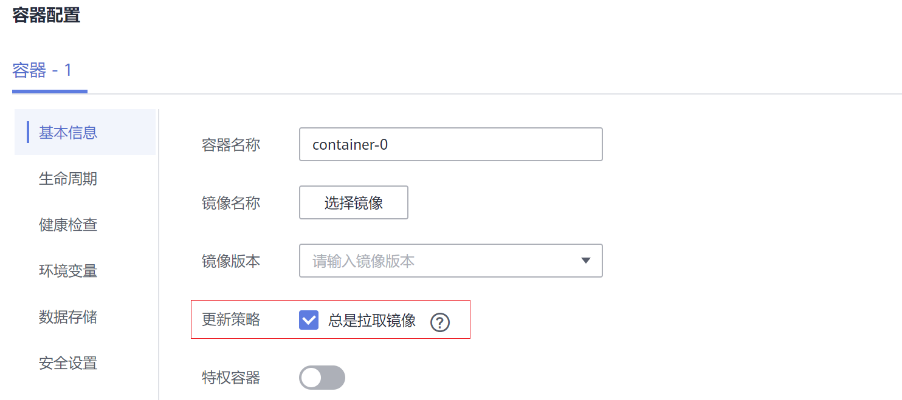

# 配置镜像拉取策略<a name="cce_01_0353"></a>

创建工作负载会从镜像仓库拉取容器镜像到节点上，当前Pod重启、升级时也会拉取镜像。

默认情况下容器镜像拉取策略imagePullPolicy是IfNotPresent，表示如果节点上有这个镜像就直接使用节点已有镜像，如果没有这个镜像就会从镜像仓库拉取。

容器镜像拉取策略还可以设置为Always，表示无论节点上是否有这个镜像，都会从镜像仓库拉取，并覆盖节点上的镜像。

```
apiVersion: v1
kind: Pod 
metadata:
  name: nginx 
spec: 
  containers:
  - image: nginx:alpine 
    name: container-0 
    resources:
      limits:
        cpu: 100m
        memory: 200Mi
      requests:
        cpu: 100m
        memory: 200Mi
    imagePullPolicy: Always
  imagePullSecrets:                 
  - name: default-secret
```

在CCE控制台也可以设置镜像拉取策略，在创建工作负载时设置。如下所示，勾选表示总是拉取镜像（Always），不勾选就是IfNotPresent。



