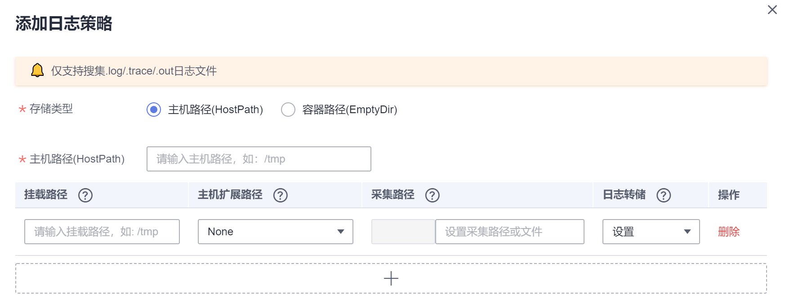

# 采集容器内路径日志

CCE支持配置工作负载日志策略，便于日志的统一收集、管理和分析，以及按周期防爆处理。

本章节向您介绍如何采集容器内路径日志。如果您需要通过不做任何配置的方式采集容器标准输出日志，请参见[采集容器标准输出日志](采集容器标准输出日志.md)。

## 操作步骤

1.  在创建容器工作负载时，添加容器后，展开“容器日志”。

    **图 1**  容器日志  
    

2.  单击“添加日志策略“，设置自定义日志参数，配置日志策略，以nginx为例，不同工作负载根据实际情况配置。

    **图 2**  添加日志策略  
    

3.  存储类型有“主机路径“和“容器路径“两种类型可供选择：
    -   主机路径：可将主机上的路径挂载到指定的容器路径。日志策略配置参数如下：

        **表 1**  添加日志策略-主机路径

        
        <table><thead align="left"><tr id="row45851074554"><th class="cellrowborder" valign="top" width="22.12%" id="mcps1.2.3.1.1">
参数

        </th>
        <th class="cellrowborder" valign="top" width="77.88000000000001%" id="mcps1.2.3.1.2">
参数说明

        </th>
        </tr>
        </thead>
        <tbody><tr id="row1458511725510"><td class="cellrowborder" valign="top" width="22.12%" headers="mcps1.2.3.1.1 ">
存储类型

        </td>
        <td class="cellrowborder" valign="top" width="77.88000000000001%" headers="mcps1.2.3.1.2 ">
设置为“主机路径”。将主机上的路径挂载到指定的容器路径。

        </td>
        </tr>
        <tr id="row75867795518"><td class="cellrowborder" colspan="2" valign="top" headers="mcps1.2.3.1.1 mcps1.2.3.1.2 ">
<strong id="b125866775515">添加容器挂载</strong>

        </td>
        </tr>
        <tr id="row1358135034614"><td class="cellrowborder" valign="top" width="22.12%" headers="mcps1.2.3.1.1 ">
*主机路径

        </td>
        <td class="cellrowborder" valign="top" width="77.88000000000001%" headers="mcps1.2.3.1.2 ">
输入主机的路径，如：/var/paas/sys/log/nginx

        </td>
        </tr>
        <tr id="row19587147165512"><td class="cellrowborder" valign="top" width="22.12%" headers="mcps1.2.3.1.1 ">
挂载路径

        </td>
        <td class="cellrowborder" valign="top" width="77.88000000000001%" headers="mcps1.2.3.1.2 ">
输入数据卷挂载到容器上的路径，如：/tmp
 须知： 
<ul id="ul14587570556"><li>请不要挂载在系统目录下，如“<strong id="b3586147145513">/</strong>”、“<strong id="b85864714555">/var/run”</strong>等，会导致容器异常。建议挂载在空目录下，若目录不为空，请确保目录下无影响容器启动的文件，否则文件会被替换，导致容器启动异常，工作负载创建失败。</li><li>挂载高危目录的情况下 ，建议使用低权限帐号启动，否则可能会造成宿主机高危文件被破坏。</li></ul>
        

        

        </td>
        </tr>
        <tr id="row6588187135510"><td class="cellrowborder" valign="top" width="22.12%" headers="mcps1.2.3.1.1 ">
主机扩展路径

        </td>
        <td class="cellrowborder" valign="top" width="77.88000000000001%" headers="mcps1.2.3.1.2 ">
通过实例的ID或者容器的名称扩展主机路径，实现同一个主机路径下区分来自不同容器的挂载。

        
会在原先的“卷目录/子目录”中增加一个三级目录。使用户更方便获取单个Pod输出的文件。

        <ul id="ul1358877135514"><li>None：不配置拓展路径。</li><li>PodUID：Pod的ID。</li><li>PodName：Pod的名称。</li><li>PodUID/ContainerName：Pod的ID/容器名称。</li><li>PodName/ContainerName：Pod名称/容器名称。</li></ul>
        </td>
        </tr>
        <tr id="row1740653212476"><td class="cellrowborder" valign="top" width="22.12%" headers="mcps1.2.3.1.1 ">
采集路径

        </td>
        <td class="cellrowborder" valign="top" width="77.88000000000001%" headers="mcps1.2.3.1.2 ">
设置采集路径可以更精确的指定采集内容，当前支持以下设置方式：

        <ul id="ul1676055194810"><li>不设置则默认采集当前路径下.log .trace .out文件</li><li>设置**表示递归采集5层目录下的.log .trace .out文件</li><li>设置*表示模糊匹配</li></ul>
        
例子： 采集路径为/tmp/**/test*.log 表示采集/tmp目录及其1-5层子目录下的全部以test开头的.log文件。

        
<strong id="b1914313301497">注意：</strong>使用采集路径功能请确认您的<a href="https://console.huaweicloud.com/aom/##/apm/agent" target="_blank" rel="noopener noreferrer">采集器ICAgent</a>版本为5.12.22或以上版本。

        </td>
        </tr>
        <tr id="row85891275552"><td class="cellrowborder" valign="top" width="22.12%" headers="mcps1.2.3.1.1 ">
日志转储

        </td>
        <td class="cellrowborder" valign="top" width="77.88000000000001%" headers="mcps1.2.3.1.2 ">
支持搜集.log、.trace、.out三种类型的日志文件。

        <ul id="ul155885775512"><li>设置：设置转储后，文件大于50M转储，转储文件保留20个。</li><li>不设置：不设置转储则采用Docker默认转储机制。</li></ul>
        </td>
        </tr>
        </tbody>
        </table>

    -   容器路径：日志仅输出到容器路径，无需挂载主机路径。日志策略配置参数如下：

        > **说明：**   
        >此功能需要[采集器ICAgent](https://console.huaweicloud.com/aom/##/apm/agent)版本升级到5.10.79或以上版本。  

        **表 2**  添加日志策略-容器路径

        
        <table><thead align="left"><tr id="row1739912520361"><th class="cellrowborder" valign="top" width="22.08%" id="mcps1.2.3.1.1">
参数

        </th>
        <th class="cellrowborder" valign="top" width="77.92%" id="mcps1.2.3.1.2">
参数说明

        </th>
        </tr>
        </thead>
        <tbody><tr id="row12882033163811"><td class="cellrowborder" valign="top" width="22.08%" headers="mcps1.2.3.1.1 ">
存储类型

        </td>
        <td class="cellrowborder" valign="top" width="77.92%" headers="mcps1.2.3.1.2 ">
设置为“容器路径”。

        
日志仅输出到容器路径，无需挂载主机路径。此功能需要<a href="https://console.huaweicloud.com/aom/##/apm/agent" target="_blank" rel="noopener noreferrer">采集器ICAgent</a>版本升级到5.10.79或以上版本。

        </td>
        </tr>
        <tr id="row1440272519365"><td class="cellrowborder" colspan="2" valign="top" headers="mcps1.2.3.1.1 mcps1.2.3.1.2 ">
<strong id="b340182515362">添加容器挂载</strong>

        </td>
        </tr>
        <tr id="row19403122523618"><td class="cellrowborder" valign="top" width="22.08%" headers="mcps1.2.3.1.1 ">
挂载路径

        </td>
        <td class="cellrowborder" valign="top" width="77.92%" headers="mcps1.2.3.1.2 ">
输入数据卷挂载到容器上的路径，如：/tmp
 须知： 
<ul id="ul540382573617"><li>请不要挂载在系统目录下，如“<strong id="b114023251366">/</strong>”、“<strong id="b10402162543617">/var/run”</strong>等，会导致容器异常。建议挂载在空目录下，若目录不为空，请确保目录下无影响容器启动的文件，否则文件会被替换，导致容器启动异常，工作负载创建失败。</li><li>挂载高危目录的情况下 ，建议使用低权限帐号启动，否则可能会造成宿主机高危文件被破坏。</li></ul>
        

        

        </td>
        </tr>
        <tr id="row14551531205115"><td class="cellrowborder" valign="top" width="22.08%" headers="mcps1.2.3.1.1 ">
采集路径

        </td>
        <td class="cellrowborder" valign="top" width="77.92%" headers="mcps1.2.3.1.2 ">
设置采集路径可以更精确的指定采集内容，当前支持以下设置方式：

        <ul id="ul2565133819518"><li>不设置则默认采集当前路径下.log .trace .out文件</li><li>设置**表示递归采集5层目录下的.log .trace .out文件</li><li>设置*表示模糊匹配</li></ul>
        
例子： 采集路径为/tmp/**/test*.log 表示采集/tmp目录及其1-5层子目录下的全部以test开头的.log文件。

        
<strong id="b3565103813511">注意：</strong>使用采集路径功能请确认您的<a href="https://console.huaweicloud.com/aom/##/apm/agent" target="_blank" rel="noopener noreferrer">采集器ICAgent</a>版本为5.12.22或以上版本。

        </td>
        </tr>
        <tr id="row1840532563617"><td class="cellrowborder" valign="top" width="22.08%" headers="mcps1.2.3.1.1 ">
日志转储

        </td>
        <td class="cellrowborder" valign="top" width="77.92%" headers="mcps1.2.3.1.2 ">
支持搜集.log、.trace、.out三种类型的日志文件。

        <ul id="ul5679104395112"><li>设置：设置转储后，文件大于50M转储，转储文件保留20个。</li><li>不设置：不设置转储则采用Docker默认转储机制。</li></ul>
        </td>
        </tr>
        </tbody>
        </table>

4.  单击“确定“，并完成创建工作负载。
5.  查看日志。

    工作负载创建完成后，访问nginx。进入工作负载详情页，单击右上角的“日志“按钮查看日志详情。

    **图 3**  查看容器内工作负载日志  
    

    > **说明：**   
    >云容器引擎服务对接了应用运维管理服务AOM提供日志查看、检索功能。华为云于2019年10月10日对应用运维管理服务进行价格调整，每月赠送租户500M免费日志采集额度，超过免费额度部分将产生费用（[了解计费详情](https://www.huaweicloud.com/notice/2018/20190929175154404.html)）。当前日志使用情况请[点此查看](https://console.huaweicloud.com/aom/#/aom/als/setting)。  

