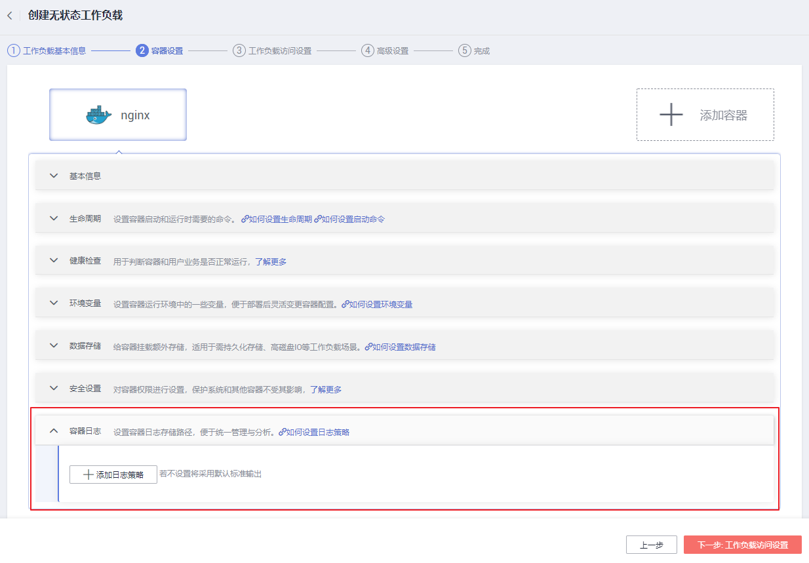
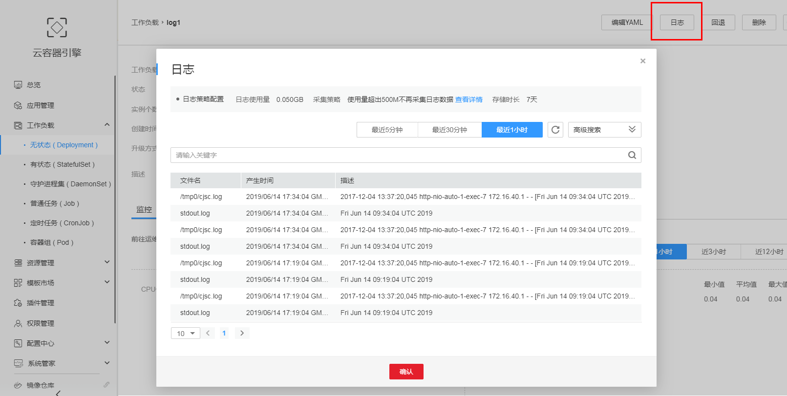

# 采集容器默认的标准输出日志

## 操作场景

CCE支持配置工作负载日志策略，便于日志的统一收集、管理和分析，以及按周期防爆处理。

本章节向您介绍如何采集容器标准输出日志。如果您需要通过配置日志策略的方式采集容器内路径日志，请参见[采集容器内挂载路径的日志](采集容器内挂载路径的日志.md)。

## 操作步骤

1.  在创建工作负载时，添加容器后，展开“容器日志”页签。
2.  若需采集容器默认的标准输出日志，则不必点击“添加日志策略“按钮。
3.  单击“下一步：工作负载访问设置“，完成工作负载的创建（以创建nginx为例）。

    **图 1**  自定义日志  
    

4.  按照如下方式查看日志。

    工作负载创建完成后，访问nginx。进入工作负载详情页，单击右上角的“日志“按钮可查看日志详情。日志约需要等待5分钟查看。

    **图 2**  查看工作负载日志  
    

    > **说明：** 
    >云容器引擎服务对接了应用运维管理服务AOM提供日志查看、检索功能。华为云于2019年10月10日对应用运维管理服务进行价格调整，每月赠送租户500M免费日志采集额度，超过免费额度部分将产生费用（[了解计费详情](https://www.huaweicloud.com/notice/2018/20190929175154404.html)）。当前日志使用情况请[点此查看](https://console.huaweicloud.com/aom/#/aom/als/setting)。

