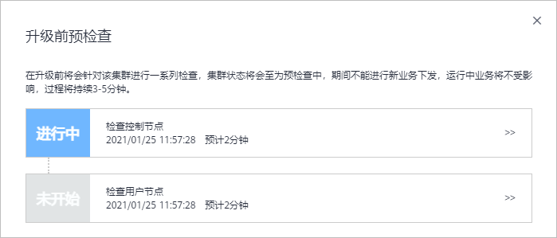

# 重置升级/滚动升级（1.13版本）

## 操作场景

您可以通过云容器引擎管理控制台，快速升级Kubernetes版本，以支持新特性的使用。

升级前，请先了解CCE各集群版本能够升级到的目标版本，以及升级方式和升级影响，详情请参见[集群升级概述](集群升级概述.md)和[升级前须知](升级前须知.md)。

## 注意事项

-   集群升级时若需要升级CoreDNS插件，请确保节点数大于等于CoreDNS的实例数，且CoreDNS的所有实例都处于运行状态，否则将导致升级失败。1.13版本的集群若需升级到更高版本，需先将CoreDNS插件升级当前集群可用的最新版本。
-   1.13版本内升级时，集群上的应用只会在升级网络组件时有短暂中断。

## 操作步骤

1.  登录CCE控制台，进入集群。
2.  在左侧导航栏选择“集群升级“，在右侧可以看到可升级的版本，单击“版本升级“。

    > **说明：** 
    >-   若您的集群当前已是最新版本，则“版本升级“按钮为灰色不可用状态。
    >-   若您的集群状态异常或存在异常状态的插件，则“版本升级“按钮为灰色不可用状态，请参考[升级前须知](升级前须知.md)检查。

3.  在弹出的“升级前预检查“对话框中，单击“开始检查“。

    **图 1**  升级前预检查  
    

4.  升级前预检查开始启动，在此过程中集群状态将显示为“预检查中“，期间该集群不能进行新业务下发，运行中的业务不受影响，该过程将持续3-5分钟。

    **图 2**  升级前预检查-进行中  
    

5.  待升级前预检查的状态显示为“已完成“时，单击“去升级“。

    **图 3**  升级前预检查-完成  
    

6.  进入集群升级页面，参照[表1](#table924319911495)确认或配置基本信息。

    **表 1**  基本信息确认与配置

    
    <table><thead align="left"><tr id="row42442974913"><th class="cellrowborder" valign="top" width="24%" id="mcps1.2.3.1.1">
参数

    </th>
    <th class="cellrowborder" valign="top" width="76%" id="mcps1.2.3.1.2">
参数说明

    </th>
    </tr>
    </thead>
    <tbody><tr id="row1137014404511"><td class="cellrowborder" valign="top" width="24%" headers="mcps1.2.3.1.1 ">
集群名称

    </td>
    <td class="cellrowborder" valign="top" width="76%" headers="mcps1.2.3.1.2 ">
请确认您要升级的集群名称。

    </td>
    </tr>
    <tr id="row83701240105118"><td class="cellrowborder" valign="top" width="24%" headers="mcps1.2.3.1.1 ">
当前版本

    </td>
    <td class="cellrowborder" valign="top" width="76%" headers="mcps1.2.3.1.2 ">
请确认待升级集群的版本。

    </td>
    </tr>
    <tr id="row4370840165119"><td class="cellrowborder" valign="top" width="24%" headers="mcps1.2.3.1.1 ">
升级后版本

    </td>
    <td class="cellrowborder" valign="top" width="76%" headers="mcps1.2.3.1.2 ">
请确认升级后的目标版本。

    </td>
    </tr>
    <tr id="row524420346511"><td class="cellrowborder" valign="top" width="24%" headers="mcps1.2.3.1.1 ">
节点升级策略

    </td>
    <td class="cellrowborder" valign="top" width="76%" headers="mcps1.2.3.1.2 ">
<strong id="b1243162591216">重置升级：</strong>用户节点采用重置安装方式，节点操作系统将会被重装，系统盘和数据盘的数据均会被清空，请谨慎使用。

    
 说明： 
<ul id="ul149475619164"><li>本集群的节点及工作负载生命周期管理功能暂不可用。</li><li>API访问功能暂不可用。</li><li>由于升级过程节点进行重置安装，用户已运行的工作负载业务将会中断。</li><li>用户节点的系统盘和数据盘将会被清空，升级前请事先备份重要数据。</li><li>用户节点上挂载的非LVM管理的数据盘，升级后需要重新挂载，盘中数据不会丢失。</li><li>云硬盘的配额需大于0。</li><li>容器的IP地址会发生变化，但是不影响容器间的网络通信。</li><li>用户节点的自定义标签将不会保留。</li><li>集群升级时间约为12分钟。</li></ul>
    

    
<strong id="b19987172861214">滚动升级：</strong>用户节点采用节点池滚动升级，适用于集群下节点均采用节点池创建的场景。

    
 说明： 
<ul id="ul1819517471712"><li>本集群的节点及工作负载生命周期管理功能暂不可用。</li><li>API访问功能暂不可用。</li><li>用户已运行的工作负载业务不会中断。</li><li>集群升级时间约为12分钟。</li></ul>
    

    </td>
    </tr>
    <tr id="row11113813113511"><td class="cellrowborder" valign="top" width="24%" headers="mcps1.2.3.1.1 ">
重置节点镜像

    </td>
    <td class="cellrowborder" valign="top" width="76%" headers="mcps1.2.3.1.2 ">
仅支持裸金属节点。

    
裸金属节点支持在升级时替换操作系统镜像，可指定节点使用新的镜像，在升级时会使用新镜像重装操作系统。如不指定则默认使用原有镜像重装操作系统。

    </td>
    </tr>
    <tr id="row1624493410514"><td class="cellrowborder" valign="top" width="24%" headers="mcps1.2.3.1.1 ">
登录方式

    </td>
    <td class="cellrowborder" valign="top" width="76%" headers="mcps1.2.3.1.2 ">
支持密码和密钥对。<ul id="ul10227542183218"><li>选择“密码”：用户名默认为“root”，请输入登录节点的密码，并确认密码。
登录节点时需要使用该密码，请妥善管理密码，系统无法获取您设置的密码内容。

    </li><li>选择“密钥对”：选择用于登录本节点的密钥对，支持选择共享密钥。
密钥对用于远程登录节点时的身份认证。若没有密钥对，可单击选项框右侧的“创建密钥对”来新建，创建密钥对操作步骤请参见<a href="https://support.huaweicloud.com/usermanual-ecs/zh-cn_topic_0014250631.html" target="_blank" rel="noopener noreferrer">创建密钥对</a>。

    </li></ul>
    

    </td>
    </tr>
    <tr id="row12041031519"><td class="cellrowborder" valign="top" width="24%" headers="mcps1.2.3.1.1 ">
集群备份

    </td>
    <td class="cellrowborder" valign="top" width="76%" headers="mcps1.2.3.1.2 ">
对集群的Master节点进行整机备份，<strong id="b19276203017490">需要用户手动确认</strong>，备份过程会使用云备份服务，备份通常耗时在20分钟左右，若当前局点云备份任务排队较多时，备份时间可能同步延长，推荐用户使用进行整机备份。

    </td>
    </tr>
    <tr id="row224517348516"><td class="cellrowborder" valign="top" width="24%" headers="mcps1.2.3.1.1 ">
节点升级优先级

    </td>
    <td class="cellrowborder" valign="top" width="76%" headers="mcps1.2.3.1.2 ">
可选择优先升级的节点。

    </td>
    </tr>
    </tbody>
    </table>

7.  完成后单击“下一步“，在弹出的“集群升级“对话框中单击“确定“。

    根据您选择的“节点升级策略“，对话框中会有如下两种不同的提示： 

    -   重置升级：升级后的集群版本将使用更高版本操作系统，升级将会重启节点并升级操作系统版本，升级过程中运行的业务会暂时中断。
    -   滚动升级：滚动升级后，需要用户重置节点（同时去除不可调度标签）或新建节点才能完成升级。

8.  进入“升级插件“步骤，如有需要升级的插件会有红色圆点提示，请单击插件卡片左下角的“升级“按钮，完成后单击页面右下角的“升级“。

    > **说明：** 
    >-   集群将依次升级控制节点，然后并发升级用户节点。用户节点较多时，节点将分批升级。
    >-   请选择合适的时间段进行升级，以减少升级对业务的影响。
    >-   单击“升级“会立刻开始执行升级操作，并且无法撤销。升级过程中请勿对节点执行关机、重启等操作。

9.  在弹出的“集群升级“对话框中阅读提示信息，确认后单击“确定“，注意集群升级后不可回退。

    **图 4**  集群升级确认  
    

10. 在集群列表页面中可以看到集群的状态为“升级中“，升级过程需要一定的时间，请耐心等待升级完成。

    升级成功后，您可以在集群列表或集群详情页面查看升级后的集群状态和版本。

