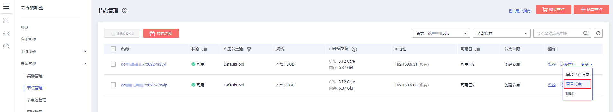

# 重置节点

-   [操作场景](#section87051629113714)
-   [约束与限制](#section0339185914138)
-   [注意事项](#section83421713122615)
-   [操作步骤](#section144215001311)

## 操作场景

在CCE集群中重置节点会将该节点以及节点内运行的业务都销毁，重置前请确认您的正常业务运行不受影响，请谨慎操作。

## 约束与限制

-   v1.13及以上版本的混合集群、CCE Turbo集群支持重置节点。
-   v1.15及以上版本的鲲鹏集群支持重置节点。

## 注意事项

-   重置节点功能不会重置控制节点，仅能对工作节点进行重置操作，如果重置后节点仍然不可用，请删除该节点重新购买。
-   **重置节点将对节点操作系统进行重置安装，节点上已运行的工作负载业务将会中断，请在业务低峰期操作。**
-   **节点重置后操作系统版本不变，但工作节点的系统盘和docker数据盘将会被清空，重置前请事先备份重要数据。**
-   **用户节点如果有自行挂载了数据盘，重置完后会清除挂载信息，请事先备份重要数据，重置完成后请重新执行挂载行为，数据不会丢失。**
-   节点上的工作负载实例的IP会发生变化，但是不影响容器网络通信。
-   云硬盘必须有剩余配额。
-   操作过程中，后台会把当前节点设置为不可调度状态。

## 操作步骤

1.  登录[CCE控制台](https://console.huaweicloud.com/cce2.0/?utm_source=helpcenter)，在左侧导航栏中选择“资源管理 \> 节点管理“，单击节点后的“更多 \> 重置节点“。

    **图 1**  重置节点  
    

2.  在弹出的“重置节点“窗口中输入**RESET**，同时重新配置密码或密钥登录方式。

    **图 2**  重置节点  
    

3.  单击“是“，等待完成节点重置。

    重置节点后，原有节点上的工作负载实例会自动迁移至其他可用节点。

