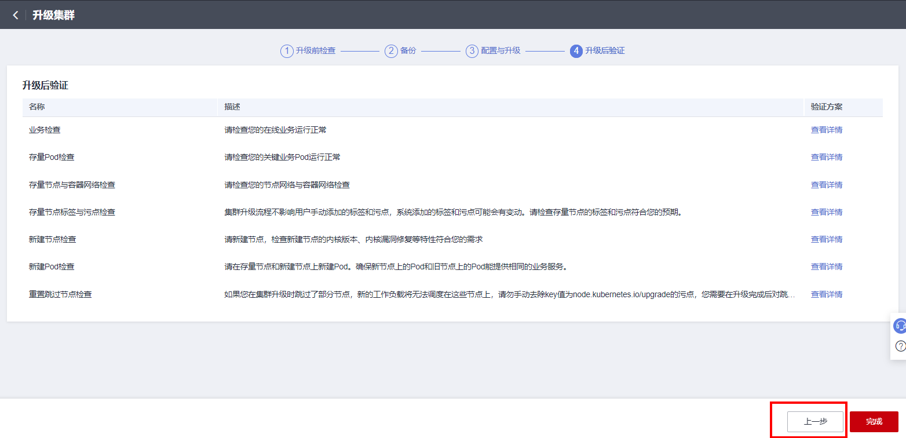
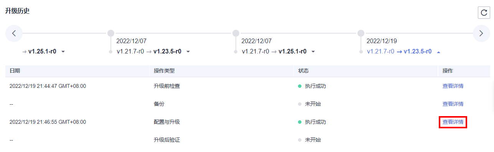
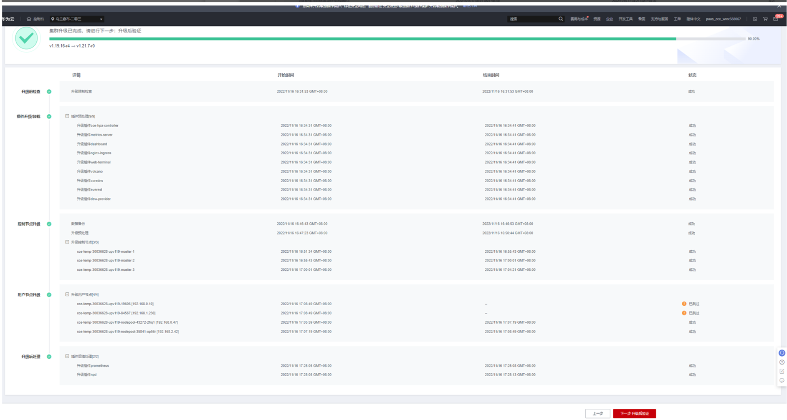

# 重置跳过节点检查

## 检查项内容

集群升级完毕之后，需要重置升级失败的节点。

## 检查步骤

返回上一步或通过升级历史页面查看进入升级详情页面，查看升级时跳过的节点。

对于升级详情页面中跳过的节点，请在升级完毕后[重置节点](重置节点.md)。

> **说明：** 
>重置节点会重置所有节点标签，可能影响工作负载调度，请在重置节点前检查并保留您手动为该节点打上的标签。

