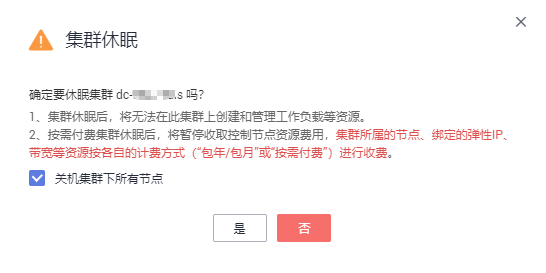

# 集群休眠与唤醒

## 集群休眠

暂时不需要使用集群时，为节省集群管理费用，建议您将集群设置为休眠状态。

集群休眠后，将无法在此集群上创建和管理工作负载等资源。

> **须知：**   
>-   按需付费集群休眠后，将暂停收取控制节点资源费用。  
>-   集群休眠后，集群中的工作节点（即ECS）并不会自动关机，集群所属的工作节点（ECS）、绑定的弹性IP、带宽等资源仍将按各自的计费方式进行收费。如需节点关机请参见[节点关机](节点关机.md)。  

1.  登录[CCE控制台](https://console.huaweicloud.com/cce2.0/?utm_source=helpcenter)，在左侧导航栏中选择“资源管理 \> 集群管理”。
2.  单击待休眠集群后的“更多 \> 集群休眠“。
3.  在弹出的集群休眠提示框中，查看风险提示并勾选“关机所有节点，关机后不再收取节点费用“，单击“确定“。

    等待集群休眠完成。

    **图 1**  集群休眠提示  
    

## 集群唤醒

休眠中的集群可以快速唤醒，正常使用。

1.  登录[CCE控制台](https://console.huaweicloud.com/cce2.0/?utm_source=helpcenter)，在左侧导航栏中选择“资源管理 \> 集群管理”。
2.  单击待唤醒集群后的“更多 \> 集群唤醒“。
3.  在弹出的集群唤醒提示框中，单击“确定“。

    等待集群完成唤醒。

    **图 2**  集群唤醒提示  
    

