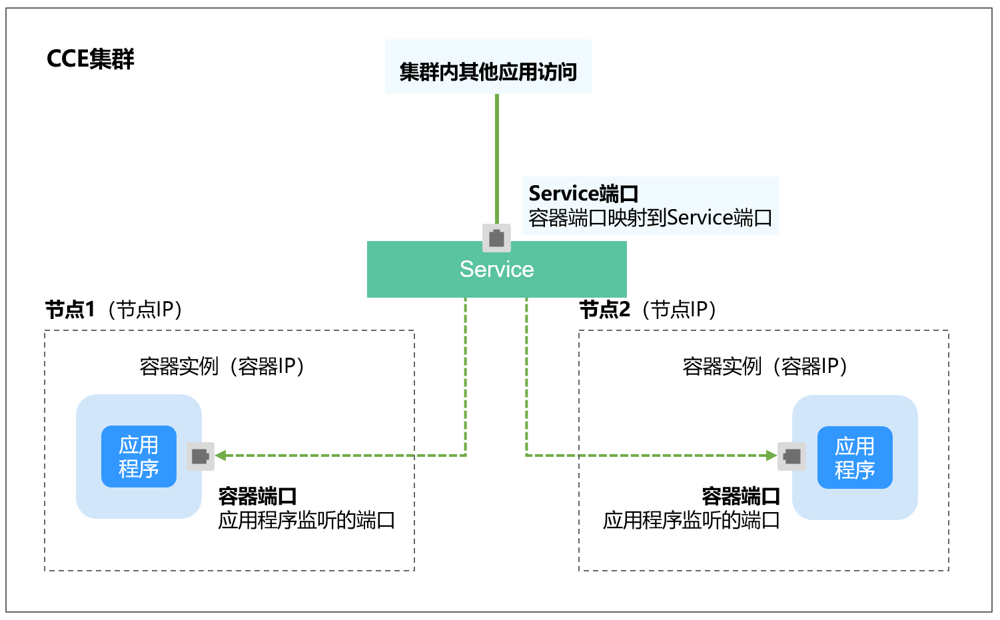

# 集群内访问\(ClusterIP\)<a name="cce_10_0011"></a>

## 操作场景<a name="section13559184110492"></a>

集群内访问表示工作负载暴露给同一集群内其他工作负载访问的方式，可以通过“集群内部域名“访问。

集群内部域名格式为“<服务名称\>.<工作负载所在命名空间\>.svc.cluster.local:<端口号\>“，例如“nginx.default.svc.cluster.local:80“。

访问通道、容器端口与访问端口映射如[图1](#fig192245420557)所示。

**图 1**  集群内访问<a name="fig192245420557"></a>  


## 创建ClusterIP类型Service<a name="section51925078171335"></a>

1.  登录CCE控制台，单击集群名称进入集群。
2.  在左侧导航栏中选择“服务发现“，在右上角单击“创建服务“。
3.  设置集群内访问参数。
    -   **Service名称：**自定义服务名称，可与工作负载名称保持一致。
    -   **访问类型**：选择“集群内访问 ClusterIP“。
    -   **命名空间：**工作负载所在命名空间。
    -   **选择器：**添加标签，Service根据标签选择Pod，填写后单击“确认添加“。也可以引用已有工作负载的标签，单击“引用负载标签“，在弹出的窗口中选择负载，然后单击“确定“。
    -   **IPv6：**默认不开启，开启后服务的集群内IP地址（ClusterIP）变为IPv6地址，具体请参见[如何通过CCE搭建IPv4/IPv6双栈集群？](https://support.huaweicloud.com/bestpractice-cce/cce_bestpractice_00222.html)。**该功能仅在1.15及以上版本的集群创建时开启了IPv6功能才会显示。**
    -   **端口配置：**
        -   协议：请根据业务的协议类型选择。
        -   服务端口：Service使用的端口，端口范围为1-65535。
        -   容器端口：工作负载程序实际监听的端口，需用户确定。例如nginx默认使用80端口。

4.  单击“确定”，创建Service。

## 通过kubectl命令行创建<a name="section9813121512319"></a>

您可以通过kubectl命令行设置Service访问方式。本节以nginx为例，说明kubectl命令实现集群内访问的方法。

1.  请参见[通过kubectl连接集群](通过kubectl连接集群.md)，使用kubectl连接集群。
2.  创建并编辑nginx-deployment.yaml和nginx-clusterip-svc.yaml文件。

    其中，nginx-deployment.yaml和nginx-clusterip-svc.yaml为自定义名称，您可以随意命名。

    **vi nginx-deployment.yaml**

    ```
    apiVersion: apps/v1
    kind: Deployment
    metadata:
      name: nginx
    spec:
      replicas: 1
      selector:
        matchLabels:
          app: nginx
      template:
        metadata:
          labels:
            app: nginx
        spec:
          containers:
          - image: nginx:latest
            name: nginx
          imagePullSecrets:
          - name: default-secret
    ```

    **vi nginx-clusterip-svc.yaml**

    ```
    apiVersion: v1
    kind: Service
    metadata:
      labels:
        app: nginx
      name: nginx-clusterip
    spec:
      ports:
      - name: service0
        port: 8080                # 访问Service的端口
        protocol: TCP             # 访问Service的协议，支持TCP和UDP
        targetPort: 80            # Service访问目标容器的端口，此端口与容器中运行的应用强相关，如本例中nginx镜像默认使用80端口
      selector:                   # 标签选择器，Service通过标签选择Pod，将访问Service的流量转发给Pod，此处选择带有 app:nginx 标签的Pod
        app: nginx
      type: ClusterIP             # Service的类型，ClusterIP表示在集群内访问
    ```

3.  创建工作负载。

    **kubectl create -f nginx-deployment.yaml**

    回显如下，表示工作负载已经创建。

    ```
    deployment "nginx" created
    ```

    **kubectl get po**

    回显如下，工作负载状态为Running，表示工作负载已处于运行中状态。

    ```
    NAME                     READY     STATUS             RESTARTS   AGE
    nginx-2601814895-znhbr   1/1       Running            0          15s
    ```

4.  创建服务。

    **kubectl create -f nginx-clusterip-svc.yaml**

    回显如下，表示服务已开始创建。

    ```
    service "nginx-clusterip" created
    ```

    **kubectl get svc**

    回显如下，表示服务已创建成功，CLUSTER-IP已生成。

    ```
    # kubectl get svc
    NAME              TYPE        CLUSTER-IP     EXTERNAL-IP   PORT(S)    AGE
    kubernetes        ClusterIP   10.247.0.1     <none>        443/TCP    4d6h
    nginx-clusterip   ClusterIP   10.247.74.52   <none>        8080/TCP   14m
    ```

5.  访问Service。

    在集群内的容器或节点上都能够访问Service。

    创建一个Pod并进入到容器内，使用curl命令访问Service的IP:Port或域名，如下所示。

    其中域名后缀可以省略，在同个命名空间内可以直接使用nginx-clusterip:8080访问，跨命名空间可以使用nginx-clusterip.default:8080访问。

    ```
    # kubectl run -i --tty --image nginx:alpine test --rm /bin/sh
    If you don't see a command prompt, try pressing enter.
    / # curl 10.247.74.52:8080
    <!DOCTYPE html>
    <html>
    <head>
    <title>Welcome to nginx!</title>
    <style>
        body {
            width: 35em;
            margin: 0 auto;
            font-family: Tahoma, Verdana, Arial, sans-serif;
        }
    </style>
    </head>
    <body>
    <h1>Welcome to nginx!</h1>
    <p>If you see this page, the nginx web server is successfully installed and
    working. Further configuration is required.</p>
    
    <p>For online documentation and support please refer to
    <a href="http://nginx.org/">nginx.org</a>.<br/>
    Commercial support is available at
    <a href="http://nginx.com/">nginx.com</a>.</p>
    
    <p><em>Thank you for using nginx.</em></p>
    </body>
    </html>
    / # curl nginx-clusterip.default.svc.cluster.local:8080
    ...
    <h1>Welcome to nginx!</h1>
    ...
    / # curl nginx-clusterip.default:8080
    ...
    <h1>Welcome to nginx!</h1>
    ...
    / # curl nginx-clusterip:8080
    ...
    <h1>Welcome to nginx!</h1>
    ...
    ```


