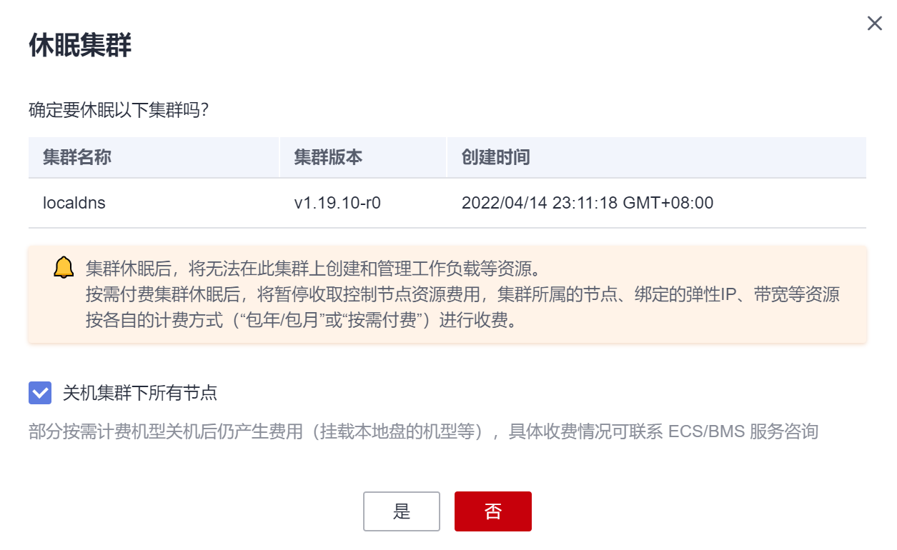

# 集群删除、休眠与唤醒

集群创建后，您可以对其进行删除、休眠、唤醒等操作。

## 删除集群

> **须知：**   
>删除集群会将集群内的节点以及运行的业务都销毁，请谨慎操作。  

本章节以删除混合集群为例，GPU集群和裸金属集群操作方式与其相同。

1.  登录[CCE控制台](https://console.huaweicloud.com/cce2.0/?utm_source=helpcenter)，在左侧导航栏中选择“资源管理 \> 集群管理”。
2.  单击待删除集群后的“更多 \> 删除集群“。

    

3.  在弹出的风险提示窗口中，建议您开启敏感操作保护，以保障您的账号及资源的安全。完成后，单击“确定”。

    -   **免费开启：**建议开启。在控制台进行敏感操作时，需通过二次认证再次确认您的身份。
    -   **我已知晓安全风险，暂不开启：**您可以随时在“统一身份认证服务-账号设置“中开启/关闭操作保护。

    当选择暂不开启时，您也可以选择“下次不再提示“，关闭该提示窗口的显示。

    **图 1**  风险提示  
    

4.  进入“删除集群“窗口，根据系统提示进行删除操作。

    > **说明：**   
    >-   删除该集群会将集群内的节点（纳管节点和包周期节点除外）以及运行的工作负载和服务都销毁。  
    >-   删除集群需要花费1\~3分钟，请耐心等候。  
    >-   请在窗口下方的输入框中输入  **DELETE**  以确认删除此集群。  
    >-   集群不可用时删除集群，存储会残留。  
    >-   如果通过网络平面添加了弹性网卡，请在删除集群时选择“删除集群下的弹性网卡“，更多网络平面信息请参见[网络平面（NetworkAttachmentDefinition）](网络平面（NetworkAttachmentDefinition）.md)。  

    **图 2**  删除集群  
    

5.  单击“是“，开始执行删除集群操作。

## 集群休眠

暂时不需要使用集群时，为节省集群管理费用，建议您将集群设置为休眠状态。

集群休眠后，将无法在此集群上创建和管理工作负载等资源。

> **须知：**   
>-   按需付费集群休眠后，将暂停收取控制节点资源费用。  
>-   集群休眠后，集群中的工作节点（即ECS）并不会自动关机，集群所属的工作节点（ECS）、绑定的弹性IP、带宽等资源仍将按各自的计费方式进行收费。如需节点关机请参见[节点关机](节点关机.md)。  

1.  登录[CCE控制台](https://console.huaweicloud.com/cce2.0/?utm_source=helpcenter)，在左侧导航栏中选择“资源管理 \> 集群管理”。
2.  单击待休眠集群后的“更多 \> 集群休眠“。
3.  在弹出的集群休眠提示框中，查看风险提示并勾选“关机所有节点，关机后不再收取节点费用“，单击“确定“。

    等待集群休眠完成。

    **图 3**  集群休眠提示  
    

## 集群唤醒

休眠中的集群可以快速唤醒，正常使用。

1.  登录[CCE控制台](https://console.huaweicloud.com/cce2.0/?utm_source=helpcenter)，在左侧导航栏中选择“资源管理 \> 集群管理”。
2.  单击待唤醒集群后的“更多 \> 集群唤醒“。
3.  在弹出的集群唤醒提示框中，单击“确定“。

    等待集群完成唤醒。

    **图 4**  集群唤醒提示  
    

