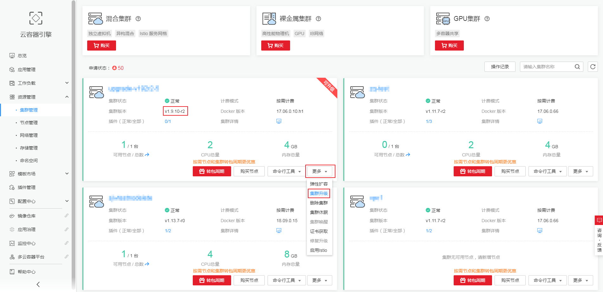
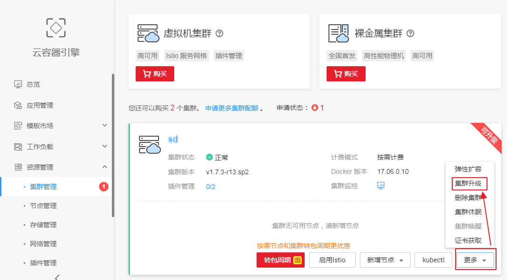
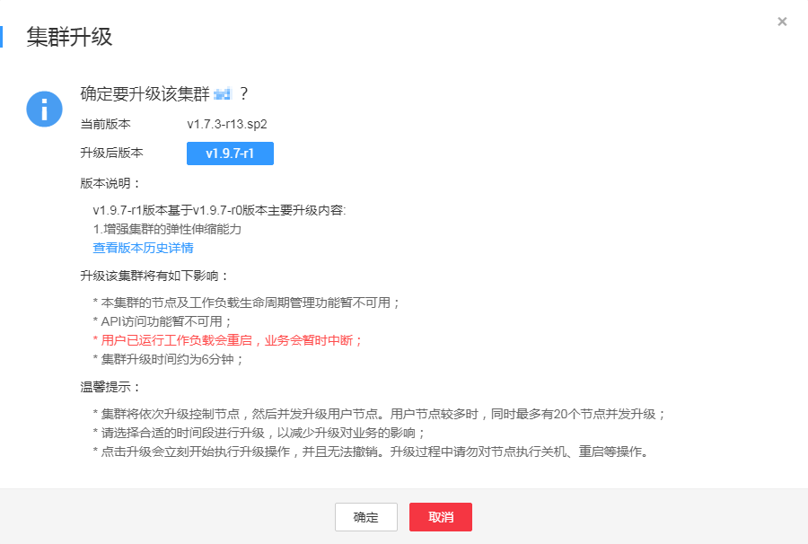
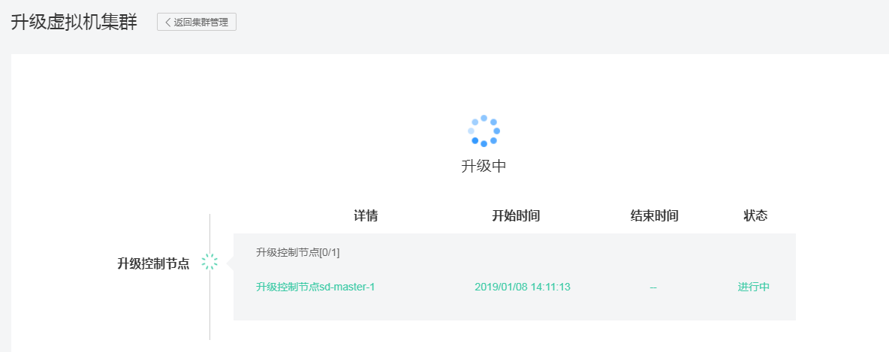
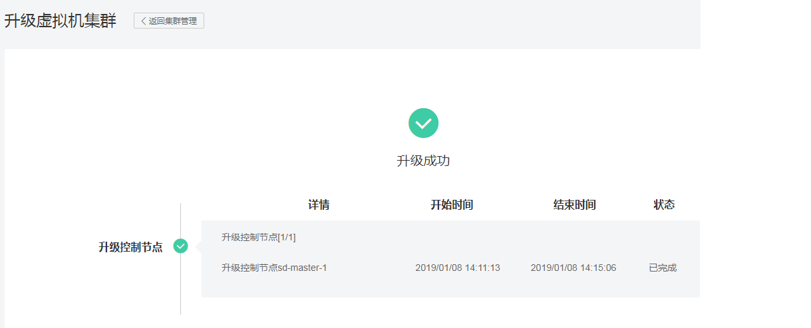

# 集群升级<a name="cce_01_0120"></a>

您可以通过云容器引擎管理控制台快速升级到Kubernetes最新版本或者bugfix版本，并支持部分新特性的使用。

您可以在集群列表页面查看您的集群的 Kubernetes 版本。若您的集群当前已是最新的，“更多 \> 集群升级“按钮则为不可用状态。

**图 1**  集群版本<a name="fig102051524175517"></a>  


本章节以升级虚拟机集群为例，其他集群操作参考虚拟机集群。

## 注意事项<a name="section19374173612221"></a>

集群升级过程中，1.7版本升级到1.9版本时，集群的所有Pod会被重启，对应用有影响。其他版本升级时，集群上的应用不会中断。如果应用强依赖于API Server可能会有短暂影响。

## 准备工作<a name="section1313984217553"></a>

请在集群升级前检查集群的健康状况，并且确保集群健康。

登录 Master 节点，参见[通过Kubectl连接集群](通过Kubectl连接集群.md)。

1.  执行kubectl get cs命令，确保所有模块都处于健康状态。

    ```
    NAME                 STATUS    MESSAGE              ERROR
     scheduler            Healthy   ok
     controller-manager   Healthy   ok
     etcd-0               Healthy   {"health": "true"}
     etcd-1               Healthy   {"health": "true"}
     etcd-2               Healthy   {"health": "true"}
    ```

2.  执行 kubectl get nodes 命令，确保所有节点都处于 Ready 状态。

    > **说明：**   
    >所有节点只能Ready状态，不能包含其他状态。  

    ```
    kubectl get nodes
     NAME                   STATUS    ROLES     AGE       VERSION
     cn-north-1a-xxxxxx   Ready     master    38d       v1.9.7-r1
     cn-north-1a-xxxxxx   Ready     <none>    38d       v1.9.7-r1
     cn-north-1a-xxxxxx   Ready     <none>    38d       v1.9.7-r1
     cn-north-1a-xxxxxx   Ready     <none>    38d       v1.9.7-r1
     cn-north-1a-xxxxxx   Ready     master    38d       v1.9.7-r1
     cn-north-1a-xxxxxx   Ready     master    38d       v1.9.7-r1
    ```


## 集群版本升级说明<a name="section984051415549"></a>

集群版本升级说明如下表格所示。

**表 1**  1.7.3版本升级到1.9.7版本升级说明

<a name="table826812711586"></a>
<table><thead align="left"><tr id="row182714712580"><th class="cellrowborder" valign="top" width="15.02%" id="mcps1.2.4.1.1"><p id="p9349145865810"><a name="p9349145865810"></a><a name="p9349145865810"></a>升级前版本</p>
</th>
<th class="cellrowborder" valign="top" width="24.98%" id="mcps1.2.4.1.2"><p id="p1727217165814"><a name="p1727217165814"></a><a name="p1727217165814"></a>目标版本</p>
</th>
<th class="cellrowborder" valign="top" width="60%" id="mcps1.2.4.1.3"><p id="p0273577581"><a name="p0273577581"></a><a name="p0273577581"></a>说明</p>
</th>
</tr>
</thead>
<tbody><tr id="row527419785819"><td class="cellrowborder" valign="top" width="15.02%" headers="mcps1.2.4.1.1 "><p id="p634915589583"><a name="p634915589583"></a><a name="p634915589583"></a>v1.7.3</p>
</td>
<td class="cellrowborder" valign="top" width="24.98%" headers="mcps1.2.4.1.2 "><p id="p11275478583"><a name="p11275478583"></a><a name="p11275478583"></a>v1.9.7</p>
</td>
<td class="cellrowborder" valign="top" width="60%" headers="mcps1.2.4.1.3 "><a name="ul1237552125913"></a><a name="ul1237552125913"></a><ul id="ul1237552125913"><li>社区1.7.3与1.9.7版本之间的CHANGELOG<p id="p15562044195910"><a name="p15562044195910"></a><a name="p15562044195910"></a>1.8到1.9的变化：<a href="https://github.com/kubernetes/kubernetes/blob/master/CHANGELOG-1.9.md" target="_blank" rel="noopener noreferrer">https://github.com/kubernetes/kubernetes/blob/master/CHANGELOG-1.9.md</a></p>
<p id="p282812387595"><a name="p282812387595"></a><a name="p282812387595"></a>1.7到1.8的变化：<a href="https://github.com/kubernetes/kubernetes/blob/master/CHANGELOG-1.8.md" target="_blank" rel="noopener noreferrer">https://github.com/kubernetes/kubernetes/blob/master/CHANGELOG-1.8.md</a></p>
</li><li>集群支持使用GPU3</li><li>集群节点弹性扩缩容</li></ul>
</td>
</tr>
</tbody>
</table>

**表 2**  集群版本升级说明

<a name="table7445114645410"></a>
<table><thead align="left"><tr id="row244694645413"><th class="cellrowborder" valign="top" width="35.05%" id="mcps1.2.3.1.1"><p id="p174461846165411"><a name="p174461846165411"></a><a name="p174461846165411"></a>Kubernetes版本-CCE补丁版本</p>
</th>
<th class="cellrowborder" valign="top" width="64.95%" id="mcps1.2.3.1.2"><p id="p1446154614545"><a name="p1446154614545"></a><a name="p1446154614545"></a>升级说明</p>
</th>
</tr>
</thead>
<tbody><tr id="row13751104313019"><td class="cellrowborder" valign="top" width="35.05%" headers="mcps1.2.3.1.1 "><p id="p177511443701"><a name="p177511443701"></a><a name="p177511443701"></a>v1.11.3-r1</p>
</td>
<td class="cellrowborder" valign="top" width="64.95%" headers="mcps1.2.3.1.2 "><p id="p1775154314015"><a name="p1775154314015"></a><a name="p1775154314015"></a>主要特性：</p>
<a name="ul1999017372616"></a><a name="ul1999017372616"></a><ul id="ul1999017372616"><li>Ingress的URL匹配支持Perl语法的正则表达式</li></ul>
</td>
</tr>
<tr id="row0226111212582"><td class="cellrowborder" valign="top" width="35.05%" headers="mcps1.2.3.1.1 "><p id="p822671216588"><a name="p822671216588"></a><a name="p822671216588"></a>v1.11.3-r0</p>
</td>
<td class="cellrowborder" valign="top" width="64.95%" headers="mcps1.2.3.1.2 "><p id="p20226181211581"><a name="p20226181211581"></a><a name="p20226181211581"></a>主要特性：</p>
<a name="ul169031946461"></a><a name="ul169031946461"></a><ul id="ul169031946461"><li>Kubernetes同步社区1.11.3版本</li><li>集群master节点支持多可用区</li><li>支持对接EFS存储</li></ul>
</td>
</tr>
<tr id="row193481521542"><td class="cellrowborder" valign="top" width="35.05%" headers="mcps1.2.3.1.1 "><p id="p53481952205413"><a name="p53481952205413"></a><a name="p53481952205413"></a>v1.9.10-r1</p>
</td>
<td class="cellrowborder" valign="top" width="64.95%" headers="mcps1.2.3.1.2 "><p id="p734825215416"><a name="p734825215416"></a><a name="p734825215416"></a>主要特性：</p>
<a name="ul692918571614"></a><a name="ul692918571614"></a><ul id="ul692918571614"><li>支持对接EFS存储</li></ul>
</td>
</tr>
<tr id="row7688248145420"><td class="cellrowborder" valign="top" width="35.05%" headers="mcps1.2.3.1.1 "><p id="p1688448205411"><a name="p1688448205411"></a><a name="p1688448205411"></a>v1.9.10-r0</p>
</td>
<td class="cellrowborder" valign="top" width="64.95%" headers="mcps1.2.3.1.2 "><p id="p1168894815417"><a name="p1168894815417"></a><a name="p1168894815417"></a>主要特性：</p>
<a name="ul1771853679"></a><a name="ul1771853679"></a><ul id="ul1771853679"><li>k8s对接ELB/Ingress新增流控机制</li><li>Kubernetes同步社区1.9.10版本</li></ul>
<p id="p1257813375617"><a name="p1257813375617"></a><a name="p1257813375617"></a>问题修复：</p>
<a name="ul13926122681411"></a><a name="ul13926122681411"></a><ul id="ul13926122681411"><li>修复操作系统cgroup内核BUG导致概率出现的节点内存泄漏问题</li></ul>
</td>
</tr>
<tr id="row184578529509"><td class="cellrowborder" valign="top" width="35.05%" headers="mcps1.2.3.1.1 "><p id="p945916523506"><a name="p945916523506"></a><a name="p945916523506"></a>v1.9.7-r1</p>
</td>
<td class="cellrowborder" valign="top" width="64.95%" headers="mcps1.2.3.1.2 "><p id="p74594528501"><a name="p74594528501"></a><a name="p74594528501"></a>主要特性：</p>
<a name="ul1080183571411"></a><a name="ul1080183571411"></a><ul id="ul1080183571411"><li>增强PVC和PV事件的上报机制</li><li>支持对接第三方认证系统</li><li>裸金属场景下支持IB网卡</li><li>集群支持纳管EulerOS2.3的物理机</li><li>裸金属场景支持对接EVS</li></ul>
</td>
</tr>
<tr id="row114461746125410"><td class="cellrowborder" valign="top" width="35.05%" headers="mcps1.2.3.1.1 "><p id="p147321753124016"><a name="p147321753124016"></a><a name="p147321753124016"></a>v1.9.7-r0</p>
</td>
<td class="cellrowborder" valign="top" width="64.95%" headers="mcps1.2.3.1.2 "><p id="p5732175312401"><a name="p5732175312401"></a><a name="p5732175312401"></a>主要特性：</p>
<a name="ul055117481143"></a><a name="ul055117481143"></a><ul id="ul055117481143"><li>新建集群的Docker版本升级到1706</li><li>支持DNS级联</li><li>支持插件化管理</li><li>Kubernetes同步社区1.9.7版本</li></ul>
</td>
</tr>
<tr id="row244634610548"><td class="cellrowborder" valign="top" width="35.05%" headers="mcps1.2.3.1.1 "><p id="p1073275354018"><a name="p1073275354018"></a><a name="p1073275354018"></a>v1.9.2-r3</p>
</td>
<td class="cellrowborder" valign="top" width="64.95%" headers="mcps1.2.3.1.2 "><p id="p7336195164511"><a name="p7336195164511"></a><a name="p7336195164511"></a>主要特性：</p>
<a name="ul13013019154"></a><a name="ul13013019154"></a><ul id="ul13013019154"><li>集群支持创建/纳管CentOS7.4操作系统的节点</li><li>k8s的Service支持对接DNAT网关服务</li><li>NetworkPolicy能力开放</li><li>增强型ELB支持service配置多个端口</li></ul>
<p id="p03473518458"><a name="p03473518458"></a><a name="p03473518458"></a>问题修复：</p>
<a name="ul182521301519"></a><a name="ul182521301519"></a><ul id="ul182521301519"><li>修复k8s资源回收过程中连不上kube-apiserver导致pod残留的问题</li><li>修复节点弹性扩容数据不准确的问题</li></ul>
</td>
</tr>
<tr id="row2044604619544"><td class="cellrowborder" valign="top" width="35.05%" headers="mcps1.2.3.1.1 "><p id="p1973285324018"><a name="p1973285324018"></a><a name="p1973285324018"></a>v1.9.2-r2</p>
</td>
<td class="cellrowborder" valign="top" width="64.95%" headers="mcps1.2.3.1.2 "><p id="p1973215312400"><a name="p1973215312400"></a><a name="p1973215312400"></a>主要特性：</p>
<a name="ul680672012154"></a><a name="ul680672012154"></a><ul id="ul680672012154"><li>经典型ELB支持自定义健康检查端口</li><li>经典型ELB性能优化</li><li>ELB四层负载均衡支持修改service的端口</li></ul>
<p id="p12072015598"><a name="p12072015598"></a><a name="p12072015598"></a>问题修复：</p>
<a name="ul1546113081515"></a><a name="ul1546113081515"></a><ul id="ul1546113081515"><li>修复网络插件防止健康检查概率死锁问题</li><li>修复高可用集群haproxy连接数限制问题</li></ul>
</td>
</tr>
<tr id="row44477467549"><td class="cellrowborder" valign="top" width="35.05%" headers="mcps1.2.3.1.1 "><p id="p17734153104013"><a name="p17734153104013"></a><a name="p17734153104013"></a>v1.9.2-r1</p>
</td>
<td class="cellrowborder" valign="top" width="64.95%" headers="mcps1.2.3.1.2 "><p id="p17849318105413"><a name="p17849318105413"></a><a name="p17849318105413"></a>主要特性：</p>
<a name="ul43911610101310"></a><a name="ul43911610101310"></a><ul id="ul43911610101310"><li>Kubernetes同步社区1.9.2版本</li><li>集群节点支持CentOS 7.1操作系统</li></ul>
</td>
</tr>
<tr id="row12447184612543"><td class="cellrowborder" valign="top" width="35.05%" headers="mcps1.2.3.1.1 "><p id="p1973414530408"><a name="p1973414530408"></a><a name="p1973414530408"></a>v1.7.3-r13</p>
</td>
<td class="cellrowborder" valign="top" width="64.95%" headers="mcps1.2.3.1.2 "><p id="p14305115718469"><a name="p14305115718469"></a><a name="p14305115718469"></a>主要特性：</p>
<a name="ul109523572122"></a><a name="ul109523572122"></a><ul id="ul109523572122"><li>新建集群的Docker版本升级到1706</li><li>支持DNS级联</li><li>支持插件化管理</li><li>增强PVC和PV事件的上报机制</li></ul>
</td>
</tr>
<tr id="row7718776556"><td class="cellrowborder" valign="top" width="35.05%" headers="mcps1.2.3.1.1 "><p id="p12734155319403"><a name="p12734155319403"></a><a name="p12734155319403"></a>v1.7.3-r12</p>
</td>
<td class="cellrowborder" valign="top" width="64.95%" headers="mcps1.2.3.1.2 "><p id="p3734744104115"><a name="p3734744104115"></a><a name="p3734744104115"></a>主要特性：</p>
<a name="ul1220014718124"></a><a name="ul1220014718124"></a><ul id="ul1220014718124"><li>集群支持创建/纳管CentOS7.4操作系统的节点</li><li>k8s的Service支持对接DNAT网关服务</li><li>NetworkPolicy能力开放</li><li>增强型ELB支持service配置多个端口</li></ul>
<p id="p198333541432"><a name="p198333541432"></a><a name="p198333541432"></a>问题修复：</p>
<a name="ul47184051216"></a><a name="ul47184051216"></a><ul id="ul47184051216"><li>修复k8s资源回收过程中连不上kube-apiserver导致pod残留的问题</li><li>修复节点弹性扩容数据不准确的问题</li></ul>
</td>
</tr>
<tr id="row685121145914"><td class="cellrowborder" valign="top" width="35.05%" headers="mcps1.2.3.1.1 "><p id="p1173425374014"><a name="p1173425374014"></a><a name="p1173425374014"></a>v1.7.3-r11</p>
</td>
<td class="cellrowborder" valign="top" width="64.95%" headers="mcps1.2.3.1.2 "><p id="p1542765013540"><a name="p1542765013540"></a><a name="p1542765013540"></a>主要特性：</p>
<a name="ul1662182618123"></a><a name="ul1662182618123"></a><ul id="ul1662182618123"><li>经典型ELB支持自定义健康检查端口</li><li>经典型ELB性能优化</li><li>ELB四层负载均衡支持修改service的端口</li></ul>
<p id="p111749433574"><a name="p111749433574"></a><a name="p111749433574"></a>问题修复：</p>
<a name="ul13646619181212"></a><a name="ul13646619181212"></a><ul id="ul13646619181212"><li>修复网络插件防止健康检查概率死锁问题</li><li>修复高可用集群haproxy连接数限制问题</li></ul>
</td>
</tr>
<tr id="row1328201465917"><td class="cellrowborder" valign="top" width="35.05%" headers="mcps1.2.3.1.1 "><p id="p147341153104013"><a name="p147341153104013"></a><a name="p147341153104013"></a>v1.7.3-r10</p>
</td>
<td class="cellrowborder" valign="top" width="64.95%" headers="mcps1.2.3.1.2 "><p id="p37571333101518"><a name="p37571333101518"></a><a name="p37571333101518"></a>主要特性：</p>
<a name="ul552378131214"></a><a name="ul552378131214"></a><ul id="ul552378131214"><li>容器网络支持Overlay L2模式</li><li>集群节点支持GPU类型虚机</li><li>集群节点支持CentOS 7.1操作系统</li><li>Windows集群支持对接二代ELB</li></ul>
</td>
</tr>
<tr id="row7597191665914"><td class="cellrowborder" valign="top" width="35.05%" headers="mcps1.2.3.1.1 "><p id="p16734185311409"><a name="p16734185311409"></a><a name="p16734185311409"></a>v1.7.3-r9</p>
</td>
<td class="cellrowborder" valign="top" width="64.95%" headers="mcps1.2.3.1.2 "><p id="p21087116496"><a name="p21087116496"></a><a name="p21087116496"></a>主要特性：</p>
<a name="ul14714175411113"></a><a name="ul14714175411113"></a><ul id="ul14714175411113"><li>工作负载支持跨AZ部署</li><li>容器存储支持OBS对象存储服务</li><li>支持ELB L7负载均衡</li><li>Windows集群支持EVS存储</li><li>裸金属集群支持devicemapper direct-lvm模式</li></ul>
</td>
</tr>
<tr id="row15124153951815"><td class="cellrowborder" valign="top" width="35.05%" headers="mcps1.2.3.1.1 "><p id="p137351753124016"><a name="p137351753124016"></a><a name="p137351753124016"></a>v1.7.3-r8</p>
</td>
<td class="cellrowborder" valign="top" width="64.95%" headers="mcps1.2.3.1.2 "><p id="p5919174415467"><a name="p5919174415467"></a><a name="p5919174415467"></a>主要特性：</p>
<a name="ul102771346191113"></a><a name="ul102771346191113"></a><ul id="ul102771346191113"><li>集群支持节点弹性扩容</li><li>支持纳管ARM节点</li></ul>
</td>
</tr>
<tr id="row42151109118"><td class="cellrowborder" valign="top" width="35.05%" headers="mcps1.2.3.1.1 "><p id="p1673575320409"><a name="p1673575320409"></a><a name="p1673575320409"></a>v1.7.3-r7</p>
</td>
<td class="cellrowborder" valign="top" width="64.95%" headers="mcps1.2.3.1.2 "><p id="p1094774518390"><a name="p1094774518390"></a><a name="p1094774518390"></a>主要特性：</p>
<a name="ul74221734141119"></a><a name="ul74221734141119"></a><ul id="ul74221734141119"><li>容器隧道网络集群支持纳管SUSE 12sp2节点</li><li>docker支持direct-lvm模式挂载devicemapper</li><li>集群支持安装dashboard</li><li>支持创建Windows集群</li></ul>
</td>
</tr>
<tr id="row192158018111"><td class="cellrowborder" valign="top" width="35.05%" headers="mcps1.2.3.1.1 "><p id="p6737125318403"><a name="p6737125318403"></a><a name="p6737125318403"></a>v1.7.3-r6</p>
</td>
<td class="cellrowborder" valign="top" width="64.95%" headers="mcps1.2.3.1.2 "><p id="p716518253818"><a name="p716518253818"></a><a name="p716518253818"></a>主要特性：</p>
<a name="ul119781427151114"></a><a name="ul119781427151114"></a><ul id="ul119781427151114"><li>集群存储对接原生EVS接口</li></ul>
</td>
</tr>
<tr id="row22151501112"><td class="cellrowborder" valign="top" width="35.05%" headers="mcps1.2.3.1.1 "><p id="p5737125317401"><a name="p5737125317401"></a><a name="p5737125317401"></a>v1.7.3-r5</p>
</td>
<td class="cellrowborder" valign="top" width="64.95%" headers="mcps1.2.3.1.2 "><p id="p1588084917202"><a name="p1588084917202"></a><a name="p1588084917202"></a>主要特性：</p>
<a name="ul3154152071118"></a><a name="ul3154152071118"></a><ul id="ul3154152071118"><li>支持创建HA高可靠集群</li></ul>
<p id="p267517230"><a name="p267517230"></a><a name="p267517230"></a>问题修复：</p>
<a name="ul197111154119"></a><a name="ul197111154119"></a><ul id="ul197111154119"><li>节点重启后容器网络不通</li></ul>
</td>
</tr>
<tr id="row178217494010"><td class="cellrowborder" valign="top" width="35.05%" headers="mcps1.2.3.1.1 "><p id="p13738105394010"><a name="p13738105394010"></a><a name="p13738105394010"></a>v1.7.3-r4</p>
</td>
<td class="cellrowborder" valign="top" width="64.95%" headers="mcps1.2.3.1.2 "><p id="p11573174852613"><a name="p11573174852613"></a><a name="p11573174852613"></a>主要特性：</p>
<a name="ul434867151112"></a><a name="ul434867151112"></a><ul id="ul434867151112"><li>集群性能优化</li><li>裸金属集群支持对接ELB</li></ul>
</td>
</tr>
<tr id="row19887142710119"><td class="cellrowborder" valign="top" width="35.05%" headers="mcps1.2.3.1.1 "><p id="p1373865312406"><a name="p1373865312406"></a><a name="p1373865312406"></a>v1.7.3-r3</p>
</td>
<td class="cellrowborder" valign="top" width="64.95%" headers="mcps1.2.3.1.2 "><p id="p25732322242"><a name="p25732322242"></a><a name="p25732322242"></a>主要特性：</p>
<a name="ul2708101191110"></a><a name="ul2708101191110"></a><ul id="ul2708101191110"><li>容器存储支持KVM虚拟机挂载</li></ul>
</td>
</tr>
<tr id="row388714274111"><td class="cellrowborder" valign="top" width="35.05%" headers="mcps1.2.3.1.1 "><p id="p1738145364010"><a name="p1738145364010"></a><a name="p1738145364010"></a>v1.7.3-r2</p>
</td>
<td class="cellrowborder" valign="top" width="64.95%" headers="mcps1.2.3.1.2 "><p id="p20873342162219"><a name="p20873342162219"></a><a name="p20873342162219"></a>主要特性：</p>
<a name="ul19355184918109"></a><a name="ul19355184918109"></a><ul id="ul19355184918109"><li>支持SFS文件存储</li><li>工作负载支持自定义应用日志</li><li>开放工作负载优雅缩容</li></ul>
<p id="p1767195515222"><a name="p1767195515222"></a><a name="p1767195515222"></a>问题修复：</p>
<a name="ul1028924317109"></a><a name="ul1028924317109"></a><ul id="ul1028924317109"><li>修复容器存储AK/SK会过期的问题</li></ul>
</td>
</tr>
<tr id="row68879271917"><td class="cellrowborder" valign="top" width="35.05%" headers="mcps1.2.3.1.1 "><p id="p2738155324010"><a name="p2738155324010"></a><a name="p2738155324010"></a>v1.7.3-r1</p>
</td>
<td class="cellrowborder" valign="top" width="64.95%" headers="mcps1.2.3.1.2 "><p id="p59371326220"><a name="p59371326220"></a><a name="p59371326220"></a>主要特性：</p>
<a name="ul727115370102"></a><a name="ul727115370102"></a><ul id="ul727115370102"><li>kube-dns支持外部域名解析</li></ul>
</td>
</tr>
<tr id="row13696412411"><td class="cellrowborder" valign="top" width="35.05%" headers="mcps1.2.3.1.1 "><p id="p17738165354012"><a name="p17738165354012"></a><a name="p17738165354012"></a>v1.7.3-r0</p>
</td>
<td class="cellrowborder" valign="top" width="64.95%" headers="mcps1.2.3.1.2 "><p id="p35582046192118"><a name="p35582046192118"></a><a name="p35582046192118"></a>主要特性：</p>
<a name="ul18348102821015"></a><a name="ul18348102821015"></a><ul id="ul18348102821015"><li>Kubernetes同步社区1.7.3版本</li><li>支持ELB负载均衡</li><li>容器存储支持XEN虚拟机挂载</li></ul>
</td>
</tr>
</tbody>
</table>

## 操作步骤<a name="section18273159190"></a>

1.  登录[云容器引擎管理控制台](https://console.huaweicloud.com/cce2.0/)。
2.  单击左侧导航栏的“资源管理 \> 集群管理”。
3.  单击待升级集群后的“更多 \> 集群升级“。

    **图 2**  集群升级<a name="fig1084285418617"></a>  
    

4.  在弹出的对话框中单击“确定“。

    **图 3**  确定升级<a name="fig20407114011010"></a>  
    

5.  系统开始升级虚拟机集群的版本，升级时间约为6分钟。

    **图 4**  开始升级虚拟机集群版本<a name="fig15515150191312"></a>  
    

    **图 5**  升级成功<a name="fig209665188164"></a>  
    

6.  升级完成后，您可以在集群列表页面查看集群的版本，确认升级成功。

    **图 6**  确认升级成功<a name="fig1885211781812"></a>  
    


