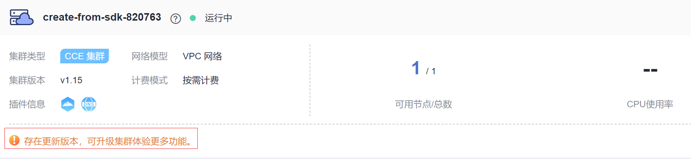

# 集群升级概述

云容器引擎（CCE）严格遵循社区一致性认证。为了能够方便您使用稳定又可靠的Kubernetes版本，请您务必在维护周期结束之前升级您的Kubernetes集群。

CCE在发布Kubernetes最新版本后，会对该版本所做的变更进行说明。

您可以通过云容器引擎管理控制台，可视化升级集群的Kubernetes版本。

升级前，您需要在集群列表页面确认集群的Kubernetes版本，以及当前是否有新的版本可供升级。

**确认方法如下：**

登录CCE控制台，查看待升级集群左下角是否存在“存在更新版本“提示，若存在则该集群支持升级，若不存在，则该集群不支持升级。

**图 1**  集群-可升级  

## 集群升级路径

如下表格详细介绍了各集群版本能够升级到的目标版本，以及升级方式和升级影响。

**表 1**  集群升级路径和影响说明

<table><thead align="left"><tr id="row089172514470"><th class="cellrowborder" valign="top" width="15.040000000000001%" id="mcps1.2.5.1.1">
源版本

</th>
<th class="cellrowborder" valign="top" width="19.54%" id="mcps1.2.5.1.2">
目标版本

</th>
<th class="cellrowborder" valign="top" width="17.02%" id="mcps1.2.5.1.3">
升级方式

</th>
<th class="cellrowborder" valign="top" width="48.4%" id="mcps1.2.5.1.4">
升级影响

</th>
</tr>
</thead>
<tbody><tr id="row19924194410388"><td class="cellrowborder" valign="top" width="15.040000000000001%" headers="mcps1.2.5.1.1 ">
v1.19

</td>
<td class="cellrowborder" valign="top" width="19.54%" headers="mcps1.2.5.1.2 ">
v1.21

</td>
<td class="cellrowborder" valign="top" width="17.02%" headers="mcps1.2.5.1.3 ">
原地升级

</td>
<td class="cellrowborder" valign="top" width="48.4%" headers="mcps1.2.5.1.4 ">
需用户自行识别各版本差异，详情请参见<a href="#section191131551162610">大版本升级须知</a>。

</td>
</tr>
<tr id="row241985117714"><td class="cellrowborder" valign="top" width="15.040000000000001%" headers="mcps1.2.5.1.1 ">
v1.17

v1.15

</td>
<td class="cellrowborder" valign="top" width="19.54%" headers="mcps1.2.5.1.2 ">
v1.19

</td>
<td class="cellrowborder" valign="top" width="17.02%" headers="mcps1.2.5.1.3 ">
原地升级

</td>
<td class="cellrowborder" valign="top" width="48.4%" headers="mcps1.2.5.1.4 ">
需用户自行识别各版本差异，详情请参见<a href="#section191131551162610">大版本升级须知</a>。

</td>
</tr>
<tr id="row8891122514474"><td class="cellrowborder" valign="top" width="15.040000000000001%" headers="mcps1.2.5.1.1 ">
v1.13

</td>
<td class="cellrowborder" valign="top" width="19.54%" headers="mcps1.2.5.1.2 ">
v1.15

</td>
<td class="cellrowborder" valign="top" width="17.02%" headers="mcps1.2.5.1.3 ">
滚动升级

重置升级

</td>
<td class="cellrowborder" valign="top" width="48.4%" headers="mcps1.2.5.1.4 "><ul id="ul93384752413"><li>coredns配置中proxy配置项不支持，需要替换成forward。</li><li>存储插件从原来的storage-driver替换成了Everest。</li></ul>
</td>
</tr>
<tr id="row8891152518474"><td class="cellrowborder" valign="top" width="15.040000000000001%" headers="mcps1.2.5.1.1 ">
v1.11

v1.9

</td>
<td class="cellrowborder" valign="top" width="19.54%" headers="mcps1.2.5.1.2 ">
Console中可创建的最新版本

</td>
<td class="cellrowborder" valign="top" width="17.02%" headers="mcps1.2.5.1.3 ">
迁移

</td>
<td class="cellrowborder" valign="top" width="48.4%" headers="mcps1.2.5.1.4 ">
需用户自行识别各版本差异，详情请参见<a href="#section191131551162610">大版本升级须知</a>。

</td>
</tr>
<tr id="row6891192511473"><td class="cellrowborder" valign="top" width="15.040000000000001%" headers="mcps1.2.5.1.1 ">
v1.9.2

v1.7

</td>
<td class="cellrowborder" valign="top" width="19.54%" headers="mcps1.2.5.1.2 ">
Console中可创建的最新版本

</td>
<td class="cellrowborder" valign="top" width="17.02%" headers="mcps1.2.5.1.3 ">
迁移

</td>
<td class="cellrowborder" valign="top" width="48.4%" headers="mcps1.2.5.1.4 ">
需用户自行识别各版本差异，详情请参见<a href="#section191131551162610">大版本升级须知</a>。

</td>
</tr>
</tbody>
</table>

## 升级方式

在集群升级过程中，Master节点的升级流程都是一致的，而Node节点的升级流程存在区别，不同升级方式的优缺点如下：

**表 2**  升级方式的区别和优缺点

<table><thead align="left"><tr id="row109098339343"><th class="cellrowborder" valign="top" width="10%" id="mcps1.2.5.1.1">
升级名称

</th>
<th class="cellrowborder" valign="top" width="30%" id="mcps1.2.5.1.2">
方式

</th>
<th class="cellrowborder" valign="top" width="30%" id="mcps1.2.5.1.3">
优点

</th>
<th class="cellrowborder" valign="top" width="30%" id="mcps1.2.5.1.4">
缺点

</th>
</tr>
</thead>
<tbody><tr id="row1275331204518"><td class="cellrowborder" valign="top" width="10%" headers="mcps1.2.5.1.1 ">
<strong id="b3729135104515">原地升级</strong>

</td>
<td class="cellrowborder" valign="top" width="30%" headers="mcps1.2.5.1.2 ">
节点上升级Kubernetes组件、网络组件和CCE管理组件，升级过程中业务Pod和网络均不受影响；升级过程中，存量节点将全部打上SchedulingDisabled标签，升级完成后，用户能够正常使用存量节点。

</td>
<td class="cellrowborder" valign="top" width="30%" headers="mcps1.2.5.1.3 ">
用户无需迁移业务，可以基本上保证业务不断。

</td>
<td class="cellrowborder" valign="top" width="30%" headers="mcps1.2.5.1.4 ">
原地升级不会升级节点的操作系统，如果希望升级操作系统，可以在节点升级完成后，清空对应的节点数据，并执行节点重置，升级到新版本的操作系统。

</td>
</tr>
<tr id="row12149149143118"><td class="cellrowborder" valign="top" width="10%" headers="mcps1.2.5.1.1 ">
<strong id="b8633172623613">滚动升级</strong>

</td>
<td class="cellrowborder" valign="top" width="30%" headers="mcps1.2.5.1.2 ">
节点上只升级Kubernetes组件以及网络部分组件，存量节点将全部打上SchedulingDisabled标签，仅保证原本运行的应用不受影响。

 须知： 
<ul id="ul818525295519"><li><strong id="b10279028143411">升级完成后，用户还需手动新建节点，并逐步释放老节点</strong>，将应用逐步迁移到新节点上，用户控制升级步骤。</li></ul>

</td>
<td class="cellrowborder" valign="top" width="30%" headers="mcps1.2.5.1.3 ">
可以基本上保证业务不断。

</td>
<td class="cellrowborder" valign="top" width="30%" headers="mcps1.2.5.1.4 "><ul id="ul14505151414115"><li><strong id="b2534144146">升级完成后，用户需手动新建节点，并逐步释放老节点，将业务迁移至新节点。</strong>该过程中，新建节点会存在额外的费用。待业务迁移至新节点后，老节点可以删除。</li></ul>
<ul id="ul861481214"><li>滚动升级完成后，如果需要继续向高版本升级，需要先完成老节点的重置，否则无法通过升级前检查。该过程可能会引起业务中断。</li></ul>
</td>
</tr>
<tr id="row391043317349"><td class="cellrowborder" valign="top" width="10%" headers="mcps1.2.5.1.1 ">
<strong id="b77711976361">重置升级</strong>

</td>
<td class="cellrowborder" valign="top" width="30%" headers="mcps1.2.5.1.2 ">
对工作节点使用最新的node镜像进行操作系统重置。

</td>
<td class="cellrowborder" valign="top" width="30%" headers="mcps1.2.5.1.3 ">
时间最短，用户介入操作也较少。

</td>
<td class="cellrowborder" valign="top" width="30%" headers="mcps1.2.5.1.4 ">
如果节点上有数据或者配置，会丢失，同样会有一段时间业务受损。

</td>
</tr>
</tbody>
</table>

## 大版本升级须知

<table><thead align="left"><tr id="row5786131912271"><th class="cellrowborder" valign="top" width="12.6%" id="mcps1.1.4.1.1">
大版本升级路径

</th>
<th class="cellrowborder" valign="top" width="42.370000000000005%" id="mcps1.1.4.1.2">
版本差异

</th>
<th class="cellrowborder" valign="top" width="45.03%" id="mcps1.1.4.1.3">
建议自检措施

</th>
</tr>
</thead>
<tbody><tr id="row976811212456"><td class="cellrowborder" rowspan="2" valign="top" width="12.6%" headers="mcps1.1.4.1.1 ">
v1.19升级至v1.21

</td>
<td class="cellrowborder" valign="top" width="42.370000000000005%" headers="mcps1.1.4.1.2 ">
Kubernetes v1.21集群版本修复 了exec probe timeouts不生效的BUG，在此修复之前，exec 探测器不考虑 timeoutSeconds 字段。相反，探测将无限期运行，甚至超过其配置的截止日期，直到返回结果。 若用户未配置，默认值为1秒。升级后此字段生效，如果探测时间超过1秒，可能会导致应用健康检查失败并频繁重启。

</td>
<td class="cellrowborder" valign="top" width="45.03%" headers="mcps1.1.4.1.3 ">
升级前检查您使用了exec probe的应用的probe timeouts是否合理。

</td>
</tr>
<tr id="row129432109456"><td class="cellrowborder" valign="top" headers="mcps1.1.4.1.1 ">
CCE的v1.19及以上版本的kube-apiserver要求客户侧webhook server的证书必须配置Subject Alternative Names (SAN)字段。否则升级后kube-apiserver调用webhook server失败，容器无法正常启动。

根因：Go语言v1.15版本废弃了X.509 <a href="https://golang.google.cn/doc/go1.15#commonname" target="_blank" rel="noopener noreferrer">CommonName</a>，CCE的v1.19版本的kube-apiserver编译的版本为v1.15，若客户的webhook证书没有Subject Alternative Names (SAN)，kube-apiserver不再默认将X509证书的CommonName字段作为hostname处理，最终导致认证失败。

</td>
<td class="cellrowborder" valign="top" headers="mcps1.1.4.1.2 ">
升级前检查您自建webhook server的证书是否配置了SAN字段。

<ul id="ul6381101434513"><li>若无自建webhook server则不涉及。</li><li>若未配置，建议您配置使用SAN字段指定证书支持的IP及域名。</li></ul>
</td>
</tr>
<tr id="row37702011134510"><td class="cellrowborder" rowspan="4" valign="top" width="12.6%" headers="mcps1.1.4.1.1 ">
v1.15升级至v1.19

</td>
<td class="cellrowborder" valign="top" width="42.370000000000005%" headers="mcps1.1.4.1.2 ">
CCE v1.19版本的控制面与v1.15版本的Kubelet存在兼容性问题。若Master节点升级成功后，节点升级失败或待升级节点发生重启，则节点有极大概率为NotReady状态。

主要原因为升级失败的节点有大概率重启kubelet而触发节点注册流程，v1.15 kubelet默认注册标签（failure-domain.beta.kubernetes.io/is-baremetal和kubernetes.io/availablezone）被v1.19版本kube-apiserver视为非法标签。

v1.19版本中对应的合法标签为node.kubernetes.io/baremetal和failure-domain.beta.kubernetes.io/zone。

</td>
<td class="cellrowborder" valign="top" width="45.03%" headers="mcps1.1.4.1.3 "><ol id="ol6328121174611"><li>正常升级流程不会触发此场景。</li><li>在Master升级完成后尽量避免使用暂停升级功能，快速升级完Node节点。</li><li>若Node节点升级失败且无法修复，请尽快驱逐此节点上的应用，请联系技术支持人员，跳过此节点升级，在整体升级完毕后，重置该节点。</li></ol>
</td>
</tr>
<tr id="row71567126452"><td class="cellrowborder" valign="top" headers="mcps1.1.4.1.1 ">
CCE的v1.15版本集群及v1.19版本集群将docker的存储驱动文件系统由 xfs切换成ext4，可能会导致升级后的java应用Pod内的import包顺序异常，既而导致Pod异常。

</td>
<td class="cellrowborder" valign="top" headers="mcps1.1.4.1.2 ">
升级前查看节点上docker配置文件/etc/docker/daemon.json。检查dm.fs配置项是否为xfs。

<ul id="ul18328141164618"><li>若为ext4或存储驱动为overlay则不涉及。</li><li>若为xfs则建议您在新版本集群预先部署应用，以测试应用与新版本集群是否兼容。</li></ul>
<pre class="screen" id="screen20328211104610">{
      "storage-driver": "devicemapper",
      "storage-opts": [
      "dm.thinpooldev=/dev/mapper/vgpaas-thinpool",
      "dm.use_deferred_removal=true",
      "dm.fs=xfs",
      "dm.use_deferred_deletion=true"
      ]
}</pre>
</td>
</tr>
<tr id="row1456761216454"><td class="cellrowborder" valign="top" headers="mcps1.1.4.1.1 ">
CCE的v1.19及以上版本的kube-apiserver要求客户侧webhook server的证书必须配置Subject Alternative Names (SAN)字段。否则升级后kube-apiserver调用webhook server失败，容器无法正常启动。

根因：Go语言v1.15版本废弃了X.509 <a href="https://golang.google.cn/doc/go1.15#commonname" target="_blank" rel="noopener noreferrer">CommonName</a>，CCE的v1.19版本的kube-apiserver编译的版本为v1.15。CommonName字段作为hostname处理，最终导致认证失败。

</td>
<td class="cellrowborder" valign="top" headers="mcps1.1.4.1.2 ">
升级前检查您自建webhook server的证书是否配置了SAN字段。

<ul id="ul03291711184620"><li>若无自建webhook server则不涉及。</li><li>若未配置，建议您配置使用SAN字段指定证书支持的IP及域名。</li></ul>

 须知： 

为减弱此版本差异对集群升级的影响，v1.15升级至v1.19时，CCE会进行特殊处理，仍然会兼容支持证书不带SAN。但后续升级不再特殊处理，请尽快整改证书，以避免影响后续升级。

</td>
</tr>
<tr id="row109371087465"><td class="cellrowborder" valign="top" headers="mcps1.1.4.1.1 ">
v1.17.17版本及以后的集群CCE自动给用户创建了PSP规则，限制了不安全配置的Pod的创建，如securityContext配置了sysctl的net.core.somaxconn的Pod。

</td>
<td class="cellrowborder" valign="top" headers="mcps1.1.4.1.2 ">
升级后请参考资料按需开放非安全系统配置，具体请参见<a href="PodSecurityPolicy配置.md">PodSecurityPolicy配置</a>。

</td>
</tr>
<tr id="row1635249104620"><td class="cellrowborder" valign="top" width="12.6%" headers="mcps1.1.4.1.1 ">
v1.13升级至v1.15

</td>
<td class="cellrowborder" valign="top" width="42.370000000000005%" headers="mcps1.1.4.1.2 ">
vpc集群升级后，由于网络组件的升级，master节点会额外占一个网段。在Master占用了网段后，无可用容器网段时，新建节点无法分配到网段，调度在该节点的pod会无法运行。

</td>
<td class="cellrowborder" valign="top" width="45.03%" headers="mcps1.1.4.1.3 ">
一般集群内节点数量快占满容器网段场景下会出现该问题。例如，容器网段为10.0.0.0/16，可用IP数量为65536，VPC网络IP分配是分配固定大小的网段（使用掩码实现，确定每个节点最多分配多少容器IP），例如上限为128，则此时集群最多支撑65536/128=512个节点，然后去掉Master节点数量为509，此时是1.13集群支持的节点数。集群升级后，在此基础上3台Master节点会各占用1个网段，最终结果就是506台节点。

</td>
</tr>
</tbody>
</table>

