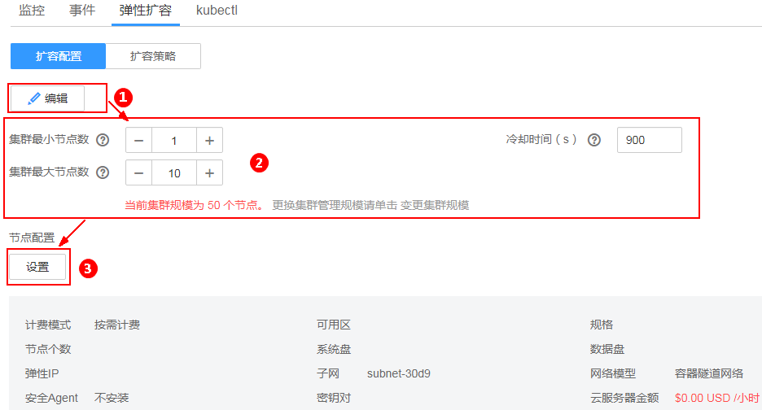

# 集群弹性扩容

## 操作场景

通过云容器引擎管理控制台，您可以根据实际业务需要对集群的工作节点进行扩容和缩容，当集群中出现由于资源不足而无法调度的工作负载时自动触发扩容，从而减少人力成本。

## 约束与限制

-   该功能仅支持通过**按需计费**方式购买的**虚拟机节点**，不支持“包年/包月“方式购买的节点和裸金属节点。
-   目前不支持集群中Master节点的扩容和缩容。
-   如果您有集群自动扩缩容的需求，请通过autoscaler插件实现，具体请参见[autoscaler](autoscaler.md)。
-   v1.17及以上版本的集群不再支持AOM提供的弹性伸缩机制，请使用节点池功能进行弹性伸缩，详情请参见[节点池概述](节点池概述.md)。

## 集群自动扩容

1.  登录[CCE控制台](https://console.huaweicloud.com/cce2.0/?utm_source=helpcenter)，在左侧导航栏中选择“资源管理 \> 集群管理”，单击待设置伸缩策略集群下的“更多 \> 弹性扩容”。
2.  在“扩容配置“页签，单击“编辑“，为集群的弹性扩容设置冷却时间、集群最大节点数和节点配置。

    **图 1**  集群自动扩容  
    

    **表 1**  扩容配置

    
    <table><thead align="left"><tr id="row6495428016271"><th class="cellrowborder" valign="top" width="26%" id="mcps1.2.3.1.1">
参数

    </th>
    <th class="cellrowborder" valign="top" width="74%" id="mcps1.2.3.1.2">
参数说明

    </th>
    </tr>
    </thead>
    <tbody><tr id="row264735262215"><td class="cellrowborder" valign="top" width="26%" headers="mcps1.2.3.1.1 ">
冷却时间

    </td>
    <td class="cellrowborder" valign="top" width="74%" headers="mcps1.2.3.1.2 ">
扩容策略执行后停止继续匹配的时间，目的是等待扩容动作完成后在系统稳定且集群正常的情况下进行下一次策略匹配。

    
取值范围为：60秒~3600秒，默认为900秒。由于节点创建时间需要2-10分钟，冷却时间小于900秒可能无法达到预期。

    </td>
    </tr>
    <tr id="row559783816271"><td class="cellrowborder" valign="top" width="26%" headers="mcps1.2.3.1.1 ">
单次扩容节点数上限

    </td>
    <td class="cellrowborder" valign="top" width="74%" headers="mcps1.2.3.1.2 ">
扩容策略执行时，集群下最大节点数。

    
例如集群最大节点数为x，取值范围：1≤x&lt;集群节点配额。

    
 说明： 

集群节点配额受两处限制，一是集群的规模，即单集群的节点数量。二是帐户的节点配额。此处的集群节点配额数，取两处限制中配额较少的。

    

    </td>
    </tr>
    <tr id="row3382856916271"><td class="cellrowborder" valign="top" width="26%" headers="mcps1.2.3.1.1 ">
节点配置

    </td>
    <td class="cellrowborder" valign="top" width="74%" headers="mcps1.2.3.1.2 ">
如果扩容策略执行后需要扩容，则系统会创建节点。

    <ol id="ol62317823171235"><li>单击“设置”，配置创建节点的各项参数。创建节点的参数配置请参见<a href="购买节点.md#li082810235392">购买节点</a>。此处计费方式只能选择按需计费。</li><li>完成节点配置后，单击“提交”。</li></ol>
    </td>
    </tr>
    </tbody>
    </table>

3.  确认扩容配置及节点参数后，单击“确定“。
4.  为集群设置扩容策略，选择“扩容策略“页签，单击“添加扩容策略“。
    -   策略名称：自定义策略名称，例如policy01。
    -   选择“策略类型“，当前支持三种弹性扩容策略：
        -   [告警策略](#table23209107191540)：支持根据集群CPU/内存分配量的设置，进行集群的自动扩容。

            **表 2**  添加告警策略

            
            <table><thead align="left"><tr id="row64542335191540"><th class="cellrowborder" valign="top" width="26%" id="mcps1.2.3.1.1">
参数

            </th>
            <th class="cellrowborder" valign="top" width="74%" id="mcps1.2.3.1.2">
参数说明

            </th>
            </tr>
            </thead>
            <tbody><tr id="row29097928191540"><td class="cellrowborder" valign="top" width="26%" headers="mcps1.2.3.1.1 ">
* 指标

            </td>
            <td class="cellrowborder" valign="top" width="74%" headers="mcps1.2.3.1.2 ">
支持“CPU分配量”指标和“内存分配量”指标。

            </td>
            </tr>
            <tr id="row32017871191540"><td class="cellrowborder" valign="top" width="26%" headers="mcps1.2.3.1.1 ">
* 触发条件

            </td>
            <td class="cellrowborder" valign="top" width="74%" headers="mcps1.2.3.1.2 ">
设置触发扩容策略的条件，即CPU或内存的分配量的平均值大于或小于某个百分比数，将触发扩容。

            </td>
            </tr>
            <tr id="row32372174191540"><td class="cellrowborder" valign="top" width="26%" headers="mcps1.2.3.1.1 ">
* 监控窗口

            </td>
            <td class="cellrowborder" valign="top" width="74%" headers="mcps1.2.3.1.2 ">
数据的汇聚窗口大小。单击下拉选项进行选择。

            
若设置为15分钟，表示每15分钟监控一次。

            </td>
            </tr>
            <tr id="row6889597191540"><td class="cellrowborder" valign="top" width="26%" headers="mcps1.2.3.1.1 ">
* 连续周期

            </td>
            <td class="cellrowborder" valign="top" width="74%" headers="mcps1.2.3.1.2 ">
指监控窗口内连续触发阈值的次数，计算周期固定一分钟。若设置为3，则表示指标数据连续三个监控窗口达到了设定的阈值，则触发策略动作。

            </td>
            </tr>
            <tr id="row9891794191540"><td class="cellrowborder" valign="top" width="26%" headers="mcps1.2.3.1.1 ">
* 执行操作

            </td>
            <td class="cellrowborder" valign="top" width="74%" headers="mcps1.2.3.1.2 ">
策略触发后执行的动作。

            </td>
            </tr>
            </tbody>
            </table>

        -   [定时策略](#table62540231191540)：支持在特定时间点进行集群的自动扩容。

            **表 3**  添加定时策略

            
            <table><thead align="left"><tr id="row39885138191540"><th class="cellrowborder" valign="top" width="26%" id="mcps1.2.3.1.1">
参数

            </th>
            <th class="cellrowborder" valign="top" width="74%" id="mcps1.2.3.1.2">
参数说明

            </th>
            </tr>
            </thead>
            <tbody><tr id="row3287219191540"><td class="cellrowborder" valign="top" width="26%" headers="mcps1.2.3.1.1 ">
* 策略类型

            </td>
            <td class="cellrowborder" valign="top" width="74%" headers="mcps1.2.3.1.2 ">
选择定时策略。

            </td>
            </tr>
            <tr id="row28191528191540"><td class="cellrowborder" valign="top" width="26%" headers="mcps1.2.3.1.1 ">
* 触发时间

            </td>
            <td class="cellrowborder" valign="top" width="74%" headers="mcps1.2.3.1.2 ">
策略触发时间。

            </td>
            </tr>
            <tr id="row46171925191540"><td class="cellrowborder" valign="top" width="26%" headers="mcps1.2.3.1.1 ">
* 执行操作

            </td>
            <td class="cellrowborder" valign="top" width="74%" headers="mcps1.2.3.1.2 ">
策略触发后执行的动作。

            </td>
            </tr>
            </tbody>
            </table>

        -   [周期策略](#table60088509191540)：支持以天、周、月为周期的扩容策略。

            **表 4**  添加周期策略

            
            <table><thead align="left"><tr id="row12838474191540"><th class="cellrowborder" valign="top" width="26%" id="mcps1.2.3.1.1">
参数

            </th>
            <th class="cellrowborder" valign="top" width="74%" id="mcps1.2.3.1.2">
参数说明

            </th>
            </tr>
            </thead>
            <tbody><tr id="row4159900191540"><td class="cellrowborder" valign="top" width="26%" headers="mcps1.2.3.1.1 ">
* 策略类型

            </td>
            <td class="cellrowborder" valign="top" width="74%" headers="mcps1.2.3.1.2 ">
选择周期策略。

            </td>
            </tr>
            <tr id="row19533571191540"><td class="cellrowborder" valign="top" width="26%" headers="mcps1.2.3.1.1 ">
* 选择时间

            </td>
            <td class="cellrowborder" valign="top" width="74%" headers="mcps1.2.3.1.2 ">
选择策略触发的时间。

            </td>
            </tr>
            <tr id="row37818973191540"><td class="cellrowborder" valign="top" width="26%" headers="mcps1.2.3.1.1 ">
* 执行操作

            </td>
            <td class="cellrowborder" valign="top" width="74%" headers="mcps1.2.3.1.2 ">
策略触发后执行的动作。

            </td>
            </tr>
            </tbody>
            </table>

5.  单击“确定“。

    伸缩完成后，在左侧导航栏中选择“资源管理 \> 节点管理“，在查看节点列表页面，可查看到扩容的工作节点。

