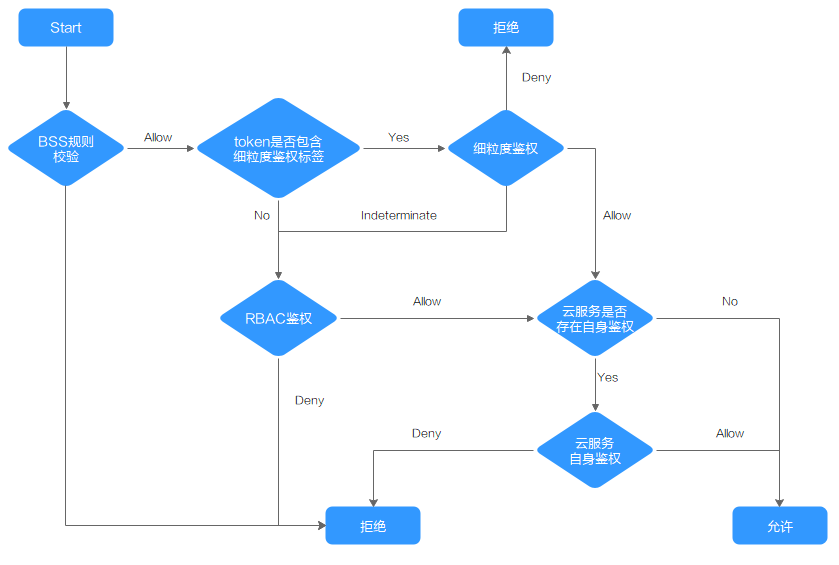

# 集群权限（IAM授权）<a name="cce_10_0188"></a>

CCE集群权限是基于IAM**系统策略**和**自定义策略**的授权，可以通过用户组功能实现IAM用户的授权。

> **注意：** 
>集群权限仅针对与集群相关的资源（如集群、节点等）有效，您必须确保同时配置了[命名空间权限](命名空间权限（Kubernetes-RBAC授权）.md)，才能有操作Kubernetes资源（如工作负载、Service等）的权限。

## 前提条件<a name="section16601203895318"></a>

-   给用户组授权之前，请您了解用户组可以添加的CCE系统策略，并结合实际需求进行选择，CCE支持的系统策略及策略间的对比，请参见[CCE系统权限](https://support.huaweicloud.com/productdesc-cce/cce_productdesc_0002.html)。若您需要对除CCE之外的其它服务授权，IAM支持服务的所有策略请参见[系统权限](https://support.huaweicloud.com/usermanual-permissions/iam_01_0001.html)。
-   拥有Security Administrator（IAM除切换角色外所有权限）权限的用户（如账号默认拥有此权限），才能看见CCE控制台权限管理页面当前用户组及用户组所拥有的权限。

## 配置说明<a name="section638994317105"></a>

CCE控制台“权限管理 \> 集群权限“页面中创建用户组和具体权限设置均是跳转到IAM控制台进行具体操作，设置完后在集群权限页面能看到用户组所拥有的权限。本章节描述操作直接以IAM中操作为主，不重复介绍在CCE控制台如何跳转。

## 示例流程<a name="section1189416161520"></a>

**图 1**  给用户授予CCE权限流程<a name="fig1351611812271"></a>  


1.  <a name="li10176121316284"></a>[创建用户组并授权](https://support.huaweicloud.com/usermanual-iam/iam_03_0001.html)。

    在IAM控制台创建用户组，并授予CCE权限，例如CCEReadOnlyAccess。

    > **说明：** 
    >CCE服务按区域部署，在IAM控制台授予CCE权限时请选择“区域级项目“。

2.  [创建用户并加入用户组](https://support.huaweicloud.com/usermanual-iam/iam_02_0001.html)。

    在IAM控制台创建用户，并将其加入[1](#li10176121316284)中创建的用户组。

3.  [用户登录](https://support.huaweicloud.com/usermanual-iam/iam_01_0552.html)并验证权限。

    新创建的用户登录控制台，切换至授权区域，验证权限：

    -   在“服务列表”中选择云容器引擎，进入CCE主界面，单击右上角“购买Kubernetes集群”，如果无法无法成功操作（假设当前权限仅包含CCEReadOnlyAccess），表示“CCEReadOnlyAccess”已生效。
    -   在“服务列表”中选择除云容器引擎外（假设当前策略仅包含CCEReadOnlyAccess）的任一服务，若提示权限不足，表示“CCEReadOnlyAccess”已生效。


## 系统角色<a name="section027554371316"></a>

角色是IAM最初提供的一种根据用户的工作职能定义权限的粗粒度授权机制。该机制以服务为粒度，提供有限的服务相关角色用于授权。角色并不能满足用户对精细化授权的要求，无法完全达到企业对权限最小化的安全管控要求。

IAM中预置的CCE系统角色为**CCEAdministrator**，给用户组授予该系统角色权限时，必须同时勾选该角色依赖的其他策略才会生效，例如Tenant Guest、Server Administrator、ELB Administrator、OBS Administrator、SFS Administrator、SWR Admin、APM FullAccess。了解更多角色依赖关系，请参考：[系统权限](https://support.huaweicloud.com/usermanual-permissions/iam_01_0001.html)。

## 系统策略<a name="section19693172419122"></a>

IAM中预置的CCE系统策略当前包含**CCEFullAccess**和**CCEReadOnlyAccess**两种策略：

-   **CCE FullAccess**：系统策略，CCE服务集群相关资源的普通操作权限，不包括集群（启用Kubernetes RBAC鉴权）的命名空间权限，不包括委托授权、生成集群证书等管理员角色的特权操作。
-   **CCE ReadOnlyAccess：**系统策略，CCE服务集群相关资源的只读权限，不包括集群（启用Kubernetes RBAC鉴权）的命名空间权限。

**表 1**  CCEFullAccess策略主要权限

<a name="table65762630"></a>
<table><thead align="left"><tr id="row64098000"><th class="cellrowborder" valign="top" width="20.4%" id="mcps1.2.4.1.1"><p id="p324219918470"><a name="p324219918470"></a><a name="p324219918470"></a>操作（Action）</p>
</th>
<th class="cellrowborder" valign="top" width="26.6%" id="mcps1.2.4.1.2"><p id="p181345334206"><a name="p181345334206"></a><a name="p181345334206"></a>Action详情</p>
</th>
<th class="cellrowborder" valign="top" width="53%" id="mcps1.2.4.1.3"><p id="p24555510"><a name="p24555510"></a><a name="p24555510"></a>说明</p>
</th>
</tr>
</thead>
<tbody><tr id="row33671837142011"><td class="cellrowborder" rowspan="43" valign="top" width="20.4%" headers="mcps1.2.4.1.1 "><p id="p1224309164711"><a name="p1224309164711"></a><a name="p1224309164711"></a>cce:*:*</p>
</td>
<td class="cellrowborder" valign="top" width="26.6%" headers="mcps1.2.4.1.2 "><p id="p1676861712325"><a name="p1676861712325"></a><a name="p1676861712325"></a>cce:cluster:create</p>
</td>
<td class="cellrowborder" valign="top" width="53%" headers="mcps1.2.4.1.3 "><p id="p17681517143220"><a name="p17681517143220"></a><a name="p17681517143220"></a>创建集群</p>
</td>
</tr>
<tr id="row1136803716207"><td class="cellrowborder" valign="top" headers="mcps1.2.4.1.1 "><p id="p476951710329"><a name="p476951710329"></a><a name="p476951710329"></a>cce:cluster:delete</p>
</td>
<td class="cellrowborder" valign="top" headers="mcps1.2.4.1.2 "><p id="p15769181710326"><a name="p15769181710326"></a><a name="p15769181710326"></a>删除集群</p>
</td>
</tr>
<tr id="row236893713200"><td class="cellrowborder" valign="top" headers="mcps1.2.4.1.1 "><p id="p1876918172329"><a name="p1876918172329"></a><a name="p1876918172329"></a>cce:cluster:update</p>
</td>
<td class="cellrowborder" valign="top" headers="mcps1.2.4.1.2 "><p id="p157698171326"><a name="p157698171326"></a><a name="p157698171326"></a>更新集群，如后续允许集群支持RBAC，调度参数更新等</p>
</td>
</tr>
<tr id="row14369237182014"><td class="cellrowborder" valign="top" headers="mcps1.2.4.1.1 "><p id="p1876971713322"><a name="p1876971713322"></a><a name="p1876971713322"></a>cce:cluster:upgrade</p>
</td>
<td class="cellrowborder" valign="top" headers="mcps1.2.4.1.2 "><p id="p16770181763217"><a name="p16770181763217"></a><a name="p16770181763217"></a>升级集群</p>
</td>
</tr>
<tr id="row336911371201"><td class="cellrowborder" valign="top" headers="mcps1.2.4.1.1 "><p id="p20770131713323"><a name="p20770131713323"></a><a name="p20770131713323"></a>cce:cluster:start</p>
</td>
<td class="cellrowborder" valign="top" headers="mcps1.2.4.1.2 "><p id="p97708172320"><a name="p97708172320"></a><a name="p97708172320"></a>唤醒集群</p>
</td>
</tr>
<tr id="row10369173792011"><td class="cellrowborder" valign="top" headers="mcps1.2.4.1.1 "><p id="p6770111743216"><a name="p6770111743216"></a><a name="p6770111743216"></a>cce:cluster:stop</p>
</td>
<td class="cellrowborder" valign="top" headers="mcps1.2.4.1.2 "><p id="p477121710323"><a name="p477121710323"></a><a name="p477121710323"></a>休眠集群</p>
</td>
</tr>
<tr id="row9371153720209"><td class="cellrowborder" valign="top" headers="mcps1.2.4.1.1 "><p id="p10772181753213"><a name="p10772181753213"></a><a name="p10772181753213"></a>cce:cluster:list</p>
</td>
<td class="cellrowborder" valign="top" headers="mcps1.2.4.1.2 "><p id="p10772817153214"><a name="p10772817153214"></a><a name="p10772817153214"></a>查询集群列表</p>
</td>
</tr>
<tr id="row1337193719205"><td class="cellrowborder" valign="top" headers="mcps1.2.4.1.1 "><p id="p1377251712329"><a name="p1377251712329"></a><a name="p1377251712329"></a>cce:cluster:get</p>
</td>
<td class="cellrowborder" valign="top" headers="mcps1.2.4.1.2 "><p id="p1877361717328"><a name="p1877361717328"></a><a name="p1877361717328"></a>查询集群详情</p>
</td>
</tr>
<tr id="row183721437152013"><td class="cellrowborder" valign="top" headers="mcps1.2.4.1.1 "><p id="p27731617163219"><a name="p27731617163219"></a><a name="p27731617163219"></a>cce:node:create</p>
</td>
<td class="cellrowborder" valign="top" headers="mcps1.2.4.1.2 "><p id="p107738172328"><a name="p107738172328"></a><a name="p107738172328"></a>添加节点</p>
</td>
</tr>
<tr id="row1337223782012"><td class="cellrowborder" valign="top" headers="mcps1.2.4.1.1 "><p id="p20773017103210"><a name="p20773017103210"></a><a name="p20773017103210"></a>cce:node:delete</p>
</td>
<td class="cellrowborder" valign="top" headers="mcps1.2.4.1.2 "><p id="p10774717183215"><a name="p10774717183215"></a><a name="p10774717183215"></a>删除节点/批量删除节点</p>
</td>
</tr>
<tr id="row537316378201"><td class="cellrowborder" valign="top" headers="mcps1.2.4.1.1 "><p id="p1177471718323"><a name="p1177471718323"></a><a name="p1177471718323"></a>cce:node:update</p>
</td>
<td class="cellrowborder" valign="top" headers="mcps1.2.4.1.2 "><p id="p187751317163218"><a name="p187751317163218"></a><a name="p187751317163218"></a>更新节点，如更新节点名称</p>
</td>
</tr>
<tr id="row9374137182017"><td class="cellrowborder" valign="top" headers="mcps1.2.4.1.1 "><p id="p077512178326"><a name="p077512178326"></a><a name="p077512178326"></a>cce:node:get</p>
</td>
<td class="cellrowborder" valign="top" headers="mcps1.2.4.1.2 "><p id="p2775131773214"><a name="p2775131773214"></a><a name="p2775131773214"></a>查询节点详情</p>
</td>
</tr>
<tr id="row95581429192015"><td class="cellrowborder" valign="top" headers="mcps1.2.4.1.1 "><p id="p1777551743217"><a name="p1777551743217"></a><a name="p1777551743217"></a>cce:node:list</p>
</td>
<td class="cellrowborder" valign="top" headers="mcps1.2.4.1.2 "><p id="p5775181718326"><a name="p5775181718326"></a><a name="p5775181718326"></a>查询节点列表</p>
</td>
</tr>
<tr id="row1914318344411"><td class="cellrowborder" valign="top" headers="mcps1.2.4.1.1 "><p id="p914473124410"><a name="p914473124410"></a><a name="p914473124410"></a>cce:nodepool:create</p>
</td>
<td class="cellrowborder" valign="top" headers="mcps1.2.4.1.2 "><p id="p1144239447"><a name="p1144239447"></a><a name="p1144239447"></a>创建节点池</p>
</td>
</tr>
<tr id="row16144535448"><td class="cellrowborder" valign="top" headers="mcps1.2.4.1.1 "><p id="p121445318449"><a name="p121445318449"></a><a name="p121445318449"></a>cce:nodepool:delete</p>
</td>
<td class="cellrowborder" valign="top" headers="mcps1.2.4.1.2 "><p id="p121444394412"><a name="p121444394412"></a><a name="p121444394412"></a>删除节点池</p>
</td>
</tr>
<tr id="row61441833448"><td class="cellrowborder" valign="top" headers="mcps1.2.4.1.1 "><p id="p111448311448"><a name="p111448311448"></a><a name="p111448311448"></a>cce:nodepool:update</p>
</td>
<td class="cellrowborder" valign="top" headers="mcps1.2.4.1.2 "><p id="p191444364417"><a name="p191444364417"></a><a name="p191444364417"></a>更新节点池信息</p>
</td>
</tr>
<tr id="row499073764515"><td class="cellrowborder" valign="top" headers="mcps1.2.4.1.1 "><p id="p1999016373456"><a name="p1999016373456"></a><a name="p1999016373456"></a>cce:nodepool:get</p>
</td>
<td class="cellrowborder" valign="top" headers="mcps1.2.4.1.2 "><p id="p799033714519"><a name="p799033714519"></a><a name="p799033714519"></a>获取节点池</p>
</td>
</tr>
<tr id="row9431181915473"><td class="cellrowborder" valign="top" headers="mcps1.2.4.1.1 "><p id="p5431719184710"><a name="p5431719184710"></a><a name="p5431719184710"></a>cce:nodepool:list</p>
</td>
<td class="cellrowborder" valign="top" headers="mcps1.2.4.1.2 "><p id="p18431121911478"><a name="p18431121911478"></a><a name="p18431121911478"></a>列出集群的所有节点池</p>
</td>
</tr>
<tr id="row914413315449"><td class="cellrowborder" valign="top" headers="mcps1.2.4.1.1 "><p id="p8144136444"><a name="p8144136444"></a><a name="p8144136444"></a>cce:release:create</p>
</td>
<td class="cellrowborder" valign="top" headers="mcps1.2.4.1.2 "><p id="p1814417319447"><a name="p1814417319447"></a><a name="p1814417319447"></a>创建模板实例</p>
</td>
</tr>
<tr id="row1814417316444"><td class="cellrowborder" valign="top" headers="mcps1.2.4.1.1 "><p id="p31443364413"><a name="p31443364413"></a><a name="p31443364413"></a>cce:release:delete</p>
</td>
<td class="cellrowborder" valign="top" headers="mcps1.2.4.1.2 "><p id="p11144173174410"><a name="p11144173174410"></a><a name="p11144173174410"></a>删除模板实例</p>
</td>
</tr>
<tr id="row514416354416"><td class="cellrowborder" valign="top" headers="mcps1.2.4.1.1 "><p id="p131441838447"><a name="p131441838447"></a><a name="p131441838447"></a>cce:release:update</p>
</td>
<td class="cellrowborder" valign="top" headers="mcps1.2.4.1.2 "><p id="p014414312443"><a name="p014414312443"></a><a name="p014414312443"></a>更新升级模板实例</p>
</td>
</tr>
<tr id="row4559162992016"><td class="cellrowborder" valign="top" headers="mcps1.2.4.1.1 "><p id="p177641773220"><a name="p177641773220"></a><a name="p177641773220"></a>cce:job:list</p>
</td>
<td class="cellrowborder" valign="top" headers="mcps1.2.4.1.2 "><p id="p17776517113217"><a name="p17776517113217"></a><a name="p17776517113217"></a>查询任务列表（集群层面的job）</p>
</td>
</tr>
<tr id="row195591929132018"><td class="cellrowborder" valign="top" headers="mcps1.2.4.1.1 "><p id="p1877691723215"><a name="p1877691723215"></a><a name="p1877691723215"></a>cce:job:delete</p>
</td>
<td class="cellrowborder" valign="top" headers="mcps1.2.4.1.2 "><p id="p2777817153217"><a name="p2777817153217"></a><a name="p2777817153217"></a>删除任务/批量删除任务（集群层面的job）</p>
</td>
</tr>
<tr id="row2056082962010"><td class="cellrowborder" valign="top" headers="mcps1.2.4.1.1 "><p id="p77771517193210"><a name="p77771517193210"></a><a name="p77771517193210"></a>cce:job:get</p>
</td>
<td class="cellrowborder" valign="top" headers="mcps1.2.4.1.2 "><p id="p777718179327"><a name="p777718179327"></a><a name="p777718179327"></a>查询任务详情（集群层面的job）</p>
</td>
</tr>
<tr id="row176811342112812"><td class="cellrowborder" valign="top" headers="mcps1.2.4.1.1 "><p id="p568154232816"><a name="p568154232816"></a><a name="p568154232816"></a><span>cce:storage:create</span></p>
</td>
<td class="cellrowborder" valign="top" headers="mcps1.2.4.1.2 "><p id="p16681642142819"><a name="p16681642142819"></a><a name="p16681642142819"></a>创建存储</p>
</td>
</tr>
<tr id="row144241133183716"><td class="cellrowborder" valign="top" headers="mcps1.2.4.1.1 "><p id="p6432636162813"><a name="p6432636162813"></a><a name="p6432636162813"></a><span>cce:storage:delete</span></p>
</td>
<td class="cellrowborder" valign="top" headers="mcps1.2.4.1.2 "><p id="p9432133662812"><a name="p9432133662812"></a><a name="p9432133662812"></a>删除存储</p>
</td>
</tr>
<tr id="row3355164418478"><td class="cellrowborder" valign="top" headers="mcps1.2.4.1.1 "><p id="p2682173554714"><a name="p2682173554714"></a><a name="p2682173554714"></a>cce:storage:list</p>
</td>
<td class="cellrowborder" valign="top" headers="mcps1.2.4.1.2 "><p id="p835594434714"><a name="p835594434714"></a><a name="p835594434714"></a>列出所有磁盘</p>
</td>
</tr>
<tr id="row24251433153719"><td class="cellrowborder" valign="top" headers="mcps1.2.4.1.1 "><p id="p1942513313716"><a name="p1942513313716"></a><a name="p1942513313716"></a>cce:addonInstance:create</p>
</td>
<td class="cellrowborder" valign="top" headers="mcps1.2.4.1.2 "><p id="p13425143353719"><a name="p13425143353719"></a><a name="p13425143353719"></a>创建插件实例</p>
</td>
</tr>
<tr id="row12425133313713"><td class="cellrowborder" valign="top" headers="mcps1.2.4.1.1 "><p id="p19425183313375"><a name="p19425183313375"></a><a name="p19425183313375"></a>cce:addonInstance:delete</p>
</td>
<td class="cellrowborder" valign="top" headers="mcps1.2.4.1.2 "><p id="p442553323710"><a name="p442553323710"></a><a name="p442553323710"></a>删除插件实例</p>
</td>
</tr>
<tr id="row16425103313718"><td class="cellrowborder" valign="top" headers="mcps1.2.4.1.1 "><p id="p84257339376"><a name="p84257339376"></a><a name="p84257339376"></a>cce:addonInstance:update</p>
</td>
<td class="cellrowborder" valign="top" headers="mcps1.2.4.1.2 "><p id="p1842514334379"><a name="p1842514334379"></a><a name="p1842514334379"></a>更新升级插件实例</p>
</td>
</tr>
<tr id="row1426112615456"><td class="cellrowborder" valign="top" headers="mcps1.2.4.1.1 "><p id="p1526117684510"><a name="p1526117684510"></a><a name="p1526117684510"></a>cce:addonInstance:get</p>
</td>
<td class="cellrowborder" valign="top" headers="mcps1.2.4.1.2 "><p id="p1626110617458"><a name="p1626110617458"></a><a name="p1626110617458"></a>获取插件实例</p>
</td>
</tr>
<tr id="row162611865459"><td class="cellrowborder" valign="top" headers="mcps1.2.4.1.1 "><p id="p1826166114519"><a name="p1826166114519"></a><a name="p1826166114519"></a>cce:addonTemplate:get</p>
</td>
<td class="cellrowborder" valign="top" headers="mcps1.2.4.1.2 "><p id="p42611061459"><a name="p42611061459"></a><a name="p42611061459"></a>获取插件模板</p>
</td>
</tr>
<tr id="row193503486466"><td class="cellrowborder" valign="top" headers="mcps1.2.4.1.1 "><p id="p3350174817468"><a name="p3350174817468"></a><a name="p3350174817468"></a>cce:addonInstance:list</p>
</td>
<td class="cellrowborder" valign="top" headers="mcps1.2.4.1.2 "><p id="p1350174804617"><a name="p1350174804617"></a><a name="p1350174804617"></a>列出所有插件实例</p>
</td>
</tr>
<tr id="row43501948114612"><td class="cellrowborder" valign="top" headers="mcps1.2.4.1.1 "><p id="p435064819462"><a name="p435064819462"></a><a name="p435064819462"></a>cce:addonTemplate:list</p>
</td>
<td class="cellrowborder" valign="top" headers="mcps1.2.4.1.2 "><p id="p14350134816468"><a name="p14350134816468"></a><a name="p14350134816468"></a>列出所有插件模板</p>
</td>
</tr>
<tr id="row3350144820467"><td class="cellrowborder" valign="top" headers="mcps1.2.4.1.1 "><p id="p83501148104611"><a name="p83501148104611"></a><a name="p83501148104611"></a>cce:chart:list</p>
</td>
<td class="cellrowborder" valign="top" headers="mcps1.2.4.1.2 "><p id="p1335017488468"><a name="p1335017488468"></a><a name="p1335017488468"></a>列出所有模板</p>
</td>
</tr>
<tr id="row1442517335378"><td class="cellrowborder" valign="top" headers="mcps1.2.4.1.1 "><p id="p1742543373719"><a name="p1742543373719"></a><a name="p1742543373719"></a>cce:chart:delete</p>
</td>
<td class="cellrowborder" valign="top" headers="mcps1.2.4.1.2 "><p id="p18425133311372"><a name="p18425133311372"></a><a name="p18425133311372"></a>删除摸板</p>
</td>
</tr>
<tr id="row198086150438"><td class="cellrowborder" valign="top" headers="mcps1.2.4.1.1 "><p id="p280811544316"><a name="p280811544316"></a><a name="p280811544316"></a>cce:chart:update</p>
</td>
<td class="cellrowborder" valign="top" headers="mcps1.2.4.1.2 "><p id="p20808111534317"><a name="p20808111534317"></a><a name="p20808111534317"></a>更新模板</p>
</td>
</tr>
<tr id="row2808171514320"><td class="cellrowborder" valign="top" headers="mcps1.2.4.1.1 "><p id="p118093151431"><a name="p118093151431"></a><a name="p118093151431"></a>cce:chart:upload</p>
</td>
<td class="cellrowborder" valign="top" headers="mcps1.2.4.1.2 "><p id="p5809015154314"><a name="p5809015154314"></a><a name="p5809015154314"></a>上传模板</p>
</td>
</tr>
<tr id="row17537614144517"><td class="cellrowborder" valign="top" headers="mcps1.2.4.1.1 "><p id="p11538121414451"><a name="p11538121414451"></a><a name="p11538121414451"></a>cce:chart:get</p>
</td>
<td class="cellrowborder" valign="top" headers="mcps1.2.4.1.2 "><p id="p85387143452"><a name="p85387143452"></a><a name="p85387143452"></a>获取模板信息</p>
</td>
</tr>
<tr id="row3343121224610"><td class="cellrowborder" valign="top" headers="mcps1.2.4.1.1 "><p id="p1892971374614"><a name="p1892971374614"></a><a name="p1892971374614"></a>cce:release:get</p>
</td>
<td class="cellrowborder" valign="top" headers="mcps1.2.4.1.2 "><p id="p12343612114617"><a name="p12343612114617"></a><a name="p12343612114617"></a>获取模板实例信息</p>
</td>
</tr>
<tr id="row1469443344711"><td class="cellrowborder" valign="top" headers="mcps1.2.4.1.1 "><p id="p116821035174718"><a name="p116821035174718"></a><a name="p116821035174718"></a>cce:release:list</p>
</td>
<td class="cellrowborder" valign="top" headers="mcps1.2.4.1.2 "><p id="p46944333479"><a name="p46944333479"></a><a name="p46944333479"></a>列出所有模板实例</p>
</td>
</tr>
<tr id="row69552924617"><td class="cellrowborder" valign="top" headers="mcps1.2.4.1.1 "><p id="p3955119154611"><a name="p3955119154611"></a><a name="p3955119154611"></a>cce:userAuthorization:get</p>
</td>
<td class="cellrowborder" valign="top" headers="mcps1.2.4.1.2 "><p id="p169551598468"><a name="p169551598468"></a><a name="p169551598468"></a>获取CCE用户授权</p>
</td>
</tr>
<tr id="row14809715124310"><td class="cellrowborder" valign="top" headers="mcps1.2.4.1.1 "><p id="p1380914153438"><a name="p1380914153438"></a><a name="p1380914153438"></a>cce:userAuthorization:create</p>
</td>
<td class="cellrowborder" valign="top" headers="mcps1.2.4.1.2 "><p id="p180913153437"><a name="p180913153437"></a><a name="p180913153437"></a>创建CCE用户授权</p>
</td>
</tr>
<tr id="row7655154602020"><td class="cellrowborder" valign="top" width="20.4%" headers="mcps1.2.4.1.1 "><p id="p1592752614810"><a name="p1592752614810"></a><a name="p1592752614810"></a>ecs:*:*</p>
</td>
<td class="cellrowborder" valign="top" width="26.6%" headers="mcps1.2.4.1.2 "><p id="p52094246485"><a name="p52094246485"></a><a name="p52094246485"></a>-</p>
</td>
<td class="cellrowborder" valign="top" width="53%" headers="mcps1.2.4.1.3 "><p id="p540810333219"><a name="p540810333219"></a><a name="p540810333219"></a>ECS（弹性云服务器）服务的所有权限。</p>
</td>
</tr>
<tr id="row13685854112019"><td class="cellrowborder" valign="top" width="20.4%" headers="mcps1.2.4.1.1 "><p id="p5243793476"><a name="p5243793476"></a><a name="p5243793476"></a>evs:*:*</p>
</td>
<td class="cellrowborder" valign="top" width="26.6%" headers="mcps1.2.4.1.2 "><p id="p1668516546206"><a name="p1668516546206"></a><a name="p1668516546206"></a>具体action详见：<a href="https://support.huaweicloud.com/api-evs/evs_04_0026.html" target="_blank" rel="noopener noreferrer">云硬盘v2接口的授权信息</a>。</p>
</td>
<td class="cellrowborder" valign="top" width="53%" headers="mcps1.2.4.1.3 "><p id="p5545230133217"><a name="p5545230133217"></a><a name="p5545230133217"></a>EVS（云硬盘）的所有权限。</p>
<p id="p1666335113594"><a name="p1666335113594"></a><a name="p1666335113594"></a>可以将云硬盘挂载到云服务器，并可以随时扩容云硬盘容量</p>
</td>
</tr>
<tr id="row1222410528205"><td class="cellrowborder" valign="top" width="20.4%" headers="mcps1.2.4.1.1 "><p id="p7243119174718"><a name="p7243119174718"></a><a name="p7243119174718"></a>vpc:*:*</p>
</td>
<td class="cellrowborder" valign="top" width="26.6%" headers="mcps1.2.4.1.2 "><p id="p48939132447"><a name="p48939132447"></a><a name="p48939132447"></a>-</p>
</td>
<td class="cellrowborder" valign="top" width="53%" headers="mcps1.2.4.1.3 "><p id="p112083121013"><a name="p112083121013"></a><a name="p112083121013"></a>VPC（虚拟私有云，包含二代ELB）的所有权限。</p>
<p id="p8937625175814"><a name="p8937625175814"></a><a name="p8937625175814"></a>创建的集群需要运行在虚拟私有云中，创建命名空间时，需要创建或关联VPC，创建在命名空间的容器都运行在VPC之内。</p>
</td>
</tr>
<tr id="row11629359101313"><td class="cellrowborder" valign="top" width="20.4%" headers="mcps1.2.4.1.1 "><p id="p1624315964717"><a name="p1624315964717"></a><a name="p1624315964717"></a>sfs:*:get*</p>
</td>
<td class="cellrowborder" valign="top" width="26.6%" headers="mcps1.2.4.1.2 "><p id="p17630135981318"><a name="p17630135981318"></a><a name="p17630135981318"></a>-</p>
</td>
<td class="cellrowborder" valign="top" width="53%" headers="mcps1.2.4.1.3 "><p id="p16630659191317"><a name="p16630659191317"></a><a name="p16630659191317"></a>SFS（弹性文件存储服务）资源详情的查看权限。</p>
</td>
</tr>
<tr id="row1681919251364"><td class="cellrowborder" valign="top" width="20.4%" headers="mcps1.2.4.1.1 "><p id="p118193253367"><a name="p118193253367"></a><a name="p118193253367"></a>sfs:shares:ShareAction</p>
</td>
<td class="cellrowborder" valign="top" width="26.6%" headers="mcps1.2.4.1.2 "><p id="p12819725193615"><a name="p12819725193615"></a><a name="p12819725193615"></a>-</p>
</td>
<td class="cellrowborder" valign="top" width="53%" headers="mcps1.2.4.1.3 "><p id="p17820202515366"><a name="p17820202515366"></a><a name="p17820202515366"></a>SFS（弹性文件存储服务）资源的扩容共享。</p>
</td>
</tr>
<tr id="row630418590147"><td class="cellrowborder" valign="top" width="20.4%" headers="mcps1.2.4.1.1 "><p id="p14243598475"><a name="p14243598475"></a><a name="p14243598475"></a>aom:*:get</p>
</td>
<td class="cellrowborder" valign="top" width="26.6%" headers="mcps1.2.4.1.2 "><p id="p630419599143"><a name="p630419599143"></a><a name="p630419599143"></a>-</p>
</td>
<td class="cellrowborder" valign="top" width="53%" headers="mcps1.2.4.1.3 "><p id="p630475941416"><a name="p630475941416"></a><a name="p630475941416"></a>AOM（应用运维管理）资源详情的查看权限。</p>
</td>
</tr>
<tr id="row1767414251516"><td class="cellrowborder" valign="top" width="20.4%" headers="mcps1.2.4.1.1 "><p id="p6244119134714"><a name="p6244119134714"></a><a name="p6244119134714"></a>aom:*:list</p>
</td>
<td class="cellrowborder" valign="top" width="26.6%" headers="mcps1.2.4.1.2 "><p id="p26757261518"><a name="p26757261518"></a><a name="p26757261518"></a>-</p>
</td>
<td class="cellrowborder" valign="top" width="53%" headers="mcps1.2.4.1.3 "><p id="p116753241514"><a name="p116753241514"></a><a name="p116753241514"></a>AOM（应用运维管理）资源列表的查看权限。</p>
</td>
</tr>
<tr id="row873810362151"><td class="cellrowborder" valign="top" width="20.4%" headers="mcps1.2.4.1.1 "><p id="p182440912479"><a name="p182440912479"></a><a name="p182440912479"></a>aom:autoScalingRule:*</p>
</td>
<td class="cellrowborder" valign="top" width="26.6%" headers="mcps1.2.4.1.2 "><p id="p177391236101516"><a name="p177391236101516"></a><a name="p177391236101516"></a>-</p>
</td>
<td class="cellrowborder" valign="top" width="53%" headers="mcps1.2.4.1.3 "><p id="p2739836171516"><a name="p2739836171516"></a><a name="p2739836171516"></a>AOM（应用运维管理）自动扩缩容规则的所有操作权限。</p>
</td>
</tr>
<tr id="row832518461404"><td class="cellrowborder" valign="top" width="20.4%" headers="mcps1.2.4.1.1 "><p id="p432516463406"><a name="p432516463406"></a><a name="p432516463406"></a>apm:icmgr:*</p>
</td>
<td class="cellrowborder" valign="top" width="26.6%" headers="mcps1.2.4.1.2 "><p id="p183251346114010"><a name="p183251346114010"></a><a name="p183251346114010"></a>-</p>
</td>
<td class="cellrowborder" valign="top" width="53%" headers="mcps1.2.4.1.3 "><p id="p1932524624015"><a name="p1932524624015"></a><a name="p1932524624015"></a>APM（应用性能管理服务）操作ICAgent权限。</p>
</td>
</tr>
<tr id="row926317319816"><td class="cellrowborder" valign="top" width="20.4%" headers="mcps1.2.4.1.1 "><p id="p112636311288"><a name="p112636311288"></a><a name="p112636311288"></a>lts:*:*</p>
</td>
<td class="cellrowborder" valign="top" width="26.6%" headers="mcps1.2.4.1.2 "><p id="p1826317317819"><a name="p1826317317819"></a><a name="p1826317317819"></a>-</p>
</td>
<td class="cellrowborder" valign="top" width="53%" headers="mcps1.2.4.1.3 "><p id="p2264133112815"><a name="p2264133112815"></a><a name="p2264133112815"></a>LTS（云日志服务）的所有权限。</p>
</td>
</tr>
</tbody>
</table>

**表 2**  CCEReadOnlyAccess策略主要权限

<a name="table11562191511348"></a>
<table><thead align="left"><tr id="row156351513348"><th class="cellrowborder" valign="top" width="19.97%" id="mcps1.2.4.1.1"><p id="p19661557182112"><a name="p19661557182112"></a><a name="p19661557182112"></a>操作（Action）</p>
</th>
<th class="cellrowborder" valign="top" width="27.029999999999998%" id="mcps1.2.4.1.2"><p id="p3563121543416"><a name="p3563121543416"></a><a name="p3563121543416"></a>操作（Action）</p>
</th>
<th class="cellrowborder" valign="top" width="53%" id="mcps1.2.4.1.3"><p id="p16563171517347"><a name="p16563171517347"></a><a name="p16563171517347"></a>说明</p>
</th>
</tr>
</thead>
<tbody><tr id="row20566115103417"><td class="cellrowborder" rowspan="9" valign="top" width="19.97%" headers="mcps1.2.4.1.1 "><p id="p2966115711217"><a name="p2966115711217"></a><a name="p2966115711217"></a>cce:*:get</p>
</td>
<td class="cellrowborder" valign="top" width="27.029999999999998%" headers="mcps1.2.4.1.2 "><p id="p13566141543417"><a name="p13566141543417"></a><a name="p13566141543417"></a>cce:cluster:get</p>
</td>
<td class="cellrowborder" valign="top" width="53%" headers="mcps1.2.4.1.3 "><p id="p1356651553417"><a name="p1356651553417"></a><a name="p1356651553417"></a>查询集群详情</p>
</td>
</tr>
<tr id="row1356613154348"><td class="cellrowborder" valign="top" headers="mcps1.2.4.1.1 "><p id="p1756601513346"><a name="p1756601513346"></a><a name="p1756601513346"></a>cce:node:get</p>
</td>
<td class="cellrowborder" valign="top" headers="mcps1.2.4.1.2 "><p id="p956719151343"><a name="p956719151343"></a><a name="p956719151343"></a>查询节点详情</p>
</td>
</tr>
<tr id="row3878824569"><td class="cellrowborder" valign="top" headers="mcps1.2.4.1.1 "><p id="p16568111523419"><a name="p16568111523419"></a><a name="p16568111523419"></a>cce:job:get</p>
</td>
<td class="cellrowborder" valign="top" headers="mcps1.2.4.1.2 "><p id="p55681415203415"><a name="p55681415203415"></a><a name="p55681415203415"></a>查询任务详情（集群层面的job）</p>
</td>
</tr>
<tr id="row11878132105614"><td class="cellrowborder" valign="top" headers="mcps1.2.4.1.1 "><p id="p10468105095616"><a name="p10468105095616"></a><a name="p10468105095616"></a>cce:addonInstance:get</p>
</td>
<td class="cellrowborder" valign="top" headers="mcps1.2.4.1.2 "><p id="p1546825075619"><a name="p1546825075619"></a><a name="p1546825075619"></a>获取插件实例</p>
</td>
</tr>
<tr id="row178786215562"><td class="cellrowborder" valign="top" headers="mcps1.2.4.1.1 "><p id="p646815505567"><a name="p646815505567"></a><a name="p646815505567"></a>cce:addonTemplate:get</p>
</td>
<td class="cellrowborder" valign="top" headers="mcps1.2.4.1.2 "><p id="p1468155025612"><a name="p1468155025612"></a><a name="p1468155025612"></a>获取插件模板</p>
</td>
</tr>
<tr id="row98783214563"><td class="cellrowborder" valign="top" headers="mcps1.2.4.1.1 "><p id="p14419321576"><a name="p14419321576"></a><a name="p14419321576"></a>cce:chart:get</p>
</td>
<td class="cellrowborder" valign="top" headers="mcps1.2.4.1.2 "><p id="p184197285716"><a name="p184197285716"></a><a name="p184197285716"></a>获取模板信息</p>
</td>
</tr>
<tr id="row1287811219567"><td class="cellrowborder" valign="top" headers="mcps1.2.4.1.1 "><p id="p196271522115714"><a name="p196271522115714"></a><a name="p196271522115714"></a>cce:nodepool:get</p>
</td>
<td class="cellrowborder" valign="top" headers="mcps1.2.4.1.2 "><p id="p1262718227574"><a name="p1262718227574"></a><a name="p1262718227574"></a>获取节点池</p>
</td>
</tr>
<tr id="row138788211562"><td class="cellrowborder" valign="top" headers="mcps1.2.4.1.1 "><p id="p3293183465716"><a name="p3293183465716"></a><a name="p3293183465716"></a>cce:release:get</p>
</td>
<td class="cellrowborder" valign="top" headers="mcps1.2.4.1.2 "><p id="p2293334135712"><a name="p2293334135712"></a><a name="p2293334135712"></a>获取模板实例信息</p>
</td>
</tr>
<tr id="row1187872195613"><td class="cellrowborder" valign="top" headers="mcps1.2.4.1.1 "><p id="p15720843135720"><a name="p15720843135720"></a><a name="p15720843135720"></a>cce:userAuthorization:get</p>
</td>
<td class="cellrowborder" valign="top" headers="mcps1.2.4.1.2 "><p id="p10721154315711"><a name="p10721154315711"></a><a name="p10721154315711"></a>获取CCE用户授权</p>
</td>
</tr>
<tr id="row155691015153414"><td class="cellrowborder" rowspan="9" valign="top" width="19.97%" headers="mcps1.2.4.1.1 "><p id="p79669573215"><a name="p79669573215"></a><a name="p79669573215"></a>cce:*:list</p>
</td>
<td class="cellrowborder" valign="top" width="27.029999999999998%" headers="mcps1.2.4.1.2 "><p id="p135694150342"><a name="p135694150342"></a><a name="p135694150342"></a>cce:cluster:list</p>
</td>
<td class="cellrowborder" valign="top" width="53%" headers="mcps1.2.4.1.3 "><p id="p75691115123419"><a name="p75691115123419"></a><a name="p75691115123419"></a>查询集群列表</p>
</td>
</tr>
<tr id="row95691715183418"><td class="cellrowborder" valign="top" headers="mcps1.2.4.1.1 "><p id="p556931517348"><a name="p556931517348"></a><a name="p556931517348"></a>cce:node:list</p>
</td>
<td class="cellrowborder" valign="top" headers="mcps1.2.4.1.2 "><p id="p1256915155349"><a name="p1256915155349"></a><a name="p1256915155349"></a>查询节点列表</p>
</td>
</tr>
<tr id="row632101717561"><td class="cellrowborder" valign="top" headers="mcps1.2.4.1.1 "><p id="p17569131533419"><a name="p17569131533419"></a><a name="p17569131533419"></a>cce:job:list</p>
</td>
<td class="cellrowborder" valign="top" headers="mcps1.2.4.1.2 "><p id="p456915157347"><a name="p456915157347"></a><a name="p456915157347"></a>查询任务列表（集群层面的job）</p>
</td>
</tr>
<tr id="row153215173561"><td class="cellrowborder" valign="top" headers="mcps1.2.4.1.1 "><p id="p2017341385818"><a name="p2017341385818"></a><a name="p2017341385818"></a>cce:addonInstance:list</p>
</td>
<td class="cellrowborder" valign="top" headers="mcps1.2.4.1.2 "><p id="p117313138588"><a name="p117313138588"></a><a name="p117313138588"></a>列出所有插件实例</p>
</td>
</tr>
<tr id="row1232141715619"><td class="cellrowborder" valign="top" headers="mcps1.2.4.1.1 "><p id="p17173131317585"><a name="p17173131317585"></a><a name="p17173131317585"></a>cce:addonTemplate:list</p>
</td>
<td class="cellrowborder" valign="top" headers="mcps1.2.4.1.2 "><p id="p41731213205813"><a name="p41731213205813"></a><a name="p41731213205813"></a>列出所有插件模板</p>
</td>
</tr>
<tr id="row20321131716562"><td class="cellrowborder" valign="top" headers="mcps1.2.4.1.1 "><p id="p285022815581"><a name="p285022815581"></a><a name="p285022815581"></a>cce:chart:list</p>
</td>
<td class="cellrowborder" valign="top" headers="mcps1.2.4.1.2 "><p id="p20850152815582"><a name="p20850152815582"></a><a name="p20850152815582"></a>列出所有模板</p>
</td>
</tr>
<tr id="row163211617135619"><td class="cellrowborder" valign="top" headers="mcps1.2.4.1.1 "><p id="p18731154115812"><a name="p18731154115812"></a><a name="p18731154115812"></a>cce:nodepool:list</p>
</td>
<td class="cellrowborder" valign="top" headers="mcps1.2.4.1.2 "><p id="p873155415589"><a name="p873155415589"></a><a name="p873155415589"></a>列出集群的所有节点池</p>
</td>
</tr>
<tr id="row1432151710565"><td class="cellrowborder" valign="top" headers="mcps1.2.4.1.1 "><p id="p1752913714594"><a name="p1752913714594"></a><a name="p1752913714594"></a>cce:release:list</p>
</td>
<td class="cellrowborder" valign="top" headers="mcps1.2.4.1.2 "><p id="p1752910719599"><a name="p1752910719599"></a><a name="p1752910719599"></a>列出所有模板实例</p>
</td>
</tr>
<tr id="row65691715113412"><td class="cellrowborder" valign="top" headers="mcps1.2.4.1.1 "><p id="p1663522265918"><a name="p1663522265918"></a><a name="p1663522265918"></a>cce:storage:list</p>
</td>
<td class="cellrowborder" valign="top" headers="mcps1.2.4.1.2 "><p id="p1963510227591"><a name="p1963510227591"></a><a name="p1963510227591"></a>列出所有磁盘</p>
</td>
</tr>
<tr id="row33184353425"><td class="cellrowborder" valign="top" width="19.97%" headers="mcps1.2.4.1.1 "><p id="p159661457192112"><a name="p159661457192112"></a><a name="p159661457192112"></a>cce:kubernetes:*</p>
</td>
<td class="cellrowborder" valign="top" width="27.029999999999998%" headers="mcps1.2.4.1.2 "><p id="p77016415184"><a name="p77016415184"></a><a name="p77016415184"></a>-</p>
</td>
<td class="cellrowborder" valign="top" width="53%" headers="mcps1.2.4.1.3 "><p id="p18702412180"><a name="p18702412180"></a><a name="p18702412180"></a>操作所有kubernetes资源，具体权限请在<a href="zh-cn_topic_0166937326.md">命名空间权限</a>中配置。</p>
</td>
</tr>
<tr id="row1557101593414"><td class="cellrowborder" valign="top" width="19.97%" headers="mcps1.2.4.1.1 "><p id="p15966145792119"><a name="p15966145792119"></a><a name="p15966145792119"></a>ecs:*:get</p>
</td>
<td class="cellrowborder" valign="top" width="27.029999999999998%" headers="mcps1.2.4.1.2 "><p id="p1457113151345"><a name="p1457113151345"></a><a name="p1457113151345"></a>-</p>
</td>
<td class="cellrowborder" valign="top" width="53%" headers="mcps1.2.4.1.3 "><p id="p1357112152343"><a name="p1357112152343"></a><a name="p1357112152343"></a>ECS（弹性云服务器）所有资源详情的查看权限。</p>
<p id="p957215152348"><a name="p957215152348"></a><a name="p957215152348"></a>CCE中的一个节点就是具有多个云硬盘的一台弹性云服务器</p>
</td>
</tr>
<tr id="row486071571816"><td class="cellrowborder" valign="top" width="19.97%" headers="mcps1.2.4.1.1 "><p id="p14966175712219"><a name="p14966175712219"></a><a name="p14966175712219"></a>ecs:*:list</p>
</td>
<td class="cellrowborder" valign="top" width="27.029999999999998%" headers="mcps1.2.4.1.2 "><p id="p786101511810"><a name="p786101511810"></a><a name="p786101511810"></a>-</p>
</td>
<td class="cellrowborder" valign="top" width="53%" headers="mcps1.2.4.1.3 "><p id="p118611115101816"><a name="p118611115101816"></a><a name="p118611115101816"></a>ECS（弹性云服务器）所有资源列表的查看权限。</p>
</td>
</tr>
<tr id="row996210272106"><td class="cellrowborder" valign="top" width="19.97%" headers="mcps1.2.4.1.1 "><p id="p596292771018"><a name="p596292771018"></a><a name="p596292771018"></a>bms:*:get*</p>
</td>
<td class="cellrowborder" valign="top" width="27.029999999999998%" headers="mcps1.2.4.1.2 "><p id="p896312710101"><a name="p896312710101"></a><a name="p896312710101"></a>-</p>
</td>
<td class="cellrowborder" valign="top" width="53%" headers="mcps1.2.4.1.3 "><p id="p438475471012"><a name="p438475471012"></a><a name="p438475471012"></a>BMS（裸金属服务器）所有资源详情的查看权限。</p>
</td>
</tr>
<tr id="row142729306106"><td class="cellrowborder" valign="top" width="19.97%" headers="mcps1.2.4.1.1 "><p id="p227310301101"><a name="p227310301101"></a><a name="p227310301101"></a>bms:*:list</p>
</td>
<td class="cellrowborder" valign="top" width="27.029999999999998%" headers="mcps1.2.4.1.2 "><p id="p162731230161017"><a name="p162731230161017"></a><a name="p162731230161017"></a>-</p>
</td>
<td class="cellrowborder" valign="top" width="53%" headers="mcps1.2.4.1.3 "><p id="p1527319304102"><a name="p1527319304102"></a><a name="p1527319304102"></a>BMS（裸金属服务器）所有资源列表的查看权限。</p>
</td>
</tr>
<tr id="row2572115143411"><td class="cellrowborder" valign="top" width="19.97%" headers="mcps1.2.4.1.1 "><p id="p4966195742117"><a name="p4966195742117"></a><a name="p4966195742117"></a>evs:*:get</p>
</td>
<td class="cellrowborder" valign="top" width="27.029999999999998%" headers="mcps1.2.4.1.2 "><p id="p135727155348"><a name="p135727155348"></a><a name="p135727155348"></a>-</p>
</td>
<td class="cellrowborder" valign="top" width="53%" headers="mcps1.2.4.1.3 "><p id="p1957301523411"><a name="p1957301523411"></a><a name="p1957301523411"></a>EVS（云硬盘）所有资源详情的查看权限。可以将云硬盘挂载到云服务器，并可以随时扩容云硬盘容量</p>
</td>
</tr>
<tr id="row4788111418218"><td class="cellrowborder" valign="top" width="19.97%" headers="mcps1.2.4.1.1 "><p id="p4966357132115"><a name="p4966357132115"></a><a name="p4966357132115"></a>evs:*:list</p>
</td>
<td class="cellrowborder" valign="top" width="27.029999999999998%" headers="mcps1.2.4.1.2 "><p id="p578813141211"><a name="p578813141211"></a><a name="p578813141211"></a>-</p>
</td>
<td class="cellrowborder" valign="top" width="53%" headers="mcps1.2.4.1.3 "><p id="p11788141442118"><a name="p11788141442118"></a><a name="p11788141442118"></a>EVS（云硬盘）所有资源列表的查看权限。</p>
</td>
</tr>
<tr id="row17392173118217"><td class="cellrowborder" valign="top" width="19.97%" headers="mcps1.2.4.1.1 "><p id="p109661579216"><a name="p109661579216"></a><a name="p109661579216"></a>evs:*:count</p>
</td>
<td class="cellrowborder" valign="top" width="27.029999999999998%" headers="mcps1.2.4.1.2 "><p id="p16392103172111"><a name="p16392103172111"></a><a name="p16392103172111"></a>-</p>
</td>
<td class="cellrowborder" valign="top" width="53%" headers="mcps1.2.4.1.3 "><p id="p1239210311211"><a name="p1239210311211"></a><a name="p1239210311211"></a>-</p>
</td>
</tr>
<tr id="row12573171515343"><td class="cellrowborder" valign="top" width="19.97%" headers="mcps1.2.4.1.1 "><p id="p296715782120"><a name="p296715782120"></a><a name="p296715782120"></a>vpc:*:get</p>
</td>
<td class="cellrowborder" valign="top" width="27.029999999999998%" headers="mcps1.2.4.1.2 "><p id="p65732151343"><a name="p65732151343"></a><a name="p65732151343"></a>-</p>
</td>
<td class="cellrowborder" valign="top" width="53%" headers="mcps1.2.4.1.3 "><p id="p55734154348"><a name="p55734154348"></a><a name="p55734154348"></a>VPC（虚拟私有云，包含二代ELB）所有资源详情的查看权限。</p>
<p id="p1557361573415"><a name="p1557361573415"></a><a name="p1557361573415"></a>创建的集群需要运行在虚拟私有云中，创建命名空间时，需要创建或关联VPC，创建在命名空间的容器都运行在VPC之内</p>
</td>
</tr>
<tr id="row178108018228"><td class="cellrowborder" valign="top" width="19.97%" headers="mcps1.2.4.1.1 "><p id="p296725702114"><a name="p296725702114"></a><a name="p296725702114"></a>vpc:*:list</p>
</td>
<td class="cellrowborder" valign="top" width="27.029999999999998%" headers="mcps1.2.4.1.2 "><p id="p19810120192214"><a name="p19810120192214"></a><a name="p19810120192214"></a>-</p>
</td>
<td class="cellrowborder" valign="top" width="53%" headers="mcps1.2.4.1.3 "><p id="p48104012227"><a name="p48104012227"></a><a name="p48104012227"></a>VPC（虚拟私有云，包含二代ELB）所有资源列表的查看权限。</p>
</td>
</tr>
<tr id="row12542155562412"><td class="cellrowborder" valign="top" width="19.97%" headers="mcps1.2.4.1.1 "><p id="p896735715219"><a name="p896735715219"></a><a name="p896735715219"></a>sfs:*:get*</p>
</td>
<td class="cellrowborder" valign="top" width="27.029999999999998%" headers="mcps1.2.4.1.2 "><p id="p554285511240"><a name="p554285511240"></a><a name="p554285511240"></a>-</p>
</td>
<td class="cellrowborder" valign="top" width="53%" headers="mcps1.2.4.1.3 "><p id="p1954215550240"><a name="p1954215550240"></a><a name="p1954215550240"></a>SFS（弹性文件服务）服务所有资源详情的查看权限。</p>
</td>
</tr>
<tr id="row14313125864413"><td class="cellrowborder" valign="top" width="19.97%" headers="mcps1.2.4.1.1 "><p id="p447719911456"><a name="p447719911456"></a><a name="p447719911456"></a>sfs:shares:ShareAction</p>
</td>
<td class="cellrowborder" valign="top" width="27.029999999999998%" headers="mcps1.2.4.1.2 "><p id="p74775964516"><a name="p74775964516"></a><a name="p74775964516"></a>-</p>
</td>
<td class="cellrowborder" valign="top" width="53%" headers="mcps1.2.4.1.3 "><p id="p44771192457"><a name="p44771192457"></a><a name="p44771192457"></a>SFS（弹性文件服务）资源的扩容共享。</p>
</td>
</tr>
<tr id="row5862111011257"><td class="cellrowborder" valign="top" width="19.97%" headers="mcps1.2.4.1.1 "><p id="p2096735718214"><a name="p2096735718214"></a><a name="p2096735718214"></a>aom:*:get</p>
</td>
<td class="cellrowborder" valign="top" width="27.029999999999998%" headers="mcps1.2.4.1.2 "><p id="p28624105258"><a name="p28624105258"></a><a name="p28624105258"></a>-</p>
</td>
<td class="cellrowborder" valign="top" width="53%" headers="mcps1.2.4.1.3 "><p id="p28621210162516"><a name="p28621210162516"></a><a name="p28621210162516"></a>AOM（应用运维管理）服务所有资源详情的查看权限。</p>
</td>
</tr>
<tr id="row1197081652510"><td class="cellrowborder" valign="top" width="19.97%" headers="mcps1.2.4.1.1 "><p id="p99674573218"><a name="p99674573218"></a><a name="p99674573218"></a>aom:*:list</p>
</td>
<td class="cellrowborder" valign="top" width="27.029999999999998%" headers="mcps1.2.4.1.2 "><p id="p7970416152513"><a name="p7970416152513"></a><a name="p7970416152513"></a>-</p>
</td>
<td class="cellrowborder" valign="top" width="53%" headers="mcps1.2.4.1.3 "><p id="p10970151614255"><a name="p10970151614255"></a><a name="p10970151614255"></a>AOM（应用运维管理）服务所有资源列表的查看权限。</p>
</td>
</tr>
<tr id="row107584135256"><td class="cellrowborder" valign="top" width="19.97%" headers="mcps1.2.4.1.1 "><p id="p3967205716219"><a name="p3967205716219"></a><a name="p3967205716219"></a>aom:autoScalingRule:*</p>
</td>
<td class="cellrowborder" valign="top" width="27.029999999999998%" headers="mcps1.2.4.1.2 "><p id="p475811392517"><a name="p475811392517"></a><a name="p475811392517"></a>-</p>
</td>
<td class="cellrowborder" valign="top" width="53%" headers="mcps1.2.4.1.3 "><p id="p575812138257"><a name="p575812138257"></a><a name="p575812138257"></a>AOM（应用运维管理）服务自动扩缩容规则的所有操作权限。</p>
</td>
</tr>
<tr id="row482983321118"><td class="cellrowborder" valign="top" width="19.97%" headers="mcps1.2.4.1.1 "><p id="p1883063341116"><a name="p1883063341116"></a><a name="p1883063341116"></a>lts:*:get</p>
</td>
<td class="cellrowborder" valign="top" width="27.029999999999998%" headers="mcps1.2.4.1.2 "><p id="p18830203311110"><a name="p18830203311110"></a><a name="p18830203311110"></a>-</p>
</td>
<td class="cellrowborder" valign="top" width="53%" headers="mcps1.2.4.1.3 "><p id="p018185813110"><a name="p018185813110"></a><a name="p018185813110"></a>LTS（云日志服务）的所有资源详情的查看权限。</p>
</td>
</tr>
<tr id="row1816873691114"><td class="cellrowborder" valign="top" width="19.97%" headers="mcps1.2.4.1.1 "><p id="p516863611115"><a name="p516863611115"></a><a name="p516863611115"></a>lts:*:list</p>
</td>
<td class="cellrowborder" valign="top" width="27.029999999999998%" headers="mcps1.2.4.1.2 "><p id="p1416883661113"><a name="p1416883661113"></a><a name="p1416883661113"></a>-</p>
</td>
<td class="cellrowborder" valign="top" width="53%" headers="mcps1.2.4.1.3 "><p id="p14440659131114"><a name="p14440659131114"></a><a name="p14440659131114"></a>LTS（云日志服务）的所有资源列表的查看权限。</p>
</td>
</tr>
</tbody>
</table>

## 自定义策略<a name="section1437818291149"></a>

如果系统预置的CCE策略，不满足您的授权要求，可以创建自定义策略。自定义策略中可以添加的授权项（Action）请参考[权限策略和授权项](https://support.huaweicloud.com/api-cce/cce_02_0327.html)。

目前支持以下两种方式创建自定义策略：

-   可视化视图创建自定义策略：无需了解策略语法，按可视化视图导航栏选择云服务、操作、资源、条件等策略内容，可自动生成策略。
-   JSON视图创建自定义策略：可以在选择策略模板后，根据具体需求编辑策略内容；也可以直接在编辑框内编写JSON格式的策略内容。

具体创建步骤请参见：[创建自定义策略](https://support.huaweicloud.com/usermanual-iam/iam_01_0605.html)。本章为您介绍常用的CCE自定义策略样例。

**CCE自定义策略样例：**

-   示例1：创建一个名称为“test”的集群

    ```
    {
        "Version": "1.1",
        "Statement": [
            {
                "Effect": "Allow",
                "Action": [
                    "cce:cluster:create"
                ]
            }
        ]
    }
    ```

-   示例2：拒绝用户删除节点

    拒绝策略需要同时配合其他策略使用，否则没有实际作用。用户被授予的策略中，一个授权项的作用如果同时存在Allow和Deny，则遵循**Deny优先原则**。

    如果您给用户授予CCEFullAccess的系统策略，但不希望用户拥有CCEFullAccess中定义的删除节点权限（cce:node:delete），您可以创建一条相同Action的自定义策略，并将自定义策略的Effect设置为Deny，然后同时将CCEFullAccess和拒绝策略授予用户，根据Deny优先原则，则用户可以对CCE执行除了删除节点外的所有操作。拒绝策略示例如下：

    ```
    {
        "Version": "1.1",
        "Statement": [
            {
                "Effect": "Deny",
                "Action": [
                    "cce:node:delete"
                ]
            }
        ]
    }
    ```

-   示例3：多个授权项策略

    一个自定义策略中可以包含多个授权项，且除了可以包含本服务的授权项外，还可以包含其他服务的授权项，可以包含的其他服务必须跟本服务同属性，即都是项目级服务或都是全局级服务。多个授权语句策略描述如下：

    ```
    {
        "Version": "1.1",
        "Statement": [
            {
                "Action": [
                    "ecs:cloudServers:resize",
                    "ecs:cloudServers:delete",
                    "ecs:cloudServers:delete",
                    "ims:images:list",
                    "ims:serverImages:create"
                ],
                "Effect": "Allow"
            }
        ]
    }
    ```


## CCE集群权限与企业项目<a name="section2079185434619"></a>

CCE支持以集群为粒度，基于企业项目维度进行资源管理以及权限分配。

如下事项需特别注意：

-   IAM项目是基于资源的物理隔离进行管理，而企业项目则是提供资源的全局逻辑分组，更符合企业实际场景，并且支持基于企业项目维度的IAM策略管理，因此推荐您使用企业项目。详细信息请参见[如何创建企业项目](https://support.huaweicloud.com/usermanual-em/zh-cn_topic_0108763964.html)。
-   IAM项目与企业项目共存时，IAM将优先匹配IAM项目策略、未决则匹配企业项目策略。
-   CCE集群基于已有基础资源（VPC）创建集群、节点时，请确保IAM用户在已有资源的企业项目下有相关权限，否则可能导致集群或者节点创建失败。

## CCE集群权限与IAM RBAC<a name="section8718111816319"></a>

CCE兼容IAM传统的系统角色进行权限管理，建议您切换使用IAM的细粒度策略，避免设置过于复杂或不必要的权限管理场景。

CCE当前支持的角色如下：

-   IAM的基础角色：
    -   te\_admin（Tenant Administrator）：可以调用除IAM外所有服务的所有API。
    -   readonly（Tenant Guest）：可以调用除IAM外所有服务的只读权限的API。

-   CCE的自定义管理员角色：CCE Administrator。
-   由于历史原因，CCE的API中保留了对[应用管理与运维平台（ServiceStage）](https://support.huaweicloud.com/servicestage/index.html)的三个系统角色（SvcStg Administrator、SvcStg Developer、SvcStg Operator）的兼容，当前CCE和ServiceStage已经全面适配了IAM的细粒度策略进行权限管理，**不建议您继续使用该系统角色进行权限管理**。其在CCE侧的具体权限如下：

    -   SvcStg Administrator：拥有CCE Administrator相同权限，例外：拥有此角色的用户不默认具有命名空间的权限（Kubernetes RBAC）。
    -   SvcStg Developer：拥有CCE Administrator相同权限，例外：拥有此角色的用户不默认具有命名空间的权限（Kubernetes RBAC）。
    -   SvcStg Operator：拥有CCE的只读权限，但不默认具有命名空间的权限。

    了解更多ServiceStage和CCE的权限管理详情请参见：[ServiceStage权限管理介绍](https://support.huaweicloud.com/productdesc-servicestage/ss_productdesc_0006.html)、[CCE权限管理介绍](https://support.huaweicloud.com/productdesc-cce/cce_productdesc_0002.html)。


> **说明：** 
>-   Tenant Administrator、Tenant Guest是特殊的IAM系统角色，当配置任意系统或自定义策略后，Tenant Administrator、Tenant Guest将以系统策略形式生效，用于兼容IAM RBAC和ABAC场景。
>-   如果用户有Tenant Administrator或者CCE Administrator的系统角色，则此用户拥有Kubernetes RBAC的cluster-admin权限，在集群创建后不可移除。
>    如果用户为集群创建者，则默认被授权Kubernetes RBAC的cluster-admin权限，此项权限可以在集群创建后被手动移除:  
>    -   方式1：权限管理 - 命名空间权限 - 移除cluster-creator。
>    -   方式2：通过API或者kubectl删除资源，ClusterRoleBinding：cluster-creator。

RBAC与IAM策略共存时，CCE开放API或Console操作的后端鉴权逻辑如下：



> **注意：** 
>CCE部分接口由于涉及命名空间权限或关键操作，需要特殊权限：
>clusterCert获取集群k8s kubeconfig: cceadm/teadmin

