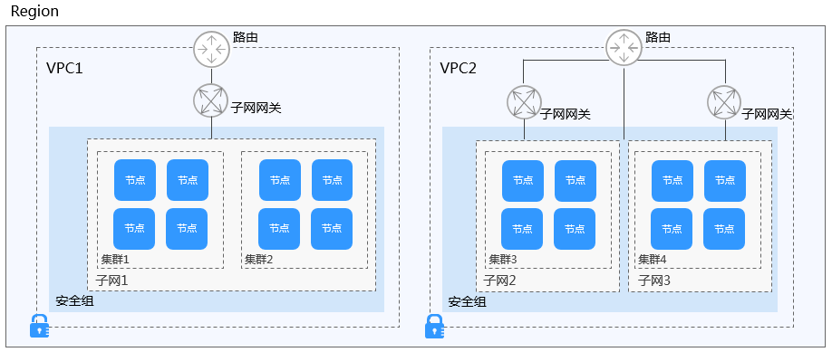

# 集群概述

集群技术是一种较新的技术，通过集群技术，可以在付出较低成本的情况下获得在性能、可靠性、灵活性方面的相对较高的收益，其任务调度则是集群系统中的核心技术。

集群（cluster）是容器运行所需云资源的集合，关联了若干云服务器节点、负载均衡、虚拟私有云等云资源。您可以理解为集群是“同一个子网中一个或多个弹性云服务器（又称：节点）”通过相关技术组合而成的计算机群体，为容器运行提供了计算资源池。

## 集群与虚拟私有云、子网的关系

-   “虚拟私有云“类似家庭生活中路由器管理192.168.0.0/16的私有局域网，是为用户在云上构建的一个私有网络，是弹性云服务器、负载均衡、中间件等工作的基本网络环境。根据实际业务需要可以设置不同规模的网络，一般可为10.0.0.0/8\~24，172.16.0.0/12\~24，192.168.0.0/16\~24，其中最大的网络10.0.0.0/8的A类地址网络。
-   子网是虚拟私有云中的一个子集，可以将虚拟私有云划分为一个个子网，每个子网之间可以通过安全组控制其之间能否互通，保证子网之间可以相互隔离，用户可以将不同业务部署在不同的子网内。
-   集群是“同一个子网中一个或多个弹性云服务器（又称：节点）“通过相关技术组合而成的计算机群体，为容器运行提供了计算资源池。

如图，同一个region下可以有多个虚拟私有云（图中以VPC表示）。虚拟私有云由一个个子网组成，子网与子网之间的网络交互通过子网网关完成，而集群就是建立在某个子网中。因此，存在以下三种场景：

-   不同集群可以创建在不同的虚拟私有云中。
-   不同集群可以创建在同一个子网中。
-   不同集群可以创建在不同的子网中。

**图 1**  集群与VPC、Subnet的关系  

## 相关链接

-   [如何选择容器网络模型？](https://support.huaweicloud.com/cce_faq/cce_faq_00162.html)
-   [如何规划CCE集群的网络地址段？](https://support.huaweicloud.com/cce_faq/cce_faq_00004.html)

