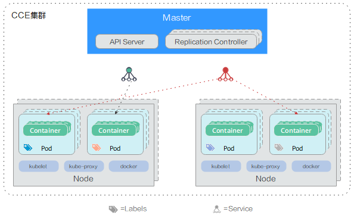

# 集群概述

随着应用程序开发向基于容器的方向发展，编排和管理资源的需求变得越来越重要。Kubernetes是一个开源的、功能强大的容器编排系统，用于管理容器化应用和服务，它提供了应用部署、规划、更新、维护的一种机制，让部署容器化的应用更加简单并且高效（powerful）。

云容器引擎（Cloud Container Engine，以下简称CCE）是一种托管的Kubernetes产品/服务，可进一步简化基于容器的应用程序部署和管理，您可以在CCE中方便的创建Kubernetes集群、部署您的容器化应用，以及方便的管理和维护。

## 为什么用集群

传统的应用部署方式是通过插件或脚本来安装应用。这样做的缺点是应用的运行、配置、管理、所有生存周期将与当前操作系统绑定，这样做并不利于应用的升级更新/回滚等操作，当然也可以通过创建虚拟机的方式来实现某些功能，但是虚拟机非常重，并不利于可移植性。

新的方式是通过部署容器方式实现，每个容器之间互相隔离，每个容器有自己的文件系统，容器之间进程不会相互影响，能区分计算资源。相对于虚拟机，容器能快速部署，由于容器与底层设施、机器文件系统解耦的，所以它能在不同云、不同版本操作系统间进行迁移。

容器占用资源少、部署快，每个应用可以被打包成一个容器镜像，每个应用与容器间成一对一关系也使容器有更大优势，使用容器可以在build或release的阶段，为应用创建容器镜像，因为每个应用不需要与其余的应用堆栈组合，也不依赖于生产环境基础结构，这使得从研发到测试、生产能提供一致环境。类似地，容器比虚拟机轻量、更“透明”，这更便于监控和管理。

集群（Cluster）是容器运行所需云资源的集合，包含了若干云服务器节点（物理服务器或者虚拟机）、负载均衡、虚拟私有云等华为云资源，您可以在集群中运行您的应用程序。在CCE中，我们可以创建若干集群，每个集群可以创建多个容器，每个容器里面运行一个应用实例，然后通过内置的负载均衡策略，实现对这一组应用实例的管理、发现、访问，而这些细节都不需要运维人员去进行复杂的手工配置和处理。

## 集群架构

CCE采用兼容标准的Kubernetes集群，Kubernetes集群属于主从分布式架构，主要由Master和Worker Node组成，以及包括客户端命令行工具kubectl和其它附加项。因此，在CCE集群中至少包含一个Master和多个Worker Node，这些Worker Node称为工作节点，这些节点都运行在Kubernetes集群编排系统中。

下图简要介绍了CCE集群的架构：

**图 1**  集群架构图  

-   **Master：**管控集群的管理面节点，提供Kubernetes核心服务和应用程序工作负载的业务流程，对集群进行调度管理。Master Node由API Server、Scheduler、Cluster State Store和Controller-Manager Server所组成。
-   **Node：**业务运行的工作节点，用于运行应用程序的容器工作负载。Worker Node包含kubelet、kube proxy和Container Runtime。
-   kubectl：用于通过命令行与API Server进行交互，而对Kubernetes进行操作，实现在集群中进行各种资源的增删改查等操作。
-   repliceation Controller：复制控制器，用于伸缩副本数量。
-   Pod：实例（Pod）是 Kubernetes 部署应用或服务的最小的基本单位。一个Pod 封装多个应用容器（也可以只有一个容器）、存储资源、一个独立的网络 IP 以及管理控制容器运行方式的策略选项。
-   Container：容器。一个通过 Docker 镜像创建的运行实例，一个节点可运行多个容器。容器的实质是进程，但与直接在宿主执行的进程不同，容器进程运行于属于自己的独立的命名空间。
-   Label：标签。其实就一对 key/value ，被关联到对象上，比如Pod,标签的使用我们倾向于能够标示对象的特殊特点，并且对用户而言是有意义的，但是标签对内核系统是没有直接意义的。
-   Service：服务，将运行在一组 Pods 上的应用程序公开为网络服务的抽象方法。

## CCE集群类型

云容器引擎CCE深度整合华为云高性能的计算（ECS/BMS）、网络\(VPC/EIP/ELB\)、存储（EVS/OBS/SFS）等服务，并支持GPU、ARM、FPGA等异构计算架构，支持多可用区（Available zone，简称AZ）、多区域（Region）容灾等技术构建高可用Kubernetes集群。

CCE已支持如下三种类型的集群创建，以满足您多种业务需求：

-   **[混合集群](购买混合集群.md)**（推荐）**：**支持虚拟机与裸金属服务器混合、支持GPU、NPU等异构节点的混合部署，基于高性能网络模型提供全方位、多场景、安全稳定的容器运行环境。
-   **[裸金属集群](购买裸金属集群.md)：**仅支持管理绑定了高速网卡的裸金属节点（X86、ARM），面向纯物理机场景提供安全稳定的容器运行环境。
-   **[鲲鹏集群](购买鲲鹏集群.md)：**仅支持管理鲲鹏架构（ARM架构）的虚拟机节点，面向纯ARM虚拟机场景提供安全稳定的容器运行环境。

> **注意：**   
>-   在创建、删除、扩容和缩容集群的操作中，请不要在统一身份认证服务（IAM）中执行权限变更或修改的操作，可能会导致创建、删除、扩容和缩容集群执行失败。  
>-   CCE节点的容器网络canal会使用一个网段作为容器网络的网段，该网段在创建集群时可配置，默认为172.16.0.0/16；docker服务也会默认创建一个docker0的网桥，docker0的默认地址为172.17.0.1。创建集群时，请确保集群中VPC（虚拟私有云）所在的网段不能和上述两个网段重复。使用VPC的对等连接功能时，对端的VPC也不能和上述两个网段重复。  

## 后续步骤

本文涵盖了Kubernetes的一些核心组件以及如何将它们应用于CCE集群的内容。 有关核心Kubernetes和CCE概念和操作的详细信息，请参阅以下文章：

-   [购买并创建一个混合集群](购买混合集群.md)
-   [通过kubectl或web-terminal插件连接CCE集群](通过kubectl或web-terminal插件连接CCE集群.md)
-   [创建无状态负载\(Deployment\)](创建无状态负载(Deployment).md)
-   [如何通过设置负载均衡\(LoadBalancer\)让公网用户访问](负载均衡(LoadBalancer).md)

