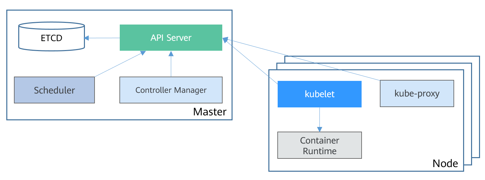

# 集群概述

[Kubernetes](https://kubernetes.io/)是一个很容易地部署和管理容器化的应用软件系统，使用Kubernetes能够方便对容器进行调度和编排。

对应用开发者而言，可以把Kubernetes看成一个集群操作系统。Kubernetes提供服务发现、伸缩、负载均衡、自愈甚至选举等功能，让开发者从基础设施相关配置等解脱出来。

Kubernetes可以把大量的服务器看做一台巨大的服务器，在一台大服务器上面运行应用程序。无论Kubernetes的集群有多少台服务器，在Kubernetes上部署应用程序的方法永远一样。

## Kubernetes集群架构

Kubernetes集群包含master节点（控制节点）和node节点（计算节点/工作节点），应用部署在node节点上，且可以通过配置选择应用部署在某些特定的节点上。

Kubernetes集群的架构如下所示：

**图 1**  Kubernetes集群架构  

**Master节点**

Master节点是集群的控制节点，由API Server、Scheduler、Controller Manager和ETCD四个组件构成。

-   API Server：各组件互相通讯的中转站，接受外部请求，并将信息写到ETCD中。
-   Controller Manager：执行集群级功能，例如复制组件，跟踪Node节点，处理节点故障等等。
-   Scheduler：负责应用调度的组件，根据各种条件（如可用的资源、节点的亲和性等）将容器调度到Node上运行。
-   ETCD：一个分布式数据存储组件，负责存储集群的配置信息。

在生产环境中，为了保障集群的高可用，通常会部署多个master，如CCE的集群高可用模式就是3个master节点。

**Node节点**

Node节点是集群的计算节点，即运行容器化应用的节点。

-   kubelet：kubelet主要负责同Container Runtime打交道，并与API Server交互，管理节点上的容器。
-   kube-proxy：应用组件间的访问代理，解决节点上应用的访问问题。
-   Container Runtime：容器运行时，如Docker，最主要的功能是下载镜像和运行容器。

## Master节点数量与集群规模

在CCE中创建集群，Master节点可以是1个或3个，3个Master节点会按高可用部署，确保集群的可靠性。

Master节点的规格决定集群管理Node节点的规模，创建集群时可以选择集群管理规模，这个规模就是指的集群可以有多少个Node节点，例如50节点、200节点等。

## 集群的网络

从网络的角度看，集群的节点都位于VPC之内，节点上又运行着容器，每个容器都需要访问，节点与节点、节点与容器、容器与容器都需要访问。

集群的网络可以分成三个网络来看。

-   节点网络：为集群内节点分配IP地址。
-   容器网络：为集群内容器分配IP地址，负责容器的通信，当前支持三种容器网络模型，不同模型有不同的工作机制。
-   服务网络：服务（Service）是用来解决访问容器的Kubernetes对象，每个Service都有一个固定的IP地址。

在创建集群时，您需要为各个网络选择合适的网段，确保各网段之间不存在冲突，每个网段下有足够的IP地址可用。集群创建后，不支持修改网段配置和容器网络模型，您需要在创建前做好规划和选择。

强烈建议您在创建集群前详细了解集群的网络以及容器网络模型，具体请参见[网络概述](网络概述.md)。

## 集群安全组

创建集群同时会创建如下安全组，保证集群安全。

-   集群名称-cce-control-随机数：Master节点安全组。
-   集群名称-cce-node-随机数：Node节点安全组。
-   集群名称-cce-eni-随机数：ENI（弹性网卡）网络安全组，仅CCE Turbo集群才会创建。

集群创建后，您可以在VPC控制台查看到创建的安全组。

> **警告：** 
>集群创建时自动创建的安全组以及安全组规则禁止删除，否则会导致集群异常。

## 集群的端口

Master节点：

-   4789：容器间网络互访。仅容器隧道网络模型需要。
-   5443、5444：Master节点的kube-apiserver的监听端口。
-   9443：Node节点网络插件访问Master节点。
-   8445：Node节点存储插件访问Master节点。

Node节点：

-   4789：容器间网络互访。仅容器隧道网络模型需要。
-   10250：Master节点的访问Node节点的kubelet组件（如执行kubectl exec \{pod\}）。
-   30000-32767：Node节点对外访问端口Nodeport，创建[Service](节点访问(NodePort).md)时需要指定。

