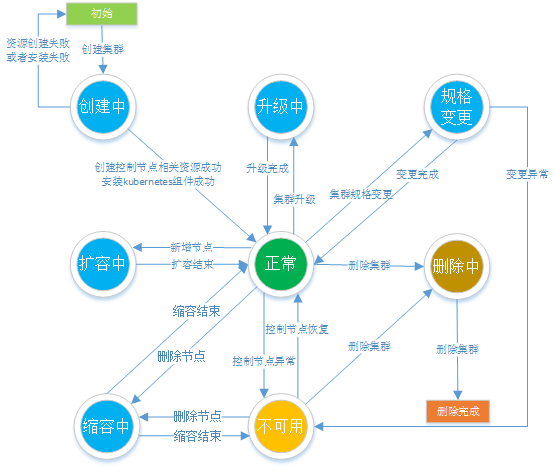

# 集群生命周期

介绍集群各生命周期的状态，便于您更深入的理解集群处于不同阶段的运行情况。

**表 1**  集群状态说明

<table><thead align="left"><tr id="row222012402006"><th class="cellrowborder" valign="top" width="26%" id="mcps1.2.3.1.1">
状态

</th>
<th class="cellrowborder" valign="top" width="74%" id="mcps1.2.3.1.2">
说明

</th>
</tr>
</thead>
<tbody><tr id="row6220640203"><td class="cellrowborder" valign="top" width="26%" headers="mcps1.2.3.1.1 ">
创建中

</td>
<td class="cellrowborder" valign="top" width="74%" headers="mcps1.2.3.1.2 ">
集群正在创建，正在申请云资源

</td>
</tr>
<tr id="row1822020409010"><td class="cellrowborder" valign="top" width="26%" headers="mcps1.2.3.1.1 ">
正常

</td>
<td class="cellrowborder" valign="top" width="74%" headers="mcps1.2.3.1.2 ">
集群正常运行

</td>
</tr>
<tr id="row14220840606"><td class="cellrowborder" valign="top" width="26%" headers="mcps1.2.3.1.1 ">
扩容中

</td>
<td class="cellrowborder" valign="top" width="74%" headers="mcps1.2.3.1.2 ">
集群正在增加节点

</td>
</tr>
<tr id="row12220440503"><td class="cellrowborder" valign="top" width="26%" headers="mcps1.2.3.1.1 ">
缩容中

</td>
<td class="cellrowborder" valign="top" width="74%" headers="mcps1.2.3.1.2 ">
集群正在删除节点

</td>
</tr>
<tr id="row1450522112209"><td class="cellrowborder" valign="top" width="26%" headers="mcps1.2.3.1.1 ">
规格变更

</td>
<td class="cellrowborder" valign="top" width="74%" headers="mcps1.2.3.1.2 ">
集群管理规模变更中

</td>
</tr>
<tr id="row13614111762019"><td class="cellrowborder" valign="top" width="26%" headers="mcps1.2.3.1.1 ">
升级中

</td>
<td class="cellrowborder" valign="top" width="74%" headers="mcps1.2.3.1.2 ">
集群正在升级中

</td>
</tr>
<tr id="row142095617205"><td class="cellrowborder" valign="top" width="26%" headers="mcps1.2.3.1.1 ">
不可用

</td>
<td class="cellrowborder" valign="top" width="74%" headers="mcps1.2.3.1.2 ">
当前集群不可用

</td>
</tr>
<tr id="row2056716914216"><td class="cellrowborder" valign="top" width="26%" headers="mcps1.2.3.1.1 ">
删除中

</td>
<td class="cellrowborder" valign="top" width="74%" headers="mcps1.2.3.1.2 ">
集群正在删除中

</td>
</tr>
</tbody>
</table>

**图 1**  集群状态图  

