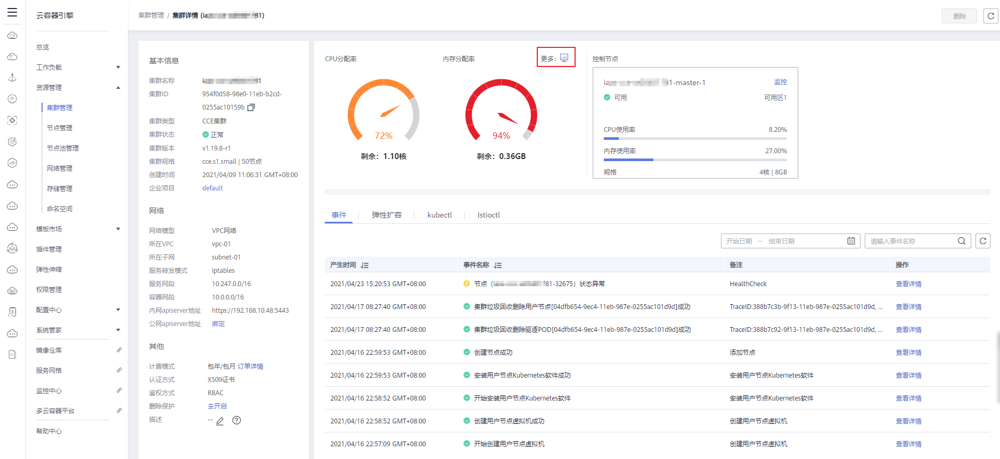

# 集群监控

## 操作场景

云容器引擎与华为云监控服务（Cloud Eye）无缝集成，您可以实时查看每个集群控制节点的资源使用情况，了解CCE集群控制节点的监控指标，及时收到异常告警并做出反应，保证业务顺畅运行。

## 操作步骤

1.  登录[CCE控制台](https://console.huaweicloud.com/cce2.0/?utm_source=helpcenter)，在左侧导航栏中选择“资源管理 \> 集群管理”。
2.  单击待监控的集群名称，进入集群详情。

    **图 1**  集群监控  
    

3.  单击“更多“右侧的图标，可以查看集群资源监控详情。
4.  单击控制节点右侧的“监控“链接，可进入应用运维管理控制台，在“主机监控“中查看对应控制节点的基本监控信息，包括CPU使用率、物理内存使用率、磁盘使用率等指标。

    **图 2**  集群监控详情  
    

