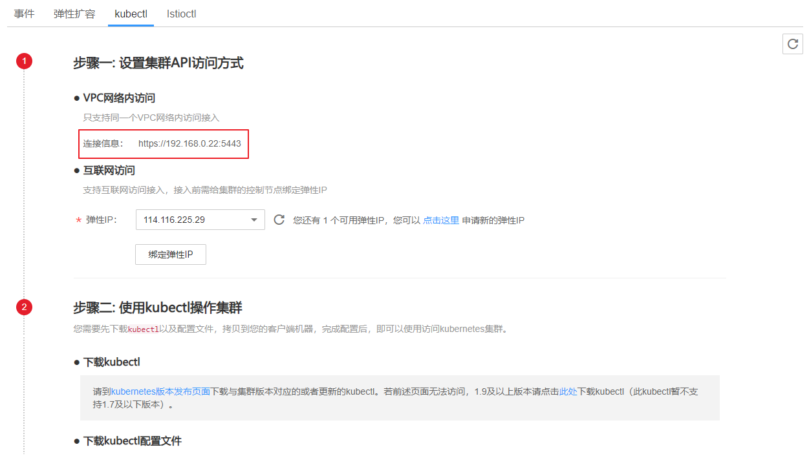

# 集群管理权限控制<a name="cce_01_0085"></a>

若需要对集群中的资源进行权限控制，（例如A用户只能对某个命名空间下的应用有读写权限，B用户只能对集群下的资源有读权限等），请参照本章节操作。

## 操作步骤<a name="section12024043015"></a>

1.  若需要对集群进行权限控制，请在创建集群时的“认证方式“参数后勾选“认证能力增强”，选择“Authenticating Proxy”。单击“CA根证书”后的“上传文件”，上传符合规范且合法的证书。详细请参见[表2](购买混合集群.md#table8638121213265)。
2.  通过kubectl创建角色。

    下面的例子展示了如何创建“Role”R：允许该角色读取default空间下的所有Pod。参数详细解释请参见[Kubernetes官方文档](https://kubernetes.io/docs/reference/)。

    ```
    kind: Role
    apiVersion: rbac.authorization.k8s.io/v1
    metadata:
      namespace: default
      name: pod-reader
    rules:
    - apiGroups: [""]
      resources: ["pods"]
      verbs: ["get", "watch", "list"]
    ```

3.  通过kubectl创建角色绑定。

    下面的例子给出RoleBindings赋予default命名空间下的**pod-reader**的角色给用户**jane**。该策略允许用户jane可以读取default命名空间下的所有pods。参数详细解释请参见[Kubernetes官方文档](https://kubernetes.io/docs/reference/)。

    ```
    kind: RoleBinding
    apiVersion: rbac.authorization.k8s.io/v1
    metadata:
      name: read-pods
      namespace: default
    subjects:
    - kind: User
      name: jane   #华为云的用户名
      apiGroup: rbac.authorization.k8s.io
    roleRef:
      kind: Role
      name: pod-reader    #创建的角色名
      apiGroup: rbac.authorization.k8s.io
    ```

4.  创建角色并与用户绑定成功后，请在接口请求的headers中携带用户信息以及集群创建时上传的证书访问kubernetes接口。例如调取查询pod的接口时，执行命令如下：

    **curl -k -H "X-Remote-User:  _jane_" --cacert /root/tls-ca.crt --key /root/tls.key --cert /root/tls.crt https://**_192.168.23.5:5443_**/api/v1/namespaces/default/pods**

    返回200表示访问成功，返回403表示没有权限访问。

    > **说明：**   
    >为避免命令执行失败，请提前把证书上传到/root目录下。  

    参数解释如下：

    -   X-Remote-User: jane：请求头固定为X-Remote-User，jane为用户名。
    -   tls-ca.crt ：创建集群时上传的CA根证书。
    -   tls.crt：与集群创建时所上传的CA根证书配套的客户端证书。
    -   tls.key：与集群创建时所上传的CA根证书配套的客户端秘钥。
    -   192.168.23.5:5443：为连接集群的地址，获取方式如下：

        登录[CCE控制台](https://console.huaweicloud.com/cce2.0/?utm_source=helpcenter)，在左侧导航栏中选择“资源管理 \> 集群管理”，单击待连接集群后的“kubectl”，选择如下参照界面中的“连接信息“后的IP地址和端口号。

        **图 1**  获取访问地址<a name="fig0834175035412"></a>  
        

        > **说明：**   
        >-   CCE支持主账号和子账号分别下载config文件（kubeconfig.json），子账号下载的config文件只有30天的有效期，而主账号下载的config文件会长期有效。  
        >-   子账号下载的config文件所拥有的Kubernetes权限与CCE控制台上子账号所拥有的权限一致。  


    另外，还支持**X-Remote-Group**的头域：用户组名，在做RoleBinding时，可以将Role与Group进行绑定，并在访问集群时携带用户组信息。


