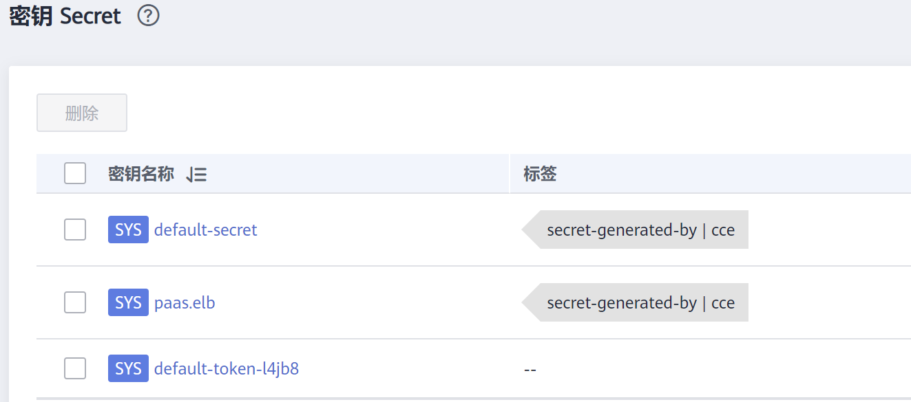

# 集群系统密钥说明<a name="cce_10_0388"></a>

CCE默认会在每个命名空间下创建如下密钥。

-   default-secret
-   paas.elb
-   default-token-xxxxx（xxxxx为随机数）



下面将详细介绍这个几个密钥的用途。

## default-secret<a name="section11760122012591"></a>

default-secret的类型为kubernetes.io/dockerconfigjson，其data内容是登录SWR镜像仓库的凭据，用于从SWR拉取镜像。在CCE中创建工作负载时如果需要从SWR拉取镜像，需要配置imagePullSecrets的取值为default-secret，如下所示。

```
apiVersion: v1                      
kind: Pod                          
metadata:
  name: nginx                      
spec:                            
  containers:
  - image: nginx:alpine            
    name: container-0               
    resources:                      
      limits:
        cpu: 100m
        memory: 200Mi
      requests:
        cpu: 100m
        memory: 200Mi
  imagePullSecrets:
  - name: default-secret
```

**default-secret的data数据会定期更新**，**且当前的data内容会在一定时间后会过期失效**。您可以使用describe命令在default-secret的中查看到具体的过期时间，如下所示。

> **须知：** 
>在使用时请直接使用default-secret，而不要拷贝secret内容重新创建，因为secret里面的凭据会过期，从而导致无法拉取镜像。

```
$ kubectl describe secret default-secret
Name:         default-secret
Namespace:    default
Labels:       secret-generated-by=cce
Annotations:  temporary-ak-sk-expires-at: 2021-11-26 20:55:31.380909 +0000 UTC

Type:  kubernetes.io/dockerconfigjson

Data
====
.dockerconfigjson:  347 bytes
```

## paas.elb<a name="section773741319418"></a>

paas.elb的data内容是临时AK/SK数据，用于创建Service和Ingress时创建ELB，paas.elb的data数据同样会定期更新，且在一定时间后会过期失效。

实际使用中您不会直接使用paas.elb，但请不要删除paas.elb，否则会导致创建ELB失败。

## default-token-xxxxx<a name="section15110823415"></a>

Kubernetes为每个命名空间默认创建一个名为default的ServiceAccount，default-token-xxxxx为这个ServiceAccount的密钥，xxxxx是随机数。

```
$ kubectl get sa
NAME     SECRETS   AGE
default  1         30d
$ kubectl describe sa default
Name:                default
Namespace:           default
Labels:              <none>
Annotations:         <none>
Image pull secrets:  <none>
Mountable secrets:   default-token-vssmw
Tokens:              default-token-vssmw
Events:              <none>
```

