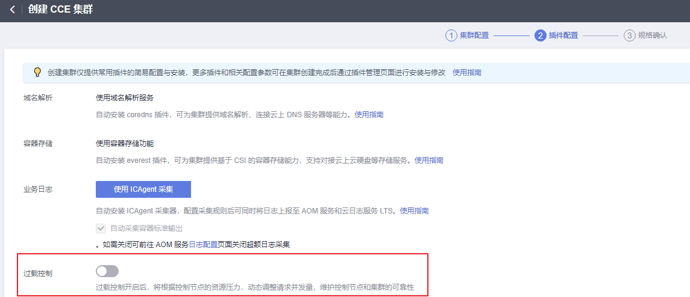
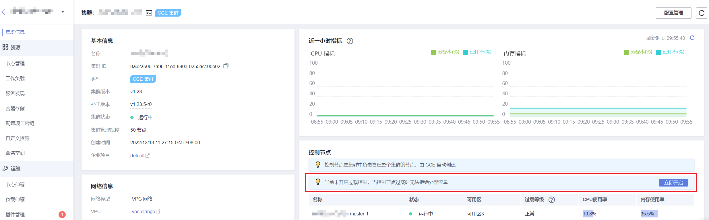
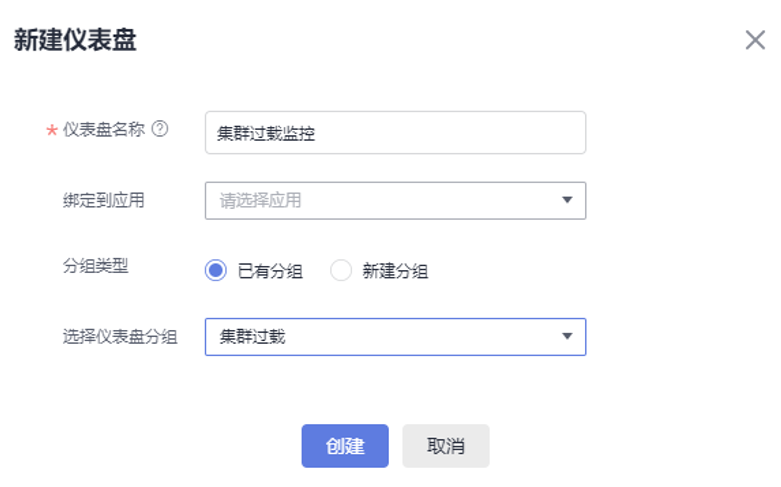
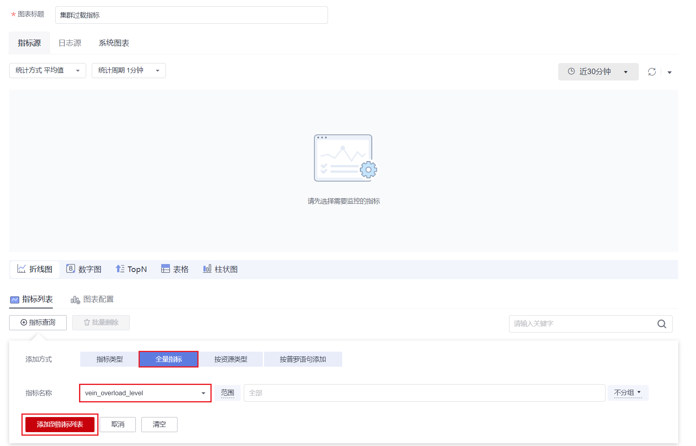
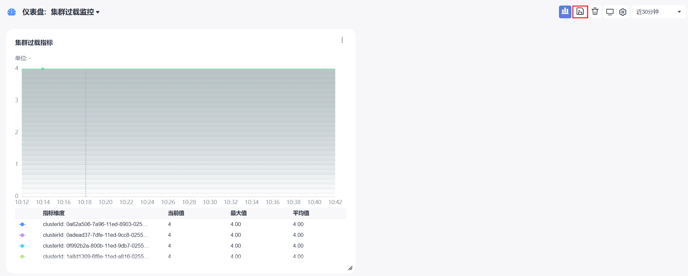
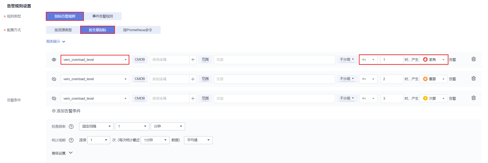

# 集群过载控制

## 操作场景

过载控制开启后，将根据控制节点的资源压力，动态调整请求并发量，维护控制节点和集群的可靠性。

## 约束与限制

集群版本需为v1.23及以上。

## 开启集群过载控制

**方式一：创建集群时开启**

创建v1.23及以上集群时，可在创建集群过程中，开启过载控制选项。

**方式二：已有集群中开启**

1.  登录CCE控制台，进入一个已有的集群（集群版本为v1.23及以上）。
2.  在“集群信息“页面，查看控制节点信息，如集群未开启过载控制，此处将会出现相应提示。如需开启过载控制，您可单击“立即开启“。

    

## 集群过载监控

**方式一：CCE界面**

1.  登录CCE控制台，进入一个已有的集群（集群版本为v1.23及以上）。
2.  在“集群信息“页面，查看控制节点信息，将会显示“过载等级“指标。

    过载等级如下：

    -   熔断：拒绝所有外部流量
    -   重度过载：拒绝75%外部流量
    -   中度过载：拒绝50%外部流量
    -   轻度过载：拒绝25%外部流量
    -   正常：不拒绝外部流量

**方式二：AOM界面**

您可登录AOM控制台，创建一个仪表盘，并在仪表盘中添加名为vein\_overload\_level的监控指标，详情请参见[创建仪表盘](https://support.huaweicloud.com/usermanual-aom2/mon_01_0003.html)。

监控指标对应的含义如下：

-   0：熔断，拒绝所有外部流量
-   1：重度过载，拒绝75%外部流量
-   2：中度过载，拒绝50%外部流量
-   3：轻度过载，拒绝25%外部流量
-   4：正常，不拒绝外部流量

此处以AOM 2.0的操作步骤为例，供您参考。

1.  登录AOM 2.0控制台，在左侧导航栏中选择“仪表盘“，单击“创建仪表盘“。

    

2.  仪表盘创建完成后，添加指标图表。

    -   图表标题：集群过载指标
    -   添加方式：全量指标
    -   指标名称：vein\_overload\_level
    -   范围：可不选

    

3.  以上参数填写完成后，单击“添加到指标列表“。
4.  单击“添加至仪表盘“，完成指标图表创建。
5.  单击右上角保存按钮，保存仪表盘。

    

## 集群过载告警

此处以AOM 2.0的操作步骤为例，供您参考。

1.  登录AOM 2.0控制台，在左侧导航栏中选择“告警管理 \> 告警规则“，单击“创建告警规则“。
2.  填写以下参数：

    -   规则名称：集群过载告警
    -   企业项目：default
    -   规则类型：指标告警规则
    -   配置方式：按全量指标
    -   告警条件：选择vein\_oerload\_level，范围可选择对应集群或者选择全部。
        -   当指标值小于等于1时，表示集群重度过载，推荐设置紧急告警。
        -   当指标值小于等于2时，表示集群中度过载，推荐设置重要告警。
        -   当指标值小于等于3时，表示集群轻度过载，推荐设置次要告警。

    其余参数可按需求填写。

    

3.  单击“立即创建“。

