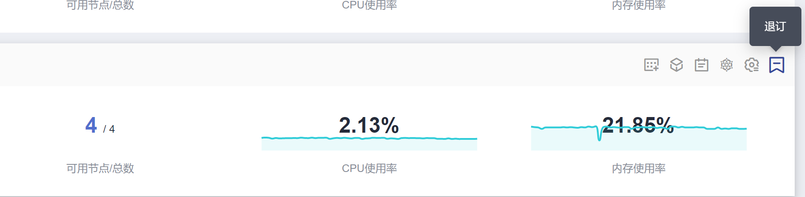
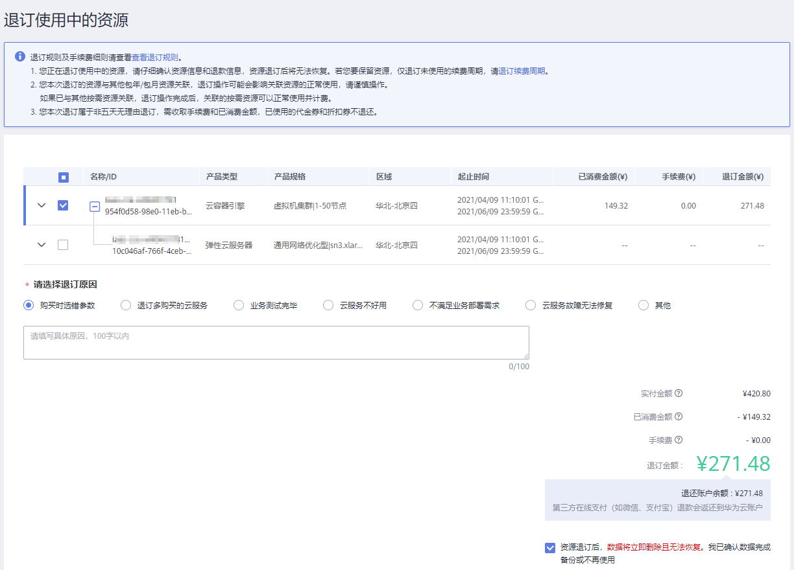
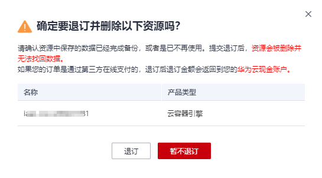
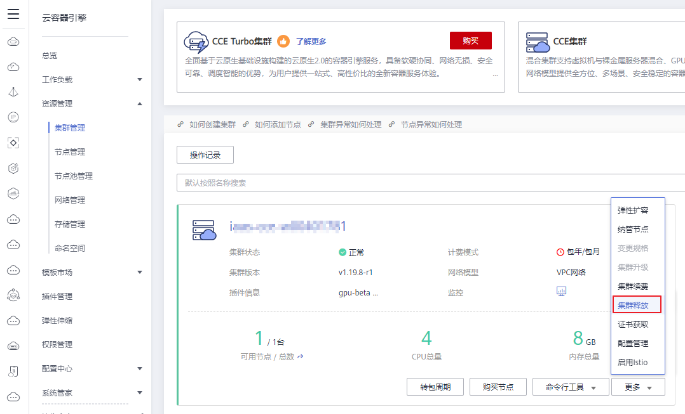
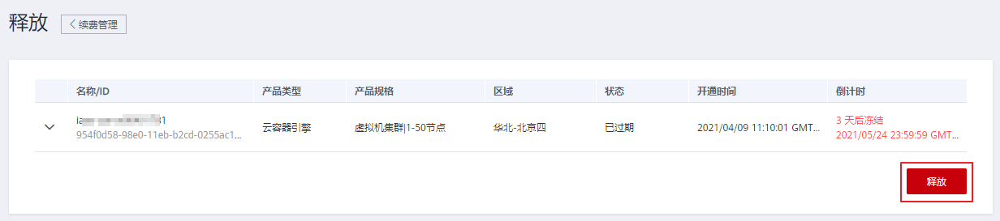

# 集群退订/释放（包年/包月）

客户购买包周期集群后，支持退订/释放包周期资源。

## 注意事项

-   退订集群是指退订续费部分和当前正在使用的部分，资源退订后将无法使用。
-   集群资源包含控制节点资源和工作节点所使用的的IaaS基础设施，详情请参见[计费说明](https://support.huaweicloud.com/productdesc-cce/cce_productdesc_0013.html)
-   订单中存在主从关系的资源，需分别退订。
-   资源退订，相关注意事项请参见[退订规则说明](https://support.huaweicloud.com/usermanual-billing/zh-cn_topic_0083138805.html)。

## 集群退订

本节以计费模式为“包年/包月“且未超期的CCE集群为例，介绍如何退订集群。

> **须知：** 
>-   退订集群会将集群内的节点以及运行的业务都销毁，在执行退订操作前，请确保将退订的云资源上的数据已完成备份或者迁移，退订完成后云资源将被删除，数据无法找回，请谨慎操作。
>-   按需计费的集群可以直接删除，详情请参见[删除集群（按需计费）](删除集群（按需计费）.md)。

1.  登录[CCE控制台](https://console.huaweicloud.com/cce2.0/?utm_source=helpcenter)，在左侧导航栏中选择“资源管理 \> 集群管理”。
2.  单击待退订集群后的“更多 \> 集群退订“。

    **图 1**  集群退订  
    

3.  在弹出的“退订使用中的资源“页面中，根据系统提示进行退订操作。

    > **说明：** 
    >-   退订该集群会将集群内的节点（纳管节点除外）以及运行的工作负载和服务都销毁。
    >-   退订集群需要花费1\~3分钟，请耐心等候。
    >-   退订规则及手续费细则请查看[查看退订规则](https://support.huaweicloud.com/usermanual-billing/zh-cn_topic_0077628999.html)。
    >    -   如果您正在退订使用中的资源，请仔细确认资源信息和退款信息，资源退订后将无法恢复。若您要保留资源，仅退订未使用的续费周期，请[退订续费周期](https://account.huaweicloud.com/usercenter/?#/enterpriseProjectIndex/retreatManagement?tab=retreat_renewal)。
    >    -   如果您退订的资源与其他包年/包月资源关联，退订操作可能会影响关联资源的正常使用，请谨慎操作。
    >        如果已与其他按需资源关联，退订操作完成后，关联的按需资源可以正常使用并计费。
    >    -   如果您本次退订属于非五天无理由退订，需收取手续费和已消费金额，已使用的代金券和折扣券不退还。

    **图 2**  退订集群资源  
    

4.  在“退订使用中的资源“页面中选择要退订的资源，选择退订原因和详细退订描述，勾选“资源退订后，数据将立即删除且无法恢复。我已确认数据完成备份或不再使用”，单击“退订“。
5.  在弹出的“确定要退订并删除以下资源吗？“提示窗口中阅读注意事项并核实退订的资源信息，单击“退订“按钮，开始执行退订集群操作。

    **图 3** “确定要退订并删除资源“  
    

    > **说明：** 
    >-   请确认资源中保存的数据已经完成备份，或者是已不再使用。提交退订后，资源会被删除并无法找回数据。
    >-   如果您的订单是通过第三方在线支付的，退订后退订金额会返回到您的华为云现金账户。

## 集群释放

本节以计费模式为“包年/包月“且已超期未续费的CCE集群为例，介绍如何释放集群。

> **须知：** 
>-   释放集群会将集群内的节点以及运行的业务都销毁，在执行释放操作前，请确保将释放的云资源上的数据已完成备份或者迁移，释放完成后云资源将被删除，数据无法找回，请谨慎操作。
>-   按需计费的集群可以直接删除，详情请参见[删除集群（按需计费）](删除集群（按需计费）.md)。

1.  登录[CCE控制台](https://console.huaweicloud.com/cce2.0/?utm_source=helpcenter)，在左侧导航栏中选择“资源管理 \> 集群管理”。
2.  单击待释放集群后的“更多 \> 集群释放“。

    **图 4**  释放集群  
    

3.  在打开的“释放“页面中，根据系统提示进行释放操作。

    > **说明：** 
    >-   释放该集群会将集群内的节点（纳管节点除外）以及运行的工作负载和服务都销毁，资源被释放后将无法恢复，请谨慎操作！
    >-   释放集群需要花费1\~3分钟，请耐心等候。

    **图 5**  释放  
    

4.  单击“释放“，查看警告信息确认无误后，单击“确定“开始释放该资源。

