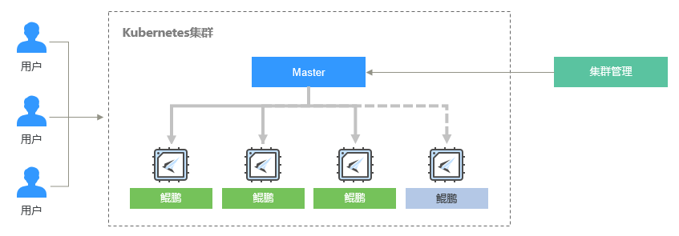
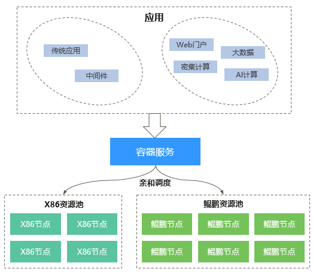

# 鲲鹏集群概述

云容器引擎CCE在国内首家发布了基于鲲鹏系列芯片的容器服务，鲲鹏容器集群（ARM指令集）提供了容器在鲲鹏（ARM架构）服务器上的运行能力，提供与X86服务器相同的调度伸缩，快速部署能力，并具有大幅降低成本的潜力。

**鲲鹏集群目前已在“华北-北京四“开放购买，点此立即[购买](https://console.huaweicloud.com/cce2.0/?region=cn-north-4#/app/resource/cluster/list)。**

## 鲲鹏集群简介

鲲鹏原指华为在2019年1月初发布的一款兼容ARM指令集的服务器芯片鲲鹏920，性能强悍，配备了64个物理核心，单核实力从CPU算力benchmark的角度对比，大约持平于同期X86的主流服务器芯片，整体多核多线程算力较同期的X86芯片更强大。 当前鲲鹏的含义已经有所延伸，鲲鹏不再仅仅局限于鲲鹏系列服务芯片，更是包含了服务器软件在新的计算架构平台上的完整软硬件生态和云服务生态。

华为云容器引擎在鲲鹏服务器基础上结合多架构平台容器技术，使云计算在融合移动互联网、物联网、人工智能、高性能计算等领域的想象空间进一步拓展，使容器技术“Build, Ship, and Run Any App, Anywhere”的理念更近一步，企业云用户可以选择更为适合自身业务的计算架构，更高的计算性价比，更方便的在各种计算架构平台之间构建、测试、运行。

**图 1**  鲲鹏集群架构  

## 鲲鹏集群优势

华为云容器引擎结合容器技术与鲲鹏全栈能力，将华为在芯片和硬件领域深厚积累的技术能力，通过更加便捷的方式提供给客户和开发者，为您提供端到端的异构计算能力。

**提供全栈ARM容器商用能力**

云容器引擎从操作系统、容器存储、容器网络端到端提供全栈鲲鹏容器服务：

-   采用自研欧拉操作系统，相对于开源主流操作系统，做了鲲鹏架构下内存拷贝、内核锁竞争等深度优化。
-   相同规格下，提供鲲鹏环境下的同等IOPS能力。
-   提供鲲鹏环境下的所有容器网络模式支持，包含容器隧道模式和VPC网络模式。

**支持应用在X86和鲲鹏环境混合部署**

华为云容器引擎支持X86节点和鲲鹏节点混合部署，用户可根据自身业务特点，采用CPU架构亲和调度能力，把业务部署到相应的环境里，实现应用从X86到鲲鹏架构的逐步上线能力。

